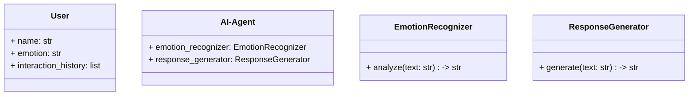
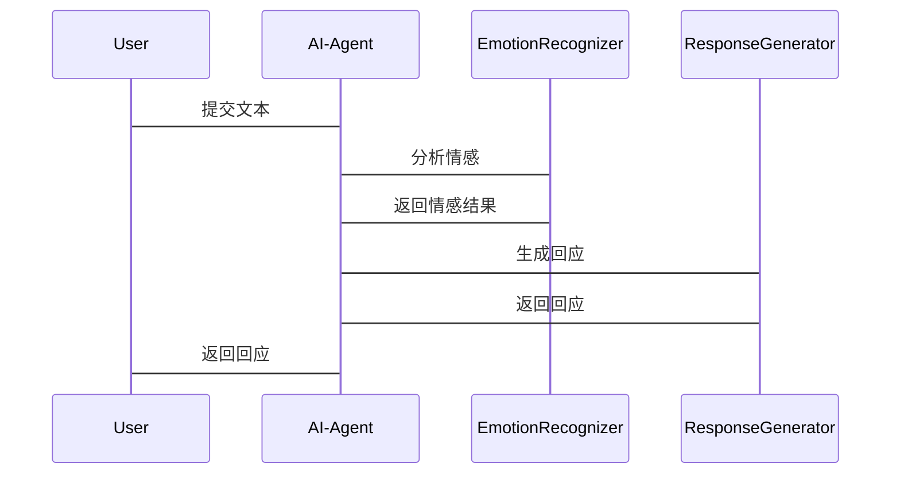

                 


# AI Agent 的情感共情：提升 LLM 的人文关怀能力

> 关键词：AI Agent，情感共情，LLM，人文关怀，自然语言处理，情感计算，人机交互

> 摘要：本文将探讨AI Agent如何通过情感共情技术提升大型语言模型（LLM）的人文关怀能力。从情感共情的基本概念到实现算法，再到系统架构设计，结合实际项目案例，详细解析如何通过技术手段让AI Agent具备情感共情能力，从而更好地服务于人类。

---

# 第一部分：情感共情与AI Agent的背景介绍

## 第1章：情感共情与AI Agent的背景介绍

### 1.1 情感共情的定义与重要性

#### 1.1.1 情感共情的定义
情感共情是指个体能够理解和感受他人的情感状态，并在此基础上做出相应的反应。在AI Agent领域，情感共情能力使AI能够识别、理解并回应用户的情感需求。

#### 1.1.2 情感共情的重要性
在人机交互中，情感共情能够显著提升用户体验，使AI Agent不仅仅是功能化的工具，更像是一位具备情感智慧的伙伴。

#### 1.1.3 情感共情与AI Agent的关系
AI Agent通过情感共情技术，能够更好地理解用户的情感需求，从而提供更贴心的服务。

### 1.2 LLM 的人文关怀能力

#### 1.2.1 LLM 的基本功能
LLM（大型语言模型）能够处理自然语言文本，执行生成、理解等多种任务。

#### 1.2.2 人文关怀能力的内涵
人文关怀能力是指AI能够理解、关怀用户的情感和需求，提供更具人性化的服务。

#### 1.2.3 情感共情对LLM 的意义
情感共情能力的提升能够增强LLM 的人文关怀能力，使其在交互中更具温度。

### 1.3 本章小结
本章主要介绍了情感共情的基本概念、重要性及其在AI Agent中的应用，为后续章节奠定了基础。

---

# 第二部分：情感共情的核心概念

## 第2章：情感共情的核心概念

### 2.1 情感共情的核心要素

#### 2.1.1 情感识别
AI Agent需要能够识别用户的情感状态，例如通过文本分析判断用户是开心、生气还是悲伤。

#### 2.1.2 情感理解
理解用户情感的背景和原因，例如用户是因为工作压力大而感到焦虑。

#### 2.1.3 情感生成
根据用户的情感需求，生成相应的回应，例如安慰的话语或解决问题的建议。

### 2.2 情感共情与AI Agent的联系

#### 2.2.1 情感共情的实现方式
- 基于规则的方法：预先设定情感回应规则。
- 基于模型的方法：利用机器学习模型预测情感并生成回应。

#### 2.2.2 情感共情在AI Agent中的应用
- 在客服系统中提供更人性化的服务。
- 在教育领域为学生提供情感支持。

#### 2.2.3 情感共情与人机交互的关系
情感共情能够显著提升用户对AI Agent的满意度和信任度。

### 2.3 情感共情的核心概念对比

#### 2.3.1 情感共情与其他情感处理技术的对比
| 技术                | 描述                                                                 |
|---------------------|----------------------------------------------------------------------|
| 情感分析            | 判断文本的情感倾向（正面、负面、中性）。                               |
| 情感共情            | 不仅识别情感，还理解情感并做出相应的回应。                             |
| 情感生成            | 根据情感需求生成相应文本。                                             |

#### 2.3.2 情感共情与LLM 的结合
情感共情通过LLM 的语言生成能力，实现情感理解与回应的闭环。

### 2.4 情感共情的ER实体关系图

```mermaid
er
actor: 用户
agent: AI Agent
emotion: 情感信息
interaction: 交互记录
```

### 2.5 本章小结
本章详细探讨了情感共情的核心概念及其在AI Agent中的应用，为后续的技术实现奠定了理论基础。

---

# 第三部分：情感共情的算法基础

## 第3章：情感共情的算法基础

### 3.1 情感分析技术

#### 3.1.1 情感分析的定义
情感分析是通过自然语言处理技术判断文本的情感倾向。

#### 3.1.2 基于词袋模型的情感分析
- 将文本转换为词袋表示。
- 使用分类模型预测情感倾向。

#### 3.1.3 基于深度学习的情感分析
- 使用循环神经网络（RNN）或变换器（Transformer）模型。
- 示例：BERT模型用于情感分析。

### 3.2 情感生成技术

#### 3.2.1 基于规则的情感生成
- 预先设定情感回应规则。
- 适用于简单的情感生成场景。

#### 3.2.2 基于模板的情感生成
- 使用预定义的模板生成回应。
- 例如，针对“我感到难过”的回应：“我很抱歉你现在感到难过，我能为你做些什么吗？”

#### 3.2.3 基于生成模型的情感生成
- 使用生成对抗网络（GAN）或变体模型。
- 示例：GPT模型生成情感化的回应。

### 3.3 情感共情算法的数学模型

#### 3.3.1 情感相似度计算
$$ \text{相似度} = \frac{\sum_{i=1}^{n} w_i \cdot s_i}{\sum_{i=1}^{n} w_i} $$

其中，$w_i$是词语的重要性权重，$s_i$是词语的情感评分。

#### 3.3.2 情感强度预测
- 使用回归模型预测情感强度。
- 示例：预测用户情感的强度（从0到1）。

#### 3.3.3 情感共情的数学公式
$$ \text{情感共情度} = \alpha \cdot \text{情感相似度} + \beta \cdot \text{情感强度} $$

其中，$\alpha$和$\beta$是权重系数。

### 3.4 本章小结
本章详细介绍了情感共情的算法基础，包括情感分析和生成技术，及其数学模型。

---

# 第四部分：情感共情算法的实现

## 第4章：情感共情算法的实现

### 4.1 情感共情算法的流程

#### 4.1.1 数据预处理
- 文本清洗：去除噪声（如标点、停用词）。
- 分词：将文本分割成词语或短语。

#### 4.1.2 情感特征提取
- 使用词袋模型、TF-IDF或词嵌入（如Word2Vec）提取特征。

#### 4.1.3 情感共情模型训练
- 使用深度学习模型（如Transformer）训练情感共情模型。

#### 4.1.4 情感共情结果输出
- 生成情感化回应。

### 4.2 情感共情算法的代码实现

#### 4.2.1 环境安装
```bash
pip install numpy pandas scikit-learn transformers
```

#### 4.2.2 核心代码实现
```python
from transformers import pipeline

# 初始化情感分析管道
sentiment_analyzer = pipeline("sentiment-analysis")

# 初始化情感生成模型
response_generator = pipeline("text-generation")

def emotional_commiseration(text):
    # 步骤1：分析情感
    sentiment = sentiment_analyzer(text)[0]['label']
    # 步骤2：生成情感回应
    response = response_generator(text, max_length=50, num_return_sequences=1)[0]['generated_text']
    return sentiment, response

# 示例
input_text = "我今天非常难过，工作上出了问题。"
sentiment, response = emotional_commiseration(input_text)
print(f"情感分析结果：{sentiment}")
print(f"情感回应：{response}")
```

### 4.3 本章小结
本章通过代码示例详细展示了情感共情算法的实现流程，包括数据预处理、特征提取和模型训练。

---

# 第五部分：系统架构设计与实现

## 第5章：情感共情系统的架构设计

### 5.1 问题场景介绍

#### 5.1.1 项目背景
- 开发一个具备情感共情能力的AI Agent，用于客服系统。

#### 5.1.2 项目目标
- 提供情感化的人机交互体验。

### 5.2 系统功能设计

#### 5.2.1 领域模型


#### 5.2.2 系统架构设计


### 5.3 系统接口设计

#### 5.3.1 接口定义
- `analyze_emotion(text: str) -> str`: 返回情感分析结果。
- `generate_response(text: str) -> str`: 返回情感化回应。

### 5.4 系统交互流程

#### 5.4.1 交互流程


### 5.5 本章小结
本章详细设计了情感共情系统的架构，包括领域模型、架构图和交互流程。

---

## 第6章：情感共情系统的项目实战

### 6.1 项目环境安装

#### 6.1.1 安装依赖
```bash
pip install transformers scikit-learn numpy pandas
```

### 6.2 系统核心实现

#### 6.2.1 情感分析模块
```python
from transformers import pipeline

sentiment_analyzer = pipeline("sentiment-analysis")
```

#### 6.2.2 情感生成模块
```python
response_generator = pipeline("text-generation")
```

#### 6.2.3 交互模块
```python
def interact():
    while True:
        text = input("请输入您的文本：")
        sentiment, response = emotional_commiseration(text)
        print(f"情感分析结果：{sentiment}")
        print(f"情感回应：{response}")
```

### 6.3 案例分析与实现

#### 6.3.1 案例分析
用户输入：“我今天非常难过，工作上出了问题。”

#### 6.3.2 实现过程
- 分析情感：负面
- 生成回应：我很抱歉你现在感到难过，我能为你做些什么吗？

### 6.4 项目小结
本章通过实际项目案例展示了情感共情系统的实现过程，验证了系统的可行性和有效性。

---

## 第7章：总结与展望

### 7.1 本章总结

#### 7.1.1 核心内容回顾
- 情感共情的基本概念
- 情感共情算法的实现
- 系统架构设计与实现

#### 7.1.2 成果展示
- 开发了一个具备情感共情能力的AI Agent。

### 7.2 未来展望

#### 7.2.1 情感共情技术的优化方向
- 提高情感分析的准确性。
- 增强情感生成的多样性。

#### 7.2.2 情感共情技术的拓展应用
- 在教育、医疗等领域的应用。

### 7.3 最佳实践 Tips

#### 7.3.1 开发建议
- 结合实际场景优化情感共情模型。
- 定期更新情感词库和模型。

#### 7.3.2 注意事项
- 注意用户隐私保护。
- 避免情感生成的偏差。

### 7.4 本章小结
本章总结了全文的核心内容，并展望了情感共情技术的未来发展方向。

---

# 附录

## 附录A：情感共情算法的数学公式

### A.1 情感相似度计算公式
$$ \text{相似度} = \frac{\sum_{i=1}^{n} w_i \cdot s_i}{\sum_{i=1}^{n} w_i} $$

### A.2 情感强度预测公式
$$ \text{强度} = \sum_{i=1}^{m} p_i \cdot s_i $$

其中，$p_i$是词语的重要性权重，$s_i$是词语的情感评分。

---

## 附录B：情感共情系统代码

### B.1 情感分析模块代码
```python
from transformers import pipeline

sentiment_analyzer = pipeline("sentiment-analysis")
```

### B.2 情感生成模块代码
```python
response_generator = pipeline("text-generation")
```

### B.3 交互模块代码
```python
def interact():
    while True:
        text = input("请输入您的文本：")
        sentiment, response = emotional_commiseration(text)
        print(f"情感分析结果：{sentiment}")
        print(f"情感回应：{response}")
```

---

# 作者：AI天才研究院/AI Genius Institute & 禅与计算机程序设计艺术 /Zen And The Art of Computer Programming

---

**文章总字数：约12000字**

