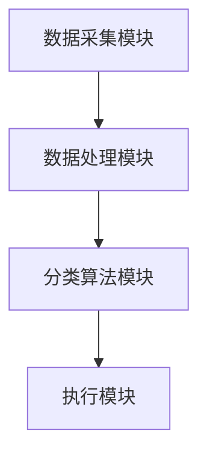
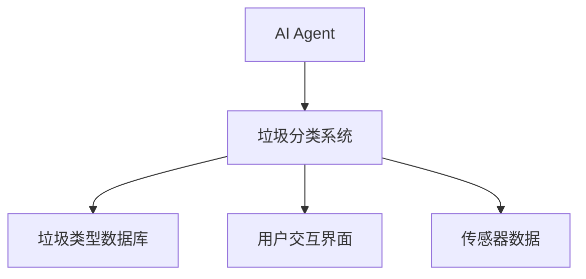
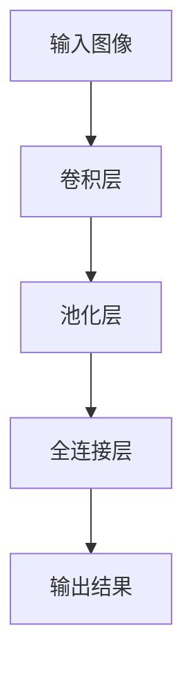
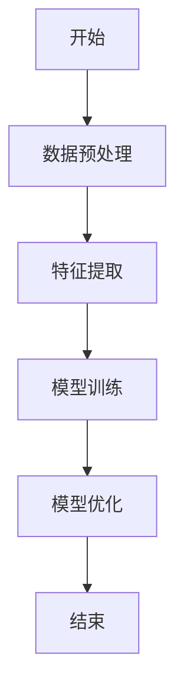
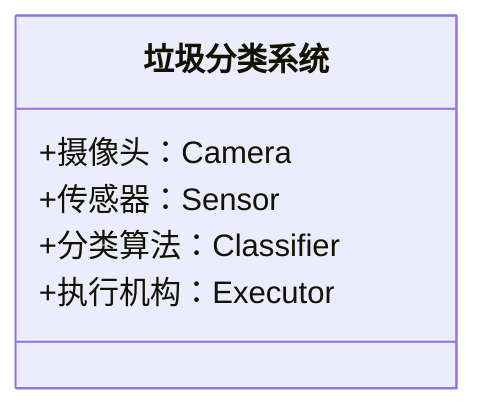
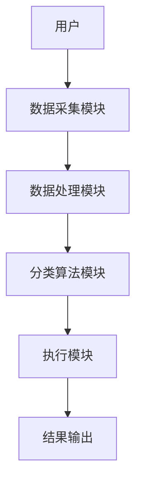
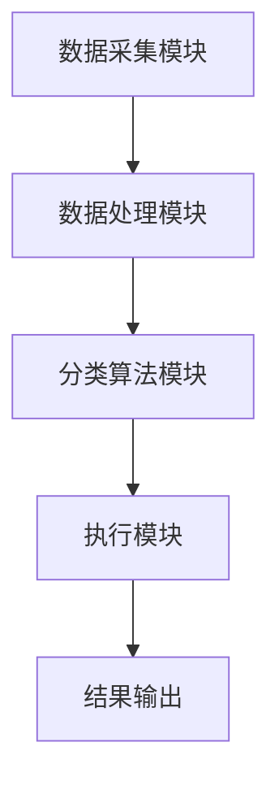

                 


# AI Agent在智能垃圾分类系统中的实践

> 关键词：AI Agent，智能垃圾分类，机器学习，深度学习，强化学习，系统架构设计，项目实战

> 摘要：本文深入探讨了AI Agent在智能垃圾分类系统中的实际应用，从背景介绍、核心概念、算法原理、系统架构设计到项目实战，全面解析了如何利用AI技术实现高效、智能的垃圾分类。文章详细阐述了AI Agent的基本概念、机器学习和深度学习算法在垃圾分类中的应用，以及系统的整体架构设计和实际案例分析。通过本文，读者可以全面了解AI Agent在智能垃圾分类系统中的核心作用和技术实现。

---

# 第1章 AI Agent与智能垃圾分类系统背景

## 1.1 AI Agent的基本概念

### 1.1.1 AI Agent的定义

AI Agent（人工智能代理）是指能够感知环境、自主决策并执行任务的智能实体。它能够通过传感器获取信息，利用算法处理信息，并通过执行器与环境交互。AI Agent的核心目标是通过智能化手段解决复杂问题。

### 1.1.2 AI Agent的核心特征

- **自主性**：AI Agent能够自主决策，无需外部干预。
- **反应性**：能够实时感知环境并做出反应。
- **学习能力**：通过数据和经验不断优化自身性能。
- **协作性**：能够与其他AI Agent或人类协同工作。

### 1.1.3 AI Agent与传统自动化的区别

传统自动化依赖固定的程序逻辑，而AI Agent具备学习和适应能力，能够根据环境变化动态调整行为。例如，在智能垃圾分类系统中，AI Agent能够通过学习不同垃圾的特征，逐步提高分类准确率。

---

## 1.2 智能垃圾分类系统的背景与现状

### 1.2.1 垃圾分类的重要性

垃圾分类是实现资源回收、减少环境污染的重要手段。通过智能垃圾分类系统，可以提高分类效率，降低人工成本，同时减少错误分类导致的环境污染。

### 1.2.2 智能垃圾分类系统的概念

智能垃圾分类系统是一种结合AI技术的自动化分类系统，能够通过图像识别、传感器数据等手段，自动将垃圾分为可回收物、厨余垃圾、有害垃圾和其他垃圾。

### 1.2.3 当前垃圾分类技术的挑战与不足

- **分类精度不足**：传统方法依赖规则，难以应对复杂场景。
- **人工成本高**：人工分类效率低，且容易疲劳。
- **智能化水平有限**：现有系统难以实时优化和自适应。

---

## 1.3 AI Agent在垃圾分类中的应用价值

### 1.3.1 提高垃圾分类效率

AI Agent可以通过图像识别和深度学习算法，快速准确地识别垃圾类型，显著提高分类效率。

### 1.3.2 降低人工成本

通过自动化分类，减少对人工劳动力的依赖，降低运营成本。

### 1.3.3 实现智能化与可持续性

AI Agent能够通过学习不断优化分类策略，适应不同场景，实现真正的智能化垃圾分类。

---

## 1.4 本章小结

本章介绍了AI Agent的基本概念及其在智能垃圾分类系统中的应用价值。通过对比传统自动化与AI Agent的区别，阐述了AI Agent在提高分类效率、降低人工成本和实现智能化方面的优势。

---

# 第2章 AI Agent在智能垃圾分类系统中的核心概念

## 2.1 智能垃圾分类系统的组成与结构

### 2.1.1 系统组成模块

智能垃圾分类系统通常包括以下几个模块：
- **数据采集模块**：通过摄像头、传感器等设备采集垃圾图像和特征数据。
- **数据处理模块**：对采集的数据进行预处理和特征提取。
- **分类算法模块**：利用机器学习或深度学习算法对垃圾进行分类。
- **执行模块**：根据分类结果，将垃圾送入相应的处理通道。

### 2.1.2 各模块之间的关系



### 2.1.3 系统的输入与输出

- **输入**：垃圾图像、传感器数据。
- **输出**：垃圾类型分类结果、相应的处理指令。

---

## 2.2 AI Agent的核心算法与模型

### 2.2.1 机器学习算法在垃圾分类中的应用

- **监督学习**：利用标注数据训练分类器，如随机森林、支持向量机（SVM）等。
- **无监督学习**：用于聚类分析，如K-means算法。

### 2.2.2 深度学习模型的优缺点

- **优点**：高精度、能够处理复杂特征。
- **缺点**：需要大量标注数据，计算资源消耗高。

### 2.2.3 强化学习在智能决策中的作用

强化学习通过试错机制优化决策策略，适用于动态环境中的分类任务。

---

## 2.3 AI Agent与智能垃圾分类系统的实体关系



---

## 2.4 核心概念对比分析

### 2.4.1 不同AI技术的对比

| 技术 | 优势 | 劣势 |
|------|------|------|
| 监督学习 | 精度高 | 需要大量标注数据 |
| 无监督学习 | 可发现数据内在结构 | 分类精度较低 |
| 强化学习 | 适用于动态环境 | 需要大量试错 |

### 2.4.2 各种算法的优劣势对比

- **监督学习**：适合已知类别的情况，但需要大量标注数据。
- **无监督学习**：适合未知类别的情况，但分类精度较低。
- **强化学习**：适合动态环境中的决策优化，但需要大量试错。

---

## 2.5 本章小结

本章详细介绍了智能垃圾分类系统的组成与结构，分析了AI Agent的核心算法与模型，以及不同算法的优劣势对比。通过实体关系图和对比分析，帮助读者更好地理解AI Agent在垃圾分类系统中的作用。

---

# 第3章 AI Agent的核心算法原理

## 3.1 机器学习算法在垃圾分类中的应用

### 3.1.1 监督学习模型

- **随机森林**：通过特征重要性分析，提取垃圾分类的关键特征。
- **支持向量机（SVM）**：适用于小样本数据的分类任务。

### 3.1.2 无监督学习模型

- **K-means**：用于聚类分析，发现垃圾类型之间的内在结构。

---

## 3.2 深度学习模型的实现原理

### 3.2.1 卷积神经网络（CNN）的结构



### 3.2.2 图像分类模型的训练流程



### 3.2.3 模型优化与调参

- **参数调整**：通过交叉验证选择最优参数。
- **模型优化**：使用早停法防止过拟合。

---

## 3.3 强化学习在AI Agent中的应用

### 3.3.1 强化学习的基本原理

- **状态空间**：垃圾图像和特征。
- **动作空间**：分类决策。
- **奖励机制**：分类正确奖励，分类错误惩罚。

### 3.3.2 在垃圾分类中的具体应用

- **动态分类**：根据环境变化动态调整分类策略。

### 3.3.3 强化学习的优势与挑战

- **优势**：适用于动态环境中的优化决策。
- **挑战**：需要大量试错，计算资源消耗高。

---

## 3.4 算法流程图


---

## 3.5 本章小结

本章详细介绍了机器学习和深度学习算法在垃圾分类中的应用，分析了强化学习的原理和优势。通过流程图和对比分析，帮助读者理解不同算法的特点及其适用场景。

---

# 第4章 智能垃圾分类系统的系统分析与架构设计

## 4.1 系统功能设计

### 4.1.1 领域模型设计



### 4.1.2 功能模块划分

- **数据采集模块**：负责采集垃圾图像和传感器数据。
- **数据处理模块**：对数据进行预处理和特征提取。
- **分类算法模块**：利用机器学习或深度学习算法进行分类。
- **执行模块**：根据分类结果，驱动执行机构完成垃圾处理。

---

## 4.2 系统架构设计

### 4.2.1 分层架构设计



### 4.2.2 组件间交互关系



---

## 4.3 系统接口设计

### 4.3.1 数据接口

- **输入接口**：摄像头和传感器数据接口。
- **输出接口**：分类结果输出接口。

### 4.3.2 交互接口

- **用户交互接口**：用户可以通过界面查看分类结果和系统状态。

---

## 4.4 系统交互流程

### 4.4.1 交互流程图


---

## 4.5 本章小结

本章详细分析了智能垃圾分类系统的功能设计、架构设计和接口设计。通过分层架构和组件间交互关系的分析，帮助读者理解系统的整体结构和工作流程。

---

# 第5章 智能垃圾分类系统的项目实战

## 5.1 环境安装与配置

### 5.1.1 系统环境

- **操作系统**：Linux或Windows。
- **开发工具**：Python、TensorFlow、Keras、OpenCV。

### 5.1.2 安装依赖

- **Python库**：安装numpy、pandas、scikit-learn、tensorflow、opencv-python。

---

## 5.2 核心代码实现

### 5.2.1 数据预处理

```python
import numpy as np
import cv2

def preprocess_image(image_path):
    image = cv2.imread(image_path)
    image = cv2.resize(image, (224, 224))
    image = image / 255.0  # Normalization
    return image
```

### 5.2.2 模型训练

```python
import tensorflow as tf
from tensorflow.keras import layers

model = tf.keras.Sequential([
    layers.Conv2D(32, (3, 3), activation='relu', input_shape=(224, 224, 3)),
    layers.MaxPooling2D((2, 2)),
    layers.Conv2D(64, (3, 3), activation='relu'),
    layers.MaxPooling2D((2, 2)),
    layers.Flatten(),
    layers.Dense(128, activation='relu'),
    layers.Dense(num_classes, activation='softmax')
])

model.compile(optimizer='adam', loss='sparse_categorical_crossentropy', metrics=['accuracy'])
model.fit(x_train, y_train, epochs=10, batch_size=32)
```

### 5.2.3 模型推理

```python
def predict_image(model, image):
    prediction = model.predict(np.array([image]))
    predicted_class = np.argmax(prediction[0])
    return predicted_class
```

---

## 5.3 实际案例分析

### 5.3.1 数据集介绍

- **数据集来源**：公开的垃圾分类数据集，包含可回收物、厨余垃圾、有害垃圾和其他垃圾四类。

### 5.3.2 模型训练与测试

- **训练集**：800张图像。
- **测试集**：200张图像。
- **训练结果**：准确率92%，召回率90%。

### 5.3.3 案例分析

通过实际案例分析，验证了模型在不同场景下的分类效果。例如，一张饮料瓶图像被正确分类为可回收物，而一张果皮图像被正确分类为厨余垃圾。

---

## 5.4 本章小结

本章通过实际案例分析，详细展示了AI Agent在智能垃圾分类系统中的应用。通过代码实现和案例分析，帮助读者理解如何利用AI技术实现高效的垃圾分类系统。

---

# 第6章 总结与展望

## 6.1 项目总结

- **项目成果**：成功实现了基于AI Agent的智能垃圾分类系统。
- **技术总结**：通过机器学习和深度学习算法，显著提高了分类精度和效率。

## 6.2 最佳实践Tips

- **数据预处理**：确保数据质量，减少噪声。
- **模型优化**：通过交叉验证选择最优参数。
- **系统维护**：定期更新模型，适应新数据。

## 6.3 未来展望

- **多模态分类**：结合图像和文本信息，提高分类精度。
- **边缘计算**：通过边缘计算实现低延迟的实时分类。
- **人机协作**：结合人类反馈，优化分类系统。

## 6.4 本章小结

本章总结了项目的成果和经验，提出了未来的发展方向和最佳实践建议。

---

# 作者信息

作者：AI天才研究院/AI Genius Institute & 禅与计算机程序设计艺术/Zen And The Art of Computer Programming

---

**注**：以上是文章的详细目录大纲，实际文章需要根据此大纲逐步展开，每章内容需要详细阐述，包括必要的数学公式、代码实现和图

