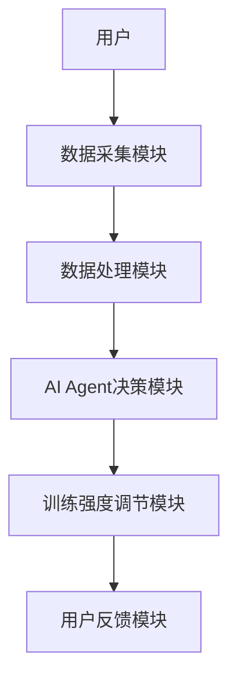
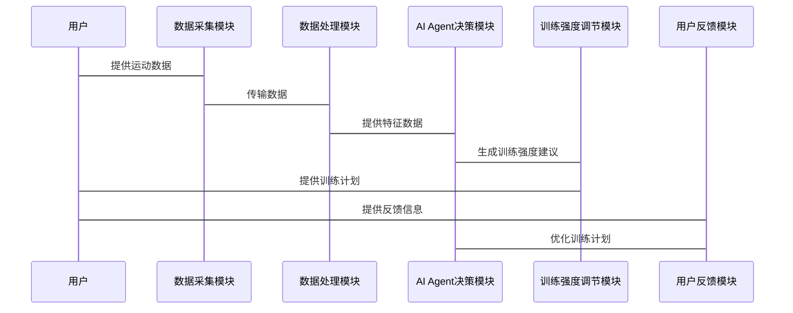

                 


# AI Agent在智能运动鞋中的训练强度调节

> 关键词：AI Agent，智能运动鞋，训练强度调节，算法原理，系统架构

> 摘要：本文系统地探讨了AI Agent在智能运动鞋中的应用，重点分析了AI Agent如何通过运动数据采集、算法模型构建与优化，实现个性化的训练强度调节。文章从背景、概念、算法原理、系统架构设计、项目实战等多维度展开，详细阐述了AI Agent在智能运动鞋中的实现逻辑与技术细节。通过理论与实践相结合的方式，本文为读者呈现了一幅AI技术在运动健康领域的全景图。

---

# 第一部分: AI Agent与智能运动鞋的背景与概念

## 第1章: AI Agent与智能运动鞋概述

### 1.1 智能运动鞋的发展背景

#### 1.1.1 智能运动鞋的定义与特点
智能运动鞋是一种结合了物联网（IoT）、人工智能（AI）和运动科学的高科技鞋类。它通过内置的传感器实时采集用户的运动数据（如步频、步幅、心率、加速度等），并通过AI技术分析这些数据，为用户提供个性化的运动建议和训练计划。

#### 1.1.2 AI技术在运动鞋中的应用现状
目前，AI技术在智能运动鞋中的应用主要集中在以下几个方面：
1. **运动数据分析**：通过AI算法分析用户的运动数据，评估运动表现和健康状况。
2. **个性化训练计划**：根据用户的运动习惯和身体状况，生成个性化的训练计划。
3. **实时反馈与调整**：在运动过程中，AI Agent实时监测用户的运动状态，并根据数据动态调整训练强度。

#### 1.1.3 训练强度调节的核心问题与挑战
训练强度调节的核心问题是如何在保证运动安全的前提下，最大化用户的运动效果。主要挑战包括：
1. 如何准确采集和处理运动数据。
2. 如何设计高效的算法模型来实现训练强度的动态调节。
3. 如何确保用户数据的隐私与安全。

---

### 1.2 AI Agent的基本概念与功能

#### 1.2.1 AI Agent的定义与核心特征
AI Agent是一种能够感知环境、做出决策并执行操作的智能实体。在智能运动鞋中，AI Agent的核心特征包括：
1. **感知能力**：通过传感器采集用户的运动数据。
2. **决策能力**：基于运动数据和预设的算法模型，生成训练强度调节建议。
3. **执行能力**：通过与运动设备的交互，实现训练强度的动态调整。

#### 1.2.2 AI Agent在智能运动鞋中的角色与作用
AI Agent在智能运动鞋中的主要作用包括：
1. **数据处理与分析**：对用户的运动数据进行清洗、特征提取和建模分析。
2. **训练强度调节**：根据用户的运动状态和健康状况，动态调整训练计划。
3. **个性化反馈**：为用户提供个性化的运动建议和健康指导。

#### 1.2.3 训练强度调节的实现逻辑与流程
训练强度调节的实现逻辑包括以下几个步骤：
1. 数据采集：通过传感器采集用户的运动数据。
2. 数据分析：利用AI算法对数据进行分析，评估用户的运动状态。
3. 训练强度计算：根据用户的运动目标和健康状况，计算出最佳的训练强度。
4. 实时调整：在运动过程中，根据实时数据动态调整训练强度。

---

### 1.3 本章小结
本章介绍了智能运动鞋的发展背景、AI Agent的基本概念与功能，以及训练强度调节的核心问题与实现逻辑。通过这些内容，读者可以对AI Agent在智能运动鞋中的应用有一个全面的了解。

---

# 第二部分: AI Agent的核心概念与原理

## 第2章: AI Agent的核心概念与联系

### 2.1 AI Agent的核心概念

#### 2.1.1 AI Agent的基本组成要素
AI Agent的基本组成要素包括：
1. **感知模块**：负责采集环境中的数据（如运动数据）。
2. **决策模块**：基于感知数据和预设算法，生成决策指令。
3. **执行模块**：根据决策指令，执行相应的操作（如调整训练强度）。

#### 2.1.2 AI Agent的核心功能模块
AI Agent的核心功能模块包括：
1. **数据采集模块**：通过传感器采集用户的运动数据。
2. **数据处理模块**：对采集到的数据进行清洗和特征提取。
3. **决策模块**：利用AI算法对数据进行分析，生成训练强度调节建议。
4. **反馈模块**：根据用户的反馈信息，优化训练计划。

#### 2.1.3 AI Agent与智能运动鞋的交互机制
AI Agent与智能运动鞋的交互机制包括：
1. **数据输入**：用户通过运动鞋上的传感器输入数据。
2. **数据处理**：AI Agent对数据进行分析和处理。
3. **决策输出**：AI Agent根据分析结果生成训练强度调节建议。
4. **用户反馈**：用户根据AI Agent的建议进行调整，并将反馈信息输入系统。

---

### 2.2 AI Agent的核心原理

#### 2.2.1 数据采集与处理
AI Agent通过传感器采集用户的运动数据，包括：
1. **步频**：每分钟的步数。
2. **步幅**：每步的长度。
3. **心率**：心脏跳动的频率。
4. **加速度**：运动时的加速度变化。

#### 2.2.2 训练强度调节算法
AI Agent利用训练强度调节算法对用户的运动数据进行分析，生成个性化的训练计划。常用的算法包括：
1. **强化学习**：通过奖励机制优化训练强度。
2. **机器学习**：利用回归模型预测最佳训练强度。
3. **规则驱动**：根据预设的规则调整训练强度。

#### 2.2.3 用户反馈与优化机制
AI Agent通过用户的反馈信息不断优化训练计划。用户可以通过运动鞋上的界面输入反馈信息（如疲劳程度、运动目标等），AI Agent根据这些信息调整训练强度。

---

### 2.3 AI Agent与运动数据的关系

#### 2.3.1 运动数据的类型与特征
运动数据的类型包括：
1. **时间序列数据**：如步频、步幅等随时间变化的数据。
2. **特征数据**：如心率、加速度等反映运动强度的特征。

#### 2.3.2 数据驱动的训练强度调节
AI Agent通过分析用户的运动数据，动态调整训练强度。例如：
- 根据用户的步频和步幅，调整跑步速度。
- 根据用户的心率，优化训练计划中的心率区间。

#### 2.3.3 数据隐私与安全问题
AI Agent在处理用户数据时，必须确保数据的隐私与安全。可以通过加密技术、数据匿名化等手段保护用户隐私。

---

### 2.4 本章小结
本章详细介绍了AI Agent的核心概念、功能模块与原理，以及AI Agent与运动数据的关系。通过这些内容，读者可以理解AI Agent在智能运动鞋中的核心作用。

---

## 第3章: AI Agent的算法原理

### 3.1 算法原理概述

#### 3.1.1 强化学习的训练强度调节
强化学习是一种基于奖励机制的算法。AI Agent通过不断尝试不同的训练强度，根据用户的反馈信息（如疲劳程度、运动效果）调整策略，最终找到最佳的训练强度。

#### 3.1.2 机器学习的训练强度预测
机器学习算法（如线性回归、支持向量机）可以用来预测用户的最佳训练强度。通过训练模型，AI Agent可以根据用户的运动数据和健康状况，生成个性化的训练计划。

#### 3.1.3 规则驱动的训练强度调节
规则驱动是一种基于预设规则的训练强度调节方法。例如，根据用户的心率区间，AI Agent可以调整训练的强度。

---

### 3.2 算法实现流程

#### 3.2.1 数据预处理与特征提取
AI Agent需要对采集到的运动数据进行预处理，包括数据清洗、特征提取等。例如，提取用户的步频、步幅、心率等特征。

#### 3.2.2 模型训练与优化
通过机器学习算法对特征数据进行建模，训练出一个能够预测最佳训练强度的模型。例如，利用随机森林算法对数据进行建模。

#### 3.2.3 模型部署与实时调节
将训练好的模型部署到智能运动鞋中，实时采集用户的运动数据，并根据模型预测结果动态调整训练强度。

---

### 3.3 算法的数学模型与公式

#### 3.3.1 强化学习的数学模型
强化学习的数学模型通常包括状态（State）、动作（Action）、奖励（Reward）和策略（Policy）。例如，可以使用Q-learning算法来优化训练强度。

$$ Q(s, a) = Q(s, a) + \alpha (r + \gamma \max Q(s', a') - Q(s, a)) $$

其中，\( Q(s, a) \) 表示状态 \( s \) 下采取动作 \( a \) 的价值，\( \alpha \) 是学习率，\( r \) 是奖励，\( \gamma \) 是折扣因子，\( Q(s', a') \) 是下一个状态下的最大价值。

#### 3.3.2 机器学习的训练公式
以线性回归为例，训练强度预测的模型可以表示为：

$$ y = \beta_0 + \beta_1 x_1 + \beta_2 x_2 + \dots + \beta_n x_n $$

其中，\( y \) 是预测的训练强度，\( x_i \) 是输入特征，\( \beta_i \) 是模型参数。

---

### 3.4 算法的优缺点与适用场景

#### 3.4.1 各种算法的优缺点对比
| 算法类型 | 优点 | 缺点 |
|----------|------|------|
| 强化学习 | 可以优化复杂决策问题 | 需要大量数据和计算资源 |
| 机器学习 | 简单易实现 | 需要大量标注数据 |
| 规则驱动 | 易解释 | 需要手动设计规则 |

#### 3.4.2 不同场景下的算法选择
- **强化学习**适用于需要动态调整训练强度的场景。
- **机器学习**适用于需要根据用户特征预测最佳训练强度的场景。
- **规则驱动**适用于规则明确的场景。

#### 3.4.3 算法的可扩展性与适应性
AI Agent可以根据用户反馈不断优化算法模型，从而提高训练强度调节的准确性和适应性。

---

### 2.5 本章小结
本章详细介绍了AI Agent的算法原理，包括强化学习、机器学习和规则驱动的训练强度调节方法。通过数学模型和公式，读者可以理解这些算法的核心思想。

---

# 第三部分: 系统分析与架构设计

## 第4章: 系统分析与架构设计方案

### 4.1 系统功能设计

#### 4.1.1 用户运动数据采集模块
用户运动数据采集模块负责通过传感器采集用户的运动数据，包括步频、步幅、心率等。

#### 4.1.2 AI Agent决策模块
AI Agent决策模块根据采集到的运动数据，利用预设的算法模型生成训练强度调节建议。

#### 4.1.3 训练强度调节模块
训练强度调节模块根据AI Agent的决策结果，调整用户的训练计划。

#### 4.1.4 用户反馈与优化模块
用户反馈与优化模块收集用户的反馈信息，并根据这些信息优化训练计划。

---

### 4.2 系统架构设计

#### 4.2.1 系统整体架构图（Mermaid）


#### 4.2.2 系统功能模块之间的关系
系统功能模块之间的关系如下：
1. 用户通过运动鞋上的传感器输入数据。
2. 数据采集模块将数据传输到数据处理模块。
3. 数据处理模块对数据进行清洗和特征提取。
4. AI Agent决策模块利用训练好的模型生成训练强度调节建议。
5. 训练强度调节模块根据建议调整用户的训练计划。
6. 用户反馈模块收集用户的反馈信息，并优化训练计划。

---

### 4.3 系统接口设计

#### 4.3.1 数据接口
AI Agent需要与运动鞋上的传感器进行数据交互。数据接口的设计需要考虑数据格式、传输协议等问题。

#### 4.3.2 用户接口
用户可以通过运动鞋上的界面查看AI Agent的建议，并输入反馈信息。

---

### 4.4 系统交互设计（Mermaid）



---

### 4.5 本章小结
本章详细介绍了智能运动鞋系统的功能设计与架构设计方案，包括系统的整体架构图、模块之间的关系、接口设计和系统交互设计。

---

## 第5章: 项目实战与案例分析

### 5.1 项目环境搭建

#### 5.1.1 硬件环境
智能运动鞋的硬件环境包括：
1. 传感器模块（如心率传感器、加速度传感器）。
2. 运动鞋上的微控制器（如Arduino、Raspberry Pi）。
3. 无线通信模块（如蓝牙、Wi-Fi）。

#### 5.1.2 软件环境
AI Agent的软件环境包括：
1. 数据采集与处理工具（如Python、MATLAB）。
2. 算法实现框架（如TensorFlow、PyTorch）。
3. 云平台（如AWS、Google Cloud）。

---

### 5.2 系统核心实现源代码

#### 5.2.1 数据采集与处理代码（Python）
```python
import numpy as np
import pandas as pd

# 数据采集模块
def collect_data(sensors):
    data = []
    for sensor in sensors:
        data.append(sensor.read())
    return data

# 数据处理模块
def process_data(data):
    df = pd.DataFrame(data)
    # 数据清洗
    df.dropna(inplace=True)
    # 特征提取
    features = df.describe()
    return features

# AI Agent决策模块
def ai_decision(features):
    # 使用机器学习模型预测最佳训练强度
    model = load_model()
    prediction = model.predict(features)
    return prediction

# 训练强度调节模块
def adjust_training_intensity(prediction):
    current_intensity = get_current_intensity()
    new_intensity = current_intensity + prediction
    return new_intensity
```

#### 5.2.2 AI Agent决策模块代码（基于强化学习）
```python
import numpy as np

# 强化学习算法实现
class AIAgent:
    def __init__(self):
        self.Q_table = np.zeros((state_space, action_space))
        self.learning_rate = 0.1
        self.discount_factor = 0.9

    def choose_action(self, state):
        if np.random.random() < 0.1:
            return np.random.randint(action_space)
        else:
            return np.argmax(self.Q_table[state])

    def learn(self, state, action, reward, next_state):
        self.Q_table[state][action] = self.Q_table[state][action] + self.learning_rate * (reward + self.discount_factor * np.max(self.Q_table[next_state]) - self.Q_table[state][action])
```

---

### 5.3 代码应用解读与分析

#### 5.3.1 数据采集与处理
数据采集模块通过传感器采集用户的运动数据，数据处理模块对数据进行清洗和特征提取，为AI Agent决策模块提供输入。

#### 5.3.2 AI Agent决策模块
AI Agent决策模块利用预设的算法模型（如机器学习或强化学习）生成训练强度调节建议。

#### 5.3.3 系统交互与反馈
用户通过运动鞋上的界面查看AI Agent的建议，并输入反馈信息。系统根据反馈信息优化训练计划。

---

### 5.4 实际案例分析

#### 5.4.1 案例背景
假设用户A是一名跑步爱好者，希望通过智能运动鞋实现个性化的训练强度调节。

#### 5.4.2 数据采集与分析
AI Agent通过传感器采集用户的运动数据，包括步频、步幅、心率等。

#### 5.4.3 AI Agent的决策过程
AI Agent根据用户的运动数据，利用强化学习算法生成训练强度调节建议。

#### 5.4.4 实时调整与反馈
用户根据AI Agent的建议进行调整，并将反馈信息输入系统。系统根据反馈信息优化训练计划。

---

### 5.5 项目小结
通过本章的项目实战与案例分析，读者可以了解AI Agent在智能运动鞋中的具体实现过程。从环境搭建、代码实现到案例分析，整个过程帮助读者掌握了AI技术在智能运动鞋中的应用。

---

## 第6章: 最佳实践、小结与注意事项

### 6.1 最佳实践
1. **数据隐私保护**：在处理用户数据时，必须确保数据的隐私与安全。
2. **算法优化**：根据具体场景选择合适的算法，并不断优化算法模型。
3. **用户体验**：设计友好的用户界面，确保用户能够方便地使用AI Agent的建议。

### 6.2 小结
通过本文的详细讲解，读者可以系统地了解AI Agent在智能运动鞋中的训练强度调节的实现过程。从背景、概念、算法原理到系统设计与项目实战，本文为读者呈现了一幅完整的AI技术在运动健康领域的应用图景。

### 6.3 注意事项
1. **数据质量问题**：确保数据采集的准确性和完整性。
2. **算法可解释性**：在复杂场景下，确保AI Agent的决策过程具有可解释性。
3. **系统稳定性**：确保系统的稳定运行，避免因技术问题影响用户体验。

---

## 第7章: 拓展阅读与未来展望

### 7.1 拓展阅读
推荐以下几本书籍和论文，供读者深入学习AI Agent在运动健康领域的应用：
1. 《强化学习：算法与应用》
2. 《机器学习实战》
3. 《智能运动鞋中的AI技术研究》

### 7.2 未来展望
随着AI技术的不断发展，智能运动鞋的功能将更加智能化和个性化。未来的研究方向包括：
1. **更高效的算法模型**：开发更高效的AI算法，提高训练强度调节的准确性和实时性。
2. **多模态数据融合**：结合多种运动数据（如步频、心率、加速度等），实现更精准的训练强度调节。
3. **智能化反馈系统**：开发更智能的反馈系统，提升用户体验。

---

## 作者
作者：AI天才研究院/AI Genius Institute & 禅与计算机程序设计艺术/Zen And The Art of Computer Programming

---

通过本文的系统讲解，读者可以全面了解AI Agent在智能运动鞋中的训练强度调节的实现过程。从理论到实践，本文为读者呈现了一幅完整的AI技术在运动健康领域的应用图景。

