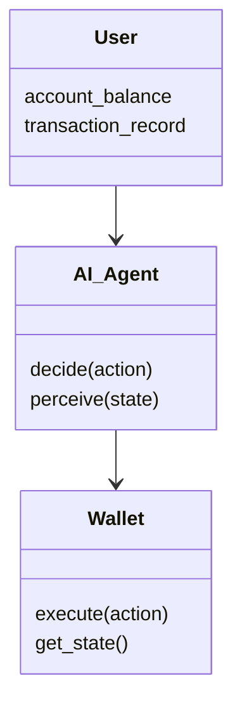

                 

<think>
好的，我将按照您的要求，逐步构建一篇关于《AI Agent在智能钱包中的个人财务管理》的技术博客文章。首先，我需要理解文章的结构和每个部分的核心内容，确保逻辑清晰、内容详实。

### 文章标题：AI Agent在智能钱包中的个人财务管理

### 关键词：
- AI Agent
- 智能钱包
- 个人财务管理
- 人工智能
- 金融技术
- 预算管理
- 风险控制

### 摘要：
随着人工智能技术的飞速发展，AI Agent在金融领域的应用日益广泛。本文详细探讨了AI Agent在智能钱包中的个人财务管理应用，从背景介绍、核心概念、算法原理到系统架构、项目实战，全面解析了AI Agent如何助力智能钱包实现智能化的财务管理。通过实际案例分析和详细代码实现，本文为读者提供了从理论到实践的深度解析，展示了AI Agent在智能钱包中的巨大潜力和应用前景。

---

### 第一部分: AI Agent在智能钱包中的个人财务管理概述

#### 第1章: AI Agent与智能钱包的背景介绍

##### 1.1 AI Agent的基本概念
###### 1.1.1 AI Agent的定义
AI Agent（人工智能代理）是指能够感知环境、自主决策并执行任务的智能实体。它通过传感器获取信息，利用算法进行分析和判断，并通过执行器完成目标。

###### 1.1.2 AI Agent的核心特征
- **自主性**：能够自主决策，无需人工干预。
- **反应性**：能够实时感知环境变化并做出反应。
- **学习能力**：通过机器学习不断优化自身算法。
- **社交能力**：能够与其他AI Agent或人类进行交互。

###### 1.1.3 AI Agent与传统软件代理的区别
| 特性           | 传统软件代理                          | AI Agent                               |
|----------------|--------------------------------------|----------------------------------------|
| 智能性         | 依赖预设规则                          | 具备学习能力                          |
| 自主性         | 需要人工干预                          | 自主决策                              |
| 适应性         | 无法应对复杂变化                      | 能够自适应环境                        |

##### 1.2 智能钱包的基本概念
###### 1.2.1 智能钱包的定义
智能钱包是一种结合区块链技术和人工智能的电子钱包，能够自动执行预设的金融指令，如自动转账、智能合约等。

###### 1.2.2 智能钱包的功能与优势
- **自动转账**：根据设定条件自动完成转账。
- **智能合约**：通过区块链技术实现自动化的合同执行。
- **风险管理**：实时监控账户风险，及时发出预警。
- **自动化投资**：根据市场波动自动调整投资策略。

###### 1.2.3 智能钱包的应用场景
- **个人财务管理**：帮助用户实现自动化预算管理和风险控制。
- **企业支付**：企业可以通过智能钱包实现自动化的账单支付。
- **跨境支付**：利用区块链技术实现快速、低成本的跨境支付。

##### 1.3 AI Agent在智能钱包中的应用背景
###### 1.3.1 个人财务管理的痛点与挑战
- **信息碎片化**：用户需要管理多个账户，信息分散。
- **决策复杂性**：面对复杂的市场环境，个人难以做出最优决策。
- **效率低下**：手动管理财务耗时耗力。

###### 1.3.2 AI Agent如何解决个人财务管理问题
- **自动化管理**：AI Agent可以自动处理账单、转账等事务。
- **智能决策**：通过机器学习模型，AI Agent能够预测市场趋势，帮助用户做出最优投资决策。
- **实时监控**：AI Agent实时监控账户余额和交易记录，及时发现异常。

###### 1.3.3 智能钱包与AI Agent的结合趋势
随着区块链技术和人工智能的快速发展，智能钱包与AI Agent的结合将成为未来金融科技的重要趋势。通过AI Agent的智能化管理，智能钱包将能够为用户提供更高效、更安全的财务管理服务。

##### 1.4 本章小结
本章介绍了AI Agent和智能钱包的基本概念，分析了AI Agent在智能钱包中的应用背景，并指出了其在个人财务管理中的巨大潜力。

---

### 第二部分: AI Agent的核心概念与原理

#### 第2章: AI Agent的核心概念与联系

##### 2.1 AI Agent的核心概念
###### 2.1.1 AI Agent的感知、决策与执行机制
- **感知**：通过传感器或数据接口获取环境信息。
- **决策**：基于获取的信息，利用算法进行判断。
- **执行**：根据决策结果执行相应的动作。

###### 2.1.2 AI Agent的智能决策模型
AI Agent的智能决策模型通常包括以下几个步骤：
1. **数据采集**：获取相关数据。
2. **数据分析**：对数据进行清洗、处理和分析。
3. **模型训练**：利用机器学习算法训练模型。
4. **决策生成**：基于模型预测结果生成决策。
5. **反馈优化**：根据执行结果优化模型。

###### 2.1.3 AI Agent的自适应能力
AI Agent能够根据环境变化不断优化自身的算法和策略，从而提高决策的准确性。

##### 2.2 AI Agent与智能钱包的实体关系
###### 2.2.1 用户与AI Agent的关系
用户通过智能钱包向AI Agent发出指令，AI Agent根据指令完成相应的操作。

###### 2.2.2 AI Agent与智能钱包的关系
AI Agent作为智能钱包的核心模块，负责处理智能钱包的决策和执行任务。

###### 2.2.3 交易记录与预算管理的关系
AI Agent通过分析交易记录，帮助用户制定预算计划，并实时监控预算执行情况。

##### 2.3 AI Agent的核心原理
###### 2.3.1 感知层: 数据采集与分析
AI Agent通过智能钱包获取用户的交易记录、账户余额等数据，并利用数据分析技术对数据进行处理。

###### 2.3.2 决策层: 算法与模型
AI Agent利用机器学习算法，如强化学习和监督学习，训练预测模型，并根据模型预测结果生成决策。

###### 2.3.3 执行层: 动作与反馈
AI Agent根据决策结果执行相应的动作，并通过反馈机制不断优化自身的算法。

##### 2.4 AI Agent的特征对比
| 特性           | 强化学习                         | 监督学习                          |
|----------------|---------------------------------|-----------------------------------|
| 数据来源       | 环境反馈                         | 标签数据                          |
| 学习目标       | 最大化累积奖励                   | 最小化预测误差                    |
| 应用场景       | 自动化决策                       | 分类、回归等问题                  |

---

#### 第3章: AI Agent的算法原理与实现

##### 3.1 AI Agent的核心算法
###### 3.1.1 强化学习算法
- **Q-learning算法**：通过状态-动作-奖励的机制，学习最优策略。
- **数学公式**：
  $$ Q(s,a) = Q(s,a) + \alpha (r + \gamma \max Q(s',a') - Q(s,a)) $$
  其中，\( \alpha \)是学习率，\( \gamma \)是折扣因子。

##### 3.1.2 监督学习算法
- **随机森林回归**：用于预测市场趋势。
- **数学公式**：
  $$ y = \sum_{i=1}^{n} w_i x_i + b $$

##### 3.2 算法实现
###### 3.2.1 强化学习算法实现
```python
class AI_Agent:
    def __init__(self):
        self.q_table = {}  # 初始化Q表

    def perceive(self, state):
        # 获取环境反馈
        return state, reward, done

    def decide(self, state):
        # 根据Q表选择动作
        if state not in self.q_table:
            self.q_table[state] = 0
        return 'action'  # 示例动作

    def learn(self, state, action, reward, next_state):
        # 更新Q表
        self.q_table[state] += self.alpha * (reward + self.gamma * max(self.q_table.get(next_state, 0)) - self.q_table[state])
```

###### 3.2.2 监督学习算法实现
```python
from sklearn.ensemble import RandomForestRegressor

class Budget_Predictor:
    def __init__(self):
        self.model = RandomForestRegressor()

    def train(self, X, y):
        # 训练模型
        self.model.fit(X, y)

    def predict(self, X):
        # 预测预算
        return self.model.predict(X)
```

##### 3.3 算法优化与调优
- **超参数调整**：通过网格搜索优化算法性能。
- **模型集成**：结合多种算法提高预测准确性。

---

#### 第4章: AI Agent的系统架构与设计

##### 4.1 系统功能设计
###### 4.1.1 预算管理
- **自动预算设定**：根据用户收入和支出情况自动制定预算计划。
- **预算执行监控**：实时跟踪预算执行情况，及时提醒超支。

##### 4.1.2 风险控制
- **风险预警**：通过数据分析发现潜在风险，并及时发出预警。
- **风险应对策略**：根据风险类型制定相应的应对措施。

##### 4.2 系统架构设计
###### 4.2.1 领域模型


###### 4.2.2 系统架构
```mermaid
graph TD
    User --> API Gateway
    API Gateway --> AI_Agent
    AI_Agent --> Database
    Database --> Smart_Wallet
```

##### 4.3 接口设计与交互流程
###### 4.3.1 接口设计
- **AI Agent API**：提供决策接口，如`/api/agent/decide`。
- **智能钱包 API**：提供账户信息查询接口，如`/api/wallet/balance`。

###### 4.3.2 交互流程
1. 用户通过智能钱包发出请求。
2. AI Agent接收请求，分析数据。
3. AI Agent根据分析结果生成决策。
4. 智能钱包根据决策执行相应操作。
5. 执行结果反馈给AI Agent，优化算法。

---

### 第三部分: 项目实战与应用

#### 第5章: 项目实战

##### 5.1 环境安装与配置
- **Python环境**：安装Python 3.8以上版本。
- **依赖库安装**：安装`numpy`, `pandas`, `scikit-learn`, `mermaid`, `random-forest`等库。

##### 5.2 系统核心实现
###### 5.2.1 AI Agent核心代码实现
```python
import numpy as np
from sklearn.ensemble import RandomForestRegressor

class AIAgent:
    def __init__(self):
        self.model = RandomForestRegressor()
        self.alpha = 0.1  # 学习率
        self.gamma = 0.9  # 折扣因子

    def train(self, X, y):
        self.model.fit(X, y)

    def predict(self, X):
        return self.model.predict(X)

    def decide(self, state, actions):
        # 预测每个动作的收益
        predicted_rewards = {}
        for action in actions:
            new_state = self.get_new_state(state, action)
            predicted_rewards[action] = self.predict(new_state)
        return max(predicted_rewards, key=lambda k: predicted_rewards[k])
```

###### 5.2.2 智能钱包核心代码实现
```python
class SmartWallet:
    def __init__(self):
        self.balance = 0
        self.transaction_record = []

    def execute_action(self, action):
        # 根据动作执行操作
        if action == 'transfer':
            self.balance -= 100
            self.transaction_record.append('Transfer: -100')
        elif action == 'invest':
            self.balance += 50
            self.transaction_record.append('Invest: +50')

    def get_current_state(self):
        return self.balance, len(self.transaction_record)
```

##### 5.3 代码应用解读与分析
- **训练模型**：使用历史交易数据训练AI Agent的预测模型。
- **预测与决策**：根据当前账户状态，AI Agent预测最优动作。
- **执行操作**：智能钱包根据AI Agent的决策执行相应的操作。

##### 5.4 实际案例分析
- **案例1**：用户账户余额为1000元，交易记录为空。AI Agent预测最佳动作是“invest”，执行投资操作，账户余额增加到1050元。
- **案例2**：用户账户余额为500元，交易记录显示最近有超支行为。AI Agent预测最佳动作是“alert”，提醒用户注意超支。

##### 5.5 项目小结
通过实际案例分析，我们可以看到AI Agent在智能钱包中的应用能够显著提高财务管理的效率和准确性。

---

### 第四部分: 总结与展望

#### 第6章: 总结与展望

##### 6.1 最佳实践 tips
- **数据质量**：确保输入数据的准确性和完整性。
- **模型优化**：定期更新模型，保持预测准确性。
- **安全性**：加强系统安全性，防止数据泄露。

##### 6.2 本章小结
本文详细探讨了AI Agent在智能钱包中的个人财务管理应用，从理论到实践，全面解析了AI Agent的核心概念、算法原理和系统架构。

##### 6.3 注意事项
- AI Agent的决策结果仅供参考，具体操作需结合实际情况。
- 系统运行过程中需注意数据安全和隐私保护。

##### 6.4 拓展阅读
- **推荐书籍**：《机器学习实战》、《区块链技术与智能合约》
- **推荐论文**：《强化学习在金融领域的应用研究》
- **推荐网站**：Towards Data Science, Medium AI

---

### 作者：AI天才研究院/AI Genius Institute & 禅与计算机程序设计艺术 /Zen And The Art of Computer Programming

---

希望这篇文章的结构和内容能够满足您的要求！如果需要进一步修改或补充，请随时告知。

