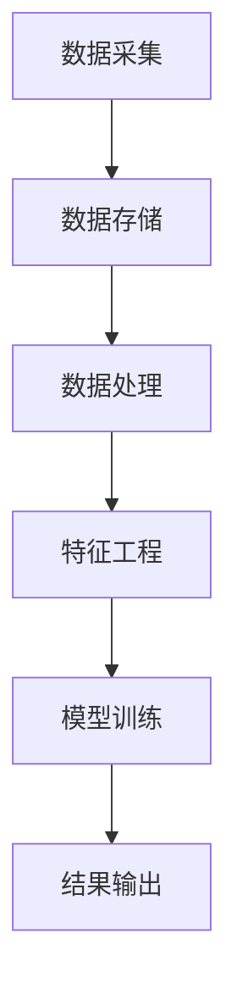
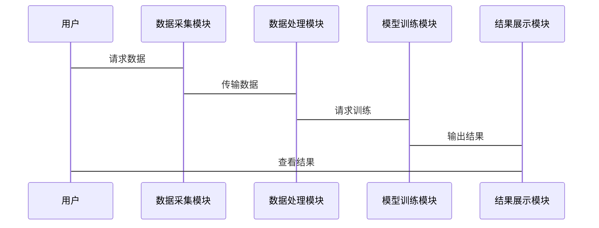

                 


# AI在企业信用评级中的应用与挑战

> 关键词：企业信用评级，人工智能，机器学习，信用风险，金融创新

> 摘要：本文深入探讨了人工智能在企业信用评级中的应用与挑战。首先，我们介绍了企业信用评级的基本概念和传统方法的局限性，接着分析了AI技术在信用评级中的核心概念与联系，详细讲解了常见算法的原理与实现。然后，我们从系统架构设计的角度，探讨了AI在企业信用评级中的应用场景与技术实现。最后，我们通过一个完整的项目实战，展示了AI技术在信用评级中的具体应用，并总结了相关经验和最佳实践。

---

# 正文

## 第一部分：企业信用评级与AI的背景介绍

### 第1章：企业信用评级概述

#### 1.1 企业信用评级的基本概念

企业信用评级是指通过对企业财务状况、经营能力、管理水平等多方面因素的综合评估，确定企业信用等级的过程。信用评级的结果通常用于金融机构对企业发放贷款、投资决策等重要业务中。

- **信用评级的定义**：信用评级是对企业的信用状况进行量化评估的过程，旨在判断企业按时履行债务义务的能力。

- **信用评级的分类**：企业信用评级通常分为外部评级和内部评级。外部评级由专业评级机构进行，而内部评级则由企业内部或金融机构自行进行。

- **信用评级的评价标准**：常见的评价标准包括财务指标（如资产负债率、利润率）、非财务指标（如管理团队的稳定性、行业风险）等。

#### 1.2 企业信用评级的流程

企业信用评级的流程通常包括以下几个步骤：

1. **数据收集与处理**：收集企业的财务数据、市场数据、管理数据等，并进行清洗和预处理。
2. **信用评估模型的构建**：基于收集的数据，选择合适的算法构建信用评估模型。
3. **信用评级结果的应用**：将模型输出的评级结果应用于实际业务中，如贷款审批、投资决策等。

#### 1.3 传统信用评级方法的优缺点

- **传统方法的优势**：
  - 简单易懂，易于解释。
  - 数据要求相对较低，适合中小型企业。

- **传统方法的局限性**：
  - 依赖人工经验，主观性强。
  - 无法处理大规模数据，效率较低。
  - 难以捕捉复杂市场变化。

- **传统方法的改进方向**：
  - 引入更多的数据源，如社交媒体数据、供应链数据等。
  - 采用自动化工具提高数据处理效率。

#### 1.4 AI在信用评级中的应用价值

- **AI技术在信用评级中的优势**：
  - 提高数据处理效率，能够处理海量数据。
  - 利用机器学习算法，能够发现传统方法难以捕捉的复杂模式。

- **AI如何提升信用评级的效率**：
  - 自动化数据清洗和特征提取。
  - 高效的模型训练和优化。

- **AI在信用评级中的潜在风险**：
  - 数据隐私问题。
  - 模型的可解释性问题。
  - 过度依赖算法可能导致决策偏差。

#### 1.5 本章小结

本章介绍了企业信用评级的基本概念、流程以及传统方法的优缺点。同时，我们还探讨了AI技术在信用评级中的应用价值和潜在挑战。

---

## 第二部分：AI在企业信用评级中的核心概念与联系

### 第2章：AI与企业信用评级的核心概念

#### 2.1 AI技术的核心概念

- **机器学习的基本原理**：
  - 通过数据训练模型，使其能够从数据中学习规律。
  - 常见的机器学习算法包括逻辑回归、支持向量机、随机森林等。

- **深度学习的基本原理**：
  - 通过多层神经网络提取数据的高层次特征。
  - 常见的深度学习模型包括卷积神经网络（CNN）、循环神经网络（RNN）等。

- **自然语言处理的基本原理**：
  - 对文本数据进行处理和分析，提取有用信息。
  - 常见的技术包括词嵌入（Word2Vec）、情感分析等。

#### 2.2 企业信用评级中的关键数据

- **财务数据**：
  - 包括收入、利润、资产负债表等。
  - 通过这些数据评估企业的财务健康状况。

- **市场数据**：
  - 包括行业趋势、市场价格等。
  - 通过这些数据评估企业的市场竞争力。

- **管理数据**：
  - 包括管理团队的背景、公司治理等。
  - 通过这些数据评估企业的管理能力。

#### 2.3 AI在信用评级中的关键算法

- **逻辑回归**：
  - 常用于分类问题，能够输出概率值。
  - 适用于二分类问题，如企业信用评级中的违约预测。

- **支持向量机（SVM）**：
  - 通过找到最优超平面，将数据点分为不同的类别。
  - 适用于小规模数据集的分类任务。

- **随机森林**：
  - 通过构建多个决策树，集成学习结果。
  - 适用于高维数据的分类和回归任务。

- **神经网络**：
  - 通过多层神经网络提取数据的高层次特征。
  - 适用于复杂数据模式的识别任务。

#### 2.4 信用评级中的实体关系图

- **数据实体关系图**：
  - 包括企业、财务数据、市场数据等实体。
  - 展示了各个实体之间的关系和数据流向。

- **模型实体关系图**：
  - 包括特征工程、模型训练、模型评估等实体。
  - 展示了模型构建的流程和各个模块之间的关系。

- **结果实体关系图**：
  - 包括评级结果、决策支持等实体。
  - 展示了评级结果的应用场景和输出形式。

#### 2.5 本章小结

本章详细讲解了AI技术的核心概念、企业信用评级中的关键数据以及AI在信用评级中的关键算法。同时，我们还通过实体关系图展示了各个模块之间的关系。

---

## 第三部分：AI在企业信用评级中的算法原理

### 第3章：常见算法的原理与实现

#### 3.1 逻辑回归算法

- **算法原理**：
  - 逻辑回归是一种用于分类的统计方法。
  - 通过logit函数将线性回归的结果映射到概率空间。

- **算法实现**：
  - 数据预处理：对数据进行标准化处理。
  - 模型训练：使用极大似然估计法求解参数。
  - 模型评估：通过准确率、召回率等指标评估模型性能。

- **算法优缺点**：
  - 优点：简单易懂，适合二分类问题。
  - 缺点：无法处理非线性关系，对特征工程要求较高。

#### 3.2 支持向量机（SVM）算法

- **算法原理**：
  - 通过找到最优超平面，将数据点分为不同的类别。
  - 使用拉格朗日乘子法求解优化问题。

- **算法实现**：
  - 数据预处理：对数据进行标准化处理。
  - 模型训练：使用SMO算法求解优化问题。
  - 模型评估：通过准确率、F1分数等指标评估模型性能。

- **算法优缺点**：
  - 优点：适用于小规模数据集，能够处理非线性关系。
  - 缺点：对高维数据的处理能力较差，对参数敏感。

#### 3.3 随机森林算法

- **算法原理**：
  - 通过构建多个决策树，集成学习结果。
  - 使用袋装法和特征选择法减少模型方差。

- **算法实现**：
  - 数据预处理：对数据进行缺失值处理和特征选择。
  - 模型训练：使用随机采样法构建决策树。
  - 模型评估：通过投票法或平均法输出最终结果。

- **算法优缺点**：
  - 优点：能够处理高维数据，模型鲁棒性较强。
  - 缺点：计算复杂度较高，难以解释。

#### 3.4 神经网络算法

- **算法原理**：
  - 通过多层神经网络提取数据的高层次特征。
  - 使用反向传播算法更新模型参数。

- **算法实现**：
  - 数据预处理：对数据进行归一化处理。
  - 模型训练：使用梯度下降法优化权重。
  - 模型评估：通过准确率、混淆矩阵等指标评估模型性能。

- **算法优缺点**：
  - 优点：能够处理复杂数据模式，模型表达能力强。
  - 缺点：计算复杂度高，模型解释性较差。

#### 3.5 算法选择与优化

- **算法选择的依据**：
  - 数据规模和类型。
  - 问题复杂度和任务目标。
  - 模型的可解释性和计算资源。

- **算法优化的方法**：
  - 参数调整：如学习率、正则化参数等。
  - 特征工程：如特征选择、特征提取等。
  - 模型集成：如投票法、堆叠法等。

---

## 第四部分：系统分析与架构设计方案

### 第4章：系统分析与架构设计

#### 4.1 问题场景介绍

企业信用评级系统需要处理大量复杂的数据，包括财务数据、市场数据、管理数据等。传统方法依赖人工经验，效率低且主观性强。AI技术的应用能够提高数据处理效率，发现传统方法难以捕捉的复杂模式。

#### 4.2 项目介绍

本项目旨在构建一个基于AI的企业信用评级系统，利用机器学习算法对企业的信用状况进行评估。系统包括数据采集、特征工程、模型训练、结果输出等模块。

#### 4.3 系统功能设计

- **领域模型设计**：
  - 企业实体：包括企业基本信息、财务数据、市场数据等。
  - 模型训练：包括特征工程、模型选择、模型训练等。
  - 评级结果：包括信用等级、风险评分等。

- **系统架构设计**：
  - 数据层：包括数据采集、数据存储、数据处理等模块。
  - 业务逻辑层：包括特征工程、模型训练、结果输出等模块。
  - 用户界面层：包括数据输入、结果展示等模块。

#### 4.4 系统架构图



#### 4.5 系统接口设计

- **数据接口**：
  - 数据采集接口：从数据库中获取企业数据。
  - 数据存储接口：将数据存储到数据库中。
- **模型接口**：
  - 模型训练接口：接收特征数据，输出模型参数。
  - 模型预测接口：接收企业数据，输出信用评级结果。

#### 4.6 系统交互序列图



#### 4.7 本章小结

本章从系统架构设计的角度，探讨了AI在企业信用评级中的应用场景与技术实现。我们通过领域模型设计和系统架构图，展示了各个模块之间的关系和交互流程。

---

## 第五部分：项目实战

### 第5章：项目实战

#### 5.1 环境安装

- 需要安装的库：
  - `pandas`：用于数据处理。
  - `scikit-learn`：用于机器学习算法实现。
  - `xgboost`：用于梯度提升算法实现。
  - `matplotlib`：用于数据可视化。

#### 5.2 系统核心实现源代码

```python
import pandas as pd
from sklearn.model_selection import train_test_split
from sklearn.metrics import accuracy_score
from sklearn.linear_model import LogisticRegression
from sklearn.svm import SVC
from sklearn.ensemble import RandomForestClassifier
from xgboost import XGBClassifier

# 数据加载
data = pd.read_csv('企业信用数据.csv')

# 数据预处理
X = data.drop('信用评级', axis=1)
y = data['信用评级']

# 数据分割
X_train, X_test, y_train, y_test = train_test_split(X, y, test_size=0.2, random_state=42)

# 模型训练
models = {
    '逻辑回归': LogisticRegression(),
    '支持向量机': SVC(),
    '随机森林': RandomForestClassifier(),
    'XGBoost': XGBClassifier()
}

# 模型评估
results = {}
for name, model in models.items():
    model.fit(X_train, y_train)
    y_pred = model.predict(X_test)
    accuracy = accuracy_score(y_test, y_pred)
    results[name] = accuracy

# 输出结果
for name, accuracy in results.items():
    print(f"{name}: {accuracy}")
```

#### 5.3 代码应用解读与分析

- **数据加载**：使用`pandas`读取CSV格式的数据。
- **数据预处理**：将数据分为特征矩阵`X`和目标向量`y`。
- **数据分割**：将数据分为训练集和测试集。
- **模型训练**：使用不同的算法对训练数据进行训练。
- **模型评估**：对测试数据进行预测，并计算准确率。

#### 5.4 实际案例分析

假设我们有一家企业的财务数据、市场数据和管理数据，我们可以通过上述代码训练好的模型对其进行信用评级。

- **数据输入**：将企业的数据输入模型中。
- **模型预测**：模型输出该企业的信用评级结果。
- **结果解读**：根据评级结果，金融机构可以决定是否发放贷款或调整贷款利率。

#### 5.5 项目小结

本章通过一个完整的项目实战，展示了AI技术在企业信用评级中的具体应用。我们通过代码实现了几种常见的机器学习算法，并对模型性能进行了评估和对比。

---

## 第六部分：最佳实践

### 第6章：最佳实践

#### 6.1 小结

AI技术在企业信用评级中的应用具有巨大的潜力，但也面临一些挑战。通过合理选择算法、优化模型参数、加强数据质量管理，我们可以提高信用评级的准确性和效率。

#### 6.2 注意事项

- 数据隐私问题：在处理企业数据时，需要注意数据隐私和合规性。
- 模型可解释性：在实际应用中，模型的可解释性非常重要。
- 模型更新：需要定期更新模型，以适应市场变化和企业需求。

#### 6.3 拓展阅读

- 《机器学习实战》：深入讲解机器学习算法的实现和应用。
- 《深入理解神经网络》：详细探讨神经网络的工作原理和应用。
- 《信用风险建模与管理》：系统介绍信用风险的建模方法和管理策略。

---

## 作者

作者：AI天才研究院/AI Genius Institute & 禅与计算机程序设计艺术/Zen And The Art of Computer Programming

