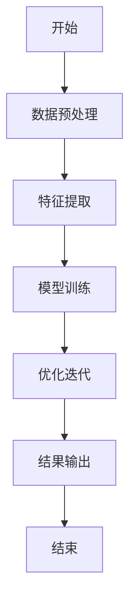
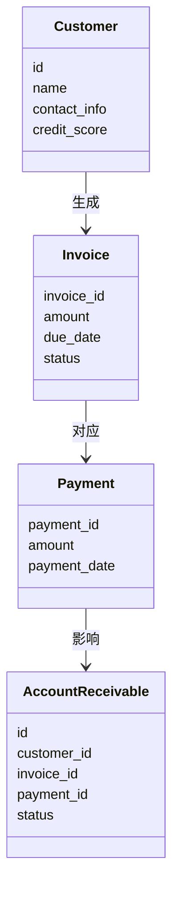
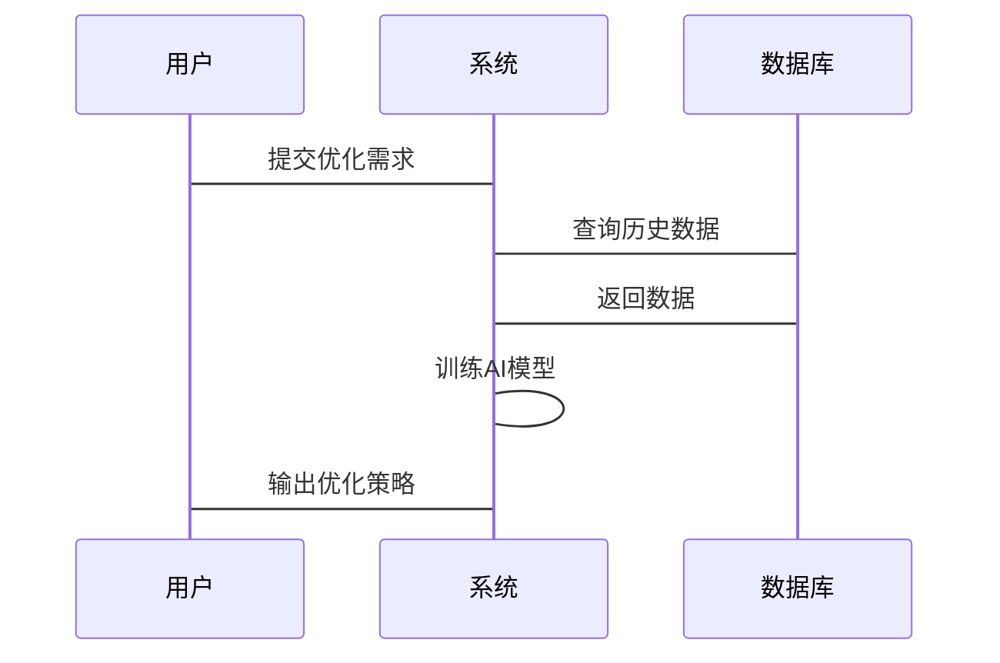

                 


# AI驱动的企业应收账款组合优化管理系统

> 关键词：AI驱动、应收账款、组合优化、管理系统、机器学习

> 摘要：本文深入探讨了AI驱动的企业应收账款组合优化管理系统的构建与应用。通过分析传统应收账款管理的痛点，结合人工智能技术，提出了基于机器学习的优化算法和系统架构设计方案。本文详细讲解了系统的核心概念、算法原理、数学模型、系统架构，并通过案例分析展示了AI技术在实际应用场景中的优势。最后，本文总结了AI驱动的应收账款管理系统的未来发展方向与实践建议。

---

# 第一部分: AI驱动的企业应收账款组合优化管理概述

# 第1章: 背景介绍

## 1.1 问题背景

### 1.1.1 应收账款管理的重要性
应收账款是企业财务管理中的重要组成部分，直接关系到企业的资金流动性和经营稳定性。传统的应收账款管理依赖人工操作，容易受到人为因素的影响，效率低下且准确性不足。

### 1.1.2 传统应收账款管理的局限性
- 数据分散：企业可能从多个系统或部门获取应收账款数据，难以统一管理。
- 风险识别难：传统方法难以准确识别高风险客户，导致坏账率居高不下。
- 决策滞后：缺乏实时数据分析支持，导致管理决策滞后。

### 1.1.3 AI技术在财务管理中的潜力
人工智能技术能够通过大数据分析和智能算法，帮助企业实现应收账款管理的自动化、智能化和精准化。

## 1.2 问题描述

### 1.2.1 应收账款组合优化的核心问题
应收账款组合优化的核心问题在于如何在有限的资源条件下，通过优化组合策略，最大化企业资金的使用效率，同时降低坏账风险。

### 1.2.2 企业应收账款管理的痛点
- 数据孤岛：各部门之间的数据难以整合，影响整体优化决策。
- 风险评估难：缺乏对客户信用风险的精准评估能力。
- 优化策略单一：传统优化方法难以应对复杂多变的市场环境。

### 1.2.3 AI驱动优化的目标与意义
AI驱动的应收账款组合优化目标是通过智能算法，动态调整应收账款组合策略，实现企业资金的最优配置。其意义在于提高管理效率、降低坏账风险、提升企业整体竞争力。

## 1.3 问题解决

### 1.3.1 AI驱动的优化方法
- 数据驱动的优化：基于历史数据和实时数据，利用机器学习算法进行预测和优化。
- 智能决策支持：通过AI模型提供实时风险评估和优化建议。

### 1.3.2 数据驱动的决策支持
- 数据采集与清洗：整合多源数据，清洗和预处理数据，确保数据质量。
- 数据分析与建模：利用统计分析和机器学习算法，构建客户信用评估模型和应收账款优化模型。

### 1.3.3 智能算法的应用场景
- 客户信用评估：通过机器学习算法预测客户违约概率。
- 组合优化：基于信用评估结果，动态调整应收账款组合策略。

## 1.4 系统边界与外延

### 1.4.1 系统边界定义
AI驱动的应收账款组合优化管理系统仅关注企业内部应收账款的优化管理，不涉及外部金融机构的直接交互。

### 1.4.2 外延与相关系统的交互
- 与企业ERP系统的交互：数据采集和同步。
- 与财务系统的交互：优化策略的执行与反馈。
- 与客户管理系统（CRM）的交互：客户信用信息的更新与维护。

### 1.4.3 系统功能的范围界定
- 数据管理：数据采集、清洗、存储与分析。
- 模型构建：客户信用评估模型和应收账款优化模型。
- 优化决策：基于模型结果，提供优化策略和决策支持。

## 1.5 核心概念与联系

### 1.5.1 核心概念原理
- **客户信用评估**：通过机器学习算法评估客户的信用风险。
- **应收账款优化**：基于信用评估结果，动态调整应收账款组合策略。

### 1.5.2 核心概念属性特征对比表

| 概念         | 属性特征                 |
|--------------|--------------------------|
| 客户信用评估 | 数据来源、评估指标、评估方法 |
| 应收账款优化 | 目标函数、优化约束、优化算法 |

### 1.5.3 ER实体关系图（Mermaid）

```mermaid
erDiagram
    customer[客户]
    invoice[发票]
    payment[付款]
    account Receivable[应收账款]
    AI Model[AI模型]
    customer --> invoice: 生成
    invoice --> payment: 对应
    payment --> account Receivable: 影响
    account Receivable --> AI Model: 输入
    AI Model --> account Receivable: 输出
```

## 1.6 本章小结

---

# 第2章: AI驱动的应收账款组合优化算法原理

## 2.1 算法原理讲解

### 2.1.1 算法概述
本章将详细介绍AI驱动的应收账款组合优化算法的原理和实现方法。通过机器学习算法，结合企业历史数据和实时数据，构建客户信用评估模型和应收账款优化模型。

### 2.1.2 算法流程（Mermaid）



### 2.1.3 算法实现（Python代码示例）

```python
import pandas as pd
from sklearn.linear_model import LinearRegression

# 示例数据加载
data = pd.read_csv('receivables.csv')

# 特征与目标分离
X = data[[' overdue_days', ' payment_history', ' customer_rating']]
y = data[' risk_score']

# 模型训练
model = LinearRegression()
model.fit(X, y)

# 模型预测
predicted_risk = model.predict(X)
```

---

## 2.2 数学模型与公式

### 2.2.1 线性回归模型
线性回归模型用于预测客户的风险评分：

$$ y = \beta_0 + \beta_1x_1 + \beta_2x_2 + \epsilon $$

其中，$y$ 是目标变量（风险评分），$x_i$ 是特征变量，$\beta_i$ 是回归系数，$\epsilon$ 是误差项。

### 2.2.2 优化目标函数
应收账款组合优化的目标是最小化风险和最大化回收率：

$$ \min \sum_{i=1}^n (违约风险_i) $$
$$ \max \sum_{i=1}^n (回收金额_i) $$

---

## 2.3 算法实现与优化

### 2.3.1 算法优化策略
- 参数调优：使用交叉验证优化模型参数。
- 集成学习：通过集成学习提升模型的准确性和稳定性。

### 2.3.2 算法实现代码

```python
from sklearn.ensemble import RandomForestRegressor
from sklearn.model_selection import GridSearchCV

# 参数调优
param_grid = {'n_estimators': [10, 20, 30], 'max_depth': [None, 5, 10]}

grid_search = GridSearchCV(RandomForestRegressor(), param_grid, cv=5)
grid_search.fit(X, y)

# 输出最佳参数
print("Best Parameters:", grid_search.best_params_)
```

---

## 2.4 本章小结

---

# 第3章: 系统分析与架构设计

## 3.1 系统分析

### 3.1.1 问题场景介绍
企业应收账款管理涉及多个部门和系统，数据分散、流程复杂，传统管理方式难以满足现代企业的高效管理需求。

### 3.1.2 项目介绍
本项目旨在通过AI技术构建一个智能化的应收账款组合优化管理系统，帮助企业实现高效、精准的应收账款管理。

---

## 3.2 系统架构设计

### 3.2.1 领域模型（Mermaid）



### 3.2.2 系统架构设计（Mermaid）

```mermaid
containerDataBase {
    数据库
    接收应付账款数据
    生成优化策略
}
containerAIModel {
    AI模型
    训练模型
    生成预测结果
}
containerUserInterface {
    用户界面
    显示优化结果
    接收用户输入
}
containerDataBase --> containerAIModel: 数据输入
containerAIModel --> containerUserInterface: 结果输出
```

### 3.2.3 系统接口设计
- 数据接口：与ERP系统、CRM系统的数据交互接口。
- 用户接口：提供优化结果的可视化界面和交互功能。

### 3.2.4 系统交互流程（Mermaid）



---

## 3.3 系统功能设计

### 3.3.1 功能模块划分
- 数据管理模块：数据采集、清洗、存储。
- 模型构建模块：客户信用评估、应收账款优化。
- 优化决策模块：优化策略生成、结果可视化。

### 3.3.2 功能实现细节
- 数据采集：从ERP系统、CRM系统等来源获取数据。
- 数据清洗：处理缺失值、异常值。
- 模型训练：基于历史数据训练AI模型。
- 优化策略生成：基于模型结果生成优化策略。

---

## 3.4 本章小结

---

# 第4章: 项目实战与案例分析

## 4.1 环境安装与配置

### 4.1.1 环境要求
- Python 3.8+
- Scikit-learn、Pandas、Numpy
- Jupyter Notebook或IDE

### 4.1.2 数据集准备
从企业ERP系统中获取应收账款相关数据，包括客户信息、发票信息、付款记录等。

---

## 4.2 系统核心实现

### 4.2.1 核心代码实现

```python
import pandas as pd
from sklearn.ensemble import RandomForestRegressor
from sklearn.metrics import mean_squared_error

# 数据加载
data = pd.read_csv('receivables.csv')

# 数据预处理
X = data[[' overdue_days', ' payment_history', ' customer_rating']]
y = data[' risk_score']

# 模型训练
model = RandomForestRegressor()
model.fit(X, y)

# 模型评估
y_pred = model.predict(X)
print('均方误差:', mean_squared_error(y, y_pred))
```

### 4.2.2 代码应用解读
- 数据加载：从CSV文件中加载数据。
- 数据预处理：选择特征变量和目标变量。
- 模型训练：训练随机森林回归模型。
- 模型评估：计算均方误差，评估模型性能。

---

## 4.3 案例分析

### 4.3.1 案例背景
某企业应收账款数据如下：

| 客户ID | 欠款天数 | 付款历史 | 客户评分 | 风险评分 |
|--------|----------|----------|----------|----------|
| C001    | 30       | 良好     | 85       | 0.8      |
| C002    | 60       | 一般     | 70       | 0.6      |
| C003    | 90       | 差       | 60       | 0.4      |

### 4.3.2 模型应用
使用训练好的模型预测客户C003的风险评分：

```python
# 输入特征
customer_C003 = [[90, '差', 60]]

# 预测结果
risk_score = model.predict(customer_C003)
print('风险评分:', risk_score[0])
```

---

## 4.4 本章小结

---

# 第5章: 最佳实践、小结与展望

## 5.1 最佳实践

### 5.1.1 数据质量管理
- 确保数据的完整性和准确性。
- 定期更新和维护数据。

### 5.1.2 模型优化
- 定期重新训练模型，更新参数。
- 引入新的数据特征，提升模型性能。

### 5.1.3 系统维护
- 定期检查系统运行状态。
- 及时修复系统故障。

---

## 5.2 小结

AI驱动的企业应收账款组合优化管理系统通过机器学习算法和智能算法，帮助企业实现应收账款管理的自动化、智能化和精准化。本文详细讲解了系统的构建过程，包括核心概念、算法原理、系统架构和项目实战。

---

## 5.3 展望

未来，随着AI技术的不断发展，企业应收账款管理将更加智能化和个性化。以下是未来发展的几个方向：

### 5.3.1 技术发展
- 更先进的机器学习算法。
- 多模态数据融合。

### 5.3.2 应用场景扩展
- 全球化应收账款管理。
- 行业化定制解决方案。

### 5.3.3 伦理与合规
- 数据隐私保护。
- 模型可解释性。

---

# 作者信息

作者：AI天才研究院（AI Genius Institute） & 禅与计算机程序设计艺术（Zen And The Art of Computer Programming）

---

感谢您的阅读！如果需要进一步了解AI驱动的企业应收账款组合优化管理系统，欢迎关注我们的后续文章或联系我们！

