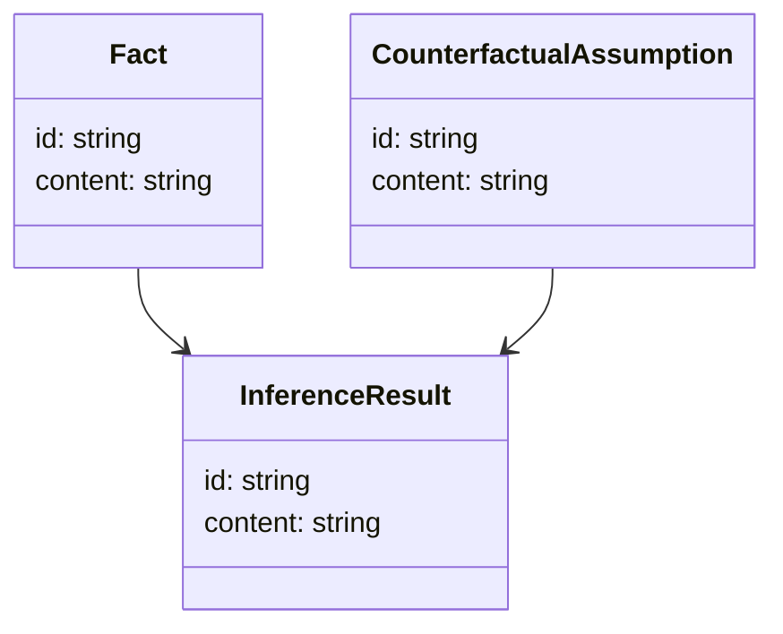
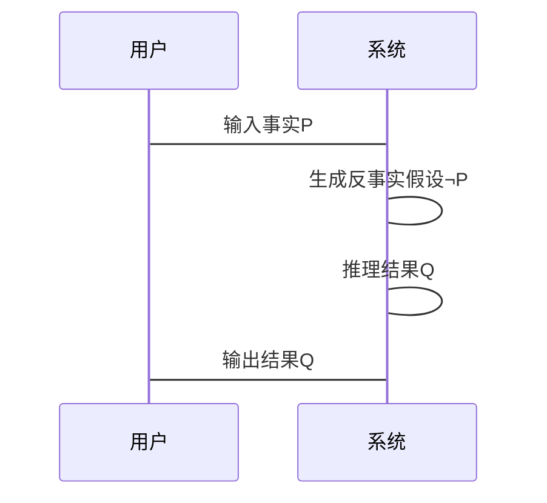

                 


# LLM在AI Agent反事实推理中的应用

## 关键词：LLM, AI Agent, 反事实推理, 生成式模型, 决策支持, 风险评估, 问题诊断

## 摘要：  
本文探讨了大语言模型（LLM）在AI Agent反事实推理中的应用，详细分析了反事实推理的理论基础、实现方法及其在决策支持、风险评估和问题诊断等领域的实际应用。通过结合LLM的强大语言理解和生成能力，本文提出了基于LLM的反事实推理框架，并通过具体案例展示了其在不同场景中的应用效果。此外，本文还探讨了系统的架构设计、算法原理及实现细节，为读者提供了全面的技术视角。

---

# 第1章: LLM与AI Agent概述

## 1.1 LLM的基本概念

### 1.1.1 大语言模型的定义  
大语言模型（LLM, Large Language Model）是指基于深度学习训练的大型神经网络模型，能够理解和生成人类语言。LLM的核心目标是通过大量数据学习语言的统计规律，从而实现自然语言处理任务，如文本生成、翻译、问答等。

### 1.1.2 LLM的核心特点  
1. **规模大**：LLM通常使用 billions（十亿）级别的参数，能够捕捉复杂的语言模式。  
2. **通用性**：LLM可以在多种任务上表现出色，无需针对每个任务进行专门微调。  
3. **生成能力**：LLM能够生成连贯且合理的文本，具备强大的创造性。  

### 1.1.3 LLM与传统NLP模型的区别  
1. **参数规模**：传统NLP模型通常参数较少，而LLM参数规模大。  
2. **任务通用性**：传统NLP模型通常针对特定任务设计，而LLM具有较强的通用性。  
3. **生成能力**：传统NLP模型在生成任务上表现有限，而LLM在这方面表现出色。  

## 1.2 AI Agent的定义与特点

### 1.2.1 AI Agent的基本概念  
AI Agent（人工智能代理）是指能够感知环境、自主决策并执行任务的智能实体。AI Agent可以是软件程序、机器人或其他智能系统，具备以下特点：  
1. **自主性**：能够在没有外部干预的情况下自主运行。  
2. **反应性**：能够实时感知环境并做出反应。  
3. **目标导向**：具备明确的目标，并通过行动实现目标。  

### 1.2.2 AI Agent的核心功能  
1. **感知环境**：通过传感器或数据输入感知外部环境。  
2. **决策与推理**：基于感知信息进行推理和决策。  
3. **执行任务**：根据决策结果执行具体任务。  

### 1.2.3 AI Agent与传统程序的区别  
1. **自主性**：传统程序依赖外部指令，而AI Agent具备自主决策能力。  
2. **学习能力**：AI Agent能够通过学习提升性能，而传统程序无法做到这一点。  
3. **适应性**：AI Agent能够适应环境变化，而传统程序则不具备这种能力。  

## 1.3 反事实推理的定义与重要性

### 1.3.1 反事实推理的定义  
反事实推理（Counterfactual Reasoning）是指从与事实相反的假设出发，推导出可能的结果或解释。例如，假设“如果我当时没做这个决定，现在的情况会怎样？”这种思考方式就是反事实推理。  

### 1.3.2 反事实推理的核心作用  
1. **决策支持**：通过分析不同决策的可能结果，帮助做出更优选择。  
2. **风险评估**：评估潜在风险并制定应对策略。  
3. **问题诊断**：分析问题的可能原因并提出解决方案。  

### 1.3.3 反事实推理在AI Agent中的应用价值  
1. **提升决策能力**：通过反事实推理，AI Agent能够模拟不同决策的后果，从而做出更明智的选择。  
2. **增强适应性**：AI Agent可以通过反事实推理快速调整策略，适应环境变化。  
3. **优化性能**：反事实推理可以帮助AI Agent发现潜在问题并优化其表现。  

## 1.4 本章小结  
本章介绍了大语言模型（LLM）、AI Agent及其核心功能，重点阐述了反事实推理的定义、作用及其在AI Agent中的应用价值。通过本章内容，读者可以初步了解LLM与AI Agent的结合如何为反事实推理提供新的可能性。

---

# 第2章: 反事实推理的理论基础

## 2.1 反事实推理的基本原理

### 2.1.1 反事实推理的逻辑框架  
反事实推理的逻辑框架可以表示为：  
$$ \text{如果} P \text{为真，那么} Q \text{也为真} $$  
其中，\( P \) 是事实，\( Q \) 是反事实推理的结果。  

### 2.1.2 反事实推理的数学模型  
反事实推理的数学模型通常基于概率论，可以通过贝叶斯网络（Bayesian Network）来表示。贝叶斯网络通过概率分布描述变量之间的关系，从而推导出反事实推理的结果。  

### 2.1.3 反事实推理的实现方法  
1. **基于逻辑的反事实推理**：通过逻辑推理引擎分析可能的反事实情况。  
2. **基于概率的反事实推理**：利用概率模型计算反事实情况的可能性。  
3. **基于语言模型的反事实推理**：结合语言模型生成可能的反事实结果。  

## 2.2 反事实推理的主要方法

### 2.2.1 基于逻辑的反事实推理  
基于逻辑的反事实推理通过逻辑规则进行推理，例如：  
$$ \text{如果} A \rightarrow B，\text{那么} \neg A \rightarrow \neg B $$  
这种方法适用于规则明确的场景，但难以处理复杂的情况。  

### 2.2.2 基于概率的反事实推理  
基于概率的反事实推理利用概率分布计算反事实情况的可能性。例如，可以通过贝叶斯网络计算 \( P(Q | P) \) 的概率。  

### 2.2.3 基于语言模型的反事实推理  
基于语言模型的反事实推理利用语言模型生成可能的反事实结果。例如，给定一个事实 \( P \)，语言模型可以生成多个可能的反事实结果 \( Q_1, Q_2, \dots \)。  

## 2.3 反事实推理的应用场景

### 2.3.1 在决策支持中的应用  
反事实推理可以帮助决策者分析不同决策的可能结果，从而做出更优选择。例如，在商业决策中，可以通过反事实推理分析不同市场策略的效果。  

### 2.3.2 在风险评估中的应用  
反事实推理可以用于评估潜在风险并制定应对策略。例如，在金融领域，可以通过反事实推理评估不同投资策略的风险。  

### 2.3.3 在问题诊断中的应用  
反事实推理可以帮助诊断问题的可能原因并提出解决方案。例如，在医疗领域，可以通过反事实推理分析不同治疗方案的效果。  

## 2.4 本章小结  
本章详细介绍了反事实推理的基本原理、主要方法及其应用场景。通过本章内容，读者可以理解反事实推理的理论基础及其在实际中的应用价值。

---

# 第3章: LLM在反事实推理中的应用

## 3.1 LLM在反事实推理中的优势

### 3.1.1 LLM的语言理解能力  
LLM能够理解和生成人类语言，具备强大的语义理解能力。例如，LLM可以理解复杂的上下文关系，并生成连贯的文本。  

### 3.1.2 LLM的生成能力  
LLM可以通过生成模型生成多种可能的反事实结果，例如生成不同的场景描述或解决方案。  

### 3.1.3 LLM的推理能力  
LLM可以通过微调或提示工程技术，具备一定的推理能力。例如，可以通过LLM生成反事实推理的结果并进行验证。  

## 3.2 基于LLM的反事实推理框架

### 3.2.1 框架的总体设计  
基于LLM的反事实推理框架通常包括以下步骤：  
1. **输入事实**：输入一个事实 \( P \)。  
2. **生成反事实假设**：生成与 \( P \) 相反的假设 \( \neg P \)。  
3. **推理结果**：根据 \( \neg P \) 推导出可能的结果 \( Q \)。  

### 3.2.2 框架的核心模块  
1. **输入处理模块**：接收事实 \( P \) 并进行预处理。  
2. **反事实生成模块**：生成反事实假设 \( \neg P \)。  
3. **推理模块**：根据 \( \neg P \) 推导出结果 \( Q \)。  

### 3.2.3 框架的实现流程  
1. **输入处理**：将事实 \( P \) 输入到系统中。  
2. **生成反事实假设**：利用生成模型生成反事实假设 \( \neg P \)。  
3. **推理结果**：根据反事实假设 \( \neg P \) 推导出结果 \( Q \)。  

## 3.3 LLM在反事实推理中的具体应用

### 3.3.1 文本生成中的反事实推理  
例如，在新闻生成中，可以通过反事实推理生成不同的新闻标题或内容。  

### 3.3.2 问题解答中的反事实推理  
例如，在医疗领域，可以通过反事实推理分析不同治疗方案的效果。  

### 3.3.3 任务规划中的反事实推理  
例如，在机器人路径规划中，可以通过反事实推理分析不同路径的优劣。  

## 3.4 本章小结  
本章详细介绍了LLM在反事实推理中的优势及其具体应用。通过本章内容，读者可以理解LLM如何增强反事实推理的能力，并在实际中发挥作用。

---

# 第4章: LLM在反事实推理中的算法原理

## 4.1 反事实推理的数学模型

### 4.1.1 反事实推理的逻辑框架  
反事实推理的逻辑框架可以表示为：  
$$ \text{如果} P \text{为真，那么} Q \text{也为真} $$  
其中，\( P \) 是事实，\( Q \) 是反事实推理的结果。  

### 4.1.2 反事实推理的概率模型  
反事实推理的概率模型可以通过贝叶斯网络表示。例如，可以通过贝叶斯网络计算 \( P(Q | P) \) 的概率。  

## 4.2 基于LLM的反事实推理算法

### 4.2.1 算法的总体流程  
1. **输入事实**：输入一个事实 \( P \)。  
2. **生成反事实假设**：生成与 \( P \) 相反的假设 \( \neg P \)。  
3. **推理结果**：根据 \( \neg P \) 推导出可能的结果 \( Q \)。  

### 4.2.2 算法的实现细节  
1. **输入处理**：将事实 \( P \) 输入到系统中。  
2. **生成反事实假设**：利用生成模型生成反事实假设 \( \neg P \)。  
3. **推理结果**：根据反事实假设 \( \neg P \) 推导出结果 \( Q \)。  

## 4.3 算法的数学模型

### 4.3.1 基于逻辑的反事实推理  
基于逻辑的反事实推理可以通过逻辑规则进行推理。例如，可以通过逻辑规则推导出 \( Q \) 的结果。  

### 4.3.2 基于概率的反事实推理  
基于概率的反事实推理可以通过概率模型计算 \( P(Q | P) \) 的概率。  

### 4.3.3 基于语言模型的反事实推理  
基于语言模型的反事实推理可以通过语言模型生成可能的反事实结果。  

## 4.4 本章小结  
本章详细介绍了基于LLM的反事实推理算法及其数学模型。通过本章内容，读者可以理解反事实推理的实现原理及其在LLM中的应用。

---

# 第5章: 系统架构设计

## 5.1 问题场景介绍  
本章将介绍一个基于LLM的反事实推理系统，并详细描述其架构设计。  

## 5.2 系统功能设计  
系统功能包括：  
1. **输入处理**：接收事实 \( P \) 并进行预处理。  
2. **生成反事实假设**：生成与 \( P \) 相反的假设 \( \neg P \)。  
3. **推理结果**：根据 \( \neg P \) 推导出结果 \( Q \)。  

### 5.2.1 领域模型设计  
领域模型可以通过类图表示，包括以下几个类：  
- **Fact**：表示事实 \( P \)。  
- **CounterfactualAssumption**：表示反事实假设 \( \neg P \)。  
- **InferenceResult**：表示推理结果 \( Q \)。  



### 5.2.2 系统架构设计  
系统架构可以通过分层设计实现，包括以下几层：  
1. **数据层**：存储事实 \( P \) 和推理结果 \( Q \)。  
2. **业务逻辑层**：实现反事实推理的核心逻辑。  
3. **用户界面层**：提供用户交互界面。  


### 5.2.3 系统接口设计  
系统接口包括：  
1. **输入接口**：接收事实 \( P \)。  
2. **输出接口**：输出推理结果 \( Q \)。  

### 5.2.4 系统交互流程  
1. 用户输入事实 \( P \)。  
2. 系统生成反事实假设 \( \neg P \)。  
3. 系统推理出结果 \( Q \)。  
4. 系统输出结果 \( Q \)。  



## 5.3 本章小结  
本章详细介绍了基于LLM的反事实推理系统的架构设计，包括系统功能、架构图、接口设计和交互流程。通过本章内容，读者可以理解系统如何实现反事实推理的核心逻辑。

---

# 第6章: 项目实战

## 6.1 环境安装  
1. 安装Python：确保Python版本为3.8及以上。  
2. 安装依赖库：安装必要的Python库，如`numpy`、`pandas`、`scikit-learn`等。  

## 6.2 系统核心实现源代码

### 6.2.1 输入处理模块  
```python
def process_input(fact):
    return fact
```

### 6.2.2 反事实生成模块  
```python
def generate_counterfactual(fact):
    return "¬" + fact
```

### 6.2.3 推理模块  
```python
def infer_result(counterfactual):
    return "如果" + counterfactual + "，那么结果是..."
```

### 6.2.4 主函数  
```python
def main():
    fact = input("请输入事实P：")
    counterfactual = generate_counterfactual(fact)
    result = infer_result(counterfactual)
    print("推理结果：", result)

if __name__ == "__main__":
    main()
```

## 6.3 代码应用解读与分析  
通过上述代码，用户可以输入一个事实 \( P \)，系统将生成反事实假设 \( \neg P \)，并推理出结果 \( Q \)。  

## 6.4 实际案例分析  
例如，输入事实 \( P \) 为“下雨了”，系统将生成反事实假设 \( \neg P \) 为“没有下雨”，并推理出结果 \( Q \) 为“如果今天没有下雨，那么交通会更顺畅”。  

## 6.5 项目小结  
本章通过实际案例展示了基于LLM的反事实推理系统的实现过程，并通过代码示例帮助读者理解系统的核心逻辑。

---

# 第7章: 总结与展望

## 7.1 本章总结  
本文详细探讨了LLM在AI Agent反事实推理中的应用，介绍了反事实推理的理论基础、算法原理及其在实际中的应用。通过本章内容，读者可以全面理解LLM如何增强反事实推理的能力，并在实际中发挥作用。

## 7.2 未来展望  
随着LLM技术的不断发展，反事实推理将在更多领域得到应用。未来的研究方向包括：  
1. **提升反事实推理的准确性**：通过改进算法和模型，提高反事实推理的准确性。  
2. **扩展应用场景**：将反事实推理应用于更多领域，如自动驾驶、智能客服等。  
3. **优化系统性能**：通过优化算法和架构设计，提升系统的运行效率。  

## 7.3 最佳实践 tips  
1. 在实际应用中，建议结合具体场景选择合适的反事实推理方法。  
2. 注意数据质量和模型训练，以提高反事实推理的效果。  
3. 定期更新模型和算法，以适应环境的变化。  

## 7.4 本章小结  
本章总结了全文内容，并展望了未来的研究方向。通过本章内容，读者可以对LLM在AI Agent反事实推理中的应用有一个全面的认识。

---

# 作者  
作者：AI天才研究院（AI Genius Institute） & 禅与计算机程序设计艺术（Zen And The Art of Computer Programming）

