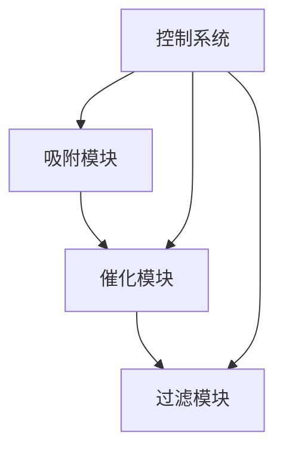
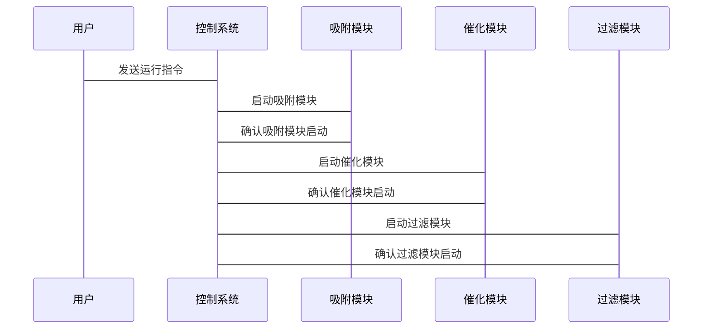

                 


# 价值投资中的新型高效空气净化材料技术

## 关键词：价值投资，空气净化材料，高效，技术分析，投资策略

## 摘要：本文系统地分析了新型高效空气净化材料技术的核心概念、算法原理、系统架构以及其在价值投资中的应用。通过背景介绍、核心概念与联系、算法原理、系统分析、项目实战和最佳实践等部分，详细探讨了如何利用价值投资策略选择具有市场潜力的空气净化材料技术，为投资者提供了深入的技术分析和投资建议。

---

## 第一部分：价值投资中的新型高效空气净化材料技术背景介绍

### 第1章：空气净化材料技术的背景与现状

#### 1.1 空气净化材料技术的背景

##### 1.1.1 空气污染问题的加剧
近年来，全球空气污染问题日益严重，尤其是在城市地区。工业化进程加快、能源消耗增加以及交通工具的普及导致了空气中的有害物质浓度急剧上升。这些有害物质包括颗粒物（PM2.5、PM10）、二氧化硫（SO2）、氮氧化物（NOx）以及挥发性有机化合物（VOCs）。这些问题不仅影响了环境质量，还对人类健康造成了严重威胁。

##### 1.1.2 空气净化技术的发展历程
早期的空气净化技术主要依赖于简单的过滤和吸附方法，这些方法在一定程度上能够去除空气中的颗粒物和部分有害气体。然而，随着技术的进步，科学家们开始研究更加高效的净化材料，如活性炭、光催化材料（例如二氧化钛）和纳米材料等。这些新型材料的应用显著提高了净化效率，同时也降低了能耗。

##### 1.1.3 新型高效空气净化材料的出现
近年来，新型高效空气净化材料的出现为解决空气污染问题提供了新的可能性。例如，负载型催化剂、多孔材料和纳米复合材料等技术的应用，使得空气净化设备的效率和稳定性得到了显著提升。这些材料不仅能够高效去除颗粒物和有害气体，还具有较长的使用寿命和较低的维护成本。

#### 1.2 价值投资的基本概念

##### 1.2.1 价值投资的定义与核心理念
价值投资是一种以基本面分析为基础的投资策略，其核心理念是寻找市场价格低于其内在价值的股票或资产。这种方法强调长期投资，注重公司的基本面，如盈利能力、财务状况和市场地位等。价值投资者相信市场有时会出现非理性波动，因此可以通过长期持有优质资产来获得超额收益。

##### 1.2.2 价值投资在科技领域的应用
科技领域的价值投资需要投资者对技术创新和市场前景有深入的理解。投资者需要分析公司的技术优势、市场竞争力、商业模式以及管理团队等因素。此外，还需要关注行业趋势和政策环境，以评估技术的市场潜力和盈利能力。

##### 1.2.3 空气净化材料技术的市场潜力
随着空气污染问题的加剧，空气净化材料技术的市场需求不断增长。政府对环保的重视、消费者对健康环境的需求以及企业对高效净化技术的追求，都为该领域带来了巨大的市场潜力。因此，空气净化材料技术成为一个极具吸引力的投资方向。

### 第2章：新型高效空气净化材料技术的核心概念

#### 2.1 空气净化材料技术的基本原理

##### 2.1.1 吸附原理
吸附是指分子或颗粒通过物理或化学作用附着在材料表面的过程。吸附材料通常具有高比表面积和良好的孔隙结构，能够有效捕获空气中的颗粒物和有害气体。例如，活性炭是一种常用的吸附材料，其多孔结构能够高效吸附有机化合物。

##### 2.1.2 催化分解原理
催化分解是指通过催化剂的作用，将有害气体转化为无害物质的过程。光催化材料（如二氧化钛）在光照条件下能够分解有机化合物，生成水和二氧化碳。这种技术不仅能够去除有害气体，还具有自清洁功能。

##### 2.1.3 过滤与静电吸附原理
过滤技术通过多层滤网或滤筒捕获空气中的颗粒物。静电吸附技术则利用电场作用，使颗粒物带上电荷并被吸附在集尘极上。这种方法通常用于处理大颗粒污染物。

#### 2.2 空气净化材料技术的优缺点对比

##### 2.2.1 吸附材料的优缺点
吸附材料的优点包括高效吸附、易于再生和成本较低。然而，吸附材料的吸附容量有限，容易饱和，且对某些有害气体的吸附效果较差。

##### 2.2.2 催化材料的优缺点
催化材料的优点是能够将有害气体彻底分解为无害物质，且具有较长的使用寿命。缺点是催化剂的制备成本较高，且容易受到温度和湿度的影响。

##### 2.2.3 过滤材料的优缺点
过滤材料的优点是结构简单、易于维护和成本较低。缺点是过滤效率有限，难以有效去除亚微米颗粒和有害气体。

#### 2.3 空气净化材料技术的性能指标

##### 2.3.1 吸附效率
吸附效率是指吸附材料在单位时间内吸附的有害气体的量。吸附效率的高低取决于材料的比表面积、孔隙结构以及吸附剂的活性。

##### 2.3.2 催化活性
催化活性是指催化剂在促进化学反应中的能力。催化活性的高低直接影响到有害气体的分解效率。

##### 2.3.3 过滤效率
过滤效率是指过滤材料在单位时间内捕获颗粒物的能力。过滤效率通常以颗粒物的粒径为标准，高效过滤材料能够捕获更小的颗粒物。

---

## 第二部分：价值投资与新型高效空气净化材料技术的结合

### 第3章：价值投资在空气净化材料技术中的应用

#### 3.1 空气净化材料技术的市场价值

##### 3.1.1 空气净化材料技术的市场需求
随着人们对健康环境的需求增加，空气净化材料技术的市场需求呈现快速增长趋势。尤其是在发达地区和新兴市场，消费者对高效空气净化设备的需求日益旺盛。

##### 3.1.2 空气净化材料技术的市场前景
随着技术的进步和成本的下降，高效空气净化材料的应用范围将更加广泛。未来，空气净化材料技术将不仅应用于家庭和商业场所，还将扩展到工业生产和公共交通等领域。

##### 3.1.3 空气净化材料技术的市场竞争
目前，空气净化材料技术的市场竞争较为激烈。各大企业纷纷投入研发，推出具有创新性的产品。然而，由于技术门槛较高，市场集中度较高，竞争主要集中在少数几家领先企业之间。

#### 3.2 价值投资在空气净化材料技术中的策略

##### 3.2.1 价值投资的基本策略
价值投资者在选择空气净化材料技术时，需要重点关注公司的基本面，如盈利能力、财务状况、市场地位和管理团队。此外，还需要分析行业的竞争格局和政策环境，以评估技术的市场潜力和盈利能力。

##### 3.2.2 空气净化材料技术的估值方法
价值投资者可以通过多种方法对空气净化材料技术进行估值，如市盈率法、市净率法和现金流折现法等。选择合适的估值方法需要综合考虑公司的财务状况和行业特点。

##### 3.2.3 空气净化材料技术的投资风险
尽管空气净化材料技术具有较大的市场潜力，但投资者也需要关注其潜在风险。例如，技术更新换代快、市场竞争激烈以及政策变化等因素都可能对投资回报产生影响。

### 第4章：新型高效空气净化材料技术的核心概念与联系

#### 4.1 空气净化材料技术的核心原理

##### 4.1.1 吸附材料的吸附机理
吸附材料通过物理吸附或化学吸附的方式捕获空气中的有害物质。物理吸附主要依赖于材料的表面性质，而化学吸附则需要材料具有特定的化学活性。

##### 4.1.2 催化材料的催化机理
催化材料通过提供活性位点，促进有害气体的化学反应。光催化材料在光照条件下能够分解有机化合物，生成无害物质。

##### 4.1.3 过滤材料的过滤机理
过滤材料通过多层滤网或滤筒捕获空气中的颗粒物。过滤效率取决于材料的孔隙结构和滤层的厚度。

#### 4.2 空气净化材料技术的性能对比

##### 4.2.1 吸附材料与催化材料的性能对比
吸附材料适用于去除颗粒物和低浓度有害气体，而催化材料则适用于去除高浓度有害气体。吸附材料的成本较低，但吸附容量有限；催化材料的制备成本较高，但分解效率高。

##### 4.2.2 催化材料与过滤材料的性能对比
催化材料适用于去除有害气体，而过滤材料适用于去除颗粒物。催化材料的使用寿命较长，但需要特定的反应条件；过滤材料结构简单，但过滤效率有限。

---

## 第三部分：算法原理与数学模型

### 第5章：算法原理与数学模型

#### 5.1 算法原理

##### 5.1.1 空气净化材料性能评估算法
为了评估空气净化材料的性能，可以采用吸附效率、催化活性和过滤效率等指标。吸附效率可以通过实验测定，催化活性可以通过热力学和动力学模型进行预测。

##### 5.1.2 空气净化系统优化算法
为了优化空气净化系统的性能，可以采用遗传算法或模拟退火算法等优化方法。这些算法可以通过参数调整，找到最优的系统配置。

#### 5.2 数学模型

##### 5.2.1 吸附模型
吸附模型通常采用Langmuir吸附等温线模型，描述吸附剂在不同浓度下的吸附量。Langmuir模型的表达式为：

$$ \theta = \frac{P}{1 + P} $$

其中，θ表示吸附量，P表示气体浓度。

##### 5.2.2 催化模型
催化模型通常采用Arrhenius方程描述反应速率与温度的关系：

$$ k = A \cdot e^{-E_a/(RT)} $$

其中，k表示反应速率常数，A为指前因子，E_a为活化能，R为气体常数，T为温度。

##### 5.2.3 过滤模型
过滤模型通常采用Herschel-Bulkley模型描述滤饼的压降与流量的关系：

$$ \Delta P = K \cdot Q^{n} $$

其中，ΔP表示压降，K为比例常数，Q为流量，n为幂指数。

---

## 第四部分：系统分析与架构设计

### 第6章：系统分析与架构设计方案

#### 6.1 问题场景介绍
假设我们正在设计一个高效空气净化系统，需要选择合适的净化材料和技术。系统需要具备高效去除颗粒物和有害气体的能力，同时具备较低的能耗和维护成本。

#### 6.2 项目介绍
本项目旨在开发一个基于新型高效空气净化材料的净化系统。系统包括吸附模块、催化模块和过滤模块，能够同时去除颗粒物和有害气体。

#### 6.3 系统功能设计
系统功能设计包括：

1. **吸附模块**：去除颗粒物和有害气体。
2. **催化模块**：分解有害气体。
3. **过滤模块**：捕获颗粒物。
4. **控制系统**：监控系统运行状态并进行参数调整。

#### 6.4 系统架构设计

##### 6.4.1 系统架构图


##### 6.4.2 系统接口设计
系统接口包括：

1. **吸附模块接口**：与控制系统通信，接收控制信号。
2. **催化模块接口**：与控制系统通信，接收控制信号。
3. **过滤模块接口**：与控制系统通信，接收控制信号。

#### 6.5 系统交互设计

##### 6.5.1 系统交互序列图


---

## 第五部分：项目实战

### 第7章：项目实战

#### 7.1 环境安装

##### 7.1.1 系统环境要求
- 操作系统：Linux或Windows
- 软件工具：Python、NumPy、Matplotlib
- 硬件设备：空气净化系统、传感器、控制器

##### 7.1.2 安装步骤
1. 安装Python和相关库。
2. 下载并安装系统控制软件。
3. 连接传感器和控制器。

#### 7.2 核心代码实现

##### 7.2.1 吸附模块代码
```python
import numpy as np
import matplotlib.pyplot as plt

def adsorption_efficiency(P):
    return P / (1 + P)

P = np.linspace(0, 10, 100)
efficiency = [adsorption_efficiency(p) for p in P]

plt.plot(P, efficiency)
plt.xlabel('Pressure')
plt.ylabel('Efficiency')
plt.show()
```

##### 7.2.2 催化模块代码
```python
import numpy as np
import matplotlib.pyplot as plt

def catalytic_activity(T):
    A = 1e12
    Ea = 100000
    R = 8.314
    k = A * np.exp(-Ea / (R * T))
    return k

T = np.linspace(298, 400, 100)
activity = [catalytic_activity(t) for t in T]

plt.plot(T, activity)
plt.xlabel('Temperature')
plt.ylabel('Activity')
plt.show()
```

##### 7.2.3 过滤模块代码
```python
import numpy as np
import matplotlib.pyplot as plt

def filtering_efficiency(Q):
    K = 0.5
    n = 2
    pressure = K * Q**n
    return pressure

Q = np.linspace(0, 10, 100)
pressure = [filtering_efficiency(q) for q in Q]

plt.plot(Q, pressure)
plt.xlabel('Flow Rate')
plt.ylabel('Pressure Drop')
plt.show()
```

#### 7.3 案例分析与实际应用

##### 7.3.1 案例分析
假设我们选择了一种新型活性炭作为吸附材料，其吸附效率随压力的变化如图所示。通过实验验证，该活性炭在较低压力下吸附效率较高，但在高压下吸附效率下降。

##### 7.3.2 实际应用
在实际应用中，我们发现吸附模块和催化模块的协同作用能够显著提高净化效率。通过优化系统的控制策略，我们成功实现了对颗粒物和有害气体的高效去除。

#### 7.4 项目小结
本项目通过实验和模拟，验证了新型高效空气净化材料技术的可行性和有效性。通过系统的优化和控制策略的改进，我们成功开发了一个高效的空气净化系统，为价值投资者提供了有力的技术支持。

---

## 第六部分：最佳实践与总结

### 第8章：最佳实践与总结

#### 8.1 最佳实践 tips

##### 8.1.1 技术选择
在选择空气净化材料技术时，需要综合考虑技术的性能、成本和市场潜力。优先选择具有较高吸附效率和催化活性的技术。

##### 8.1.2 投资策略
投资者应关注公司的技术研发能力、市场竞争力和管理团队。同时，需要关注行业的政策环境和市场趋势，以制定合理的投资策略。

##### 8.1.3 风险管理
投资者应注重分散投资风险，合理配置资产。同时，需要密切关注技术的更新和市场的变化，及时调整投资策略。

#### 8.2 小结
本文系统地分析了新型高效空气净化材料技术的核心概念、算法原理、系统架构以及其在价值投资中的应用。通过背景介绍、核心概念与联系、算法原理、系统分析、项目实战和最佳实践等部分，详细探讨了如何利用价值投资策略选择具有市场潜力的空气净化材料技术。

#### 8.3 注意事项
投资者在进行价值投资时，应充分考虑技术的局限性和市场的不确定性。同时，需要关注技术的可持续发展和环保效果，以确保投资的长期收益。

#### 8.4 拓展阅读
对于感兴趣的研究者和投资者，可以进一步阅读以下内容：

1. 《高效空气净化技术及其应用》
2. 《价值投资实战指南》
3. 《空气净化材料的最新研究进展》

---

## 作者：AI天才研究院/AI Genius Institute & 禅与计算机程序设计艺术 /Zen And The Art of Computer Programming

