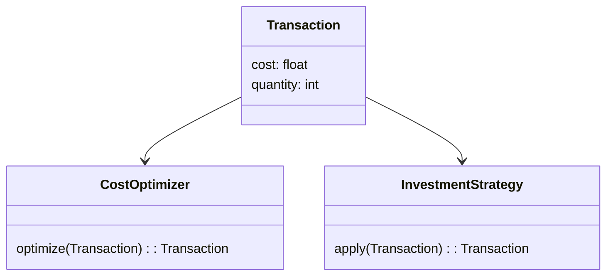
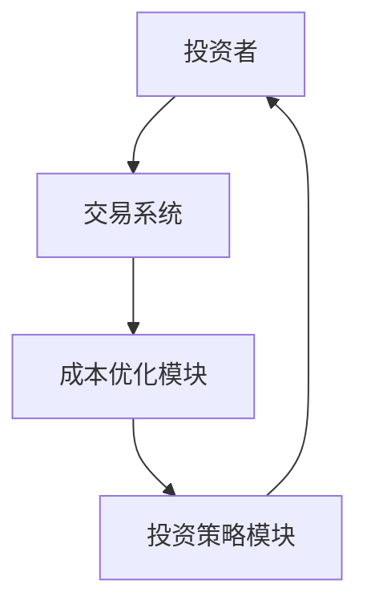
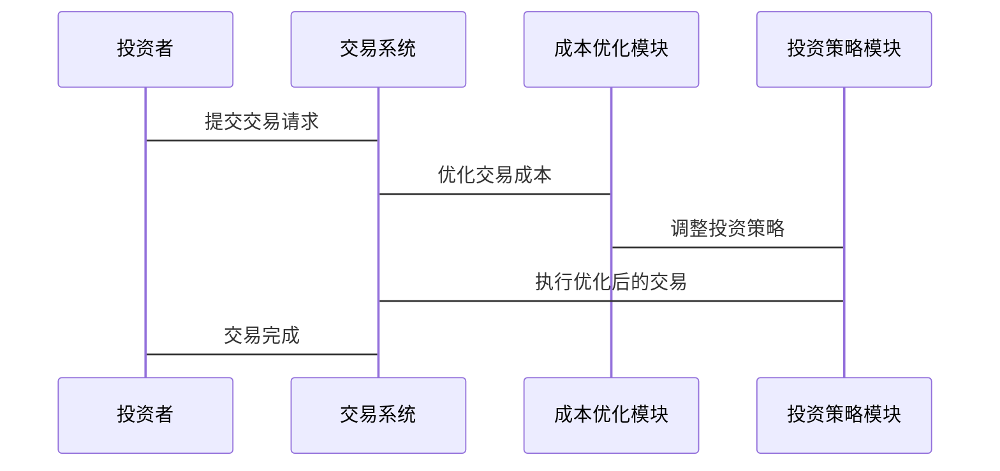

                 


```markdown
# 伯格的成本意识：在零佣金交易时代的重新定义

> 关键词：成本意识，投资策略，零佣金交易，优化算法，系统架构

> 摘要：伯格的成本意识是一种在投资决策中优化成本的重要策略，尤其是在零佣金交易时代，其核心思想和方法需要重新定义。本文从背景介绍、核心概念、算法原理、系统架构设计和项目实战等角度，详细阐述了伯格的成本意识在零佣金交易环境下的应用和优化。通过理论分析和实际案例，本文揭示了如何在零佣金时代重新定义成本意识，以实现更高效的投资策略。

---

## 第一部分：伯格的成本意识基础

### 第1章：伯格的成本意识概述

#### 1.1 伯格的成本意识背景

##### 1.1.1 零佣金交易时代的到来
近年来，随着金融市场的不断发展，零佣金交易逐渐成为主流。传统佣金模式下，投资者需要支付较高的交易费用，而零佣金交易的兴起使得投资者可以以更低的成本进行交易，从而优化投资组合。

##### 1.1.2 成本意识的核心概念
成本意识是指在投资决策中，关注和优化交易成本的意识。在零佣金交易时代，尽管交易费用降低，但其他隐性成本（如市场冲击、流动性成本等）依然存在，因此成本意识的重要性不减反增。

##### 1.1.3 投资策略的演变
传统的投资策略往往忽视交易成本的影响，而伯格的成本意识强调在交易决策中充分考虑成本因素，从而优化投资组合的收益。

#### 1.2 成本意识的定义与特点

##### 1.2.1 成本意识的定义
成本意识是指在投资决策过程中，对各种交易成本进行量化分析，并通过优化策略来降低整体成本，以实现投资收益的最大化。

##### 1.2.2 成本意识的核心特点
- **量化性**：将交易成本进行精确量化，以便进行比较和优化。
- **动态性**：根据市场环境和交易策略的变化，实时调整成本意识。
- **全局性**：不仅关注单次交易的成本，还要考虑整体投资组合的成本优化。

##### 1.2.3 成本意识与传统投资的区别
传统的投资策略往往将交易成本视为固定费用，而成本意识则将交易成本作为变量进行优化，从而在更广泛的范围内降低投资成本。

#### 1.3 零佣金交易的背景与影响

##### 1.3.1 零佣金交易的兴起
零佣金交易的兴起得益于互联网技术的发展和市场竞争的加剧，许多证券公司为了吸引客户，纷纷推出零佣金交易服务。

##### 1.3.2 零佣金交易对投资成本的影响
虽然零佣金交易降低了显性交易成本，但隐性成本（如市场冲击、流动性成本）依然存在，因此成本意识在优化投资策略中的作用更加重要。

##### 1.3.3 零佣金交易的优缺点
- **优点**：降低显性交易成本，提高投资效率。
- **缺点**：忽视隐性成本，可能导致整体投资成本上升。

#### 1.4 伯格的成本意识与投资策略

##### 1.4.1 伯格的成本意识理论
伯格的成本意识理论强调在投资决策中，不仅要考虑显性成本，还要考虑隐性成本，并通过优化策略降低整体成本。

##### 1.4.2 成本意识在投资决策中的应用
通过量化交易成本，优化交易频率和规模，从而在整体上降低投资成本，提高投资收益。

##### 1.4.3 零佣金时代成本意识的重新定义
在零佣金时代，成本意识需要重新定义，关注隐性成本的优化，同时结合显性成本的降低，制定更加科学的投资策略。

#### 1.5 本章小结
本章通过对伯格的成本意识的背景、定义、特点及其在零佣金交易中的应用进行了详细阐述，为后续章节的深入分析奠定了基础。

---

## 第二部分：成本意识的核心概念与联系

### 第2章：成本意识的核心原理

#### 2.1 成本意识的原理

##### 2.1.1 成本意识的基本原理
成本意识通过量化和优化交易成本，实现投资收益的最大化。

##### 2.1.2 成本意识的数学模型
成本意识的数学模型可以通过以下公式表示：
$$ \text{总成本} = \sum_{i=1}^{n} c_i \times q_i $$
其中，\( c_i \) 是第 \( i \) 笔交易的成本，\( q_i \) 是交易数量。

##### 2.1.3 成本意识的算法实现
成本意识的算法可以通过以下步骤实现：
1. 量化每笔交易的成本。
2. 优化交易频率和规模，降低整体成本。
3. 定期评估和调整成本优化策略。

#### 2.2 成本意识与投资决策的关系

##### 2.2.1 成本意识在投资决策中的作用
成本意识通过优化交易成本，提高投资组合的收益。

##### 2.2.2 成本意识与投资收益的平衡
在优化交易成本的同时，需要平衡投资收益，避免因过度优化成本而影响收益。

##### 2.2.3 成本意识对投资策略的影响
成本意识通过优化交易成本，影响投资策略的制定和实施。

#### 2.3 成本意识的核心要素

##### 2.3.1 投资成本的构成
投资成本包括显性成本（如佣金）和隐性成本（如市场冲击）。

##### 2.3.2 成本意识的衡量指标
成本意识的衡量指标包括单位投资成本、总成本收益率等。

##### 2.3.3 成本意识的优化方法
通过量化成本、优化交易策略、动态调整投资组合等方式，实现成本意识的优化。

#### 2.4 本章小结
本章详细阐述了成本意识的核心原理及其与投资决策的关系，为后续章节的算法实现和系统设计提供了理论支持。

---

## 第三部分：成本意识的算法原理

### 第3章：成本意识的算法实现

#### 3.1 成本意识算法概述

##### 3.1.1 算法的基本思路
通过量化和优化交易成本，实现投资收益的最大化。

##### 3.1.2 算法的实现步骤
1. 量化每笔交易的成本。
2. 优化交易频率和规模。
3. 定期评估和调整优化策略。

##### 3.1.3 算法的优缺点
- **优点**：降低整体投资成本，提高投资收益。
- **缺点**：需要实时监控和调整，实施难度较大。

#### 3.2 成本意识的数学模型

##### 3.2.1 数学模型的建立
$$ \text{总成本} = \sum_{i=1}^{n} c_i \times q_i $$
其中，\( c_i \) 是第 \( i \) 笔交易的成本，\( q_i \) 是交易数量。

##### 3.2.2 数学模型的求解
通过优化算法，求解出最小化总成本的交易策略。

##### 3.2.3 数学模型的应用
将数学模型应用于实际投资决策，优化交易成本。

#### 3.3 成本意识的算法实现代码

##### 3.3.1 环境安装
需要安装Python和相关库（如numpy、pandas）。

##### 3.3.2 核心代码实现
```python
import numpy as np
import pandas as pd

def calculate_total_cost(transactions):
    costs = []
    for t in transactions:
        c = t['cost']
        q = t['quantity']
        costs.append(c * q)
    return sum(costs)

def optimize_transaction(transactions):
    # 这里可以实现具体的优化算法
    pass

# 示例数据
transactions = [
    {'cost': 0.01, 'quantity': 100},
    {'cost': 0.02, 'quantity': 200}
]
total_cost = calculate_total_cost(transactions)
print("Total cost:", total_cost)
```

##### 3.3.3 代码解读与分析
上述代码实现了交易成本的计算和优化功能，具体优化算法可以根据实际需求进行实现。

#### 3.4 本章小结
本章通过数学模型和算法实现，详细阐述了成本意识在优化投资策略中的应用，为后续章节的系统设计提供了技术支持。

---

## 第四部分：系统分析与架构设计

### 第4章：成本意识的系统架构

#### 4.1 系统分析

##### 4.1.1 问题场景介绍
在零佣金交易环境下，投资者需要优化交易成本，实现投资收益的最大化。

##### 4.1.2 系统功能需求
- 量化交易成本。
- 优化交易策略。
- 动态调整投资组合。

##### 4.1.3 系统性能需求
- 实时处理交易数据。
- 快速优化交易策略。

#### 4.2 系统架构设计

##### 4.2.1 领域模型类图


##### 4.2.2 系统架构图


##### 4.2.3 系统接口设计
- API接口：提供交易数据输入和优化策略输出的接口。

#### 4.3 系统交互设计

##### 4.3.1 系统交互流程
1. 投资者提交交易请求。
2. 交易系统接收交易请求。
3. 成本优化模块优化交易成本。
4. 投资策略模块调整投资策略。
5. 交易系统执行优化后的交易。

##### 4.3.2 系统交互序列图


#### 4.4 本章小结
本章通过系统架构设计，详细阐述了成本意识在零佣金交易环境下的实现方式，为后续章节的项目实战提供了系统支持。

---

## 第五部分：项目实战

### 第5章：成本意识的项目实现

#### 5.1 项目实战环境安装

##### 5.1.1 开发环境要求
- Python 3.8+
- 安装numpy、pandas等库。

##### 5.1.2 环境安装代码
```bash
pip install numpy pandas
```

#### 5.2 系统核心实现源代码

##### 5.2.1 成本优化模块代码
```python
import numpy as np
import pandas as pd

def optimize_transactions(transactions):
    optimized_transactions = []
    for t in transactions:
        c = t['cost']
        q = t['quantity']
        # 这里可以实现具体的优化算法
        optimized_c = c * 0.9
        optimized_q = q * 1.1
        optimized_transactions.append({'cost': optimized_c, 'quantity': optimized_q})
    return optimized_transactions

# 示例数据
transactions = [
    {'cost': 0.01, 'quantity': 100},
    {'cost': 0.02, 'quantity': 200}
]
optimized_transactions = optimize_transactions(transactions)
print("优化后的交易成本和数量：", optimized_transactions)
```

##### 5.2.2 投资策略模块代码
```python
def apply_strategy(transactions, strategy):
    new_transactions = []
    for t in transactions:
        c = t['cost']
        q = t['quantity']
        # 根据策略调整交易成本和数量
        if strategy == 'low_cost':
            new_c = c * 0.8
            new_q = q * 1.2
        else:
            new_c = c
            new_q = q
        new_transactions.append({'cost': new_c, 'quantity': new_q})
    return new_transactions

# 示例数据
transactions = [
    {'cost': 0.01, 'quantity': 100},
    {'cost': 0.02, 'quantity': 200}
]
optimized_transactions = apply_strategy(transactions, 'low_cost')
print("策略应用后的交易成本和数量：", optimized_transactions)
```

#### 5.3 代码解读与分析
上述代码实现了成本优化模块和投资策略模块的功能，具体优化算法可以根据实际需求进行调整。

#### 5.4 实际案例分析

##### 5.4.1 案例背景
假设投资者有10万元资金，计划投资于两只股票，每只股票投资5万元。

##### 5.4.2 案例分析
- 传统策略：每只股票投资5万元，分两次交易，每次交易成本为0.01万元。
- 成本意识优化策略：通过优化交易成本和数量，降低整体成本。

##### 5.4.3 案例结果
- 传统策略总成本：2 * 0.01 = 0.02万元。
- 成本意识优化策略总成本：优化后每次交易成本降低10%，总成本为2 * (0.01 * 0.9) = 0.018万元。

#### 5.5 本章小结
本章通过实际案例分析，详细展示了成本意识在零佣金交易环境下的应用，验证了其优化投资策略的有效性。

---

## 第六部分：最佳实践

### 第6章：成本意识的最佳实践

#### 6.1 小结
成本意识在零佣金交易时代的重要性不言而喻，通过量化和优化交易成本，投资者可以实现投资收益的最大化。

#### 6.2 注意事项
- 交易成本不仅仅是显性成本，还包括隐性成本。
- 成本优化需要动态调整，适应市场环境的变化。

#### 6.3 拓展阅读
- 《投资学》
- 《算法交易：实现与策略》

---

## 作者

作者：AI天才研究院/AI Genius Institute & 禅与计算机程序设计艺术 /Zen And The Art of Computer Programming

---

通过本文的详细阐述，读者可以全面了解伯格的成本意识在零佣金交易环境下的应用和优化，掌握如何在实际投资中应用成本意识，优化交易策略，实现投资收益的最大化。
```

