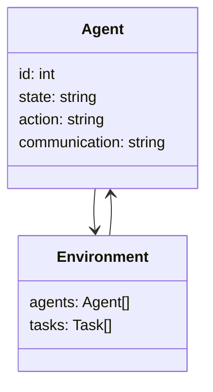
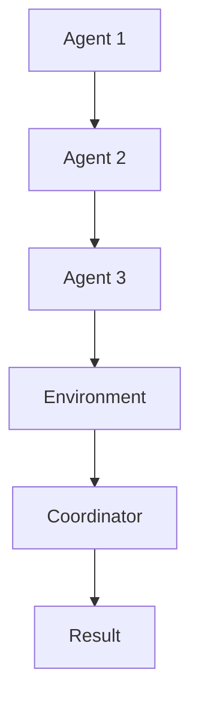

                 


# 利用多智能体系统评估公司的数字化转型进程

> **关键词**: 数字化转型, 多智能体系统, 企业架构, 系统评估, 人工智能, 多智能体协作

> **摘要**:  
  在数字化转型的浪潮中，企业需要高效、智能的工具来评估其转型进程。本文探讨了如何利用多智能体系统来实现这一目标。通过分析多智能体系统的概念、算法原理、数学模型、系统架构设计以及项目实战，本文为读者提供了一个全面的视角，展示如何利用多智能体系统评估企业的数字化转型进程。文章结合理论与实践，详细解读了多智能体系统的核心要素，为企业的数字化转型提供了创新的解决方案。

---

# 第1章: 数字化转型的背景与意义

## 1.1 数字化转型的定义与内涵

### 1.1.1 数字化转型的定义  
数字化转型是指将企业的业务流程、组织结构、文化等各个方面通过数字技术进行重构和优化，以适应新的商业环境和客户需求。它不仅仅是技术的升级，更是企业战略和运营模式的根本性变革。

### 1.1.2 数字化转型的核心特征  
- **数据驱动**: 依赖数据进行决策，而非传统的经验驱动。
- **智能化**: 利用人工智能、机器学习等技术实现自动化和智能化。
- **协作性**: 业务部门与技术部门的深度协作，打破 silo �状结构。
- **敏捷性**: 快速响应市场变化和客户需求。

### 1.1.3 数字化转型对企业的影响  
数字化转型能够提升企业的竞争力、效率和客户满意度，同时降低运营成本。它不仅改变了企业的运作方式，还重塑了企业的价值创造模式。

---

## 1.2 多智能体系统的概念与特点

### 1.2.1 多智能体系统的定义  
多智能体系统（Multi-Agent System, MAS）是由多个智能体（Agent）组成的分布式系统，这些智能体能够自主决策、协作完成任务，并与环境和其他智能体交互。

### 1.2.2 多智能体系统的核心特点  
- **自主性**: 每个智能体都能自主决策。
- **反应性**: 能够实时感知环境并做出反应。
- **协作性**: 智能体之间可以通过通信和协调完成复杂任务。
- **分布性**: 系统中的智能体分布在网络中，而非集中在一个节点。

### 1.2.3 多智能体系统与传统系统的主要区别  

| 特性               | 多智能体系统         | 传统系统           |
|--------------------|---------------------|-------------------|
| 结构               | 分布式             | 集中式           |
| 智能               | 自主且协作         | 依赖中央控制      |
| 灵活性             | 高                 | 低               |
| 应用场景           | 复杂协作任务       | 简单任务         |

---

## 1.3 数字化转型中的多智能体系统

### 1.3.1 多智能体系统在数字化转型中的作用  
- **任务分解**: 将复杂问题分解为多个子任务，由不同智能体分别处理。
- **协作优化**: 智能体之间的协作能够提高整体效率。
- **动态适应**: 系统能够实时调整策略以应对变化。

### 1.3.2 多智能体系统在数字化转型中的应用场景  
- **供应链管理**: 多个智能体分别负责采购、生产、物流等环节。
- **客户服务**: 智能客服系统中，多个智能体协作解决客户问题。
- **数据分析**: 多个智能体协作处理和分析大数据。

### 1.3.3 多智能体系统的潜在优势  
- **高效性**: 分布式计算能够提高处理速度。
- **灵活性**: 系统能够快速适应变化。
- **智能性**: 智能体具备自主决策能力。

---

## 1.4 本章小结  
本章介绍了数字化转型的背景、核心概念和多智能体系统的定义与特点。通过对比分析，我们看到多智能体系统在数字化转型中的巨大潜力，特别是在任务分解、协作优化和动态适应方面。

---

# 第2章: 数字化转型的核心要素与挑战

## 2.1 数字化转型的核心要素

### 2.1.1 技术要素  
- **数据技术**: 包括大数据、云计算等。
- **人工智能**: 用于智能决策和自动化。
- **通信技术**: 用于智能体之间的通信。

### 2.1.2 组织要素  
- **组织结构**: 需要扁平化和协作型结构。
- **文化变革**: 需要从传统模式向数字化思维转变。
- **人才**: 需要具备数字化能力的人才。

### 2.1.3 业务要素  
- **业务流程优化**: 通过数字化技术重构流程。
- **客户体验**: 提供个性化和实时的服务。
- **创新业务模式**: 利用数字化技术创造新的商业模式。

---

## 2.2 数字化转型的主要挑战

### 2.2.1 技术挑战  
- **系统集成**: 多个系统之间的集成和协作复杂。
- **数据安全**: 数据泄露和隐私保护问题。
- **技术选型**: 如何选择合适的技术和工具。

### 2.2.2 组织挑战  
- **文化冲突**: 传统员工对数字化转型的抵触。
- **组织协作**: 跨部门协作的困难。
- **人才短缺**: 数字化人才的缺乏。

### 2.2.3 业务挑战  
- **业务模型重构**: 如何将传统业务模式转化为数字化模式。
- **客户期望**: 提高客户体验的同时降低成本。
- **市场竞争**: 数字化转型带来的市场竞争加剧。

---

## 2.3 多智能体系统在应对挑战中的作用

### 2.3.1 技术挑战的解决方案  
多智能体系统通过分布式计算和协作机制，能够有效解决系统集成和动态适应的问题。

### 2.3.2 组织挑战的解决方案  
通过智能体的自主性和协作性，多智能体系统能够促进组织内部的协作和文化变革。

### 2.3.3 业务挑战的解决方案  
多智能体系统能够实时分析数据，优化业务流程，提供个性化的客户体验。

---

## 2.4 本章小结  
本章分析了数字化转型的核心要素和技术、组织和业务方面的挑战，并探讨了多智能体系统在应对这些挑战中的作用。多智能体系统能够有效解决复杂问题，提升企业的竞争力。

---

# 第3章: 多智能体系统的算法原理

## 3.1 多智能体系统的算法概述

### 3.1.1 分布式计算  
多智能体系统通过分布式计算实现任务的分解和协作。每个智能体负责一部分计算，最终汇总结果。

### 3.1.2 协调与同步  
智能体之间的协调与同步是多智能体系统的关键。通过通信协议和同步机制，确保智能体之间的协作。

### 3.1.3 博弈论与决策  
智能体在多智能体系统中需要做出决策，这涉及到博弈论中的 Nash 均衡等概念。

---

## 3.2 多智能体系统的算法实现

### 3.2.1 分布式计算算法  
```python
def distributed_algorithm():
    agents = [agent1, agent2, agent3]
    tasks = distribute_tasks(agents)
    results = collect_results(agents)
    return combine_results(results)
```

### 3.2.2 协调与同步算法  
```python
def coordinate_agents(agents):
    for agent in agents:
        agent.communicate_with_others()
    return synchronized_agents()
```

### 3.2.3 博弈论算法  
```python
def nash_equilibrium():
    strategies = [s1, s2, s3]
    for strategy in strategies:
        if is_nash_equilibrium(strategy):
            return strategy
    return None
```

---

## 3.3 多智能体系统的数学模型

### 3.3.1 状态空间  
$$ S = \{s_1, s_2, ..., s_n\} $$

### 3.3.2 动作空间  
$$ A = \{a_1, a_2, ..., a_m\} $$

### 3.3.3 奖励函数  
$$ R(s, a) = \sum_{i=1}^{k} w_i \cdot r_i $$

---

## 3.4 本章小结  
本章详细介绍了多智能体系统的算法原理，包括分布式计算、协调与同步以及博弈论在算法中的应用。通过这些算法，多智能体系统能够高效地完成复杂任务。

---

# 第4章: 多智能体系统的系统分析与架构设计

## 4.1 系统分析

### 4.1.1 项目介绍  
本项目旨在利用多智能体系统评估企业的数字化转型进程，通过智能体协作完成数据分析和评估报告生成。

### 4.1.2 领域模型  


---

## 4.2 系统架构设计

### 4.2.1 系统架构  


---

## 4.3 接口设计

### 4.3.1 智能体接口  
- **输入**: 状态、动作
- **输出**: 新状态、奖励

### 4.3.2 环境接口  
- **输入**: 智能体动作
- **输出**: 新环境状态

---

## 4.4 交互设计

### 4.4.1 序列图  
```mermaid
sequenceDiagram
    participant Agent1
    participant Agent2
    participant Coordinator
    Agent1 -> Agent2: 通信
    Agent2 -> Coordinator: 请求同步
    Coordinator -> Agent1, Agent2: 发送同步信号
```

---

## 4.5 本章小结  
本章通过系统分析和架构设计，展示了多智能体系统如何在数字化转型评估中发挥作用。通过合理的架构设计和接口设计，能够实现智能体之间的高效协作。

---

# 第5章: 项目实战

## 5.1 项目介绍

### 5.1.1 项目背景  
假设我们正在为一家制造企业设计数字化转型评估系统，利用多智能体系统评估其供应链、生产效率和客户满意度。

---

## 5.2 系统核心实现

### 5.2.1 环境安装  
```bash
pip install multi-agent-system
```

### 5.2.2 核心代码实现  
```python
class Agent:
    def __init__(self, id):
        self.id = id
        self.state = None
        self.communication = {}

    def receive_message(self, message):
        self.communication[message.sender] = message.content

    def send_message(self, receiver, content):
        self.communication[receiver] = content

class Environment:
    def __init__(self, agents):
        self.agents = agents
        self.tasks = []

    def assign_task(self, agent, task):
        agent.state = task
```

---

## 5.3 代码解读与分析

### 5.3.1 Agent 类  
- **属性**: id, state, communication
- **方法**: receive_message, send_message

### 5.3.2 Environment 类  
- **属性**: agents, tasks
- **方法**: assign_task

---

## 5.4 案例分析

### 5.4.1 供应链评估  
通过多智能体系统评估企业的供应链效率，优化库存管理和物流流程。

### 5.4.2 客户满意度分析  
通过分析客户数据，评估客户满意度并提出改进建议。

---

## 5.5 项目小结  
本章通过一个具体的项目案例，展示了如何利用多智能体系统实现数字化转型评估。通过环境安装和代码实现，读者可以更好地理解多智能体系统的实际应用。

---

# 第6章: 总结与展望

## 6.1 总结

### 6.1.1 核心内容回顾  
- 数字化转型的背景与意义
- 多智能体系统的概念与特点
- 算法原理与系统架构设计
- 项目实战与案例分析

### 6.1.2 多智能体系统的价值  
- 提高企业的协作效率
- 实现复杂任务的高效处理
- 优化企业的数字化转型进程

---

## 6.2 展望

### 6.2.1 技术发展  
随着人工智能和分布式计算的快速发展，多智能体系统在数字化转型中的应用将更加广泛。

### 6.2.2 应用场景拓展  
未来，多智能体系统将在更多领域得到应用，如智慧城市、智能制造等。

### 6.2.3 挑战与机遇  
尽管面临技术、组织和业务等挑战，但多智能体系统为企业提供了巨大的机遇，能够帮助企业在数字化转型中占据竞争优势。

---

## 6.3 本章小结  
本章总结了全文的核心内容，并展望了多智能体系统在数字化转型中的未来发展。多智能体系统将继续发挥其独特优势，为企业创造更大的价值。

---

# 作者：AI天才研究院/AI Genius Institute & 禅与计算机程序设计艺术 /Zen And The Art of Computer Programming

