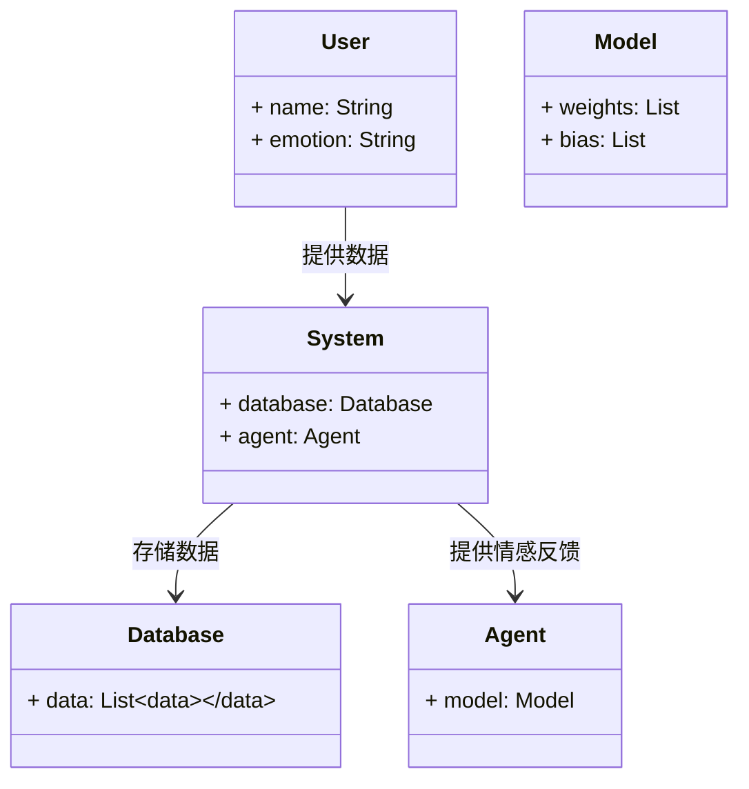

                 


# 开发AI Agent的多模态情感识别系统

## 关键词：AI Agent，多模态情感识别，情感计算，文本分析，图像识别，机器学习

## 摘要：  
随着人工智能技术的快速发展，AI Agent（智能代理）在各个领域的应用越来越广泛。情感识别作为人机交互的重要组成部分，通过分析多模态数据（如文本、语音、图像）来理解用户的情感状态。本文详细探讨了如何开发基于AI Agent的多模态情感识别系统，从背景、核心概念、算法原理到系统架构设计和项目实战，结合具体的技术细节和实例，帮助读者掌握相关技术。

---

# 第一部分: 多模态情感识别系统背景介绍

## 第1章: 多模态情感识别系统背景介绍

### 1.1 问题背景与问题描述

#### 1.1.1 情感识别技术的现状与挑战
情感识别是人工智能领域的重要研究方向，旨在通过分析多模态数据（如文本、语音、图像）来理解用户的情感状态。当前，情感识别技术在自然语言处理、计算机视觉等领域取得了显著进展，但仍面临以下挑战：

- **数据多样性**：不同用户、不同场景下的情感表达方式差异较大，导致模型泛化能力不足。
- **多模态融合**：如何有效融合文本、语音和图像等多种模态信息，提升情感识别的准确性和鲁棒性。
- **实时性与效率**：在实时交互场景中，如何高效处理多模态数据并快速生成情感反馈是一个关键问题。

#### 1.1.2 多模态数据在情感识别中的优势
多模态数据能够提供更全面的情感信息，例如：

- **文本**：通过分析用户的输入文本，提取情感倾向、关键词等信息。
- **语音**：通过分析语调、语速、音调等语音特征，进一步丰富情感表达。
- **图像**：通过分析面部表情、肢体动作等视觉信息，提供情感线索。

#### 1.1.3 AI Agent在情感识别中的应用价值
AI Agent作为一种智能代理，能够通过情感识别技术更好地理解用户需求，提供更个性化的服务。例如：

- **智能客服**：通过情感识别技术，AI Agent可以更准确地理解用户情绪，提供更贴心的服务。
- **虚拟助手**：通过分析用户的语音和表情，虚拟助手能够更自然地与用户互动。
- **情感陪护机器人**：通过多模态情感识别，机器人可以更好地理解用户情感，提供情感支持。

### 1.2 多模态情感识别的核心概念

#### 1.2.1 多模态数据的定义与特征
多模态数据是指多种类型的数据同时存在的形式，例如文本、语音、图像等。其主要特征包括：

- **异构性**：不同模态的数据具有不同的特征和表达方式。
- **互补性**：不同模态的数据可以互补，共同提供更全面的信息。
- **动态性**：多模态数据在时间和空间上可能具有动态变化的特点。

#### 1.2.2 情感识别的基本原理
情感识别的核心目标是通过分析多模态数据，识别出用户的情感状态。具体步骤包括：

1. 数据采集：获取用户的文本、语音、图像等多模态数据。
2. 数据预处理：对数据进行清洗、归一化等处理。
3. 特征提取：从数据中提取有用的特征，例如文本中的关键词、语音的音调特征、图像的表情特征。
4. 情感分析：基于提取的特征，利用机器学习或深度学习模型进行情感分类。

#### 1.2.3 AI Agent的定义与功能
AI Agent是一种智能代理，能够感知环境、理解用户需求并执行相应的操作。其主要功能包括：

- **感知环境**：通过多模态传感器获取环境信息。
- **理解用户需求**：通过自然语言处理、情感识别等技术理解用户意图。
- **决策与执行**：根据用户需求和环境信息，做出决策并执行相应的操作。

### 1.3 技术趋势与应用前景

#### 1.3.1 多模态情感识别的技术发展趋势
随着深度学习技术的快速发展，多模态情感识别技术将朝着以下几个方向发展：

- **深度学习的融合**：利用深度学习模型（如卷积神经网络、循环神经网络）进行多模态数据的特征提取和融合。
- **实时性优化**：通过优化算法和硬件加速技术，提升情感识别的实时性。
- **个性化定制**：根据不同的用户需求，定制个性化的情感识别模型。

#### 1.3.2 AI Agent在不同领域的应用案例
AI Agent在情感识别技术的应用已经涵盖了多个领域：

- **智能客服**：通过情感识别技术，智能客服可以更好地理解用户情绪，提供更优质的服务。
- **教育领域**：通过分析学生的表情和语言，AI Agent可以帮助教师更好地了解学生的学习状态。
- **医疗领域**：通过分析患者的语音和表情，AI Agent可以帮助医生更好地理解患者的心理状态。

#### 1.3.3 情感识别技术的挑战与未来方向
尽管情感识别技术取得了显著进展，但仍面临一些挑战：

- **跨模态融合的挑战**：如何有效融合文本、语音、图像等多种模态数据，是一个尚未完全解决的问题。
- **实时性与效率的挑战**：在实时交互场景中，如何高效处理多模态数据并快速生成情感反馈是一个关键问题。
- **隐私与伦理问题**：情感识别技术的广泛应用可能引发隐私和伦理问题，需要引起高度重视。

### 1.4 本章小结
本章介绍了多模态情感识别系统的发展背景、核心概念和应用价值。通过分析多模态数据的特征和情感识别的基本原理，读者可以更好地理解AI Agent在情感识别中的重要作用。同时，本章还探讨了技术发展趋势和应用前景，为后续章节的深入分析奠定了基础。

---

# 第二部分: 多模态情感识别的核心概念与联系

## 第2章: 多模态情感识别的核心原理

### 2.1 情感计算的基本原理

#### 2.1.1 情感计算的定义与目标
情感计算（Affective Computing）是一种通过计算机技术分析和理解人类情感状态的科学。其目标是通过分析多模态数据，识别和理解用户的情感状态，并根据情感信息提供相应的反馈或服务。

#### 2.1.2 情感计算的关键步骤
情感计算的关键步骤包括：

1. 数据采集：获取用户的多模态数据，如文本、语音、图像等。
2. 数据预处理：对数据进行清洗、归一化等处理。
3. 特征提取：从数据中提取有用的特征，例如文本中的关键词、语音的音调特征、图像的表情特征。
4. 情感分类：基于提取的特征，利用机器学习或深度学习模型进行情感分类。

#### 2.1.3 情感计算的数学模型
情感计算的数学模型可以通过多种方式实现，例如：

- **基于统计的方法**：如朴素贝叶斯、支持向量机（SVM）等。
- **基于深度学习的方法**：如卷积神经网络（CNN）、循环神经网络（RNN）等。

#### 2.1.4 情感计算的挑战与解决方案
情感计算面临的主要挑战包括：

- **跨模态数据的融合**：如何有效融合文本、语音、图像等多种模态数据，是一个尚未完全解决的问题。
- **实时性与效率**：在实时交互场景中，如何高效处理多模态数据并快速生成情感反馈是一个关键问题。

### 2.2 多模态数据融合的原理

#### 2.2.1 多模态数据的特征提取
多模态数据的特征提取是情感识别的关键步骤。例如：

- **文本特征提取**：通过自然语言处理技术提取文本中的关键词、情感倾向等信息。
- **语音特征提取**：通过语音信号处理技术提取语音的音调、语速、语调等特征。
- **图像特征提取**：通过计算机视觉技术提取图像的表情特征，如眼睛的开合程度、嘴角的上扬程度等。

#### 2.2.2 多模态数据融合的方法
多模态数据融合的方法包括：

- **级联融合**：将不同模态的数据依次处理，例如先处理文本，再处理图像。
- **并行融合**：同时处理不同模态的数据，然后将结果进行融合。
- **混合融合**：结合级联和并行的方法，进行多模态数据的融合。

#### 2.2.3 数据融合对情感识别准确性的提升
通过多模态数据的融合，可以显著提升情感识别的准确性。例如：

- **文本+图像**：通过分析用户的文本和表情，可以更准确地识别用户的情感状态。
- **语音+图像**：通过分析用户的语音和表情，可以更全面地理解用户的情感状态。

### 2.3 AI Agent与情感识别的结合

#### 2.3.1 AI Agent的情感识别需求
AI Agent需要通过情感识别技术理解用户的情感状态，从而提供更个性化的服务。例如：

- **智能客服**：通过情感识别技术，AI Agent可以更准确地理解用户情绪，提供更贴心的服务。
- **虚拟助手**：通过分析用户的语音和表情，虚拟助手能够更自然地与用户互动。

#### 2.3.2 情感识别对AI Agent决策能力的提升
情感识别技术可以显著提升AI Agent的决策能力。例如：

- **情感反馈**：通过情感识别技术，AI Agent可以实时获取用户的情感反馈，从而调整自己的行为策略。
- **个性化推荐**：通过分析用户的情感状态，AI Agent可以提供更个性化的推荐服务。

#### 2.3.3 AI Agent与多模态情感识别的协同优化
AI Agent与多模态情感识别的协同优化可以通过以下几个方面实现：

- **数据共享**：通过共享多模态数据，提升情感识别的准确性。
- **模型优化**：通过优化情感识别模型，提升AI Agent的决策能力。
- **实时交互**：通过实时处理多模态数据，实现更自然的用户交互。

### 2.4 核心概念对比与ER实体关系图

#### 2.4.1 多模态数据特征对比表
以下是对多模态数据特征的对比表：

| 特征类型 | 文本 | 语音 | 图像 |
|----------|------|------|------|
| 数据来源 | 文本输入 | 音频信号 | 视频图像 |
| 数据特征 | 关键词、情感倾向 | 音调、语速 | 面部表情、肢体动作 |

#### 2.4.2 情感识别算法对比分析
以下是对情感识别算法的对比分析：

| 算法类型 | 优点 | 缺点 |
|----------|------|------|
| 基于统计的方法（如Naive Bayes） | 实现简单、计算效率高 | 对数据分布的假设过于简化 |
| 基于深度学习的方法（如CNN、RNN） | 表现力强、能够捕捉复杂特征 | 训练时间长、需要大量数据 |

#### 2.4.3 多模态情感识别系统的ER实体关系图（Mermaid）

```mermaid
erDiagram
    actor User
    actor System
    actor Agent
    actor Database
    actor Output

    User --> Database: 提供多模态数据
    Database --> System: 处理数据
    System --> Agent: 提供情感反馈
    Agent --> Output: 输出结果
```

### 2.5 本章小结
本章详细介绍了多模态情感识别的核心原理，包括情感计算的基本原理、多模态数据融合的方法以及AI Agent与情感识别的结合。通过对比分析和ER实体关系图，读者可以更好地理解多模态情感识别系统的整体架构和各部分的协同作用。

---

# 第三部分: 多模态情感识别算法原理

## 第3章: 多模态情感识别算法详解

### 3.1 文本情感分析算法

#### 3.1.1 词袋模型（Bag-of-Words）
词袋模型是一种简单的文本表示方法，它将文本表示为单词的集合。例如：

- 输入文本： "我非常开心"
- 词袋表示： {"我": 1, "非常": 1, "开心": 1}

#### 3.1.2 TF-IDF（Term Frequency-Inverse Document Frequency）
TF-IDF是一种用于衡量单词在文档中的重要性的统计方法。计算公式如下：

$$
TF-IDF(t, d) = TF(t, d) \times \log\left(\frac{N}{DF(t)}\right)
$$

其中，$TF(t, d)$是单词$t$在文档$d$中的词频，$DF(t)$是单词$t$在所有文档中的文档频数，$N$是文档总数。

#### 3.1.3 情感分类器的实现
情感分类器可以通过以下步骤实现：

1. **特征提取**：提取文本的TF-IDF特征。
2. **模型训练**：使用训练数据训练情感分类器，例如支持向量机（SVM）。
3. **情感预测**：对测试文本进行情感预测。

#### 3.1.4 情感分类器的优化
为了提升情感分类器的性能，可以采取以下优化措施：

- **特征选择**：通过选择最具代表性的特征，减少特征维度。
- **模型优化**：尝试不同的模型（如逻辑回归、随机森林）以找到最佳性能。
- **数据增强**：通过数据增强技术（如同义词替换）提升模型的泛化能力。

### 3.2 图像情感识别算法

#### 3.2.1 面部表情识别
面部表情识别是图像情感识别的重要组成部分。常用的技术包括：

- **基于模板的方法**：通过匹配预定义的模板图像进行表情识别。
- **基于特征提取的方法**：通过提取面部关键点（如眼睛、嘴巴）的位置和形状，进行表情识别。
- **基于深度学习的方法**：通过卷积神经网络（CNN）学习面部表情的特征。

#### 3.2.2 基于深度学习的图像情感识别
基于深度学习的图像情感识别可以通过以下步骤实现：

1. **数据预处理**：对图像进行归一化、调整尺寸等处理。
2. **特征提取**：通过卷积神经网络（CNN）提取图像的特征。
3. **情感分类**：基于提取的特征，利用全连接层进行情感分类。

#### 3.2.3 图像情感识别的数学模型
图像情感识别的数学模型可以通过以下公式表示：

$$
P(y|x) = \frac{e^{W_y x + b_y}}{\sum_{k} e^{W_k x + b_k}}
$$

其中，$W_y$和$b_y$是情感类别$k$对应的权重和偏置，$x$是输入的特征向量。

### 3.3 文本与图像情感识别的融合

#### 3.3.1 融合方法
文本与图像情感识别的融合可以通过以下方法实现：

1. **级联融合**：先进行文本情感识别，再进行图像情感识别，最后结合两种结果。
2. **并行融合**：同时进行文本和图像的情感识别，然后将结果进行加权融合。
3. **混合融合**：结合级联和并行的方法，进行多模态数据的融合。

#### 3.3.2 融合模型的设计
融合模型的设计可以通过以下步骤实现：

1. **特征提取**：分别提取文本和图像的特征。
2. **特征融合**：将提取的特征进行融合，例如通过加权平均的方式。
3. **情感分类**：基于融合的特征，进行情感分类。

### 3.4 本章小结
本章详细介绍了文本情感分析和图像情感识别的算法原理，并探讨了多模态情感识别的融合方法。通过具体的数学公式和算法实现，读者可以更好地理解多模态情感识别系统的实现过程。

---

# 第四部分: 多模态情感识别系统分析与架构设计

## 第4章: 多模态情感识别系统分析

### 4.1 系统分析

#### 4.1.1 问题场景介绍
系统需要实现一个多模态情感识别功能，能够同时处理文本、语音和图像三种数据类型。用户可以通过输入文本、语音或图像，系统能够识别出用户的情感状态。

#### 4.1.2 项目介绍
本项目的目标是开发一个多模态情感识别系统，能够支持文本、语音和图像三种数据类型的输入，并能够识别出用户的情感状态。系统将分为以下几个模块：

- **数据采集模块**：负责采集用户的多模态数据。
- **数据预处理模块**：对采集的数据进行预处理。
- **特征提取模块**：从数据中提取有用的特征。
- **情感分类模块**：基于提取的特征，进行情感分类。
- **结果输出模块**：将情感分类结果输出给用户。

### 4.2 系统功能设计

#### 4.2.1 领域模型类图
以下是系统的领域模型类图：



#### 4.2.2 系统架构设计
以下是系统的架构设计图：

```mermaid
archi
    title 多模态情感识别系统架构
    网页 --> 数据采集模块
    数据采集模块 --> 数据预处理模块
    数据预处理模块 --> 特征提取模块
    特征提取模块 --> 情感分类模块
    情感分类模块 --> 结果输出模块
```

#### 4.2.3 系统接口设计
系统需要以下接口：

- **数据采集接口**：用于采集用户的多模态数据。
- **数据预处理接口**：用于对采集的数据进行预处理。
- **特征提取接口**：用于从数据中提取特征。
- **情感分类接口**：用于进行情感分类。
- **结果输出接口**：用于将情感分类结果输出给用户。

#### 4.2.4 系统交互流程图
以下是系统的交互流程图：

```mermaid
sequence
    用户 --> 数据采集模块: 提供多模态数据
    数据采集模块 --> 数据预处理模块: 提供预处理后的数据
    数据预处理模块 --> 特征提取模块: 提供特征提取后的数据
    特征提取模块 --> 情感分类模块: 提供情感分类结果
    情感分类模块 --> 用户: 提供情感反馈
```

### 4.3 本章小结
本章详细分析了多模态情感识别系统的功能需求和系统架构设计。通过领域模型类图和系统架构设计图，读者可以更好地理解系统的整体结构和各部分的协作方式。

---

# 第五部分: 多模态情感识别系统项目实战

## 第5章: 项目实战

### 5.1 环境安装与配置

#### 5.1.1 开发环境
- **操作系统**：Linux/MacOS/Windows
- **编程语言**：Python 3.8+
- **开发工具**：PyCharm/VS Code
- **依赖管理**：pip

#### 5.1.2 依赖库安装
安装以下依赖库：

- **文本处理**：nltk、spaCy
- **图像处理**：OpenCV、dlib
- **深度学习框架**：TensorFlow、Keras
- **语音处理**：SpeechRecognition、pyaudio

安装命令：

```bash
pip install nltk spacy opencv-python dlib tensorflow keras speechRecognition pyaudio
```

### 5.2 系统核心实现

#### 5.2.1 文本情感分析实现

##### 5.2.1.1 词袋模型实现
```python
from collections import Counter

def bag_of_words(text):
    return Counter(text.split())
```

##### 5.2.1.2 TF-IDF实现
```python
import math

def compute_tf(text):
    word_counts = bag_of_words(text)
    return {word: count / sum(word_counts.values()) for word, count in word_counts.items()}

def compute_idf(word, corpus):
    return math.log(len(corpus) / sum(1 for doc in corpus if word in doc))

def tfidf(text, corpus):
    tf = compute_tf(text)
    idf = {word: compute_idf(word, corpus) for word in tf}
    return {word: tf[word] * idf[word] for word in tf}
```

##### 5.2.1.3 情感分类器实现
```python
from sklearn.svm import SVC
from sklearn.feature_extraction.text import TfidfVectorizer
from sklearn.pipeline import Pipeline

def train_emotion_classifier(train_texts, train_labels):
    model = Pipeline([
        ('tfidf', TfidfVectorizer()),
        ('clf', SVC())
    ])
    model.fit(train_texts, train_labels)
    return model

def predict_emotion(text, model):
    return model.predict([text])[0]
```

#### 5.2.2 图像情感识别实现

##### 5.2.2.1 面部表情识别实现
```python
import cv2

def detect_face(image):
    gray = cv2.cvtColor(image, cv2.COLOR_BGR2GRAY)
    faceCascade = cv2.CascadeClassifier(cv2.data.haarcascades + 'haarcascade_frontalface_default.xml')
    faces = faceCascade.detectMultiScale(gray, 1.3, 5)
    return faces
```

##### 5.2.2.2 基于CNN的情感分类实现
```python
import tensorflow as tf
from tensorflow.keras import layers

def build_cnn_model(input_shape, num_classes):
    model = tf.keras.Sequential([
        layers.Conv2D(32, (3,3), activation='relu', input_shape=input_shape),
        layers.MaxPooling2D((2,2)),
        layers.Conv2D(64, (3,3), activation='relu'),
        layers.MaxPooling2D((2,2)),
        layers.Flatten(),
        layers.Dense(64, activation='relu'),
        layers.Dense(num_classes, activation='softmax')
    ])
    model.compile(optimizer='adam', loss='sparse_categorical_crossentropy', metrics=['accuracy'])
    return model
```

#### 5.2.3 文本与图像情感识别的融合实现
```python
def fuse_emotion(text_emotion, image_emotion, alpha=0.5):
    return alpha * text_emotion + (1 - alpha) * image_emotion
```

### 5.3 项目实现与测试

#### 5.3.1 数据集准备
- 文本数据集：包含正面、负面、中性三种情感类别。
- 图像数据集：包含快乐、悲伤、愤怒三种情感类别。

#### 5.3.2 系统测试
1. 文本情感识别测试：
   - 输入文本： "我非常开心"
   - 预期输出： 正面

2. 图像情感识别测试：
   - 输入图像： 一张笑脸图片
   - 预期输出： 快乐

3. 融合情感识别测试：
   - 输入文本： "我非常开心"
   - 输入图像： 一张笑脸图片
   - 预期输出： 正面

### 5.4 项目总结
通过本项目，读者可以掌握多模态情感识别系统的核心实现技术。通过实际操作，读者可以更好地理解文本情感分析、图像情感识别以及多模态数据融合的实现方法。

---

# 第六部分: 多模态情感识别系统的最佳实践

## 第6章: 最佳实践

### 6.1 小结
本章总结了开发多模态情感识别系统的最佳实践，包括系统设计、算法优化和项目管理等方面。

### 6.2 注意事项

#### 6.2.1 数据质量
- 确保数据的多样性和代表性。
- 处理数据中的噪声和异常值。

#### 6.2.2 模型优化
- 选择合适的特征提取方法。
- 尝试不同的模型结构，寻找最佳性能。

#### 6.2.3 系统性能
- 优化系统的实时性，减少处理延迟。
- 提升系统的可扩展性，支持更多模态数据的接入。

### 6.3 拓展阅读

#### 6.3.1 推荐书籍
- 《自然语言处理实战：基于Python的深度学习方法》
- 《计算机视觉：算法与应用》

#### 6.3.2 推荐论文
- "Deep Learning for Image Recognition"
- "Affective Computing: A Survey"

### 6.4 本章小结
本章总结了开发多模态情感识别系统的最佳实践，包括系统设计、算法优化和项目管理等方面。通过这些实践，读者可以更好地开发和优化自己的情感识别系统。

---

# 作者：AI天才研究院/AI Genius Institute & 禅与计算机程序设计艺术 /Zen And The Art of Computer Programming

---

以上是《开发AI Agent的多模态情感识别系统》的完整目录和内容概述。

