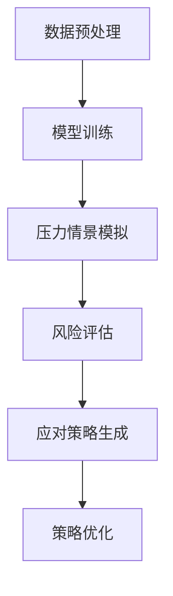
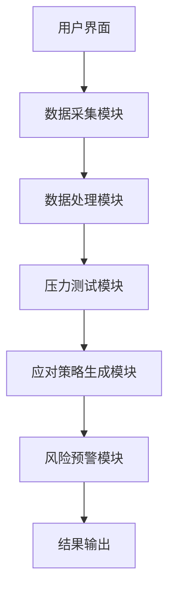
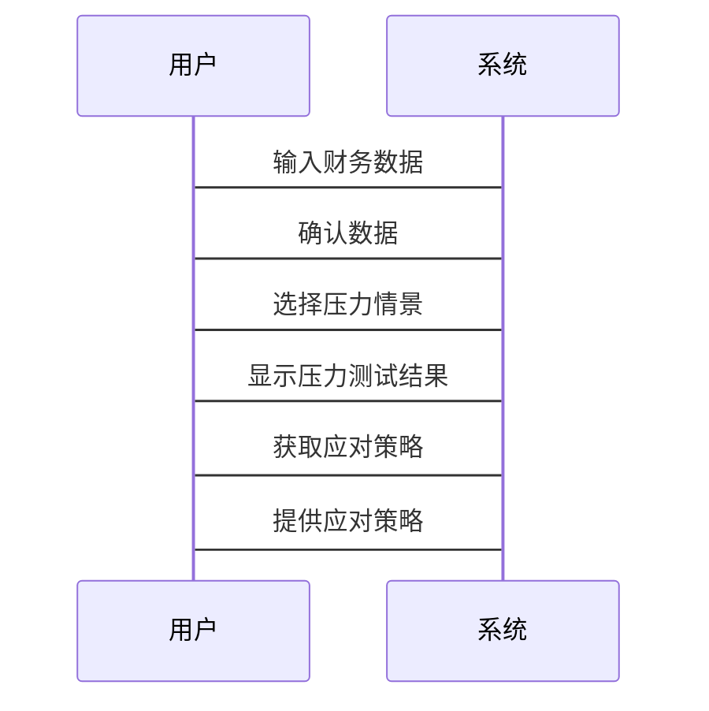

                 


# 智能个人财务压力测试与应对策略生成

> 关键词：智能财务压力测试、人工智能、压力测试模型、应对策略生成、财务风险管理

> 摘要：本文详细探讨了智能个人财务压力测试与应对策略生成的核心概念、算法原理、系统架构设计及实际应用场景。通过结合人工智能和大数据分析技术，提出了一种基于智能算法的压力测试模型和应对策略生成方案，为个人财务风险管理提供了新的思路和方法。

---

# 引言

在当今快速变化的经济环境中，个人财务管理面临着前所未有的挑战。经济波动、收入变化、债务压力、投资风险等因素都可能对个人财务状况造成重大影响。传统的财务压力测试方法往往依赖于人工计算和经验判断，效率低且难以应对复杂多变的财务风险。因此，引入人工智能技术，构建智能个人财务压力测试与应对策略生成系统，成为提升个人财务风险管理能力的重要途径。

本文将从背景分析、核心概念、算法设计、系统架构到实际应用，全面探讨智能个人财务压力测试与应对策略生成的实现方法，并通过具体案例展示其实际应用价值。

---

## 第一章：问题背景与问题描述

### 1.1 问题背景

随着经济全球化和金融市场的复杂化，个人财务风险管理的重要性日益凸显。传统的财务压力测试方法通常基于静态数据和固定模型，难以应对动态变化的经济环境。例如，当市场发生剧烈波动时，传统的压力测试模型可能无法及时捕捉到潜在风险，导致财务决策滞后或失误。

此外，个人财务数据的多样性和复杂性也增加了压力测试的难度。例如，个人可能面临多种财务压力来源，如高负债、收入不稳定、大额支出等，这些因素需要综合考虑才能制定有效的应对策略。

### 1.2 问题描述

智能个人财务压力测试的目标是通过分析个人的财务状况、收入来源、支出结构、资产配置等多维度数据，识别潜在的财务风险，并生成相应的应对策略。具体而言，问题可以分解为以下几个方面：

- **数据收集与分析**：如何高效、准确地收集和处理个人财务数据。
- **风险识别**：如何基于数据识别潜在的财务风险点。
- **压力测试模型构建**：如何设计模型，模拟不同压力情景下的财务表现。
- **应对策略生成**：如何根据压力测试结果，生成个性化的应对策略。

### 1.3 问题解决与边界

智能个人财务压力测试的核心目标是通过智能化手段，提高财务压力测试的效率和准确性，同时降低人为判断的偏差。解决方案的关键在于构建一个基于人工智能的财务压力测试模型，结合大数据分析技术，实现对个人财务状况的动态监控和风险预警。

在边界与外延方面，本文将重点关注个人财务领域，不涉及企业或机构的财务压力测试。同时，本文将主要探讨技术实现方法，而非具体的业务流程或政策法规。

---

## 第二章：核心概念与原理

### 2.1 智能压力测试的定义与原理

智能压力测试是一种基于人工智能技术的财务压力测试方法，其核心在于利用机器学习算法对个人财务数据进行分析，识别潜在风险，并模拟不同压力情景下的财务表现。其主要原理包括：

- **数据驱动**：基于大量历史数据，识别财务风险的模式和特征。
- **动态调整**：根据市场变化和个体财务状况的变化，动态更新压力测试模型。
- **个性化分析**：针对个人的财务特征，生成个性化的压力测试结果和应对策略。

### 2.2 核心概念的属性特征对比

为了更好地理解智能压力测试的核心概念，我们可以通过对比分析其关键属性特征。以下是一个简要的对比表格：

| **属性**         | **传统压力测试**       | **智能压力测试**         |
|------------------|-----------------------|--------------------------|
| 数据来源         | 静态数据，范围有限     | 动态数据，范围广泛       |
| 模型复杂度       | 简单线性模型           | 复杂非线性模型，支持深度学习 |
| 风险识别能力     | 有限，依赖经验判断     | 强大，支持自动识别和分类   |
| 处理效率         | 低效，人工干预较多     | 高效，自动化处理         |

通过对比可以看出，智能压力测试在数据来源、模型复杂度和风险识别能力等方面具有显著优势。

### 2.3 ER实体关系图架构

为了更好地理解智能压力测试系统的架构，我们可以通过ER实体关系图来展示系统的核心要素及其关系。

```mermaid
er
    entity(个人) {
        id
        姓名
        收入
        支出
        资产
        负债
    }
    entity(财务数据) {
        id
        时间
        类型
        数值
    }
    entity(压力测试结果) {
        id
        测试时间
        风险等级
        应对策略
    }
    entity(模型参数) {
        id
        参数名称
        参数值
    }
    entity(市场数据) {
        id
        时间
        类型
        数值
    }
    entity(风险预警) {
        id
        预警时间
        预警类型
        预警级别
    }
    关系：个人 --> 财务数据：拥有
    关系：财务数据 --> 压力测试结果：输入
    关系：压力测试结果 --> 应对策略：输出
    关系：模型参数 --> 压力测试结果：依赖
    关系：市场数据 --> 压力测试结果：参考
    关系：压力测试结果 --> 风险预警：触发
```

---

## 第三章：算法原理与实现

### 3.1 压力测试模型算法

#### 3.1.1 算法原理

智能压力测试的核心算法基于机器学习，特别是深度学习技术。以下是压力测试模型的实现步骤：

1. **数据预处理**：对原始财务数据进行清洗、归一化和特征提取。
2. **模型训练**：利用训练数据训练深度学习模型（如LSTM或GRU），捕捉数据中的时间序列特征。
3. **压力情景模拟**：通过输入不同的压力情景参数，模拟模型在各种假设条件下的表现。
4. **风险评估**：根据模拟结果，评估个人财务状况在压力情景下的健康程度。

#### 3.1.2 应对策略生成模型

应对策略生成模型的目标是根据压力测试结果，生成个性化的应对策略。以下是其实现步骤：

1. **风险评估结果输入**：将压力测试结果作为输入，分析风险的严重程度。
2. **策略生成规则**：基于预设的规则库，生成应对策略。例如，当风险等级为“高”时，建议减少非必要支出或增加紧急储备金。
3. **策略优化**：通过强化学习算法，优化应对策略的效果。

#### 3.1.3 算法流程图

以下是一个简化的算法流程图：



#### 3.1.4 数学模型与公式

以下是压力测试模型的核心数学公式：

$$
\text{风险评分} = \alpha \cdot \text{收入波动} + \beta \cdot \text{支出增长} + \gamma \cdot \text{资产比例}
$$

其中，$\alpha$、$\beta$、$\gamma$是模型的权重参数，通过训练数据优化得到。

---

## 第四章：系统分析与架构设计

### 4.1 系统功能设计

智能个人财务压力测试系统的主要功能模块包括：

1. **数据采集模块**：收集个人的财务数据，包括收入、支出、资产、负债等。
2. **数据处理模块**：对数据进行清洗、归一化和特征提取。
3. **压力测试模块**：基于训练好的模型，模拟不同压力情景下的财务表现。
4. **应对策略生成模块**：根据压力测试结果，生成个性化的应对策略。
5. **风险预警模块**：实时监控财务状况，触发风险预警。

### 4.2 系统架构设计

以下是系统的整体架构图：



### 4.3 系统接口设计

系统主要通过以下接口与用户交互：

1. **数据输入接口**：用户输入财务数据。
2. **压力测试接口**：用户选择压力情景参数。
3. **结果输出接口**：输出压力测试结果和应对策略。

### 4.4 系统交互流程图

以下是系统的交互流程图：



---

## 第五章：项目实战与案例分析

### 5.1 项目环境安装

为了运行本文中的代码示例，需要安装以下工具和库：

- Python 3.8+
- Pandas
- NumPy
- TensorFlow
- Matplotlib

### 5.2 系统核心实现源代码

以下是压力测试模型的核心代码示例：

```python
import pandas as pd
import numpy as np
import tensorflow as tf
import matplotlib.pyplot as plt

# 数据预处理
def preprocess(data):
    # 数据归一化
    normalized_data = (data - data.mean()) / data.std()
    return normalized_data

# 压力测试模型
class FinancialStressTestModel:
    def __init__(self):
        self.model = self.build_model()

    def build_model(self):
        model = tf.keras.Sequential()
        model.add(tf.keras.layers.LSTM(64, input_shape=(None, 1)))
        model.add(tf.keras.layers.Dense(1))
        model.compile(loss='mean_squared_error', optimizer='adam')
        return model

    def train(self, X_train, y_train):
        self.model.fit(X_train, y_train, epochs=100, batch_size=32)

    def predict(self, X_test):
        return self.model.predict(X_test)

# 应对策略生成
def generate_strategies(stress_test_results):
    strategies = []
    for result in stress_test_results:
        if result > 0.8:
            strategies.append("减少非必要支出，增加紧急储备金")
        elif result > 0.5:
            strategies.append("优化资产配置，增加高收益投资")
        else:
            strategies.append("保持当前财务状况，定期复检")
    return strategies
```

### 5.3 代码应用解读与分析

上述代码示例展示了如何利用LSTM模型进行压力测试，并根据测试结果生成应对策略。以下是代码的主要功能：

1. **数据预处理**：对输入数据进行归一化处理，确保模型的输入格式一致。
2. **模型构建**：使用LSTM网络构建压力测试模型，捕捉数据的时间序列特征。
3. **模型训练**：利用训练数据优化模型参数。
4. **压力测试**：对测试数据进行预测，评估个人财务状况的风险等级。
5. **应对策略生成**：根据压力测试结果，生成个性化的应对策略。

### 5.4 实际案例分析

假设我们有一个包含以下数据的案例：

| 时间（月） | 收入（元） | 支出（元） | 资产（元） | 负债（元） |
|------------|------------|------------|------------|------------|
| 2023-01    | 10000      | 8000       | 50000      | 20000      |
| 2023-02    | 9500       | 8500       | 52000      | 22000      |
| 2023-03    | 10500      | 8200       | 54000      | 25000      |

通过上述代码，我们可以对这些数据进行压力测试，并生成应对策略。

### 5.5 项目小结

通过本案例，我们可以看到，智能个人财务压力测试系统能够有效地识别潜在风险，并生成个性化的应对策略。这不仅提高了财务风险管理的效率，还降低了人为判断的偏差。

---

## 第六章：总结与展望

### 6.1 最佳实践 tips

- **数据准确性**：确保输入数据的准确性和完整性。
- **模型优化**：根据实际情况不断优化模型参数和结构。
- **策略执行**：制定应对策略后，需要定期复检和调整。

### 6.2 小结

本文详细探讨了智能个人财务压力测试与应对策略生成的核心概念、算法原理、系统架构设计及实际应用场景。通过结合人工智能和大数据分析技术，提出了一种基于智能算法的压力测试模型和应对策略生成方案，为个人财务风险管理提供了新的思路和方法。

### 6.3 注意事项

- **数据隐私**：在实际应用中，需要特别注意个人数据的隐私保护。
- **模型局限性**：目前的模型仍有一定的局限性，需要根据具体场景进行调整和优化。

### 6.4 拓展阅读

- **推荐书籍**：《机器学习实战》、《Python机器学习》
- **推荐论文**：相关领域的学术论文可进一步深入研究。

---

## 作者

作者：AI天才研究院/AI Genius Institute & 禅与计算机程序设计艺术/Zen And The Art of Computer Programming

---

通过本文的系统阐述，我们希望能够为读者提供一个清晰的智能个人财务压力测试与应对策略生成的技术框架，帮助个人在复杂的经济环境中更好地管理财务风险。

