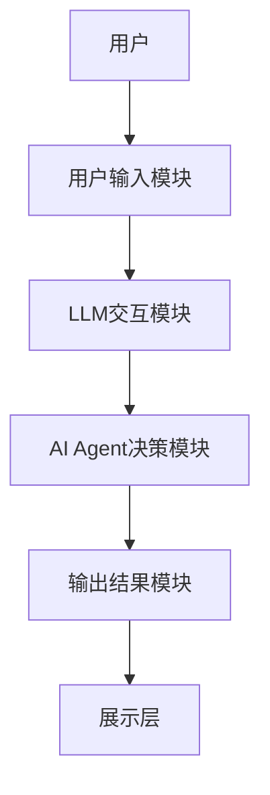

                 


# AI Agent的创新思维：激发LLM的发散性思考

> 关键词：AI Agent，LLM，创新思维，发散性思考，人工智能，自然语言处理

> 摘要：本文探讨了AI Agent与大语言模型（LLM）结合的可能性与创新性，重点分析了如何通过AI Agent激发LLM的发散性思考，从而提升LLM的创造性能力。文章从AI Agent与LLM的基本概念出发，详细分析了LLM的数学模型与算法原理，设计了AI Agent与LLM结合的系统架构，并通过实际案例展示了如何在项目中应用这些技术。最后，本文总结了AI Agent与LLM结合的创新点，并提出了未来的研究方向。

---

# 第一部分: AI Agent与LLM的背景介绍

# 第1章: AI Agent与LLM的背景介绍

## 1.1 AI Agent的基本概念

### 1.1.1 AI Agent的定义与起源

AI Agent，即人工智能代理，是一种能够感知环境并采取行动以实现目标的智能实体。它可以是一个软件程序，也可以是一个物理机器人。AI Agent的核心在于其自主性、反应性、目标导向性和社交能力。AI Agent的概念起源于20世纪70年代的人工智能研究，其初衷是开发能够像人类一样思考和行动的智能系统。

### 1.1.2 LLM的基本概念与特点

LLM（Large Language Model，大语言模型）是一种基于深度学习的自然语言处理模型，具有以下特点：

- **大规模训练数据**：通常使用 billions of parameters 的参数规模。
- **上下文理解能力**：能够理解上下文并生成连贯的文本。
- **多任务处理能力**：可以通过微调或提示工程技术，适应多种语言处理任务。
- **生成能力**：能够生成高质量的文本内容，包括文章、对话、代码等。

### 1.1.3 AI Agent与LLM的结合背景

随着AI Agent和LLM技术的不断发展，两者的结合成为了一个新兴的研究方向。AI Agent需要具备强大的决策能力和环境适应能力，而LLM则可以为AI Agent提供强大的自然语言理解和生成能力。两者的结合不仅能够提升AI Agent的智能水平，还能为LLM提供更广阔的的应用场景。

---

## 1.2 创新思维的定义与重要性

### 1.2.1 创新思维的定义

创新思维是指打破常规思维模式，通过创造性思考产生新的想法、解决方案或方法。创新思维的核心在于打破常规，寻找新的可能性。

### 1.2.2 创新思维在AI领域的重要性

在AI领域，创新思维是推动技术进步的核心动力。通过创新思维，我们可以开发出新的算法、模型和应用场景，从而推动AI技术的发展。

### 1.2.3 激发LLM发散性思考的意义

LLM的发散性思考是指LLM能够从多个角度思考问题，生成多种不同的解决方案。通过激发LLM的发散性思考，我们可以使其具备更强的创造性能力，从而在实际应用中解决更复杂的问题。

---

## 1.3 本章小结

本章从AI Agent和LLM的基本概念出发，探讨了两者的结合背景，并分析了创新思维在AI领域的重要性。接下来，我们将深入探讨AI Agent与LLM的核心概念与联系。

---

# 第二部分: AI Agent与LLM的核心概念与联系

# 第2章: AI Agent与LLM的核心概念

## 2.1 AI Agent的核心原理

### 2.1.1 AI Agent的决策机制

AI Agent的决策机制是一个复杂的系统，通常包括感知环境、目标设定、行动选择和结果评估等步骤。AI Agent需要根据当前环境的状态，结合自身的知识和经验，选择最优的行动方案。

### 2.1.2 AI Agent的分类与特点

AI Agent可以根据不同的标准进行分类，常见的分类方式包括：

- **基于智能水平**：分为反应式AI Agent和认知式AI Agent。
- **基于应用场景**：分为服务型AI Agent、娱乐型AI Agent等。

### 2.1.3 AI Agent与人类思维的类比

AI Agent的决策过程与人类思维有相似之处，但也有本质区别。人类思维具有主观性和创造性，而AI Agent的决策过程是基于数据和算法的。

---

## 2.2 LLM的核心原理

### 2.2.1 LLM的定义与工作原理

LLM是一种基于深度学习的自然语言处理模型，其核心是通过大量的数据训练，使得模型能够理解和生成自然语言文本。

### 2.2.2 LLM的训练过程与数学模型

LLM的训练过程通常包括数据预处理、模型初始化、正向传播、损失计算和反向传播等步骤。模型的训练目标是最小化预测错误，从而使得模型能够生成符合语法规则和语义要求的文本。

### 2.2.3 LLM的输出机制与创新性

LLM的输出机制是基于生成式模型，通常使用贪心算法或蒙特卡洛方法生成文本。通过调整模型的参数，可以控制生成文本的创新性和多样性。

---

## 2.3 AI Agent与LLM的关系

### 2.3.1 AI Agent作为LLM的外部决策者

AI Agent可以作为LLM的外部决策者，通过分析LLM生成的文本，选择最优的行动方案。

### 2.3.2 LLM作为AI Agent的内部知识库

LLM可以作为AI Agent的内部知识库，为AI Agent提供语言理解和生成能力。

### 2.3.3 两者结合的创新点

AI Agent与LLM的结合，使得AI Agent具备了更强的自然语言理解和生成能力，同时，LLM也因为AI Agent的决策能力，能够更好地适应复杂的实际应用场景。

---

## 2.4 核心概念对比分析

### 2.4.1 AI Agent与传统AI的区别

AI Agent具有更强的自主性和目标导向性，而传统AI更多是基于规则的专家系统。

### 2.4.2 LLM与传统NLP模型的对比

LLM具有更强的上下文理解和生成能力，而传统NLP模型通常只专注于特定任务。

### 2.4.3 AI Agent与LLM结合的优劣势分析

**优势**：
- AI Agent与LLM结合可以提升AI Agent的智能水平。
- LLM为AI Agent提供了强大的自然语言处理能力。

**劣势**：
- AI Agent与LLM的结合需要复杂的系统设计和优化。
- LLM的生成结果可能缺乏准确性，需要人工干预。

---

## 2.5 本章小结

本章详细分析了AI Agent与LLM的核心概念与联系，探讨了两者的结合方式及其优劣势。接下来，我们将深入探讨AI Agent与LLM的算法原理。

---

# 第三部分: AI Agent与LLM的算法原理

# 第3章: LLM的数学模型与算法原理

## 3.1 LLM的数学模型

### 3.1.1 概率论基础

概率论是机器学习的基础，LLM的训练和推理过程都基于概率论原理。

### 3.1.2 语言模型的损失函数

语言模型的损失函数通常采用交叉熵损失函数：

$$ \text{Loss} = -\frac{1}{N} \sum_{i=1}^{N} \log P(w_i | w_{i-1}, ..., w_{i-k}) $$

其中，$N$ 是训练样本的数量，$k$ 是上下文窗口的大小。

### 3.1.3 注意力机制的数学公式

注意力机制的核心公式如下：

$$ \text{Attention}(Q, K, V) = \text{softmax}\left(\frac{QK^T}{\sqrt{d_k}}\right)V $$

其中，$Q$、$K$、$V$ 分别是查询、键和值向量，$d_k$ 是键的维度。

### 3.1.4 解码过程的数学

解码过程通常采用贪心算法或束搜索算法，具体取决于生成的多样性和效率要求。

---

## 3.2 AI Agent的决策算法

### 3.2.1 基于规则的决策算法

基于规则的决策算法是一种简单的决策方法，适用于规则明确的场景。

### 3.2.2 基于概率的决策算法

基于概率的决策算法通过计算不同行动的概率，选择概率最高的行动。

### 3.2.3 基于强化学习的决策算法

强化学习是一种基于奖励机制的决策算法，通过不断试错，优化决策策略。

---

## 3.3 AI Agent与LLM的协同算法

### 3.3.1 LLM作为知识库的协同算法

在这种协同模式下，AI Agent通过查询LLM获取知识，然后基于知识做出决策。

### 3.3.2 AI Agent作为决策者的协同算法

在这种协同模式下，AI Agent负责生成行动方案，LLM负责生成具体的执行步骤。

---

## 3.4 本章小结

本章详细分析了AI Agent与LLM的算法原理，探讨了两者协同工作的数学模型和决策算法。接下来，我们将设计AI Agent与LLM结合的系统架构。

---

# 第四部分: AI Agent与LLM的系统架构设计

# 第4章: 系统功能设计与实现

## 4.1 系统功能需求分析

本系统的主要功能包括：

1. **自然语言理解**：能够理解用户的输入指令。
2. **知识检索**：能够从LLM中检索相关信息。
3. **决策推理**：能够基于检索到的知识，做出最优决策。
4. **结果生成**：能够生成符合要求的输出结果。

### 4.1.1 系统功能模块划分

系统功能模块包括：

- 用户输入模块
- LLM交互模块
- AI Agent决策模块
- 输出结果模块

---

## 4.2 系统架构设计

### 4.2.1 系统架构图



### 4.2.2 模块功能描述

- **用户输入模块**：接收用户的输入指令。
- **LLM交互模块**：与LLM进行交互，获取相关信息。
- **AI Agent决策模块**：基于LLM提供的信息，做出决策。
- **输出结果模块**：生成最终的输出结果。
- **展示层**：将输出结果展示给用户。

---

## 4.3 本章小结

本章设计了AI Agent与LLM结合的系统架构，并详细描述了各个功能模块的职责和交互流程。接下来，我们将探讨如何在实际项目中应用这些技术。

---

# 第五部分: 项目实战与案例分析

# 第5章: 项目实战

## 5.1 环境安装与配置

### 5.1.1 安装Python环境

```bash
python --version
pip install --upgrade pip
```

### 5.1.2 安装必要的库

```bash
pip install numpy
pip install transformers
pip install torch
```

---

## 5.2 系统核心实现

### 5.2.1 LLM接口实现

```python
from transformers import AutoTokenizer, AutoModelForCausalLM
import torch

tokenizer = AutoTokenizer.from_pretrained("gpt2")
model = AutoModelForCausalLM.from_pretrained("gpt2")
```

### 5.2.2 AI Agent决策模块实现

```python
class AI_Agent:
    def __init__(self, model, tokenizer):
        self.model = model
        self.tokenizer = tokenizer
        self.tokenizer.pad_token = self.tokenizer.eos_token

    def decide_action(self, input_text):
        # 输入处理
        inputs = self.tokenizer(input_text, return_tensors="pt")
        outputs = self.model.generate(**inputs, max_length=50)
        # 解析结果
        result = self.tokenizer.decode(outputs[0], skip_special_tokens=True)
        return result
```

### 5.2.3 整体系统实现

```python
from transformers import AutoTokenizer, AutoModelForCausalLM
import torch

# 初始化模型和tokenizer
tokenizer = AutoTokenizer.from_pretrained("gpt2")
model = AutoModelForCausalLM.from_pretrained("gpt2")
agent = AI_Agent(model, tokenizer)

# 用户输入
user_input = input("请输入指令：")
# 调用决策模块
result = agent.decide_action(user_input)
# 输出结果
print("生成结果：", result)
```

---

## 5.3 案例分析

### 5.3.1 案例背景

假设我们希望AI Agent能够根据用户的输入生成一个故事的开头。用户输入：“生成一个科幻小说的开头”。

### 5.3.2 案例实现

用户输入："生成一个科幻小说的开头"

AI Agent调用LLM生成结果：

"In a distant galaxy, far from our solar system, there exists a planet called Zeta-9. The inhabitants of Zeta-9 are highly intelligent beings with advanced technology..."

---

## 5.4 本章小结

本章通过实际项目展示了如何在Python中实现AI Agent与LLM的结合。通过代码实现，我们可以看到AI Agent如何调用LLM生成结果。接下来，我们将总结AI Agent与LLM结合的创新点和未来的研究方向。

---

# 第六部分: 总结与展望

# 第6章: 总结与展望

## 6.1 创新点总结

AI Agent与LLM的结合，使得AI Agent具备了更强的自然语言理解和生成能力，同时，LLM也因为AI Agent的决策能力，能够更好地适应复杂的实际应用场景。

## 6.2 未来研究方向

### 6.2.1 提升LLM的发散性思考能力

通过改进LLM的训练方法，使其能够生成更多样化的文本内容。

### 6.2.2 增强AI Agent的决策能力

通过引入强化学习和多智能体协作技术，提升AI Agent的决策水平。

### 6.2.3 探索AI Agent与LLM结合的新应用场景

例如，教育、医疗、金融等领域。

---

## 6.3 本章小结

本章总结了AI Agent与LLM结合的创新点，并提出了未来的研究方向。通过持续的研究和实践，我们可以进一步提升AI Agent与LLM的结合水平，推动人工智能技术的发展。

---

# 结语

AI Agent与LLM的结合是一个充满潜力的研究方向。通过激发LLM的发散性思考，我们可以让AI Agent具备更强的创造性能力，从而在更广泛的应用场景中发挥作用。未来，随着技术的不断进步，AI Agent与LLM的结合将推动人工智能技术迈向新的高度。

---

# 作者

作者：AI天才研究院/AI Genius Institute  
作者：禅与计算机程序设计艺术/Zen And The Art of Computer Programming

---

通过以上内容，您可以看到AI Agent与LLM结合的潜力和实现方式。希望本文能够为您提供有价值的参考和启发，让我们一起探索人工智能的未来！

