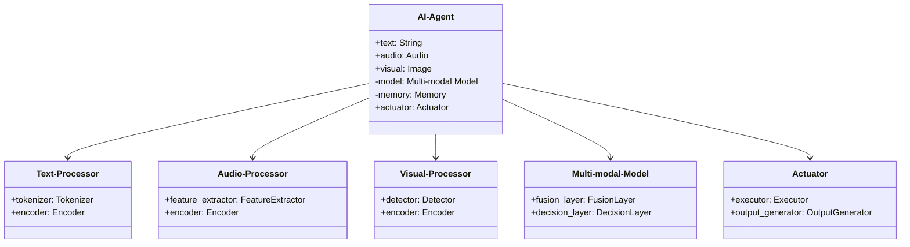
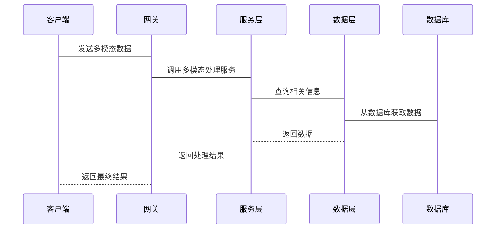

                 


# AI Agent的多模态交互：整合文本、语音和视觉

---

## 关键词：AI Agent、多模态交互、文本、语音、视觉、融合技术、算法原理

---

## 摘要：

AI Agent的多模态交互是指整合文本、语音和视觉等多种信息模式，以实现更智能、更自然的人机交互。本文从AI Agent的基本概念出发，详细探讨了多模态交互的核心技术，包括文本、语音和视觉数据的处理与融合方法，分析了多模态交互的算法原理和系统架构设计。通过实际案例的分析，展示了多模态交互技术在智能助手、机器人等场景中的应用，并总结了未来的发展方向和最佳实践。

---

# 第1章: 多模态交互的背景与意义

## 1.1 多模态交互的背景

### 1.1.1 人工智能的发展历程

人工智能（Artificial Intelligence，AI）的发展可以追溯到20世纪50年代。从早期的基于规则的专家系统到现在的深度学习和大语言模型，AI技术经历了多次变革。随着计算能力的提升和数据量的爆炸式增长，AI技术逐渐从单一模态（如文本或图像）处理扩展到多模态处理。

### 1.1.2 多模态交互的兴起

在AI技术发展的过程中，单一模态处理的局限性逐渐显现。例如，仅依赖文本的智能助手在处理复杂问题时显得力不从心。多模态交互的兴起，源于对更自然、更智能人机交互的需求。通过整合文本、语音和视觉等多种信息，AI Agent能够更好地理解和响应用户的意图。

### 1.1.3 AI Agent在多模态交互中的作用

AI Agent（智能体）是多模态交互的核心。它通过整合多种模态的数据，能够更全面地理解用户的需求，并以更自然的方式进行反馈。例如，在智能客服场景中，AI Agent可以通过语音识别用户的意图，同时结合用户的表情和肢体语言（视觉信息）来提供更个性化的服务。

---

## 1.2 多模态交互的核心概念

### 1.2.1 多模态交互的定义

多模态交互是指通过整合多种信息模式（如文本、语音、视觉等）进行人机交互的过程。与单一模态交互相比，多模态交互能够提供更丰富的信息和更自然的用户体验。

### 1.2.2 多模态交互的特点

| 特性 | 描述 |
|------|------|
| 多样性 | 支持多种信息模式的输入和输出 |
| 融合性 | 各模态数据相互关联，共同作用 |
| 实时性 | 支持实时交互，反馈速度快 |
| 智能性 | 通过多模态数据的融合，实现更智能的决策 |

### 1.2.3 多模态交互的应用场景

多模态交互技术广泛应用于多个领域：

1. **智能助手**：如 Siri、Alexa 等，通过语音和文本交互提供服务。
2. **机器人**：如工业机器人和家庭服务机器人，结合视觉和语音进行人机交互。
3. **医疗健康**：通过视觉和语音数据辅助医生进行诊断。
4. **教育**：通过多模态数据提供个性化的学习体验。

---

## 1.3 多模态交互的整合技术

### 1.3.1 文本、语音和视觉的整合

多模态交互的核心在于如何有效地整合不同模态的数据。例如，当用户通过语音提问时，AI Agent可以通过语音识别获取文本信息，同时结合用户的表情（视觉信息）来判断用户的情感状态。

### 1.3.2 多模态数据的融合方式

多模态数据的融合方式可以分为以下几种：

1. **早期融合**：在数据预处理阶段进行融合。
2. **晚期融合**：在特征提取阶段进行融合。
3. **混合融合**：结合早期和晚期融合的优点。

### 1.3.3 多模态交互的挑战与解决方案

#### 挑战

1. **数据异构性**：不同模态的数据格式和特征维度差异大。
2. **计算复杂度**：多模态数据的处理需要更高的计算资源。
3. **模型设计**：如何设计能够有效融合多模态数据的模型是一个难点。

#### 解决方案

1. **跨模态对齐**：通过技术手段将不同模态的数据对齐，例如通过时间同步或空间对齐。
2. **深度学习模型**：利用深度学习模型（如Transformer）进行多模态数据的融合。
3. **多模态注意力机制**：通过注意力机制，动态调整不同模态数据的重要性。

---

# 第2章: AI Agent的基本原理

## 2.1 AI Agent的定义与分类

### 2.1.1 AI Agent的定义

AI Agent 是一种智能实体，能够感知环境、自主决策并执行任务。它可以是一个软件程序，也可以是一个物理设备（如机器人）。

### 2.1.2 AI Agent的分类

AI Agent可以根据智能水平分为以下几类：

1. **反应式AI Agent**：基于当前感知做出反应，没有内部状态。
2. **认知式AI Agent**：具有复杂推理和规划能力，能够处理复杂任务。
3. **混合式AI Agent**：结合反应式和认知式的特点，适用于多种场景。

### 2.1.3 AI Agent的核心特征

| 特性 | 描述 |
|------|------|
| 感知能力 | 能够感知环境中的多种信息 |
| 决策能力 | 能够根据感知信息做出决策 |
| 执行能力 | 能够执行决策任务 |
| 学习能力 | 能够通过经验改进性能 |

---

## 2.2 多模态交互的实现机制

### 2.2.1 多模态数据的采集与预处理

#### 文本数据的采集与预处理

文本数据可以通过用户输入或语音识别生成。预处理步骤包括分词、去除停用词和词干提取。

#### 语音数据的采集与预处理

语音数据可以通过麦克风采集。预处理步骤包括降噪、分割和特征提取（如MFCC）。

#### 视觉数据的采集与预处理

视觉数据可以通过摄像头采集。预处理步骤包括图像增强、目标检测和特征提取（如CNN）。

### 2.2.2 多模态数据的融合方法

#### 基于模态权重的融合

通过给每个模态分配权重，将多个模态的数据加权融合。

$$ y = \sum_{i=1}^{n} w_i x_i $$

其中，\( w_i \) 是第 \( i \) 个模态的权重，\( x_i \) 是第 \( i \) 个模态的数据。

#### 基于注意力机制的融合

通过注意力机制，动态调整不同模态数据的重要性。

$$ \alpha_i = \text{softmax}(W a_i) $$

其中，\( \alpha_i \) 是第 \( i \) 个模态的注意力权重，\( a_i \) 是第 \( i \) 个模态的特征向量，\( W \) 是参数矩阵。

#### 基于多模态变换器的融合

通过多模态变换器模型，将多个模态的数据转换到同一个空间，然后进行融合。

---

## 2.3 多模态交互的数学模型

### 2.3.1 多模态数据的表示方法

#### 文本表示

文本可以表示为词向量或句子向量，例如使用BERT模型。

#### 语音表示

语音可以表示为频谱图或声学特征向量。

#### 视觉表示

视觉数据可以表示为图像特征向量，例如使用ResNet提取的特征。

### 2.3.2 多模态融合的数学模型

#### 多模态注意力模型

$$ \text{Attention}(Q, K, V) = \text{softmax}\left(\frac{QK^T}{\sqrt{d_k}}\right)V $$

其中，\( Q \) 是查询向量，\( K \) 是键向量，\( V \) 是值向量，\( d_k \) 是维度。

#### 多模态变换器模型

$$ \text{Transformer}(X) = \text{FFN}(\text{MultiHead}(X)) $$

其中，\( X \) 是输入数据，\( \text{MultiHead} \) 是多头注意力机制，\( \text{FFN} \) 是前馈神经网络。

---

## 2.4 本章小结

本章介绍了AI Agent的基本原理，包括其定义、分类和核心特征。同时，详细探讨了多模态交互的实现机制，包括数据的采集与预处理、融合方法和数学模型。这些内容为后续章节的深入分析奠定了基础。

---

# 第3章: 多模态交互的核心算法

## 3.1 多模态数据的表示与编码

### 3.1.1 文本的表示方法

文本可以通过词向量、句子向量或上下文表示进行编码。例如，使用BERT模型进行文本编码。

### 3.1.2 语音的表示方法

语音可以通过MFCC特征或谱图表示进行编码。例如，使用Mel-Frequency Cepstral Coefficients（MFCC）提取语音特征。

### 3.1.3 视觉的表示方法

视觉数据可以通过卷积神经网络（CNN）提取图像特征。例如，使用ResNet提取图像的深层特征。

---

## 3.2 多模态数据的融合算法

### 3.2.1 基于注意力机制的融合

通过注意力机制，动态调整不同模态数据的重要性。例如，使用多模态注意力网络进行融合。

### 3.2.2 基于变换器的融合

通过多模态变换器模型，将多个模态的数据转换到同一个空间，然后进行融合。例如，使用多模态Transformer进行跨模态推理。

### 3.2.3 基于图神经网络的融合

通过图神经网络，将多模态数据建模为图结构，然后进行融合。例如，使用图注意力网络进行多模态数据的融合。

---

## 3.3 多模态交互的决策算法

### 3.3.1 基于强化学习的决策

通过强化学习算法，训练AI Agent在多模态交互中的决策策略。例如，使用Policy Gradient方法进行决策优化。

### 3.3.2 基于生成模型的决策

通过生成模型（如GPT）生成多模态的交互响应。例如，使用生成对抗网络（GAN）进行多模态数据的生成。

### 3.3.3 基于规则的决策

通过预定义的规则，指导AI Agent的决策过程。例如，基于特定的业务规则进行决策。

---

## 3.4 本章小结

本章详细介绍了多模态交互的核心算法，包括数据表示、融合方法和决策算法。这些算法为AI Agent的多模态交互提供了技术支撑。

---

# 第4章: 系统分析与架构设计

## 4.1 系统功能设计

### 4.1.1 领域模型设计

通过Mermaid类图展示系统的功能模块关系。



### 4.1.2 系统架构设计

通过Mermaid架构图展示系统的整体架构。


### 4.1.3 系统接口设计

通过Mermaid序列图展示系统接口的交互流程。



---

## 4.2 系统交互设计

通过Mermaid序列图展示系统各部分的交互流程。

---

## 4.3 本章小结

本章详细分析了多模态交互系统的功能设计、架构设计和交互设计，为后续的实现提供了理论基础。

---

# 第5章: 项目实战

## 5.1 环境配置

### 5.1.1 安装Python和相关库

```bash
pip install numpy pandas torch transformers
```

### 5.1.2 安装深度学习框架

```bash
pip install tensorflow keras
```

### 5.1.3 安装语音处理库

```bash
pip install librosa pydub
```

### 5.1.4 安装图像处理库

```bash
pip install opencv-python pillow
```

---

## 5.2 核心代码实现

### 5.2.1 文本处理代码

```python
import torch
from transformers import BertTokenizer, BertModel

tokenizer = BertTokenizer.from_pretrained('bert-base-uncased')
model = BertModel.from_pretrained('bert-base-uncased')

def process_text(text):
    inputs = tokenizer(text, return_tensors='pt')
    outputs = model(**inputs)
    return outputs.last_hidden_state
```

### 5.2.2 语音处理代码

```python
import librosa

def process_audio(audio_path):
    audio, sr = librosa.load(audio_path, sr=16000)
    mfccs = librosa.feature.mfcc(y=audio, sr=sr, n_mfcc=13)
    return mfccs
```

### 5.2.3 视觉处理代码

```python
import cv2

def process_image(image_path):
    img = cv2.imread(image_path)
    img_resized = cv2.resize(img, (224, 224))
    return img_resized
```

### 5.2.4 多模态融合代码

```python
import torch
import torch.nn as nn

class MultiModalFusion(nn.Module):
    def __init__(self, input_size, hidden_size):
        super().__init__()
        self.fc = nn.Linear(input_size, hidden_size)
        self.relu = nn.ReLU()
        self.dropout = nn.Dropout(0.5)
    
    def forward(self, x):
        x = self.fc(x)
        x = self.relu(x)
        x = self.dropout(x)
        return x
```

---

## 5.3 功能测试与优化

### 5.3.1 功能测试

编写测试用例，验证各模态数据的处理和融合功能。

### 5.3.2 性能优化

通过调整模型参数和优化算法，提升系统的运行效率。

---

## 5.4 案例分析与总结

### 5.4.1 实际案例分析

通过实际案例，分析多模态交互技术的应用效果。

### 5.4.2 项目小结

总结项目实现的经验和教训，提出改进建议。

---

# 第6章: 总结与展望

## 6.1 总结

本文系统地介绍了AI Agent的多模态交互技术，包括核心概念、算法原理和系统设计。通过实际案例的分析，展示了多模态交互技术的应用潜力。

## 6.2 未来展望

未来，多模态交互技术将在更多领域得到应用。例如，随着5G和物联网技术的发展，多模态交互将更加普及。同时，如何进一步提升多模态数据的融合效率和准确性，是未来研究的重点方向。

---

## 作者：AI天才研究院/AI Genius Institute & 禅与计算机程序设计艺术 /Zen And The Art of Computer Programming

---

通过本文的详细讲解，读者可以全面了解AI Agent的多模态交互技术，并能够在实际项目中应用这些技术。

