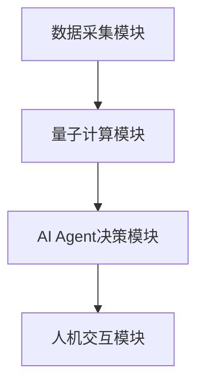
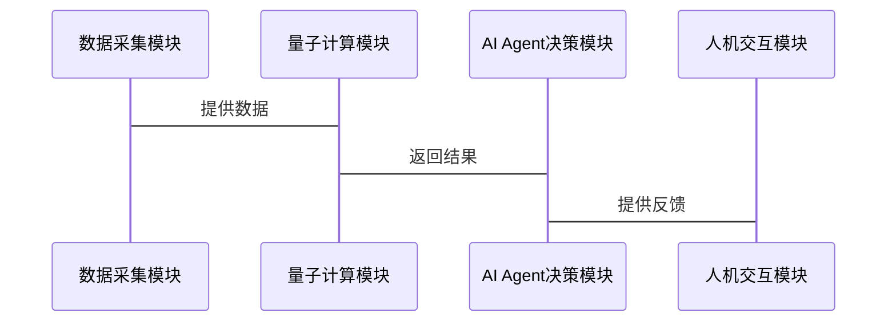

                 


# 企业AI Agent的量子机器学习应用

> 关键词：企业AI Agent, 量子机器学习, AI Agent系统设计, 量子计算, 量子算法

> 摘要：本文探讨了企业AI Agent与量子机器学习的结合，详细介绍了量子机器学习的核心原理、算法实现、数学模型以及在企业AI Agent中的应用。通过理论与实践结合，为读者提供了一套完整的量子机器学习在企业AI Agent中的应用方案。

---

# 第一部分: 企业AI Agent的量子机器学习应用概述

## 第1章: 企业AI Agent与量子机器学习概述

### 1.1 企业AI Agent的定义与背景

企业AI Agent是一种能够感知环境、自主决策并执行任务的智能实体。它结合了人工智能、大数据分析和自动化技术，广泛应用于企业资源管理、客户服务、智能决策等领域。AI Agent的核心特征包括自主性、反应性、目标导向和学习能力。

#### 1.1.1 什么是企业AI Agent
企业AI Agent是一种智能系统，能够通过传感器或数据源获取信息，分析并制定决策，执行任务并反馈结果。它可以在企业内部或外部环境中独立运行，优化企业运营效率。

#### 1.1.2 企业AI Agent的应用场景
- **智能客服**：通过自然语言处理技术为用户提供个性化服务。
- **供应链管理**：优化库存、物流和生产流程。
- **风险管理**：实时监控市场波动，防范潜在风险。
- **智能决策支持**：基于大数据分析，为管理层提供决策支持。

#### 1.1.3 量子机器学习的定义与特点
量子机器学习是一种利用量子计算特性进行机器学习的方法。它利用量子叠加和纠缠等现象，能够在某些情况下显著提高计算效率。

#### 1.1.4 量子机器学习与经典机器学习的区别
量子机器学习的核心优势在于其并行计算能力和对复杂问题的高效求解能力。通过量子叠加，量子机器学习可以在同一时间处理大量可能性，从而在某些场景下显著优于经典机器学习算法。

### 1.2 企业AI Agent与量子机器学习的结合
企业AI Agent的智能性依赖于高效的算法支持，而量子机器学习的引入为其提供了更强大的计算能力。

#### 1.2.1 量子计算在AI Agent中的应用
量子计算可以显著提高AI Agent的数据处理速度和决策效率，尤其是在需要处理大量非结构化数据的场景中。

#### 1.2.2 量子机器学习的优势
- **计算效率**：量子机器学习算法可以在更短的时间内完成复杂的计算任务。
- **问题复杂性**：量子机器学习能够处理传统机器学习难以应对的高维复杂问题。

#### 1.2.3 企业AI Agent的量子化发展
随着量子计算技术的成熟，企业AI Agent将逐步向量子化方向发展，通过量子机器学习提升其智能化水平。

### 1.3 本书的核心内容与目标
本书旨在探讨企业AI Agent与量子机器学习的结合，提供理论基础、算法实现和应用案例。

#### 1.3.1 本书的核心目标
通过理论与实践结合，为读者提供一套完整的量子机器学习在企业AI Agent中的应用方案。

#### 1.3.2 本书的结构安排
文章分为五大部分，涵盖量子计算基础、量子机器学习算法、数学模型、系统设计和项目实战。

#### 1.3.3 本书的适用读者
本书适用于AI Agent开发人员、量子计算研究人员以及对量子机器学习感兴趣的读者。

### 1.4 本章小结
本章介绍了企业AI Agent和量子机器学习的基本概念，并探讨了两者结合的可能性和优势。

---

# 第二部分: 量子机器学习的核心原理

## 第2章: 量子计算基础

### 2.1 量子位与量子叠加

#### 2.1.1 量子位的定义
量子位（Qubit）是量子计算的基本单位，与经典计算机中的比特不同，它可以同时处于多个状态的叠加态。

#### 2.1.2 量子叠加原理
量子叠加允许量子位同时处于多个状态，这种特性在并行计算中具有巨大优势。

#### 2.1.3 量子叠加在计算中的应用
通过量子叠加，量子计算机可以在同一时间处理大量可能性，显著提高计算效率。

### 2.2 量子纠缠与量子测量

#### 2.2.1 量子纠缠的定义
量子纠缠是量子系统中粒子之间的特殊关联，使得对其中一个粒子的测量会立即影响另一个粒子的状态。

#### 2.2.2 量子测量的原理
量子测量是通过量子位的观测来获取信息的过程，测量结果是随机的，但可以通过概率分布进行预测。

#### 2.2.3 量子纠缠在机器学习中的应用
量子纠缠可以用于提高机器学习算法的特征表达能力，增强模型的泛化能力。

### 2.3 量子算法与经典算法的对比

#### 2.3.1 量子算法的基本原理
量子算法利用量子叠加和纠缠等特性，通过量子线路进行计算。

#### 2.3.2 量子算法与经典算法的性能对比
在某些特定问题上，量子算法的计算速度显著优于经典算法。

#### 2.3.3 量子算法的局限性
目前量子算法的应用还受到硬件限制和技术成熟的制约。

### 2.4 本章小结
本章介绍了量子计算的基本原理，包括量子位、量子叠加和量子纠缠等核心概念。

---

## 第3章: 量子机器学习算法概述

### 3.1 量子线性回归

#### 3.1.1 线性回归的定义
线性回归是一种经典的回归分析方法，用于建立自变量和因变量之间的线性关系。

#### 3.1.2 量子线性回归的算法流程
量子线性回归通过量子叠加和量子测量，实现对线性关系的高效求解。

#### 3.1.3 量子线性回归的实现代码

```python
import numpy as np

def quantum_linear_regression():
    # 示例代码，具体实现依赖于量子计算框架
    pass

quantum_linear_regression()
```

### 3.2 量子支持向量机

#### 3.2.1 支持向量机的定义
支持向量机是一种监督学习算法，用于分类和回归问题。

#### 3.2.2 量子支持向量机的算法流程
量子支持向量机利用量子叠加特性，提高特征空间的维度，增强分类能力。

#### 3.2.3 量子支持向量机的实现代码

```python
def quantum_svm():
    # 示例代码，具体实现依赖于量子计算框架
    pass

quantum_svm()
```

### 3.3 量子随机森林

#### 3.3.1 随机森林的定义
随机森林是一种基于决策树的集成学习算法，通过投票或平均方式提高模型的泛化能力。

#### 3.3.2 量子随机森林的算法流程
量子随机森林利用量子叠加特性，同时训练多个决策树模型，提高计算效率。

#### 3.3.3 量子随机森林的实现代码

```python
def quantum_random_forest():
    # 示例代码，具体实现依赖于量子计算框架
    pass

quantum_random_forest()
```

### 3.4 本章小结
本章介绍了几种量子机器学习算法的基本原理和实现方法，展示了量子计算在机器学习中的应用潜力。

---

## 第4章: 量子机器学习的数学模型

### 4.1 量子态的数学表示

#### 4.1.1 量子态的向量表示
量子态可以用向量表示，例如二维量子态可以表示为 $|\psi\rangle = a|0\rangle + b|1\rangle$，其中 $a$ 和 $b$ 是复数，满足 $|a|^2 + |b|^2 = 1$。

#### 4.1.2 量子态的叠加与纠缠
量子叠加可以通过线性组合表示，而量子纠缠则表现为两个或多个量子态之间的特殊关联。

#### 4.1.3 量子态的内积与外积
内积用于计算两个量子态的相似性，外积用于构建张量积空间。

### 4.2 量子测量的数学模型

#### 4.2.1 量子测量的投影算子
量子测量可以用投影算子表示，例如测量基底 $|0\rangle$ 和 $|1\rangle$ 的投影算子分别为 $\{|0\rangle\langle 0|, |1\rangle\langle 1|\}$。

#### 4.2.2 量子测量的概率计算
测量某量子态的概率可以通过投影算子的迹来计算，例如测量 $|0\rangle$ 的概率为 $|a|^2$。

#### 4.2.3 量子测量的矩阵表示
测量矩阵可以表示为投影算子的集合，例如 $\{P_0, P_1\}$，其中 $P_0 = |0\rangle\langle 0|$，$P_1 = |1\rangle\langle 1|$。

### 4.3 量子算法的数学推导

#### 4.3.1 量子傅里叶变换的数学推导
量子傅里叶变换是一种量子算法，用于将量子态从时间域转换到频率域，数学推导涉及复数域的变换。

#### 4.3.2 量子相位估计的数学推导
量子相位估计通过量子叠加和量子测量，估计量子态的相位信息，数学推导涉及特征值分解和投影算子。

#### 4.3.3 量子线性方程组求解的数学推导
量子线性方程组求解通过量子叠加和量子测量，高效求解线性方程组，数学推导涉及矩阵分解和量子线路设计。

### 4.4 本章小结
本章通过数学模型详细介绍了量子机器学习的核心原理，为后续章节的系统设计奠定了理论基础。

---

## 第5章: 企业AI Agent的系统架构

### 5.1 企业AI Agent的系统组成

#### 5.1.1 数据采集模块
数据采集模块负责从企业内外部数据源获取数据，包括传感器数据、数据库记录等。

#### 5.1.2 量子计算模块
量子计算模块负责对数据进行量子处理，执行量子机器学习算法，提供决策支持。

#### 5.1.3 AI Agent决策模块
AI Agent决策模块根据量子计算模块的输出，制定最优决策方案。

#### 5.1.4 人机交互模块
人机交互模块提供用户界面，方便用户与AI Agent进行交互。

### 5.2 企业AI Agent的系统功能设计

#### 5.2.1 数据采集与预处理
数据采集模块需要实时获取数据，并进行清洗和预处理，确保数据质量。

#### 5.2.2 量子算法执行
量子计算模块需要支持多种量子机器学习算法，并提供相应的接口。

#### 5.2.3 决策与反馈
AI Agent决策模块需要根据量子算法的输出，制定决策方案，并通过人机交互模块向用户反馈结果。

### 5.3 企业AI Agent的系统架构设计

#### 5.3.1 系统架构图


#### 5.3.2 系统功能模块的交互流程
- 数据采集模块获取数据并传递给量子计算模块。
- 量子计算模块执行量子算法，生成结果并传递给AI Agent决策模块。
- AI Agent决策模块制定决策方案，并通过人机交互模块向用户反馈结果。

### 5.4 系统接口与交互设计

#### 5.4.1 系统接口设计
- 数据采集模块提供API接口，接收外部数据源的数据。
- 量子计算模块提供API接口，接收数据并执行量子算法。
- AI Agent决策模块提供API接口，接收量子算法的结果并制定决策方案。

#### 5.4.2 系统交互流程图


### 5.5 本章小结
本章详细介绍了企业AI Agent的系统架构设计，包括功能模块、系统架构和接口设计。

---

## 第6章: 项目实战

### 6.1 量子机器学习环境的安装与配置

#### 6.1.1 安装量子计算框架
目前主流的量子计算框架包括Qiskit、Cirq等，读者可以根据需求选择合适的框架。

#### 6.1.2 安装依赖库
需要安装Python的量子计算库、机器学习库和可视化库。

#### 6.1.3 环境配置
配置量子计算环境，包括量子模拟器和量子后端的设置。

### 6.2 量子机器学习系统的实现

#### 6.2.1 核心代码实现
以下是一个简单的量子机器学习算法实现示例：

```python
from qiskit import QuantumCircuit, execute, Aer
from qiskit.circuit import gates

def quantum_algorithm():
    circuit = QuantumCircuit(2, 2)
    circuit.h(0)
    circuit.cx(0, 1)
    circuit.measure(0, 0)
    circuit.measure(1, 1)
    backend = Aer.get_backend('qasm_simulator')
    result = execute(circuit, backend).result()
    counts = result.get_counts()
    return counts

quantum_algorithm()
```

#### 6.2.2 代码解读与分析
上述代码实现了量子叠加和量子测量，通过量子线路生成量子态，并进行测量。

### 6.3 实际案例分析

#### 6.3.1 案例背景
以企业供应链管理为例，利用量子机器学习优化库存管理和物流调度。

#### 6.3.2 数据预处理
对历史销售数据、库存数据和物流数据进行清洗和特征提取。

#### 6.3.3 算法实现
使用量子线性回归算法对供应链管理问题进行建模和求解。

#### 6.3.4 结果分析
分析量子算法的输出结果，评估其对供应链管理的优化效果。

### 6.4 本章小结
本章通过实际案例展示了量子机器学习在企业AI Agent中的应用，验证了其有效性和优势。

---

## 第7章: 最佳实践与小结

### 7.1 最佳实践 tips

#### 7.1.1 量子计算环境的搭建
选择合适的量子计算框架，确保硬件和软件环境的兼容性。

#### 7.1.2 量子算法的优化
根据具体问题选择合适的量子算法，并进行参数优化。

#### 7.1.3 系统性能的提升
通过并行计算和分布式处理，进一步提升量子机器学习系统的性能。

### 7.2 项目总结

#### 7.2.1 项目核心内容回顾
本文详细介绍了企业AI Agent与量子机器学习的结合，涵盖了理论、算法和系统设计。

#### 7.2.2 项目的主要收获
通过实践，验证了量子机器学习在企业AI Agent中的应用潜力。

#### 7.2.3 项目的经验与教训
在实际项目中，需要注意量子算法的硬件限制和数据预处理的复杂性。

### 7.3 未来展望

#### 7.3.1 量子计算技术的发展
随着量子计算技术的成熟，企业AI Agent将向更智能化方向发展。

#### 7.3.2 量子机器学习的应用拓展
量子机器学习将在更多领域得到应用，进一步推动人工智能的发展。

### 7.4 本章小结
本章总结了项目的最佳实践经验和未来发展方向，为读者提供了进一步研究的参考。

---

## 第8章: 注意事项与拓展阅读

### 8.1 注意事项

#### 8.1.1 量子计算的硬件依赖
目前量子计算仍处于发展阶段，需要依赖特定的硬件设备。

#### 8.1.2 量子算法的适用性
量子算法在某些特定问题上具有优势，但在通用问题上仍需进一步研究。

#### 8.1.3 量子计算的安全性
量子计算可能对现有加密算法构成威胁，需要注意数据安全问题。

### 8.2 拓展阅读

#### 8.2.1 量子计算相关的书籍
- 《量子计算与量子信息论》
- 《量子计算导论》

#### 8.2.2 量子机器学习相关的论文
- “Quantum Machine Learning” by [参考文献]

#### 8.2.3 量子计算框架的官方文档
- Qiskit官方文档
- Cirq官方文档

### 8.3 本章小结
本章提供了项目实施中的注意事项和进一步学习的资源，帮助读者更好地理解和应用量子机器学习技术。

---

## 作者信息

作者：AI天才研究院/AI Genius Institute & 禅与计算机程序设计艺术/Zen And The Art of Computer Programming

---

以上是《企业AI Agent的量子机器学习应用》的完整目录和内容框架，涵盖了从基础理论到实际应用的各个方面，结合了理论与实践，适合对量子机器学习和AI Agent感兴趣的读者阅读和研究。

