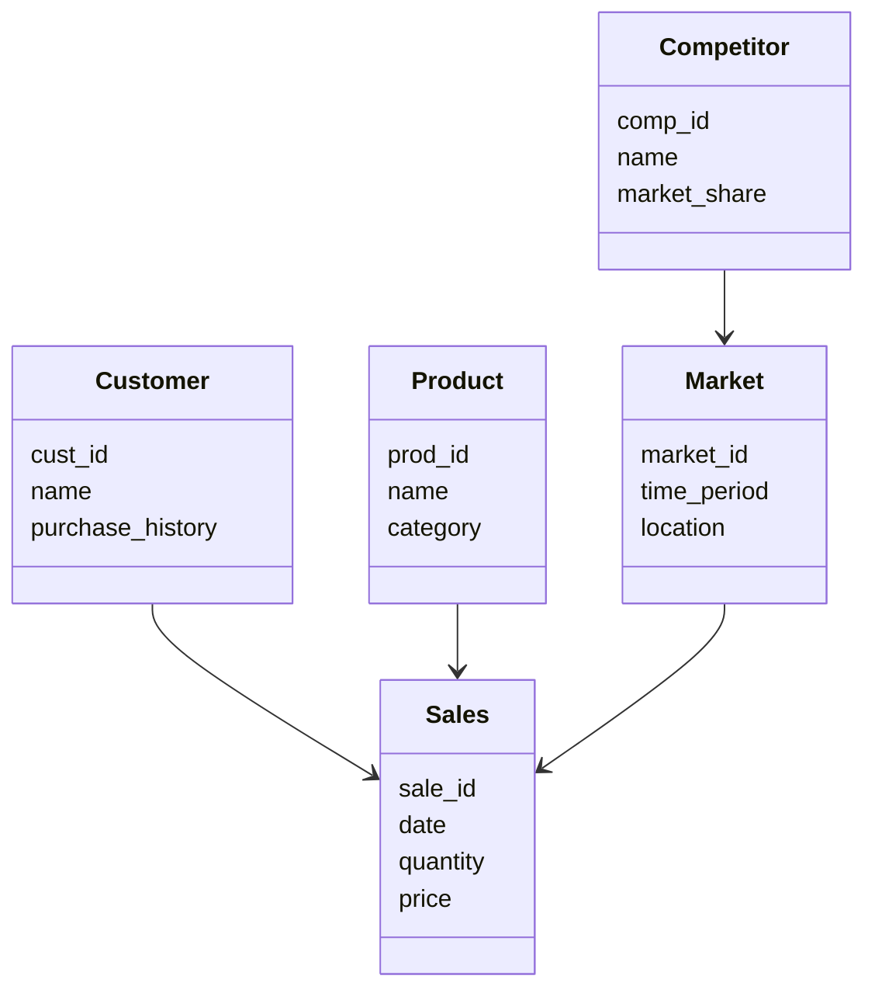
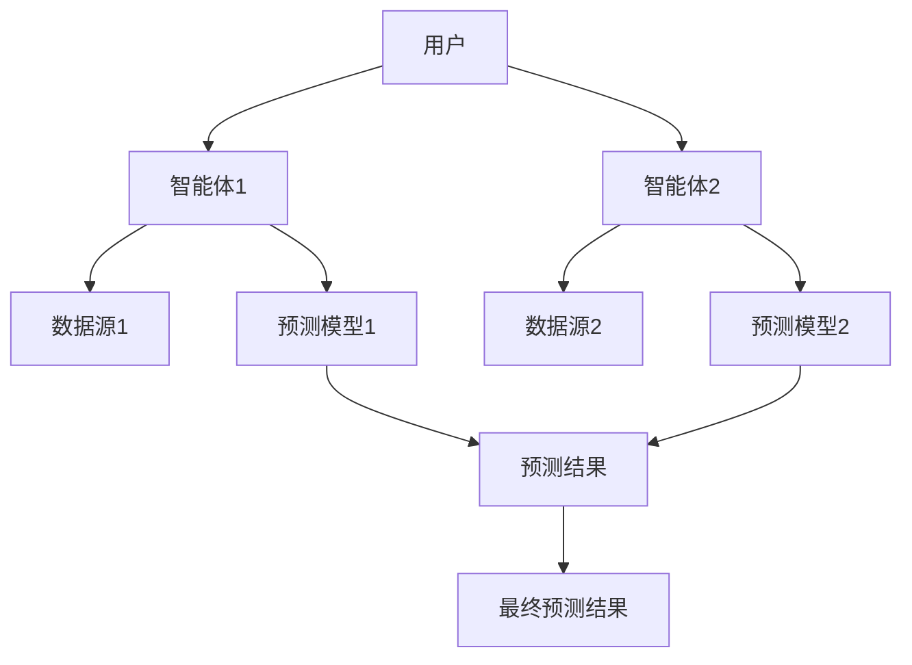
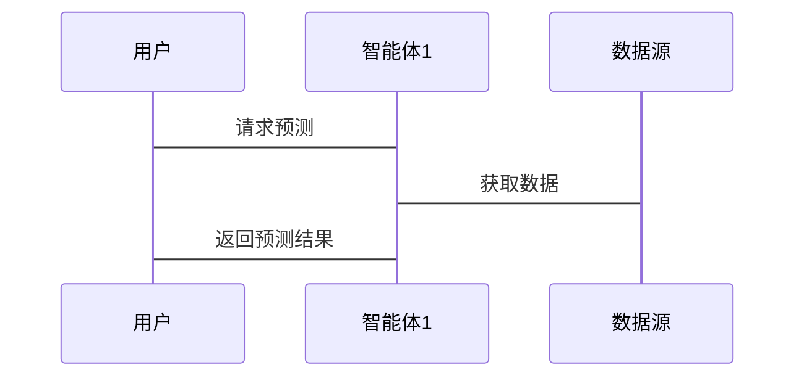

                 


# 利用多智能体AI实现动态市场份额预测

## 关键词
多智能体AI, 动态市场份额预测, 协同学习, 强化学习, 注意力机制, 系统架构

## 摘要
本文探讨了利用多智能体AI技术进行动态市场份额预测的方法，从背景介绍到系统架构设计，结合实际案例分析，详细阐述了多智能体协同学习、强化学习和注意力机制在动态市场环境中的应用。通过系统化的方法，本文旨在为读者提供一个全面的技术视角，帮助他们在实际应用中更好地理解和运用多智能体AI技术进行市场份额预测。

---

# 第一部分: 背景介绍

# 第1章: 动态市场份额预测的背景与挑战

## 1.1 多智能体AI的定义与特点
### 1.1.1 多智能体系统的定义
多智能体系统（Multi-Agent System, MAS）是由多个智能体组成的系统，这些智能体能够通过协作和竞争共同完成任务。每个智能体都有自己的目标、知识和行为规则，能够自主决策并与其他智能体进行通信和协作。

### 1.1.2 多智能体的核心特点
1. **自主性**：智能体能够自主决策，无需外部干预。
2. **反应性**：智能体能够根据环境变化实时调整行为。
3. **协作性**：多个智能体能够通过协作完成复杂任务。
4. **分布式性**：智能体之间通过分布式通信进行协作。

### 1.1.3 多智能体与传统AI的区别
传统AI通常基于单一智能体，而多智能体系统通过多个智能体的协作实现更复杂的任务。多智能体系统能够更好地应对动态环境和复杂问题。

## 1.2 动态市场份额预测的背景
### 1.2.1 市场份额预测的重要性
市场份额预测是企业制定战略决策的重要依据，能够帮助企业预测市场趋势、优化资源分配和制定竞争策略。

### 1.2.2 动态市场的特点
动态市场环境复杂多变，受多种因素影响，如市场需求变化、竞争格局调整和政策变化等。传统的市场份额预测方法难以应对这种动态变化。

### 1.2.3 传统市场份额预测的局限性
1. **静态模型**：传统方法通常基于静态数据，难以捕捉市场动态变化。
2. **单一视角**：传统模型缺乏多智能体协同的视角，难以全面考虑市场中的多因素影响。

## 1.3 多智能体AI在市场份额预测中的应用
### 1.3.1 多智能体AI的优势
多智能体AI能够通过多个智能体的协作，更好地捕捉市场动态，提供更准确的预测结果。

### 1.3.2 多智能体AI在动态市场中的应用案例
例如，在电商平台上，多个智能体可以分别负责价格监控、竞争对手分析和用户行为预测，通过协作提供更精准的市场份额预测。

### 1.3.3 多智能体AI的未来发展趋势
随着AI技术的不断发展，多智能体系统将更加智能化和协作化，能够更好地应对复杂的动态市场环境。

## 1.4 本章小结
本章介绍了多智能体AI的定义、特点以及在动态市场份额预测中的应用，指出了传统方法的局限性和多智能体AI的优势，为后续章节奠定了基础。

---

# 第二部分: 核心概念与联系

# 第2章: 多智能体系统与动态市场份额预测的核心概念

## 2.1 多智能体系统的原理
### 2.1.1 多智能体系统的组成
多智能体系统由多个智能体、通信机制、协作机制和环境组成，各部分协同工作以完成任务。

### 2.1.2 多智能体系统的通信机制
智能体之间通过消息传递进行通信，消息内容包括状态、意图和行动等。

### 2.1.3 多智能体系统的协作机制
协作机制包括协商、协调和分配任务，确保智能体之间能够有效协作。

## 2.2 动态市场份额预测的原理
### 2.2.1 动态市场的特征
市场环境复杂多变，需要实时捕捉市场变化，动态调整预测模型。

### 2.2.2 多智能体协作预测的核心流程
1. 数据采集：智能体从不同数据源获取市场信息。
2. 数据分析：智能体分别分析数据，提取特征。
3. 协作预测：智能体通过协作生成预测结果。
4. 结果优化：通过优化算法提升预测准确性。

### 2.2.3 多智能体系统与动态市场份额预测的关系
多智能体系统通过协作机制，能够更准确地预测市场份额变化，适应动态市场环境。

## 2.3 核心概念的对比分析
### 2.3.1 多智能体系统与传统市场份额预测的对比
| 对比维度 | 多智能体系统 | 传统方法 |
|----------|--------------|----------|
| 协作性   | 高           | 低       |
| 实时性   | 高           | 低       |
| 精准性   | 高           | 中       |

### 2.3.2 动态市场份额预测的ER实体关系图
```mermaid
er
  title 动态市场份额预测的ER图
  Customer(cust_id, name, purchase_history)
  Product(prod_id, name, category)
  Market m(market_id, time_period, location)
  Sales(sale_id, date, quantity, price)
  Competitor(comp_id, name, market_share)
  Customer c -o Sales s
  Product p -o Sales s
  Market m -o Sales s
  Competitor c -o Market m
```

## 2.4 本章小结
本章详细阐述了多智能体系统的原理，分析了其与动态市场份额预测的关系，并通过对比和ER图展示了核心概念之间的联系。

---

# 第三部分: 算法原理

# 第3章: 多智能体协同学习与动态预测算法

## 3.1 协同学习算法
### 3.1.1 协同学习的基本原理
协同学习是一种多智能体协作机制，通过智能体之间的协作提高学习效果。

### 3.1.2 协同学习的流程
1. 数据采集：智能体从不同数据源获取数据。
2. 数据分析：每个智能体分别分析数据。
3. 协作学习：智能体通过协商生成共同的预测模型。
4. 模型优化：通过迭代优化模型参数。

### 3.1.3 协同学习的数学模型
$$
\text{预测结果} = \sum_{i=1}^{n} w_i \cdot x_i
$$
其中，\( w_i \) 是智能体 \( i \) 的权重，\( x_i \) 是智能体 \( i \) 的预测结果。

### 3.1.4 协同学习的案例分析
例如，在电商平台上，多个智能体分别负责用户行为分析、竞争对手分析和市场趋势预测，通过协作生成最终的市场份额预测结果。

## 3.2 强化学习算法
### 3.2.1 强化学习的基本原理
强化学习是一种基于奖励机制的学习方法，通过智能体与环境的互动获得奖励，优化决策策略。

### 3.2.2 强化学习的流程
1. 状态识别：智能体识别当前市场状态。
2. 行动选择：智能体选择行动以最大化奖励。
3. 状态转移：环境根据智能体的行动产生新的状态。
4. 奖励反馈：智能体根据奖励调整策略。

### 3.2.3 强化学习的数学模型
$$
Q(s, a) = Q(s, a) + \alpha \cdot [r + \max_{a'} Q(s', a') - Q(s, a)]
$$
其中，\( Q(s, a) \) 是状态 \( s \) 下行动 \( a \) 的价值，\( \alpha \) 是学习率，\( r \) 是奖励，\( s' \) 是新状态。

### 3.2.4 强化学习的案例分析
例如，在股票交易中，智能体通过强化学习优化买卖策略，实现动态市场份额预测。

## 3.3 注意力机制
### 3.3.1 注意力机制的基本原理
注意力机制是一种关注重要信息的机制，通过权重分配提高模型的预测准确性。

### 3.3.2 注意力机制的数学模型
$$
\text{权重} = \frac{\exp(\text{score})}{\sum_{i=1}^{n} \exp(\text{score}_i)}
$$
其中，\( \text{score}_i \) 是智能体 \( i \) 的预测分数。

### 3.3.3 注意力机制的案例分析
例如，在自然语言处理中，注意力机制用于动态权重分配，提高文本理解的准确性。

## 3.4 本章小结
本章详细讲解了多智能体协同学习、强化学习和注意力机制的算法原理，并通过案例分析展示了它们在动态市场份额预测中的应用。

---

# 第四部分: 系统分析与架构设计

# 第4章: 多智能体AI系统的架构设计

## 4.1 问题场景介绍
动态市场份额预测需要实时捕捉市场变化，通过多智能体协作生成预测结果。

## 4.2 系统功能设计
### 4.2.1 领域模型


### 4.2.2 系统架构设计


## 4.3 接口设计
### 4.3.1 系统接口
1. 数据接口：智能体与数据源之间的接口。
2. 通信接口：智能体之间的通信接口。
3. 预测接口：智能体与预测模型之间的接口。

### 4.3.2 接口交互


## 4.4 本章小结
本章通过领域模型和系统架构图，详细展示了多智能体AI系统的架构设计，为后续的实现提供了理论基础。

---

# 第五部分: 项目实战

# 第5章: 多智能体AI系统的实现

## 5.1 环境安装
### 5.1.1 系统环境
- Python 3.8+
- PyTorch 1.9+
- Transformers 4.12+

### 5.1.2 安装依赖
```bash
pip install torch transformers
```

## 5.2 核心代码实现
### 5.2.1 协同学习实现
```python
class Agent:
    def __init__(self, id):
        self.id = id
        self.data = []
    
    def collect_data(self, data):
        self.data.append(data)
    
    def predict(self, model):
        return model.predict(self.data)
```

### 5.2.2 强化学习实现
```python
class ReinforceAgent:
    def __init__(self, id):
        self.id = id
        self.state = None
        self.reward = 0
    
    def act(self, action):
        # 执行动作
        pass
    
    def receive_reward(self, reward):
        self.reward = reward
```

### 5.2.3 注意力机制实现
```python
import torch
class AttentionModel:
    def __init__(self, input_size):
        self.attention_weights = torch.randn(input_size, 1)
    
    def compute_attention(self, inputs):
        scores = torch.matmul(inputs, self.attention_weights)
        weights = torch.softmax(scores, dim=1)
        return weights
```

## 5.3 代码解读与分析
### 5.3.1 协同学习代码解读
- `Agent` 类负责数据收集和预测。
- `collect_data` 方法用于收集数据。
- `predict` 方法调用预测模型生成结果。

### 5.3.2 强化学习代码解读
- `ReinforceAgent` 类负责强化学习。
- `act` 方法执行动作。
- `receive_reward` 方法接收奖励并更新状态。

### 5.3.3 注意力机制代码解读
- `AttentionModel` 类负责注意力计算。
- `compute_attention` 方法计算注意力权重。
- `scores` 是输入与权重的点积结果。
- `weights` 是通过Softmax函数归一化的权重。

## 5.4 实际案例分析
### 5.4.1 数据准备
假设我们有多个智能体分别收集不同数据源的市场数据，如用户行为数据、竞争对手数据和市场趋势数据。

### 5.4.2 模型训练
通过协同学习和强化学习算法，训练模型以预测市场份额变化。

### 5.4.3 预测结果
最终的预测结果是多个智能体预测结果的加权平均值，权重通过注意力机制计算。

## 5.5 本章小结
本章通过实际代码实现，展示了多智能体AI系统的实现过程，包括协同学习、强化学习和注意力机制的具体实现。

---

# 第六部分: 最佳实践

# 第6章: 动态市场份额预测的最佳实践

## 6.1 小结
多智能体AI通过协同学习、强化学习和注意力机制，能够更准确地预测动态市场份额。

## 6.2 注意事项
1. 数据质量：确保数据的准确性和实时性。
2. 模型优化：通过不断优化算法提升预测精度。
3. 系统维护：定期更新模型和数据源，确保系统的稳定性和准确性。

## 6.3 拓展阅读
1. 多智能体系统相关书籍：《Multi-Agent Systems: Algorithmic, Complexity Theoretic, and Logical Foundations》。
2. 动态预测相关论文：《Dynamic Market Share Prediction Using Multi-Agent Reinforcement Learning》。

## 6.4 本章小结
本章总结了多智能体AI在动态市场份额预测中的应用，并提供了实际应用中的注意事项和拓展阅读资料。

---

# 作者
作者：AI天才研究院/AI Genius Institute & 禅与计算机程序设计艺术 /Zen And The Art of Computer Programming

