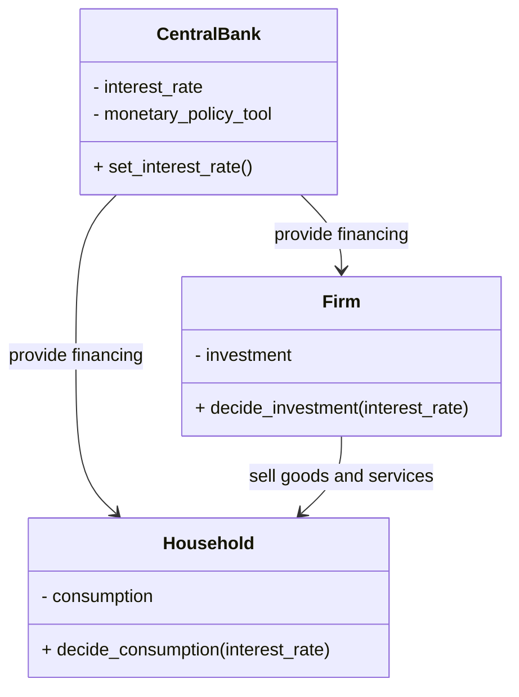
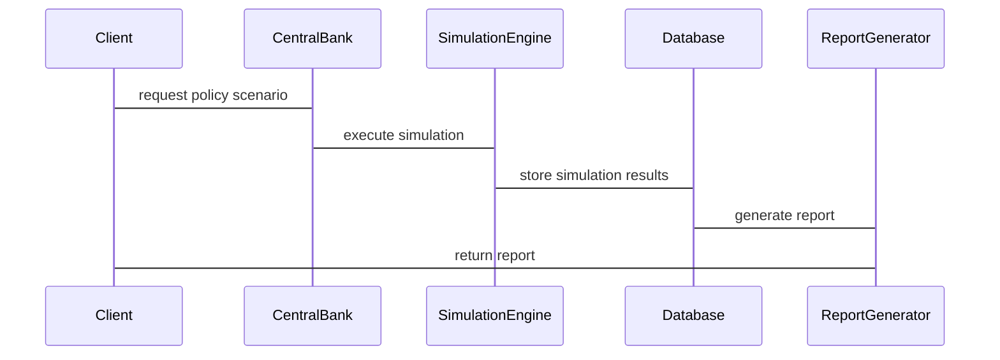

                 


# 利用多智能体系统模拟不同货币政策情景：评估宏观风险

## 关键词：多智能体系统, 宏观经济, 货币政策, 宏观风险, 人工智能模拟

## 摘要

在宏观经济分析中，货币政策的制定和实施往往面临高度复杂的环境，传统的单一主体分析方法难以全面捕捉系统性风险。多智能体系统（Multi-Agent System, MAS）作为一种新兴的计算范式，通过模拟多个具有自主决策能力的智能体之间的交互，能够更真实地反映经济系统中个体行为对整体经济的影响。本文将介绍如何利用多智能体系统模拟不同货币政策情景，分析其对宏观经济的影响，并评估潜在的宏观风险。通过构建一个多智能体模拟平台，本文将详细探讨货币政策在不同情景下的传导机制、风险传播路径以及风险缓解策略，为政策制定者和风险管理提供理论依据和实践指导。

---

## 第一部分：多智能体系统与货币政策模拟基础

### 第1章：宏观经济与货币政策概述

#### 1.1 宏观经济基础

##### 1.1.1 宏观经济的基本概念

宏观经济是研究整体经济体系运行规律的学科，关注的对象包括GDP、通货膨胀、失业率、利率、货币供应等宏观经济指标。宏观经济的核心在于理解经济系统中各个变量之间的相互关系，以及这些变量如何影响整体经济的运行状态。

##### 1.1.2 货币政策的目标与工具

货币政策是中央银行为了实现特定的经济目标（如控制通货膨胀、促进就业、维持经济增长等）而采取的调节货币供给和利率水平的政策工具。常用的货币政策工具包括公开市场操作、调整法定存款准备金率、调整再贴现率等。货币政策的目标是通过调节货币供应量和利率水平，影响企业和居民的借贷成本，进而影响投资、消费和整体经济活动。

##### 1.1.3 宏观经济中的不确定性与风险

宏观经济系统是一个高度动态和复杂的系统，充满了不确定性。政策制定者在制定货币政策时，需要面对不确定性带来的挑战，例如外部冲击、市场参与者的预期变化、政策滞后效应等。这些不确定性可能导致政策效果偏离预期，从而引发宏观风险，如系统性金融危机、通货膨胀失控等。

#### 1.2 货币政策的定义与作用

##### 1.2.1 货币政策的定义

货币政策是指中央银行通过调节货币供给量和利率水平，影响经济主体的借贷行为，进而调节社会总需求和总供给，实现经济稳定增长的目标。货币政策的核心在于通过调整货币政策工具，影响市场参与者的经济行为，从而实现宏观经济目标。

##### 1.2.2 货币政策的主要工具与手段

- **公开市场操作**：中央银行通过在公开市场上买卖政府债券，调节基础货币供应量，从而影响商业银行的准备金水平和市场利率。
- **法定存款准备金率**：中央银行通过调整商业银行必须持有的法定存款准备金比例，影响商业银行的信贷扩张能力。
- **再贴现率**：中央银行通过调整商业银行向中央银行借款时的利率，影响商业银行的成本和可获得资金数量。

##### 1.2.3 货币政策在宏观经济中的作用机制

货币政策的作用机制是通过影响市场参与者的借贷成本和可获得资金数量，进而影响投资、消费和整体经济活动。例如，降低利率可以降低企业和居民的借贷成本，刺激投资和消费，从而推动经济增长。相反，提高利率会增加借贷成本，抑制投资和消费，从而控制通货膨胀。

#### 1.3 宏观经济模型与政策模拟

##### 1.3.1 宏观经济模型的分类

宏观经济模型可以分为两类：**一般均衡模型**和**局部均衡模型**。一般均衡模型试图描述整个经济系统中所有市场和价格的相互作用，而局部均衡模型则关注单个市场或部分市场的均衡状态。

##### 1.3.2 宏观经济政策模拟的意义

政策模拟的核心目标是通过模拟不同政策情景下的经济表现，评估政策的效果，并为政策制定提供科学依据。传统的宏观经济模型通常假设市场参与者是理性的，且市场是完全竞争的，这种假设在实际经济中往往难以成立。因此，需要借助更加灵活和复杂的工具来模拟宏观经济政策的效果。

##### 1.3.3 多智能体系统在货币政策模拟中的应用

多智能体系统（MAS）是一种模拟多个具有自主决策能力的智能体之间交互的计算范式。在货币政策模拟中，可以将企业和居民视为具有自主决策能力的智能体，通过模拟它们在不同政策情景下的行为变化，评估政策效果。

---

### 第2章：多智能体系统基础

#### 2.1 多智能体系统概述

##### 2.1.1 多智能体系统的定义

多智能体系统（Multi-Agent System, MAS）是由多个具有自主决策能力的智能体组成的系统，这些智能体能够通过环境和与其它智能体的交互来感知世界并采取行动。MAS的核心特征是智能体之间的分布式决策和协作。

##### 2.1.2 多智能体系统的特征

- **自主性**：智能体能够自主决策，无需外部干预。
- **反应性**：智能体能够根据环境的变化调整自己的行为。
- **协作性**：智能体之间可以通过通信和协作实现共同目标。
- **分布式性**：智能体分布在整个系统中，不存在集中控制的中心。

##### 2.1.3 多智能体系统的优势与挑战

- **优势**：
  - 能够模拟复杂系统的动态行为。
  - 可以处理高度分布和异构的环境。
- **挑战**：
  - 系统的复杂性增加，导致设计和实现难度加大。
  - 智能体之间的通信和协作需要复杂的协议和机制。

#### 2.2 多智能体系统的组成部分

##### 2.2.1 智能体的定义与分类

- **定义**：智能体是一种能够感知环境、自主决策并采取行动的实体。
- **分类**：
  - **简单反应型智能体**：根据当前感知做出反应，不依赖历史信息。
  - **基于模型的反应型智能体**：利用内部状态和环境模型进行决策。
  - **目标驱动型智能体**：根据预设目标采取行动。
  - **效用驱动型智能体**：根据效用函数优化决策。

##### 2.2.2 智能体之间的交互与通信

智能体之间的交互和通信是多智能体系统的核心机制。智能体可以通过共享信息、协商达成一致或协作完成任务。通信机制可以是直接的点对点通信，也可以通过中间媒介进行。

##### 2.2.3 多智能体系统的架构设计

多智能体系统的架构设计决定了系统的行为方式和智能体之间的交互模式。常见的架构包括：

- **反应式架构**：基于当前感知做出反应。
- **规划式架构**：通过规划实现长期目标。
- **混合式架构**：结合反应式和规划式的特点。

#### 2.3 多智能体系统与货币政策模拟的结合

##### 2.3.1 多智能体系统在经济模拟中的应用

多智能体系统可以模拟经济系统中多个市场参与者的交互行为，例如企业、消费者、银行等。通过模拟这些主体的决策过程，可以更好地理解经济系统的动态行为。

##### 2.3.2 货币政策模拟中的多智能体系统优势

- **能够模拟个体行为对整体经济的影响**：传统的宏观经济模型通常假设市场参与者是理性的，且行为是同质的。多智能体系统能够模拟异质性个体的行为，从而更真实地反映经济系统的复杂性。
- **能够捕捉系统性风险**：通过模拟多个智能体之间的交互，可以发现系统性风险的传播路径和放大机制。

##### 2.3.3 多智能体系统在宏观风险管理中的作用

通过模拟不同政策情景下的经济表现，可以评估政策的效果，并预测潜在的风险。例如，可以通过模拟不同货币政策情景下的企业投资行为和居民消费行为，评估政策对经济增长和通货膨胀的影响。

---

## 第二部分：多智能体系统模拟货币政策的理论基础

### 第3章：多智能体系统模拟货币政策的核心概念

#### 3.1 宏观经济理论基础

##### 3.1.1 IS-LM模型

IS-LM模型是宏观经济学中经典的模型，用于分析产品市场和货币市场的均衡状态。IS曲线表示产品市场的均衡，LM曲线表示货币市场的均衡。两者的交点即为均衡利率和均衡产出。

##### 3.1.2 AD-AS模型

AD-AS模型用于分析总需求（AD）和总供给（AS）的动态关系。AD曲线表示在不同价格水平下，经济的总需求量；AS曲线表示在不同价格水平下，经济的总供给量。两者的交点即为均衡价格水平和均衡产出。

##### 3.1.3 货币政策传导机制

货币政策的传导机制通常包括以下几种渠道：

- **利率渠道**：货币政策通过影响市场利率，进而影响企业和居民的借贷成本，从而影响投资和消费。
- **资产价格渠道**：货币政策通过影响资产价格，进而影响财富效应和投资行为。
- **信贷渠道**：货币政策通过影响银行的信贷供给能力，进而影响企业的信贷可得性。

#### 3.2 多智能体系统模拟货币政策的理论框架

##### 3.2.1 多智能体系统的宏观经济模型构建

在构建多智能体系统的宏观经济模型时，需要明确以下几个方面：

- **智能体的类型**：例如，企业和居民可以分别作为不同的智能体类型。
- **智能体的决策规则**：例如，企业可以根据利率水平决定投资规模，居民可以根据利率水平决定消费和储蓄。
- **智能体之间的交互机制**：例如，企业可以向银行申请贷款，居民可以购买金融资产。

##### 3.2.2 货币政策在多智能体系统中的实现

货币政策在多智能体系统中的实现可以通过以下方式：

- **调整智能体的决策规则**：例如，中央银行可以通过调整利率水平，影响企业和居民的决策。
- **干预智能体之间的交互**：例如，中央银行可以通过调节信贷市场，影响企业和居民的信贷可得性。

##### 3.2.3 宏观经济风险的多智能体系统评估方法

通过模拟不同政策情景下的智能体行为，可以评估政策的效果和潜在风险。例如，可以通过模拟不同利率水平下的企业投资行为和居民消费行为，评估政策对经济增长和通货膨胀的影响。

#### 3.3 多智能体系统模拟货币政策的核心概念

##### 3.3.1 多智能体系统的宏观经济模拟

宏观经济模拟需要考虑多个智能体之间的交互行为，例如企业投资、居民消费、银行信贷等。

##### 3.3.2 货币政策在多智能体系统中的实现方式

货币政策在多智能体系统中的实现可以通过调整智能体的决策规则和交互机制来实现。

##### 3.3.3 宏观经济风险的多智能体系统评估方法

通过模拟不同政策情景下的智能体行为，可以评估政策的效果和潜在风险。

---

## 第三部分：多智能体系统模拟货币政策的实现

### 第4章：货币政策模拟的算法实现

#### 4.1 基于多智能体的货币政策模拟算法

##### 4.1.1 算法概述

货币政策模拟的算法需要考虑以下步骤：

1. **初始化智能体**：定义智能体的类型、属性和决策规则。
2. **设定政策情景**：例如，设定不同的利率水平和货币政策工具。
3. **模拟智能体行为**：根据智能体的决策规则和政策情景，模拟智能体的行为。
4. **评估政策效果**：通过分析模拟结果，评估政策的效果和潜在风险。

##### 4.1.2 算法实现步骤

1. **定义智能体类型**：例如，企业和居民。
2. **设定智能体属性**：例如，企业的投资函数和居民的消费函数。
3. **设定政策情景**：例如，设定不同的利率水平和货币政策工具。
4. **模拟智能体行为**：根据智能体的决策规则和政策情景，模拟智能体的行为。
5. **评估政策效果**：通过分析模拟结果，评估政策的效果和潜在风险。

##### 4.1.3 算法实现的数学模型

货币政策模拟的数学模型可以表示为以下形式：

$$
Y = C + I + G + X - M
$$

其中，Y为GDP，C为消费，I为投资，G为政府支出，X为出口，M为进口。

---

## 第五部分：多智能体系统模拟货币政策的系统设计

### 第5章：货币政策模拟系统的架构设计

#### 5.1 问题场景介绍

货币政策模拟系统的应用场景包括：

- 政策制定：帮助政策制定者评估不同货币政策的效果。
- 风险管理：帮助企业和居民识别和应对宏观风险。
- 教育与研究：用于教学和研究宏观经济政策的效果。

#### 5.2 系统功能设计

##### 5.2.1 领域模型

领域模型可以通过Mermaid类图表示，展示系统中不同智能体之间的关系。



##### 5.2.2 系统架构设计

系统架构可以通过Mermaid架构图表示，展示系统的主要模块和交互方式。


##### 5.2.3 系统接口设计

系统接口设计需要考虑以下方面：

- **输入接口**：允许用户输入政策情景和参数。
- **输出接口**：允许用户获取模拟结果和报告。

##### 5.2.4 系统交互设计

系统交互可以通过Mermaid序列图表示，展示系统中不同模块的交互流程。



---

## 第六部分：项目实战

### 第6章：货币政策模拟的项目实战

#### 6.1 环境安装

需要安装以下工具：

- Python
- Jupyter Notebook
- Matplotlib
- NetworkX

#### 6.2 系统核心实现

##### 6.2.1 核心代码实现

以下是货币政策模拟的核心代码实现：

```python
class CentralBank:
    def __init__(self):
        self.interest_rate = 0.05

    def set_interest_rate(self, rate):
        self.interest_rate = rate

class Firm:
    def __init__(self):
        self.investment = 0

    def decide_investment(self, interest_rate):
        if interest_rate < 0.05:
            self.investment = 100
        else:
            self.investment = 50

class Household:
    def __init__(self):
        self.consumption = 0

    def decide_consumption(self, interest_rate):
        if interest_rate < 0.05:
            self.consumption = 100
        else:
            self.consumption = 50

# 初始化智能体
central_bank = CentralBank()
firm = Firm()
household = Household()

# 设定政策情景
central_bank.set_interest_rate(0.03)

# 模拟智能体行为
firm.decide_investment(central_bank.interest_rate)
household.decide_consumption(central_bank.interest_rate)

# 输出结果
print("Interest rate:", central_bank.interest_rate)
print("Investment:", firm.investment)
print("Consumption:", household.consumption)
```

##### 6.2.2 代码实现的解读与分析

上述代码实现了一个简单的货币政策模拟系统，包括中央银行、企业和居民三个智能体。中央银行设定利率水平，企业和居民根据利率水平决定投资和消费。

##### 6.2.3 实际案例分析

通过模拟不同利率水平下的投资和消费行为，可以评估货币政策的效果。

##### 6.2.4 结果分析与总结

通过模拟结果，可以发现：

- 当利率水平低于5%时，企业和居民的投资和消费行为更为积极。
- 当利率水平高于5%时，企业和居民的投资和消费行为会受到抑制。

---

## 第七部分：总结与展望

### 第7章：总结与展望

#### 7.1 最佳实践 Tips

- 在设计多智能体系统时，需要充分考虑智能体的异质性。
- 在模拟货币政策效果时，需要结合实际情况调整智能体的决策规则。

#### 7.2 小结

通过利用多智能体系统模拟不同货币政策情景，可以更好地理解货币政策的传导机制和潜在风险。多智能体系统能够捕捉系统性风险的传播路径和放大机制，为政策制定者和风险管理提供科学依据。

#### 7.3 注意事项

- 需要充分验证智能体决策规则的合理性。
- 需要定期更新智能体的行为模型以反映实际情况。

#### 7.4 拓展阅读

- 建议进一步研究多智能体系统在其他宏观经济政策模拟中的应用。
- 建议进一步探讨如何通过多智能体系统模拟复杂金融市场的动态行为。

---

## 作者：AI天才研究院/AI Genius Institute & 禅与计算机程序设计艺术 /Zen And The Art of Computer Programming

