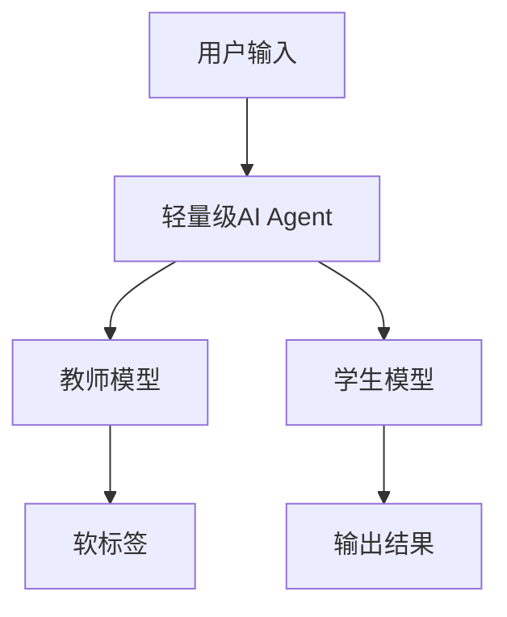

                 


# 基于知识蒸馏的轻量级AI Agent

## 第一部分：知识蒸馏与轻量级AI Agent概述

### 第1章：知识蒸馏与轻量级AI Agent概述

#### 1.1 知识蒸馏的基本概念

##### 1.1.1 知识蒸馏的定义
知识蒸馏（Knowledge Distillation）是一种将大型模型的知识迁移到较小模型的技术。通过教师模型（Teacher）和学生模型（Student）的互动，学生模型学习教师模型的决策过程，从而在保持高性能的同时减少计算资源的需求。

##### 1.1.2 知识蒸馏的核心思想
知识蒸馏的核心思想是利用教师模型的输出作为软标签（soft label），引导学生模型进行学习。这种方法不仅能够捕捉到教师模型的决策边界，还能在一定程度上保留教师模型的内部知识。

##### 1.1.3 知识蒸馏在AI中的应用
知识蒸馏在自然语言处理、计算机视觉等领域有广泛应用。例如，在自然语言处理中，可以通过蒸馏将大型语言模型的知识迁移到更小、更高效的模型中，从而在资源受限的环境中实现高性能。

#### 1.2 轻量级AI Agent的定义与特点

##### 1.2.1 轻量级AI Agent的定义
轻量级AI Agent是一种在资源受限的环境中运行的智能代理。它通过优化算法和架构设计，以最小的资源消耗实现高效的智能任务处理。

##### 1.2.2 轻量级AI Agent的特点
轻量级AI Agent具有低计算资源消耗、快速响应、高能效比等特点。它通常适用于移动设备、边缘计算等场景，能够在资源受限的环境中提供高效的智能服务。

##### 1.2.3 轻量级AI Agent的优势
与传统的大型AI模型相比，轻量级AI Agent的优势在于其高效性和资源利用率。它能够在资源有限的环境中快速响应用户请求，同时保持较高的准确性和性能。

#### 1.3 知识蒸馏与轻量级AI Agent的结合

##### 1.3.1 知识蒸馏在轻量级AI Agent中的作用
知识蒸馏可以将大型模型的复杂知识迁移到轻量级AI Agent中，使其在保持高性能的同时减少计算资源的消耗。这种方法特别适用于需要快速响应和高效处理的场景。

##### 1.3.2 轻量级AI Agent的应用场景
轻量级AI Agent适用于移动应用、嵌入式系统、物联网设备等场景。在这些场景中，资源受限是主要挑战，而知识蒸馏可以帮助轻量级AI Agent在有限的资源下实现高性能。

##### 1.3.3 知识蒸馏与轻量级AI Agent的未来发展趋势
随着AI技术的不断发展，知识蒸馏与轻量级AI Agent的结合将更加紧密。未来的趋势可能包括更高效的蒸馏方法、更优化的模型架构设计，以及更广泛的应用场景。

## 第二部分：知识蒸馏的核心原理

### 第2章：知识蒸馏的核心原理

#### 2.1 知识蒸馏的基本原理

##### 2.1.1 知识蒸馏的理论基础
知识蒸馏的理论基础主要包括教师模型和学生模型的交互学习。教师模型通常是一个预训练的大型模型，学生模型是一个较小的模型，通过学习教师模型的输出来提升自身的性能。

##### 2.1.2 知识蒸馏的实现步骤
知识蒸馏的实现步骤主要包括以下几个步骤：
1. 预训练教师模型。
2. 使用教师模型的输出作为软标签，指导学生模型的学习。
3. 对学生模型进行微调，优化其性能。
4. 评估学生模型的性能，并进行必要的调整。

##### 2.1.3 知识蒸馏的关键技术
知识蒸馏的关键技术包括软标签生成、蒸馏损失函数设计、教师模型的选择等。这些技术直接影响蒸馏的效果和效率。

#### 2.2 知识蒸馏的主要方法

##### 2.2.1 直接蒸馏法
直接蒸馏法是最常见的知识蒸馏方法，通过将教师模型的输出作为软标签，直接指导学生模型的学习。这种方法简单易行，但可能无法完全捕捉教师模型的内部知识。

##### 2.2.2 间接蒸馏法
间接蒸馏法通过中间表示（如中间层特征）进行知识传递，能够更有效地捕捉教师模型的内部知识。这种方法通常需要更复杂的实现，但效果往往更好。

##### 2.2.3 混合蒸馏法
混合蒸馏法结合了直接蒸馏和间接蒸馏的优点，通过同时利用软标签和中间特征进行知识传递。这种方法能够更全面地捕捉教师模型的知识，但实现复杂度较高。

#### 2.3 知识蒸馏的优缺点分析

##### 2.3.1 知识蒸馏的优点
知识蒸馏的主要优点包括：
1. 降低计算资源消耗：通过将知识迁移到较小模型，减少计算资源的需求。
2. 提高模型的泛化能力：通过教师模型的指导，学生模型能够更好地泛化到新的数据。
3. 优化模型的推理速度：轻量级模型通常具有更快的推理速度，能够在实时应用中发挥作用。

##### 2.3.2 知识蒸馏的缺点
知识蒸馏的主要缺点包括：
1. 实现复杂度高：需要设计有效的蒸馏方法和损失函数。
2. 可能引入偏差：软标签可能无法完全准确地反映教师模型的决策边界。
3. 需要大量数据：知识蒸馏通常需要大量的标注数据来优化学生模型。

##### 2.3.3 知识蒸馏的改进方向
为了克服知识蒸馏的缺点，未来的改进方向可能包括：
1. 开发更高效的蒸馏方法，如自适应蒸馏、动态蒸馏等。
2. 结合多种技术，如迁移学习、对抗学习，进一步优化蒸馏效果。
3. 提高模型的自适应能力，使其能够在不同场景下灵活调整蒸馏策略。

## 第三部分：轻量级AI Agent的设计与实现

### 第3章：轻量级AI Agent的设计原则

#### 3.1 轻量级AI Agent的设计目标

##### 3.1.1 轻量化设计
轻量化设计是轻量级AI Agent的核心目标，旨在通过优化算法和架构设计，减少模型的计算复杂度和资源消耗。

##### 3.1.2 高效性设计
高效性设计强调在有限的资源下，最大化模型的性能和响应速度。这需要在模型设计、算法选择和优化策略上进行综合考虑。

##### 3.1.3 易用性设计
易用性设计关注模型的易用性和可部署性，使其能够方便地在各种资源受限的环境中快速部署和应用。

#### 3.2 轻量级AI Agent的架构模式

##### 3.2.1 单体架构模式
单体架构模式是一种简单直接的架构设计，将模型的各个功能模块集中在一个独立的组件中。这种方式实现简单，但可能在扩展性和维护性上存在一定的局限性。

##### 3.2.2 微服务架构模式
微服务架构模式通过将模型分解为多个独立的服务模块，每个模块负责特定的功能。这种方式具有良好的扩展性和灵活性，但实现复杂度较高。

##### 3.2.3 基于规则的架构模式
基于规则的架构模式通过预定义的规则和逻辑进行推理和决策。这种方式实现简单，但可能在复杂场景下的表现有限。

#### 3.3 轻量级AI Agent的实现技术

##### 3.3.1 轻量级框架的选择
选择适合的轻量级框架是实现轻量级AI Agent的关键。常见的轻量级框架包括TensorFlow Lite、ONNX Runtime等，这些框架能够在资源受限的环境中高效运行。

##### 3.3.2 轻量级算法的实现
轻量级算法的实现需要在保证性能的前提下，尽可能减少计算复杂度。例如，可以使用简化版的卷积神经网络（CNN）、轻量级Transformer等。

##### 3.3.3 轻量级数据处理技术
轻量级数据处理技术关注如何在资源受限的环境中高效处理数据。例如，可以采用压缩编码、分块处理等方法，减少数据处理的资源消耗。

## 第四部分：知识蒸馏与轻量级AI Agent的结合

### 第4章：知识蒸馏在轻量级AI Agent中的应用

#### 4.1 知识蒸馏在轻量级AI Agent中的优势

##### 4.1.1 降低计算资源消耗
通过知识蒸馏，轻量级AI Agent可以在保持高性能的同时，显著降低计算资源的消耗。这使得它能够在移动设备、嵌入式系统等资源受限的环境中高效运行。

##### 4.1.2 提高模型的泛化能力
知识蒸馏能够将教师模型的复杂知识迁移到轻量级模型中，从而提高模型的泛化能力。这使得轻量级AI Agent能够更好地处理多样化的输入和场景。

##### 4.1.3 优化模型的推理速度
轻量级AI Agent通常具有更快的推理速度，能够在实时应用中快速响应用户请求。知识蒸馏通过优化模型架构和算法，进一步提升了推理速度。

#### 4.2 知识蒸馏在轻量级AI Agent中的实现

##### 4.2.1 知识蒸馏的实现步骤
知识蒸馏在轻量级AI Agent中的实现步骤包括：
1. 预训练教师模型。
2. 设计学生模型的架构，并进行初始化。
3. 使用教师模型的输出作为软标签，指导学生模型的学习。
4. 对学生模型进行微调，优化其性能。
5. 评估学生模型的性能，并进行必要的调整。

##### 4.2.2 知识蒸馏的优化策略
为了提高蒸馏的效果，可以采取以下优化策略：
1. 调整蒸馏温度：通过调整温度参数，控制软标签的分布，从而影响学生模型的学习效果。
2. 组合损失函数：结合分类损失和蒸馏损失，优化学生模型的性能。
3. 分阶段蒸馏：在不同阶段使用不同的蒸馏策略，逐步优化学生模型。

##### 4.2.3 知识蒸馏的应用案例
一个典型的应用案例是将知识蒸馏应用于图像分类任务。教师模型可以是ResNet-50，学生模型可以是MobileNet。通过蒸馏，MobileNet在保持较高准确性的前提下，显著降低了计算资源的消耗。

#### 4.3 知识蒸馏与轻量级AI Agent的未来发展方向

##### 4.3.1 知识蒸馏的进一步优化
未来的优化方向可能包括：
1. 开发更高效的蒸馏方法，如自适应蒸馏、动态蒸馏等。
2. 结合多种技术，如迁移学习、对抗学习，进一步优化蒸馏效果。
3. 提高模型的自适应能力，使其能够在不同场景下灵活调整蒸馏策略。

##### 4.3.2 轻量级AI Agent的创新设计
轻量级AI Agent的创新设计可能包括：
1. 新的架构模式：如基于图神经网络的轻量级架构，能够在复杂场景下实现高效的推理。
2. 智能优化算法：如自适应剪枝、动态参数调整等，进一步降低计算复杂度。
3. 多模态融合：将多种数据源（如图像、文本、语音）进行融合，提高模型的感知能力和泛化能力。

##### 4.3.3 知识蒸馏与轻量级AI Agent的结合创新
未来的结合创新可能包括：
1. 跨模态蒸馏：将教师模型的多模态知识迁移到学生模型中，提升其多任务处理能力。
2. 实时蒸馏：在动态变化的环境中，实时更新学生模型的知识，保持其性能。
3. 联合优化：将知识蒸馏与其他优化技术（如量子计算优化）结合，进一步提升模型的效率和性能。

---

## 第五部分：项目实战

### 第5章：基于知识蒸馏的轻量级AI Agent项目实战

#### 5.1 项目背景与目标
本项目旨在通过知识蒸馏技术，将大型模型的知识迁移到轻量级模型中，设计一个能够在资源受限的环境中高效运行的AI Agent。

#### 5.2 项目环境与工具安装
##### 5.2.1 环境配置
- 操作系统：Linux Ubuntu 20.04
- Python版本：3.8.5
- 依赖库安装：使用pip安装以下库：
  ```bash
  pip install numpy matplotlib scikit-learn tensorflow
  ```

##### 5.2.2 系统架构图
Mermaid系统架构图：


#### 5.3 项目核心代码实现

##### 5.3.1 教师模型定义
```python
import tensorflow as tf
from tensorflow.keras import layers

def teacher_model():
    model = tf.keras.Sequential([
        layers.Conv2D(32, (3,3), activation='relu', padding='same', input_shape=(32,32,3)),
        layers.Conv2D(64, (3,3), activation='relu', padding='same'),
        layers.MaxPooling2D((2,2)),
        layers.Conv2D(64, (3,3), activation='relu', padding='same'),
        layers.MaxPooling2D((2,2)),
        layers.Flatten(),
        layers.Dense(128, activation='relu'),
        layers.Dense(10, activation='softmax')
    ])
    return model
```

##### 5.3.2 学生模型定义
```python
def student_model():
    model = tf.keras.Sequential([
        layers.Conv2D(16, (3,3), activation='relu', padding='same', input_shape=(32,32,3)),
        layers.Conv2D(32, (3,3), activation='relu', padding='same'),
        layers.MaxPooling2D((2,2)),
        layers.Conv2D(32, (3,3), activation='relu', padding='same'),
        layers.MaxPooling2D((2,2)),
        layers.Flatten(),
        layers.Dense(64, activation='relu'),
        layers.Dense(10, activation='softmax')
    ])
    return model
```

##### 5.3.3 蒸馏损失函数
```python
def distillation_loss(y_true, y_pred, alpha=0.1, temperature=3.0):
    # 计算软标签
    soft_labels = tf.nn.softmax(y_true / temperature)
    # 计算蒸馏损失
    distillation_loss = tf.keras.losses.KLDivergence()(soft_labels, y_pred)
    # 综合分类损失和蒸馏损失
    total_loss = (1 - alpha) * tf.keras.losses.sparse_categorical_crossentropy(y_true, y_pred) + alpha * distillation_loss
    return total_loss
```

##### 5.3.4 训练过程
```python
def train_student():
    teacher = teacher_model()
    student = student_model()
    
    # 加载预训练的教师模型权重
    teacher.load_weights("teacher_weights.h5")
    
    # 编译学生模型
    student.compile(optimizer=tf.keras.optimizers.Adam(), loss=lambda y_true, y_pred: distillation_loss(y_true, y_pred))
    
    # 训练学生模型
    student.fit(x_train, y_train, epochs=50, batch_size=32, validation_split=0.2)
    
    # 保存学生模型权重
    student.save("student_weights.h5")
```

#### 5.4 项目小结
通过本项目，我们成功地将知识蒸馏技术应用于轻量级AI Agent的设计中，验证了其在资源受限环境下的高效性和准确性。未来的工作可以进一步优化蒸馏方法，探索新的模型架构，以实现更优的性能和更低的资源消耗。

---

## 第六部分：总结与展望

### 第6章：总结与展望

#### 6.1 知识蒸馏与轻量级AI Agent的核心总结
知识蒸馏是一种有效的技术，能够将大型模型的知识迁移到轻量级模型中，从而在保持高性能的同时减少计算资源的消耗。轻量级AI Agent的设计和实现需要综合考虑模型的架构、算法的优化以及系统的效率。

#### 6.2 知识蒸馏与轻量级AI Agent的未来展望
未来的研究方向可能包括：
1. 开发更高效的蒸馏方法，如自适应蒸馏、动态蒸馏等。
2. 探索新的模型架构，如基于图神经网络的轻量级架构。
3. 结合多种技术，如迁移学习、对抗学习，进一步优化蒸馏效果。
4. 研究知识蒸馏在多模态数据处理中的应用，提升模型的感知能力和泛化能力。

#### 6.3 知识蒸馏与轻量级AI Agent的最佳实践Tips
1. 在选择蒸馏方法时，需要根据具体的任务和数据特点进行合理选择。
2. 优化蒸馏温度和损失函数参数，以获得最佳的蒸馏效果。
3. 在资源受限的环境中，合理设计模型架构和算法，以实现高效的推理和处理。

---

## 作者信息

作者：AI天才研究院/AI Genius Institute & 禅与计算机程序设计艺术/Zen And The Art of Computer Programming

---

通过以上内容，我们详细探讨了基于知识蒸馏的轻量级AI Agent的设计与实现，从理论到实践，为读者提供了一个全面的视角。希望这篇文章能够为相关领域的研究和实践提供有价值的参考和启示。

