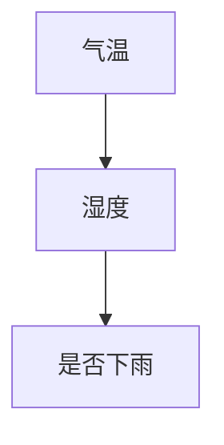
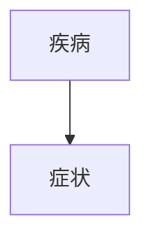
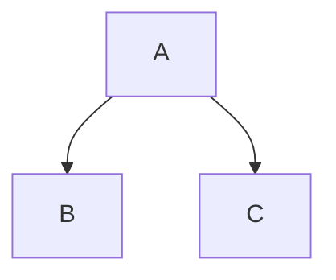
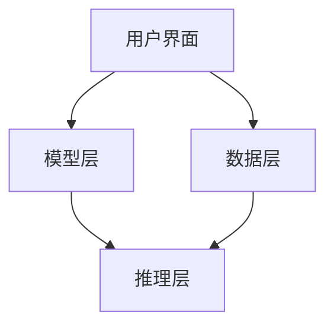
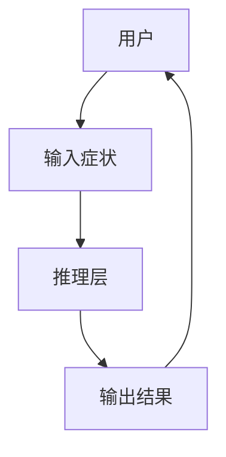

                 


# 基于贝叶斯方法的AI Agent不确定性处理

> 关键词：贝叶斯方法，AI Agent，不确定性处理，概率推理，机器学习

> 摘要：贝叶斯方法是一种强大的概率推理方法，广泛应用于AI Agent的不确定性处理中。本文将从贝叶斯方法的基本概念出发，深入探讨其在AI Agent中的应用，结合实际案例，详细讲解贝叶斯网络的构建、推理过程以及在系统中的应用，帮助读者掌握如何利用贝叶斯方法来解决AI Agent中的不确定性问题。

---

## 第一部分: 贝叶斯方法与AI Agent不确定性处理基础

### 第1章: 贝叶斯方法与AI Agent概述

#### 1.1 贝叶斯方法的基本概念

##### 1.1.1 贝叶斯定理的定义与公式

贝叶斯定理是概率论中的一个基本定理，用于计算在已知某些条件下事件发生的概率。其公式为：

$$P(A|B) = \frac{P(B|A) \cdot P(A)}{P(B)}$$

其中：
- $P(A|B)$ 表示在事件 $B$ 发生的条件下，事件 $A$ 发生的概率。
- $P(B|A)$ 表示在事件 $A$ 发生的条件下，事件 $B$ 发生的概率。
- $P(A)$ 和 $P(B)$ 分别表示事件 $A$ 和 $B$ 的先验概率。

##### 1.1.2 贝叶斯方法的核心思想

贝叶斯方法的核心思想是通过不断更新概率来反映数据对模型假设的支持程度。它将概率视为对未知事件的“信念”或“信任程度”，并根据新的数据或证据来更新这些概率。

##### 1.1.3 贝叶斯方法与频率学派的对比

贝叶斯方法与频率学派在概率解释上有显著差异：

| 对比维度 | 贝叶斯方法 | 频率学派 |
|----------|------------|----------|
| 概率含义 | 概率代表信念 | 概率代表频率 |
| 参数处理 | 参数为随机变量 | 参数为固定值 |
| 推理方式 | 主观推理 | 客观推理 |

#### 1.2 AI Agent的基本概念

##### 1.2.1 AI Agent的定义与分类

AI Agent（智能体）是指能够感知环境并采取行动以实现目标的实体。它可以分为以下几类：

1. **简单反射型Agent**：基于当前感知直接行动，不依赖内部状态。
2. **基于模型的反射型Agent**：利用内部模型和状态进行决策。
3. **目标驱动型Agent**：根据目标选择最优行动。
4. **效用驱动型Agent**：通过最大化效用函数来决策。

##### 1.2.2 AI Agent的核心功能与特点

AI Agent的核心功能包括：
- **感知环境**：通过传感器获取环境信息。
- **推理与决策**：基于感知信息进行推理并做出决策。
- **行动**：根据决策执行动作。

其特点包括：
- **自主性**：能够自主决策。
- **反应性**：能够实时响应环境变化。
- **学习能力**：能够通过经验优化性能。

##### 1.2.3 AI Agent与传统程序的区别

AI Agent与传统程序的主要区别如下：

| 对比维度 | AI Agent | 传统程序 |
|----------|-----------|----------|
| 智能性   | 高         | 低       |
| 自主性   | 高         | 低       |
| 学习能力 | 高         | 低       |
| 适应性   | 高         | 低       |

#### 1.3 贝叶斯方法在AI Agent中的应用

##### 1.3.1 贝叶斯网络在AI Agent中的作用

贝叶斯网络（Bayesian Network）是一种有向无环图（DAG），由节点和边组成，节点代表随机变量，边代表变量之间的依赖关系。它在AI Agent中的作用包括：
- **表示不确定性**：通过概率分布描述变量之间的关系。
- **推理与决策**：基于观测数据进行概率推理，辅助决策。

##### 1.3.2 贝叶斯方法处理不确定性的优势

贝叶斯方法在处理不确定性方面具有以下优势：
- **概率表示**：能够量化不确定性。
- **动态更新**：能够根据新证据动态更新概率。
- **可解释性**：推理过程直观，易于解释。

##### 1.3.3 贝叶斯方法在AI Agent中的典型应用场景

贝叶斯方法在AI Agent中的典型应用场景包括：
- **医疗诊断**：根据症状和检查结果推断疾病的可能性。
- **故障诊断**：根据故障症状和检测数据定位问题。
- **风险评估**：评估项目可能面临的风险并制定应对策略。

---

## 第二部分: 贝叶斯方法的核心原理

### 第2章: 贝叶斯方法的核心原理

#### 2.1 贝叶斯定理的数学推导

##### 2.1.1 条件概率的定义

条件概率 $P(A|B)$ 表示在 $B$ 发生的条件下，$A$ 发生的概率：

$$P(A|B) = \frac{P(A \cap B)}{P(B)}$$

##### 2.1.2 贝叶斯定理的公式推导

通过链式法则和条件概率公式，可以推导出贝叶斯定理：

$$P(A|B) = \frac{P(B|A) \cdot P(A)}{P(B)}$$

##### 2.1.3 贝叶斯定理的直观解释

贝叶斯定理通过先验概率 $P(A)$ 和似然度 $P(B|A)$ 计算后验概率 $P(A|B)$，反映了证据 $B$ 对假设 $A$ 的支持程度。

#### 2.2 贝叶斯网络的结构与属性

##### 2.2.1 贝叶斯网络的定义

贝叶斯网络是一种有向无环图（DAG），由节点（随机变量）和边（依赖关系）组成。

##### 2.2.2 贝叶斯网络的节点与边

- **节点**：代表随机变量。
- **边**：代表变量之间的依赖关系，从父节点指向子节点。

##### 2.2.3 贝叶斯网络的属性特征对比表

| 属性 | 定义 | 示例 |
|------|------|------|
| 节点 | 随机变量 | 气温、湿度、是否下雨 |
| 边   | 依赖关系 | 气温影响湿度 |

##### 2.2.4 贝叶斯网络的ER实体关系图



#### 2.3 贝叶斯方法的算法流程

##### 2.3.1 贝叶斯网络的构建流程

贝叶斯网络的构建流程包括以下几个步骤：

1. **确定变量**：明确问题中涉及的随机变量。
2. **确定关系**：分析变量之间的依赖关系。
3. **构建网络**：根据变量和关系构建DAG。
4. **定义概率**：为每个节点定义概率分布。

##### 2.3.2 贝叶斯网络的推理过程

贝叶斯推理的过程包括：
1. **计算后验概率**：基于观测数据计算后验概率。
2. **更新信念**：根据后验概率更新模型的信念。

##### 2.3.3 贝叶斯网络的训练与优化

贝叶斯网络的训练包括：
1. **参数学习**：估计网络中的参数。
2. **结构学习**：确定网络的结构。

---

## 第三部分: 贝叶斯方法在AI Agent中的算法实现

### 第3章: 贝叶斯方法在AI Agent中的算法实现

#### 3.1 贝叶斯网络的构建算法

##### 3.1.1 确定变量与关系

确定问题中的随机变量及其依赖关系，例如在医疗诊断中，症状和疾病之间的关系。

##### 3.1.2 构建概率分布表

为每个变量构建概率分布表，例如：

| 症状（S） | 患病（D） | P(S|D) |
|----------|-----------|--------|
| 是       | 是        | 0.8    |
| 否       | 是        | 0.2    |
| 是       | 否        | 0.1    |
| 否       | 否        | 0.9    |

##### 3.1.3 确定网络结构

根据变量和关系构建DAG，例如：



#### 3.2 贝叶斯网络的推理算法

##### 3.2.1 前向推理

前向推理是从已知变量开始，推导出其他变量的概率。例如，已知症状为“是”，推导出患病的概率。

##### 3.2.2 后向推理

后向推理是从目标变量开始，反向推导出相关变量的概率。例如，已知患病，推导出症状的概率。

##### 3.2.3 推理过程的优化

通过剪枝和合并概率分布等方法，优化推理过程的效率。

#### 3.3 贝叶斯网络的训练与优化

##### 3.3.1 参数学习方法

参数学习方法包括：
- **最大似然估计**：基于数据估计参数。
- **贝叶斯估计**：结合先验信息估计参数。

##### 3.3.2 结构学习方法

结构学习方法包括：
- **贪心搜索**：逐步优化网络结构。
- **马尔可夫链蒙特卡洛方法**：通过采样方法学习结构。

##### 3.3.3 贝叶斯网络的评估与优化

通过交叉验证和似然分数等指标，评估网络的性能并进行优化。

#### 3.4 本章小结

---

## 第四部分: 贝叶斯方法的数学模型与公式

### 第4章: 贝叶斯方法的数学模型与公式

#### 4.1 贝叶斯定理的数学公式

贝叶斯定理的公式为：

$$P(A|B) = \frac{P(B|A) \cdot P(A)}{P(B)}$$

其中：
- $P(A)$ 是 $A$ 的先验概率。
- $P(B|A)$ 是 $A$ 发生时 $B$ 发生的条件概率。
- $P(B)$ 是 $B$ 的全概率，可以通过全概率公式计算：

$$P(B) = \sum_{i} P(B|A_i) \cdot P(A_i)$$

#### 4.2 贝叶斯网络的数学模型

贝叶斯网络的数学模型由以下两部分组成：
1. **结构**：DAG的结构，定义变量之间的依赖关系。
2. **参数**：每个节点的条件概率分布。

例如，对于一个简单的贝叶斯网络，结构为：



其对应的条件概率分布可以表示为：

$$P(B|A) = 0.8, P(C|A) = 0.7$$

---

## 第五部分: 贝叶斯方法在AI Agent中的系统架构设计

### 第5章: 贝叶斯方法在AI Agent中的系统架构设计

#### 5.1 问题场景介绍

以医疗诊断为例，AI Agent需要根据患者的症状和检查结果，推断出可能的疾病。

#### 5.2 系统功能设计

系统功能设计包括：
- **症状输入**：用户输入症状信息。
- **概率推理**：基于贝叶斯网络计算疾病概率。
- **结果输出**：显示疾病概率和建议。

#### 5.3 系统架构设计

系统架构设计包括：
1. **数据层**：存储症状和疾病的数据。
2. **模型层**：构建贝叶斯网络模型。
3. **推理层**：执行概率推理。
4. **用户界面层**：展示结果。

系统架构图如下：



#### 5.4 系统接口设计

系统接口设计包括：
- **输入接口**：接收用户输入的症状。
- **输出接口**：显示疾病概率和建议。

#### 5.5 系统交互设计

系统交互设计包括：
1. 用户输入症状。
2. 系统调用贝叶斯网络进行推理。
3. 系统输出疾病概率和建议。

系统交互图如下：



---

## 第六部分: 贝叶斯方法的项目实战

### 第6章: 贝叶斯方法的项目实战

#### 6.1 项目环境安装

安装所需的库：

```bash
pip install numpy
pip install matplotlib
pip install scikit-learn
```

#### 6.2 项目核心实现

##### 6.2.1 症状输入

用户输入症状：

```python
symptoms = input("请输入症状：")
```

##### 6.2.2 贝叶斯网络构建

构建贝叶斯网络：

```python
import numpy as np

class BayesianNetwork:
    def __init__(self):
        self.network = {}
    
    def add_node(self, node, parents, CPT):
        self.network[node] = {'parents': parents, 'CPT': CPT}
    
    def get_probability(self, node, evidence):
        parents = self.network[node]['parents']
        CPT = self.network[node]['CPT']
        # 假设 evidence 是一个字典，键为父节点，值为布尔值
        if all(evidence.get(p, False) for p in parents):
            return CPT['True']
        else:
            return CPT['False']
```

##### 6.2.3 疾病诊断

调用贝叶斯网络进行推理：

```python
# 构建贝叶斯网络
network = BayesianNetwork()
network.add_node('疾病', ['症状'], {'True': 0.8, 'False': 0.2})
network.add_node('症状', [], {'True': 0.6, 'False': 0.4})

# 推理疾病概率
evidence = {'症状': True}
probability = network.get_probability('疾病', evidence)
print(f'疾病概率为：{probability}')
```

##### 6.2.4 结果展示

显示疾病概率和建议：

```python
print(f'疾病概率为：{probability}%')
print('建议：')
print('- 建议进一步检查')
print('- 如有严重症状，请立即就医')
```

#### 6.3 项目实战小结

---

## 第七部分: 总结与展望

### 第7章: 总结与展望

#### 7.1 本章小结

本文详细介绍了贝叶斯方法在AI Agent中的应用，包括贝叶斯定理的基本原理、贝叶斯网络的构建与推理、以及在实际项目中的应用。通过实际案例，展示了如何利用贝叶斯方法处理不确定性问题。

#### 7.2 未来研究方向

未来的研究方向包括：
1. **动态贝叶斯网络**：处理时序数据。
2. **贝叶斯强化学习**：结合强化学习提高决策能力。
3. **分布式贝叶斯推理**：在分布式系统中应用贝叶斯方法。

#### 7.3 注意事项与最佳实践

- **数据质量**：确保数据的准确性和完整性。
- **模型选择**：根据问题选择合适的贝叶斯网络结构。
- **性能优化**：通过剪枝和优化算法提高推理效率。

#### 7.4 拓展阅读

推荐阅读以下书籍和论文：
- 《Pattern Recognition and Machine Learning》
- 《Bayesian Reasoning and Machine Learning》

---

## 第八部分: 参考文献

- [1] Bishop, C. M. (2006). Pattern Recognition and Machine Learning.
- [2] Barber, D. (2012). Bayesian Reasoning and Machine Learning.
- [3] Koller, D., & Friedman, N. (2009). Probabilistic Graphical Models: Principles and Techniques.

---

## 作者：AI天才研究院/AI Genius Institute & 禅与计算机程序设计艺术 /Zen And The Art of Computer Programming

