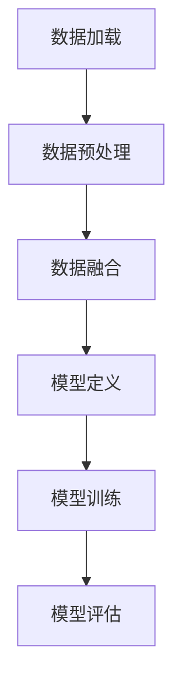
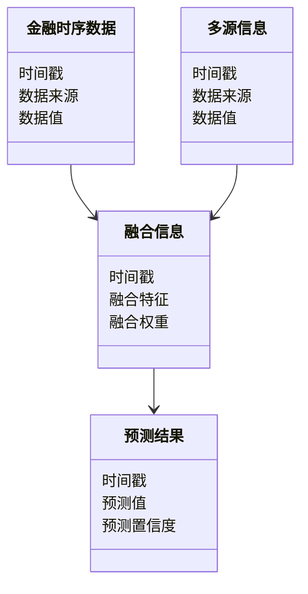
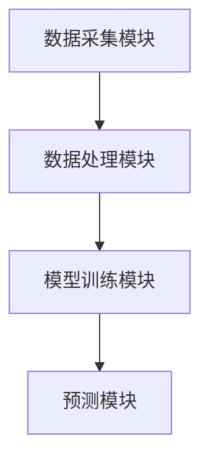

                 


# 开发智能化的金融时序数据多源信息融合预测模型

关键词：金融时序数据，多源信息融合，预测模型，深度学习，LSTM，时间序列分析

摘要：本文详细探讨了如何开发智能化的金融时序数据多源信息融合预测模型。通过分析金融时序数据的特点和多源信息融合的重要性，提出了一种基于深度学习的预测模型。该模型结合了LSTM网络和多源数据融合技术，能够有效捕捉金融数据的复杂模式和潜在关联。通过实际案例分析和系统实现，验证了该模型在金融预测中的有效性和优越性。

---

# 第1章: 金融时序数据与多源信息融合概述

## 1.1 金融时序数据的定义与特点

### 1.1.1 金融时序数据的定义
金融时序数据是指在金融市场上，随着时间推移而产生的各种数据，包括股票价格、汇率、利率、指数等。这些数据通常具有连续性、周期性和波动性的特点。

### 1.1.2 金融时序数据的核心特点
- **连续性**：数据随着时间的推移而连续变化。
- **周期性**：数据往往表现出明显的周期性波动，如日、周、月周期。
- **波动性**：金融市场的不确定性导致数据波动较大。
- **依赖性**：当前数据与过去数据密切相关。

### 1.1.3 金融时序数据的应用场景
- 股票价格预测
- 汇率预测
- 债券定价
- 风险评估
- 投资组合管理

## 1.2 多源信息融合的定义与特点

### 1.2.1 多源信息融合的定义
多源信息融合是指将来自不同数据源的信息进行整合，以提高信息的准确性和完整性。在金融领域，多源信息融合通常涉及将市场数据、新闻数据、经济指标等多种信息进行融合。

### 1.2.2 多源信息融合的核心特点
- **多样性**：数据来源多样，包括结构化数据和非结构化数据。
- **互补性**：不同数据源的信息可以相互补充，提高预测能力。
- **复杂性**：数据融合过程涉及复杂的计算和处理。

### 1.2.3 多源信息融合与单一数据源的区别
- 单一数据源：仅依赖一种数据进行分析，可能遗漏重要信息。
- 多源信息融合：结合多种数据源，提高预测的准确性和鲁棒性。

## 1.3 金融时序数据多源信息融合的背景与意义

### 1.3.1 金融时序数据多源信息融合的背景
随着金融市场的发展，数据来源日益多样化。投资者和机构需要从多个数据源获取信息，以做出更准确的决策。

### 1.3.2 金融时序数据多源信息融合的意义
- 提高预测模型的准确性和鲁棒性。
- 捕捉数据中的潜在关联，发现新的投资机会。
- 帮助机构做出更科学的决策。

### 1.3.3 金融时序数据多源信息融合的应用前景
- 个性化投资策略
- 风险预警系统
- 自动化交易

## 1.4 本章小结
本章介绍了金融时序数据和多源信息融合的基本概念和特点，并探讨了其在金融领域的应用前景。通过多源信息融合，可以显著提高金融预测模型的性能。

---

# 第2章: 金融时序数据多源信息融合的核心概念

## 2.1 核心概念与原理

### 2.1.1 数据预处理与特征提取
- 数据清洗：处理缺失值、异常值等。
- 特征提取：从原始数据中提取有用的特征，如均值、方差、自相关系数等。

### 2.1.2 多源数据融合方法
- 基于加权的融合方法：根据数据源的重要性进行加权融合。
- 基于模型的融合方法：通过模型（如LSTM）直接融合多源数据。

### 2.1.3 模型训练与优化
- 模型选择：选择适合的深度学习模型（如LSTM、GRU）。
- 模型优化：通过调整超参数（如学习率、批量大小）提高模型性能。

## 2.2 核心概念对比分析

### 2.2.1 数据预处理方法对比
| 方法         | 描述                                   |
|--------------|----------------------------------------|
| 数据清洗     | 处理缺失值和异常值                   |
| 特征提取     | 提取有用的特征，如均值、方差等         |

### 2.2.2 多源数据融合方法对比
| 方法         | 描述                                   |
|--------------|----------------------------------------|
| 基于加权的融合| 根据数据源的重要性进行加权           |
| 基于模型的融合| 通过模型直接融合多源数据             |

### 2.2.3 模型训练与优化方法对比
| 方法         | 描述                                   |
|--------------|----------------------------------------|
| 随机梯度下降  | 常用于训练深度学习模型                 |
| Adam优化器    | 收敛速度快，适合复杂模型               |

## 2.3 核心概念的ER实体关系图

```mermaid
er
    entity(金融时序数据) {
        id: int
        时间戳: datetime
        数据来源: string
        数据类型: string
        数据值: float
    }
    entity(多源信息) {
        id: int
        时间戳: datetime
        数据来源: string
        数据类型: string
        数据值: float
    }
    entity(融合信息) {
        id: int
        时间戳: datetime
        融合特征: float
        融合权重: float
    }
    entity(预测结果) {
        id: int
        时间戳: datetime
        预测值: float
        预测置信度: float
    }
```

## 2.4 本章小结
本章详细探讨了金融时序数据多源信息融合的核心概念，包括数据预处理、特征提取、多源数据融合方法以及模型训练与优化。

---

# 第3章: 金融时序数据多源信息融合预测模型的算法原理

## 3.1 算法原理概述

### 3.1.1 算法选择与优化
- 算法选择：选择LSTM网络作为模型基础。
- 算法优化：通过调整LSTM的隐藏层、门控机制等参数，优化模型性能。

### 3.1.2 算法流程
1. 数据预处理：清洗数据，提取特征。
2. 数据融合：将多源数据进行融合。
3. 模型训练：使用融合后的数据训练LSTM模型。
4. 模型预测：利用训练好的模型进行预测。

## 3.2 算法实现细节

### 3.2.1 LSTM网络结构
LSTM网络由输入门、遗忘门和输出门组成，能够有效捕捉时间序列数据的长-term依赖关系。

### 3.2.2 模型训练流程
1. 数据加载：加载多源数据。
2. 数据融合：将多源数据进行融合。
3. 模型定义：定义LSTM网络结构。
4. 模型训练：使用训练数据训练模型。
5. 模型评估：评估模型的性能。

### 3.2.3 模型训练代码示例
```python
import numpy as np
import pandas as pd
from keras.layers import LSTM, Dense, Dropout
from keras.models import Sequential

# 数据加载
data = pd.read_csv('financial_data.csv')

# 数据预处理
# 假设我们有多个数据源，如股票价格和新闻情感得分
# 这里简单地将两者进行拼接
merged_data = pd.merge(data['price'], data['sentiment'], on='time')

# 数据分割
train_data = merged_data.iloc[:800]
test_data = merged_data.iloc[800:]

# 数据标准化
from sklearn.preprocessing import MinMaxScaler
scaler = MinMaxScaler()
train_scaled = scaler.fit_transform(train_data)
test_scaled = scaler.transform(test_data)

# 数据转换为LSTM输入格式
def create_dataset(data, look_back=1):
    X, Y = [], []
    for i in range(len(data) - look_back):
        X.append(data[i:i+look_back])
        Y.append(data[i+look_back])
    return np.array(X), np.array(Y)

look_back = 5
X_train, Y_train = create_dataset(train_scaled, look_back)
X_test, Y_test = create_dataset(test_scaled, look_back)

# 模型定义
model = Sequential()
model.add(LSTM(50, input_shape=(look_back, 1)))
model.add(Dense(1))
model.compile(loss='mean_squared_error', optimizer='adam')

# 模型训练
model.fit(X_train, Y_train, epochs=100, batch_size=32, verbose=2)

# 模型预测
train_predict = model.predict(X_train)
test_predict = model.predict(X_test)

# 反标准化
train_predict = scaler.inverse_transform(train_predict)
test_predict = scaler.inverse_transform(test_predict)
```

### 3.2.4 模型评估
通过均方误差（MSE）和相关系数（R²）评估模型的性能。

### 3.2.5 模型训练过程的Mermaid流程图


## 3.3 本章小结
本章详细介绍了金融时序数据多源信息融合预测模型的算法原理，包括LSTM网络的结构、训练流程以及实现细节。

---

# 第4章: 金融时序数据多源信息融合预测模型的系统架构设计

## 4.1 系统功能设计

### 4.1.1 领域模型设计


### 4.1.2 系统功能模块
- 数据采集模块：从多个数据源采集金融数据。
- 数据处理模块：清洗和融合数据。
- 模型训练模块：训练预测模型。
- 预测模块：进行金融预测。

## 4.2 系统架构设计

### 4.2.1 系统架构图


### 4.2.2 系统交互流程
1. 数据采集模块从多个数据源采集数据。
2. 数据处理模块对数据进行清洗和融合。
3. 模型训练模块使用融合后的数据训练预测模型。
4. 预测模块利用训练好的模型进行金融预测。

## 4.3 系统接口设计

### 4.3.1 数据接口
- 数据输入接口：接收多源数据。
- 数据输出接口：输出融合后的数据。

### 4.3.2 模型接口
- 模型训练接口：接收训练数据，输出训练好的模型。
- 模型预测接口：接收输入数据，输出预测结果。

## 4.4 本章小结
本章详细描述了金融时序数据多源信息融合预测模型的系统架构设计，包括功能模块、系统架构图以及系统交互流程。

---

# 第5章: 金融时序数据多源信息融合预测模型的项目实战

## 5.1 项目背景与目标

### 5.1.1 项目背景
本项目旨在开发一个智能化的金融时序数据多源信息融合预测模型，用于股票价格预测。

### 5.1.2 项目目标
- 实现多源数据的融合。
- 开发基于LSTM的预测模型。
- 验证模型的预测能力。

## 5.2 项目实现

### 5.2.1 环境安装
- 安装Python环境。
- 安装必要的库（如Keras、TensorFlow、Pandas等）。

### 5.2.2 数据加载与预处理
```python
import pandas as pd
import numpy as np
from sklearn.preprocessing import MinMaxScaler

# 数据加载
data = pd.read_csv('financial_data.csv')

# 数据预处理
# 假设我们有多个数据源，如股票价格和新闻情感得分
merged_data = pd.merge(data['price'], data['sentiment'], on='time')

# 数据标准化
scaler = MinMaxScaler()
train_scaled = scaler.fit_transform(train_data)
test_scaled = scaler.transform(test_data)
```

### 5.2.3 模型定义与训练
```python
from keras.layers import LSTM, Dense, Dropout
from keras.models import Sequential

# 模型定义
model = Sequential()
model.add(LSTM(50, input_shape=(look_back, 1)))
model.add(Dense(1))
model.compile(loss='mean_squared_error', optimizer='adam')

# 模型训练
model.fit(X_train, Y_train, epochs=100, batch_size=32, verbose=2)
```

### 5.2.4 模型预测与评估
```python
# 模型预测
train_predict = model.predict(X_train)
test_predict = model.predict(X_test)

# 反标准化
train_predict = scaler.inverse_transform(train_predict)
test_predict = scaler.inverse_transform(test_predict)

# 模型评估
from sklearn.metrics import mean_squared_error, r2_score

mse_train = mean_squared_error(Y_train, train_predict)
r2_train = r2_score(Y_train, train_predict)
mse_test = mean_squared_error(Y_test, test_predict)
r2_test = r2_score(Y_test, test_predict)

print(f"训练集MSE: {mse_train}, R²: {r2_train}")
print(f"测试集MSE: {mse_test}, R²: {r2_test}")
```

## 5.3 项目小结
本章通过实际案例分析，详细展示了金融时序数据多源信息融合预测模型的开发过程，包括数据加载、预处理、模型定义与训练、预测与评估。

---

# 第6章: 金融时序数据多源信息融合预测模型的最佳实践

## 6.1 小结
本章总结了金融时序数据多源信息融合预测模型的核心概念和实现方法。

## 6.2 注意事项
- 数据预处理是关键，确保数据的准确性和完整性。
- 模型选择与优化直接影响预测性能。
- 模型评估时，需关注评估指标的合理性。

## 6.3 拓展阅读
- 《时间序列分析》
- 《深度学习实战》
- 《金融数据分析与建模》

## 6.4 本章小结
本章提供了金融时序数据多源信息融合预测模型的最佳实践，包括小结、注意事项和拓展阅读。

---

# 作者：AI天才研究院/AI Genius Institute & 禅与计算机程序设计艺术 /Zen And The Art of Computer Programming

