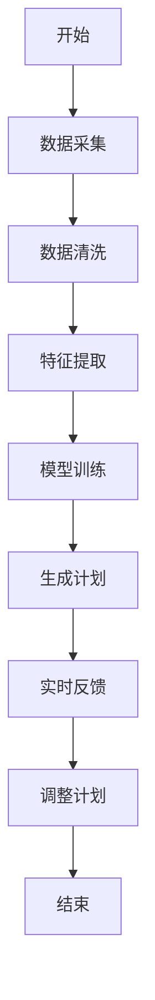
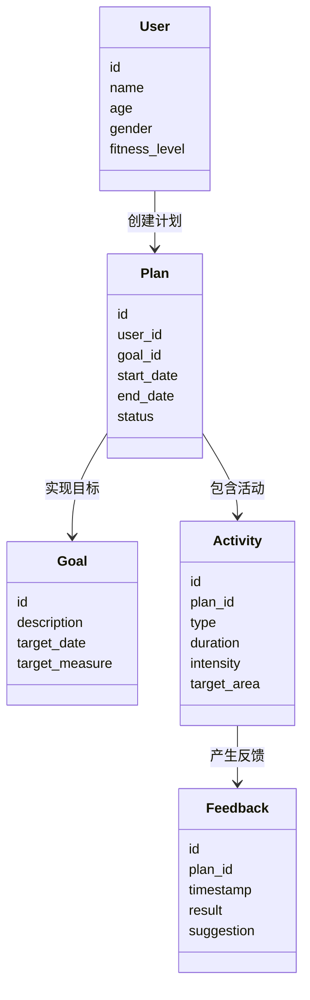
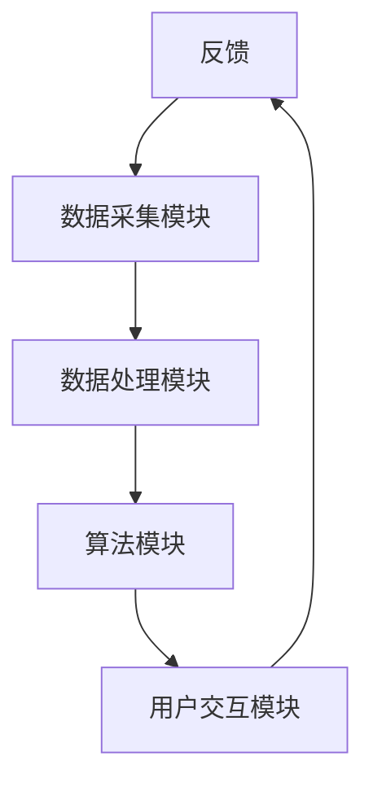
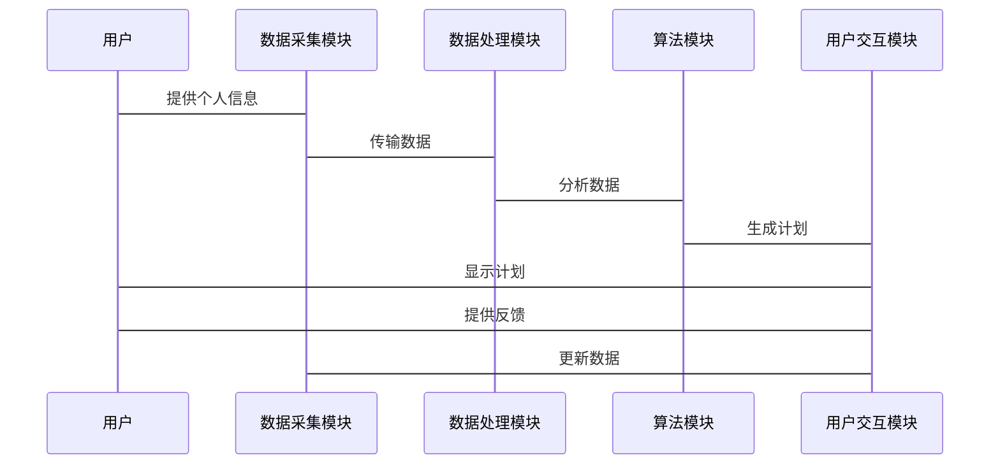

                 


# 智能健身：AI Agent的个性化训练计划

## 关键词：AI Agent，个性化训练，健身计划，机器学习，强化学习，自然语言处理

## 摘要：本文深入探讨了AI Agent在个性化健身训练中的应用，从背景介绍到算法实现，从系统架构到项目实战，全面解析了如何利用人工智能技术制定科学、高效的个性化训练计划。通过结合数据驱动和实时反馈，AI Agent能够根据用户的需求和反馈动态调整训练方案，显著提升健身效果和用户体验。

---

# 第一部分：背景与核心概念

## 第1章：背景介绍

### 1.1 问题背景

#### 1.1.1 传统健身计划的局限性
传统健身计划通常基于通用的健身指南，忽视了个体差异。不同用户的年龄、性别、体能水平、健康目标和生活习惯差异较大，导致统一的训练计划难以满足所有人的需求。此外，传统计划往往缺乏实时反馈和动态调整能力，难以适应用户在训练过程中的变化。

#### 1.1.2 个性化健身需求的兴起
随着人们对健康和健身的关注度不断提高，个性化健身需求逐渐兴起。用户期望获得量身定制的训练计划，以更高效地实现个人健身目标。个性化健身不仅能够提升训练效果，还能减少受伤风险，提高用户体验。

#### 1.1.3 AI技术在健身领域的应用潜力
人工智能技术的快速发展为个性化健身提供了新的可能性。通过机器学习、自然语言处理和强化学习等技术，AI Agent能够分析大量数据，理解用户需求，并动态调整训练计划。AI技术的引入使得健身计划更加智能化、个性化和高效。

### 1.2 问题描述

#### 1.2.1 个性化训练计划的核心要素
个性化训练计划需要考虑用户的基本信息（如年龄、性别、体能水平）、健康目标（如减脂、增肌、提高耐力）、可用时间、设备和偏好等因素。此外，计划还需要根据用户的实时反馈和训练数据进行调整。

#### 1.2.2 用户需求的多样性与复杂性
用户需求具有多样性和复杂性。例如，有些用户可能希望快速减脂，而另一些用户可能希望提高肌肉力量。不同用户的目标和限制条件不同，导致训练计划需要高度定制化。

#### 1.2.3 现有解决方案的不足与改进方向
现有的解决方案往往基于固定规则或经验，难以应对用户需求的变化。此外，传统方法缺乏实时反馈和动态调整能力，难以实现真正的个性化。

### 1.3 问题解决

#### 1.3.1 AI Agent在个性化训练中的作用
AI Agent能够通过数据采集、分析和处理，为用户提供个性化的训练建议。它能够根据用户的需求和反馈动态调整训练计划，确保计划的有效性和安全性。

#### 1.3.2 智能健身的核心理念与实现路径
智能健身的核心理念是以用户为中心，通过AI技术实现个性化的训练计划。其实现路径包括数据采集与分析、训练计划生成与优化、实时反馈与调整。

#### 1.3.3 技术与应用场景的结合
AI Agent与健身领域的结合可以通过智能设备、移动应用和在线平台实现。这些技术工具能够帮助用户便捷地获取个性化的训练建议，并实时跟踪训练效果。

### 1.4 边界与外延

#### 1.4.1 智能健身的适用范围与限制
智能健身适用于需要个性化训练的用户，如健身爱好者、运动员和康复患者。其限制包括数据采集的准确性、算法的泛化能力以及用户依从性等。

#### 1.4.2 与其他健康领域的关联
智能健身与健康管理、疾病预防等领域密切相关。例如，AI Agent可以根据用户的健康数据提供个性化的饮食建议和疾病预防方案。

#### 1.4.3 未来可能的发展方向
未来，智能健身可能与虚拟现实、增强现实等技术结合，提供更加沉浸式的训练体验。同时，AI Agent可能具备更强的自适应能力和学习能力，能够更好地应对复杂的用户需求。

### 1.5 概念结构与核心要素

#### 1.5.1 AI Agent的基本构成
AI Agent通常包括数据采集模块、数据处理模块、算法模块和用户交互模块。数据采集模块负责获取用户信息和训练数据；数据处理模块对数据进行清洗和分析；算法模块基于分析结果生成训练计划；用户交互模块与用户进行实时互动。

#### 1.5.2 个性化训练计划的关键要素
个性化训练计划的关键要素包括用户信息、训练目标、训练方案、实时反馈和效果评估。这些要素相互关联，共同构成了个性化的训练计划。

#### 1.5.3 系统的核心功能模块
系统的核心功能模块包括数据采集、数据处理、计划生成、实时反馈和效果评估。这些模块协同工作，确保训练计划的科学性和高效性。

---

## 第2章：核心概念与联系

### 2.1 AI Agent的基本原理

#### 2.1.1 AI Agent的定义与分类
AI Agent是指能够感知环境并采取行动以实现目标的智能体。根据智能水平，AI Agent可以分为简单反射型、基于模型的反应型、目标驱动型和效用驱动型。

#### 2.1.2 AI Agent的核心功能模块
AI Agent的核心功能模块包括感知模块、推理模块、决策模块和执行模块。感知模块负责获取环境信息；推理模块负责分析信息；决策模块负责制定行动方案；执行模块负责执行决策。

#### 2.1.3 AI Agent与个性化训练的结合
AI Agent通过数据采集和分析，能够理解用户的需求和偏好，并根据这些信息动态调整训练计划。例如，AI Agent可以根据用户的心率、运动强度和动作标准度实时调整训练方案。

### 2.2 个性化训练计划的实现原理

#### 2.2.1 数据采集与分析
个性化训练计划的实现依赖于数据采集与分析。数据来源包括用户的体能测试、运动记录和健康问卷。通过分析这些数据，AI Agent可以了解用户的体能水平、健康状况和训练需求。

#### 2.2.2 训练计划的生成与优化
基于数据分析结果，AI Agent可以生成个性化的训练计划。例如，对于减脂目标的用户，AI Agent可能会建议高强度间歇训练；对于增肌目标的用户，可能会建议力量训练。

#### 2.2.3 计划的执行与反馈
用户执行训练计划时，AI Agent会实时跟踪用户的运动数据，并根据反馈结果动态调整计划。例如，如果用户在训练中表现不佳，AI Agent可能会降低训练强度或调整训练内容。

### 2.3 核心概念的属性特征对比

#### 2.3.1 数据驱动 vs. 规则驱动
数据驱动方法依赖于大量数据和机器学习算法，能够发现数据中的隐含模式。规则驱动方法基于专家经验制定规则，适用于规则明确的场景。个性化训练计划通常结合数据驱动和规则驱动方法。

#### 2.3.2 个性化 vs. 标准化
个性化训练计划根据用户的独特需求进行定制，而标准化训练计划基于通用规则。个性化方法能够提供更好的用户体验，但实现复杂度较高。

#### 2.3.3 实时反馈 vs. 周期性评估
实时反馈能够快速响应用户的训练状态，而周期性评估通常在训练周期结束后进行。个性化训练计划需要实时反馈和周期性评估相结合，以实现动态调整。

### 2.4 ER实体关系图
```mermaid
erDiagram
    user {
        id
        name
        age
        gender
        fitness_level
    }
    goal {
        id
        description
        target_date
        target_measure
    }
    plan {
        id
        user_id
        goal_id
        start_date
        end_date
        status
    }
    activity {
        id
        plan_id
        type
        duration
        intensity
        target_area
    }
    feedback {
        id
        plan_id
        timestamp
        result
        suggestion
    }
    user --> plan : 创建计划
    plan --> goal : 实现目标
    plan --> activity : 包含活动
    activity --> feedback : 产生反馈
```

---

## 第3章：算法原理讲解

### 3.1 算法概述

#### 3.1.1 基于机器学习的个性化推荐
基于机器学习的个性化推荐通过分析用户数据，生成适合用户的训练计划。常用算法包括协同过滤、聚类和深度学习等。

#### 3.1.2 基于强化学习的训练计划优化
强化学习通过试错机制优化训练计划。AI Agent在执行计划时，会根据反馈调整策略，以实现最佳效果。

#### 3.1.3 基于自然语言处理的用户反馈
自然语言处理技术可以解析用户的文本反馈，提取有用信息并调整训练计划。例如，用户可以通过自然语言描述自己的训练感受，AI Agent可以根据这些信息优化计划。

### 3.2 算法实现

#### 3.2.1 机器学习算法实现
机器学习算法用于分析用户数据，生成个性化的训练计划。例如，使用随机森林算法分析用户的体能数据和健康目标，生成适合的训练方案。

#### 3.2.2 强化学习算法实现
强化学习算法用于动态调整训练计划。例如，使用Q-learning算法根据用户的实时反馈调整训练强度和内容。

#### 3.2.3 自然语言处理算法实现
自然语言处理算法用于解析用户的反馈。例如，使用BERT模型分析用户的训练感受，提取关键词并调整训练计划。

### 3.3 算法流程图


### 3.4 算法代码实现

#### 3.4.1 简单的机器学习实现
```python
import pandas as pd
from sklearn.ensemble import RandomForestRegressor

# 数据加载
data = pd.read_csv('fitness_data.csv')

# 特征与目标分离
X = data[['age', 'gender', 'fitness_level', 'target_measure']]
y = data['recommended_plan']

# 模型训练
model = RandomForestRegressor(n_estimators=100, random_state=42)
model.fit(X, y)

# 预测计划
new_user = [[30, 1, 3, '减脂']]
predicted_plan = model.predict(new_user)
print(predicted_plan)
```

#### 3.4.2 基于强化学习的优化
```python
import numpy as np
from collections import defaultdict

# 状态空间：用户特征
# 动作空间：训练强度和内容
# 奖励函数：根据反馈调整奖励
```

---

## 第4章：数学模型与公式

### 4.1 数据处理与特征提取
```latex
\text{特征选择：} \quad \text{从原始数据中提取关键特征，如年龄、性别、体能水平、目标测量等。}
```

### 4.2 个性化训练计划的生成
```latex
\text{训练计划生成：} \quad \text{基于机器学习模型，生成个性化的训练方案。}
```

### 4.3 实时反馈与调整
```latex
\text{反馈机制：} \quad \text{根据用户的实时反馈，动态调整训练计划。}
```

---

## 第5章：系统分析与架构设计

### 5.1 系统架构设计

#### 5.1.1 领域模型


#### 5.1.2 系统架构


### 5.2 系统接口设计

#### 5.2.1 API接口
- `/api/users`：用户信息接口
- `/api/plans`：训练计划接口
- `/api/feedback`：反馈接口

### 5.3 系统交互流程


---

## 第6章：项目实战

### 6.1 环境安装

#### 6.1.1 安装Python
```bash
python --version
pip install --upgrade pip
```

#### 6.1.2 安装依赖库
```bash
pip install numpy pandas scikit-learn matplotlib
```

### 6.2 核心代码实现

#### 6.2.1 数据处理
```python
import pandas as pd

data = pd.read_csv('fitness_data.csv')
data.head()
```

#### 6.2.2 训练计划生成
```python
from sklearn.ensemble import RandomForestRegressor

model = RandomForestRegressor(n_estimators=100, random_state=42)
model.fit(X_train, y_train)
predicted_plan = model.predict(X_new)
```

#### 6.2.3 反馈与调整
```python
def update_plan(plan_id, feedback):
    # 更新训练计划
    pass
```

### 6.3 案例分析与解读

#### 6.3.1 案例背景
用户A，30岁，男性，体能水平3，目标减脂。

#### 6.3.2 训练计划生成
AI Agent生成了一个为期四周的训练计划，包括有氧运动和力量训练。

#### 6.3.3 实时反馈
用户在执行过程中反馈训练强度过大，AI Agent降低了训练强度并调整了训练内容。

### 6.4 项目小结

#### 6.4.1 实战总结
通过项目实战，验证了AI Agent在个性化训练计划中的有效性。

#### 6.4.2 经验教训
数据质量和模型泛化能力对计划效果影响较大。

---

## 第7章：总结与展望

### 7.1 总结

#### 7.1.1 核心观点回顾
AI Agent通过数据驱动和实时反馈，能够生成个性化的训练计划。

#### 7.1.2 突出优势
个性化、动态调整和高效性是智能健身的核心优势。

#### 7.1.3 关键结论
AI Agent的应用能够显著提升健身效果和用户体验。

### 7.2 未来展望

#### 7.2.1 技术发展
未来，AI Agent可能与虚拟现实和增强现实结合，提供更沉浸式的训练体验。

#### 7.2.2 应用扩展
AI Agent可能扩展到更广泛的健康领域，如饮食管理和疾病预防。

#### 7.2.3 挑战与机遇
数据隐私和模型泛化能力是未来发展的主要挑战，而技术创新和应用拓展是主要机遇。

### 7.3 最佳实践Tips

#### 7.3.1 用户建议
用户应选择可靠的AI健身平台，并提供准确的健康数据。

#### 7.3.2 开发者建议
开发者应注重数据隐私保护，同时不断优化模型性能。

#### 7.3.3 企业建议
企业应关注AI技术的前沿发展，积极布局智能健身领域。

---

## 作者：AI天才研究院/AI Genius Institute & 禅与计算机程序设计艺术/Zen And The Art of Computer Programming

