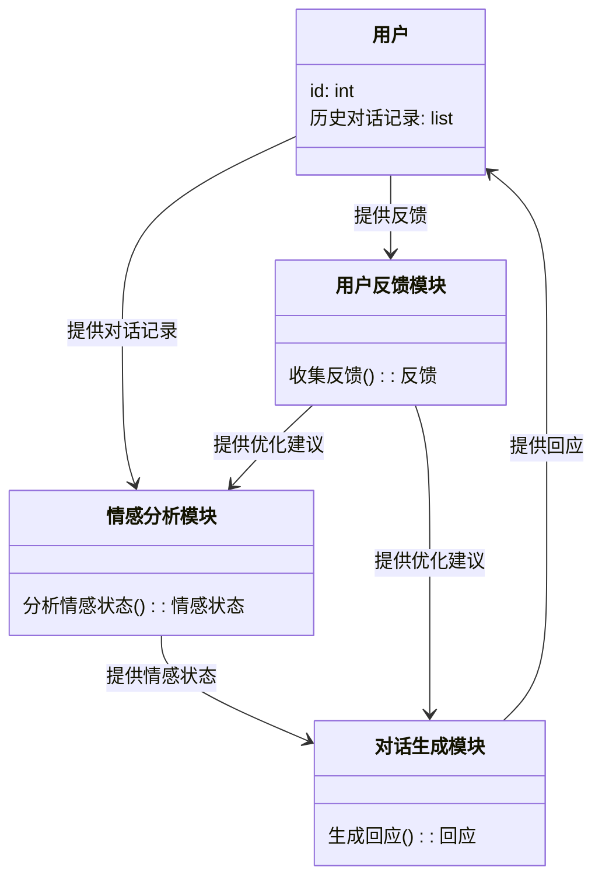
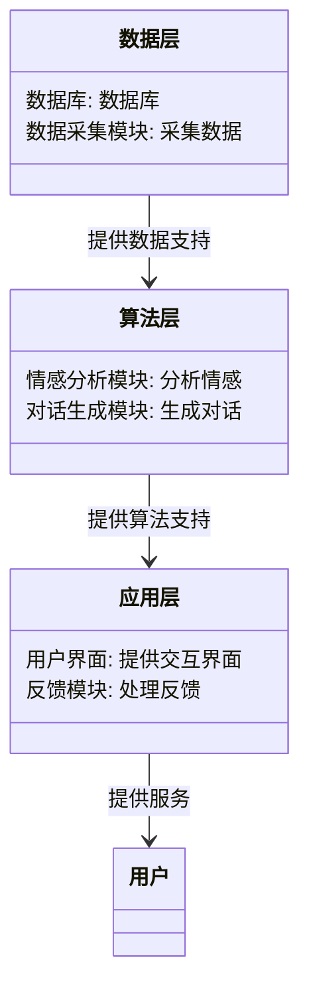
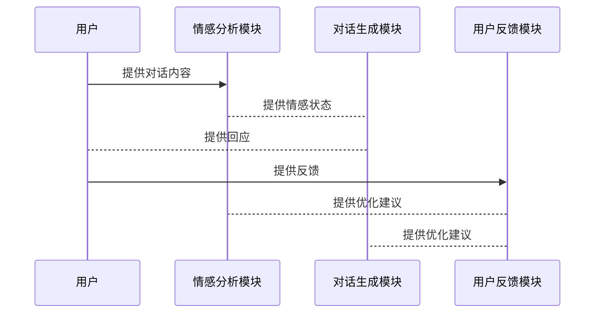

                 


# 《构建AI Agent驱动的智能情感陪伴系统》

> 关键词：AI Agent、情感陪伴、人机交互、情感计算、机器学习

> 摘要：本文将深入探讨如何构建一个基于AI Agent的智能情感陪伴系统，结合情感计算和自然语言处理技术，实现与用户进行情感交流和情感支持的系统。通过系统化的分析与设计，本文将详细阐述系统的构建过程，包括系统架构、算法原理、项目实战等，为读者提供全面的技术指导。

---

## 第1章: AI Agent驱动的智能情感陪伴系统背景

### 1.1 问题背景

#### 1.1.1 当前人机交互的发展趋势
随着人工智能技术的飞速发展，人机交互的方式正在发生深刻的变化。传统的基于规则的交互方式逐渐被基于深度学习和自然语言处理的交互方式所取代。近年来，随着智能音箱、智能助手等设备的普及，人机交互的需求场景也从单一的功能执行扩展到情感陪伴、心理支持等更深层次的需求。

#### 1.1.2 情感陪伴系统的市场需求
现代社会中，人们的生活节奏越来越快，工作压力和心理压力也随之增加。特别是在全球疫情的影响下，人们更加强调心理健康的重要性。情感陪伴系统作为一种能够提供情感支持和心理安慰的技术，市场需求日益增长。

#### 1.1.3 AI Agent在情感陪伴中的作用
AI Agent（智能体）作为一种能够自主感知环境、执行任务的智能实体，在情感陪伴系统中扮演着核心角色。它不仅能够通过自然语言处理技术与用户进行交互，还能通过情感计算技术理解用户的情感状态，并提供相应的反馈和建议。

### 1.2 问题描述

#### 1.2.1 情感陪伴系统的定义
情感陪伴系统是一种基于人工智能技术，能够通过自然语言处理和情感计算，为用户提供情感支持和心理安慰的智能系统。

#### 1.2.2 系统需要解决的核心问题
1. 如何准确识别用户的情感状态？
2. 如何生成符合用户情感需求的回应？
3. 如何设计一个能够持续提供情感支持的智能系统？

#### 1.2.3 系统的边界与外延
情感陪伴系统的边界主要集中在情感分析、情感生成和交互反馈三个核心功能上。外延则包括与用户的交互界面设计、数据隐私保护、系统可扩展性等多个方面。

### 1.3 问题解决与系统目标

#### 1.3.1 系统设计的核心目标
1. 准确识别用户的情感状态。
2. 自动生成符合用户情感需求的回应。
3. 提供持续、稳定的情感支持服务。

#### 1.3.2 系统功能的初步设想
1. 情感分析模块：识别用户的情感状态。
2. 对话生成模块：根据情感状态生成回应。
3. 用户反馈模块：收集用户反馈，优化系统性能。

#### 1.3.3 系统实现的技术路线
1. 数据采集与处理：收集用户对话数据，进行预处理。
2. 情感分析模型训练：基于机器学习算法训练情感分类模型。
3. 对话生成模型训练：基于自然语言处理技术训练对话生成模型。
4. 系统集成与测试：将各模块集成，进行系统测试和优化。

### 1.4 系统的核心要素与概念结构

#### 1.4.1 系统的核心组成要素
1. 情感分析模块。
2. 对话生成模块。
3. 用户反馈模块。

#### 1.4.2 各要素之间的关系
- 情感分析模块负责识别用户的情感状态，为对话生成模块提供输入。
- 对话生成模块根据情感状态生成回应，并将回应反馈给用户。
- 用户反馈模块收集用户的反馈，用于优化情感分析和对话生成模型。

#### 1.4.3 系统的整体架构
系统整体架构分为数据层、算法层和应用层。数据层负责数据的采集与存储，算法层负责情感分析和对话生成，应用层负责与用户的交互。

---

## 第2章: AI Agent与情感计算的核心概念

### 2.1 AI Agent的基本原理

#### 2.1.1 AI Agent的定义与分类
AI Agent是一种能够感知环境、自主决策并执行任务的智能实体。根据智能体的智能水平，可以将AI Agent分为反应式智能体和认知式智能体。

#### 2.1.2 AI Agent的核心特征
1. **自主性**：能够自主决策。
2. **反应性**：能够实时感知环境并做出反应。
3. **学习能力**：能够通过学习优化自身行为。

#### 2.1.3 AI Agent与传统程序的区别
AI Agent的核心区别在于其自主性和智能性，传统程序通常基于固定的规则执行任务，而AI Agent能够通过学习和推理优化自身行为。

### 2.2 情感计算的基本原理

#### 2.2.1 情感计算的定义
情感计算是一种通过计算机技术分析、识别和理解人类情感状态的计算方式。

#### 2.2.2 情感计算的关键技术
1. **情感识别**：通过语音、文本或面部表情识别用户的情感状态。
2. **情感生成**：根据情感状态生成相应的回应或反馈。

#### 2.2.3 情感计算的应用场景
情感计算广泛应用于智能客服、情感陪伴系统、教育辅助等领域。

### 2.3 AI Agent与情感计算的结合

#### 2.3.1 AI Agent在情感计算中的作用
AI Agent作为情感计算的核心载体，能够实时感知用户情感状态并生成相应的回应。

#### 2.3.2 情感计算对AI Agent的增强
情感计算为AI Agent提供了情感理解能力，使其能够更好地满足用户的情感需求。

#### 2.3.3 二者的结合方式与优势
通过结合AI Agent和情感计算，系统能够实现情感识别、情感生成和情感反馈的闭环，从而提供更智能、更贴心的情感陪伴服务。

### 2.4 核心概念对比与联系

#### 2.4.1 AI Agent与传统AI的区别
| 特性         | AI Agent                 | 传统AI                     |
|--------------|--------------------------|-----------------------------|
| 自主性       | 高                        | 低                        |
| 反应性       | 高                        | 中                        |
| 学习能力     | 高                        | 中                        |

#### 2.4.2 情感计算与传统数据处理的区别
| 特性         | 情感计算                 | 传统数据处理               |
|--------------|--------------------------|-----------------------------|
| 数据类型     | 情感相关数据（文本、语音等） | 结构化数据                 |
| 处理目标     | 情感状态识别与生成       | 数据分类、统计等            |

#### 2.4.3 二者的协同关系
AI Agent作为载体，负责感知环境和执行任务；情感计算作为技术手段，负责情感识别和生成。两者协同工作，共同实现情感陪伴系统的功能。

### 2.5 本章小结

---

## 第3章: 系统分析与架构设计

### 3.1 系统功能分析

#### 3.1.1 系统的功能模块划分
1. **情感分析模块**：识别用户情感状态。
2. **对话生成模块**：生成符合情感需求的回应。
3. **用户反馈模块**：收集用户反馈，优化系统性能。

#### 3.1.2 各功能模块的实现目标
1. 情感分析模块：准确识别用户情感状态。
2. 对话生成模块：生成自然、贴切的回应。
3. 用户反馈模块：收集用户反馈，优化系统性能。

#### 3.1.3 功能模块之间的关系
情感分析模块为对话生成模块提供输入，对话生成模块将生成的回应反馈给用户，用户反馈模块收集用户反馈，优化情感分析和对话生成模型。

### 3.2 系统架构设计

#### 3.2.1 系统架构的总体思路
系统采用分层架构设计，包括数据层、算法层和应用层。

#### 3.2.2 系统架构的分层设计
1. **数据层**：负责数据的采集与存储。
2. **算法层**：负责情感分析和对话生成。
3. **应用层**：负责与用户的交互。

#### 3.2.3 系统架构的模块化设计
系统架构设计采用模块化思想，各功能模块相对独立，便于系统的维护和扩展。

### 3.3 系统功能设计（领域模型）

#### 3.3.1 领域模型的定义与作用
领域模型是对系统功能的抽象描述，用于指导系统的设计与实现。

#### 3.3.2 领域模型的构建方法
领域模型的构建通常包括需求分析、功能模块划分、模块间关系设计等步骤。

#### 3.3.3 系统功能的领域模型设计
以下是系统功能的领域模型设计：



### 3.4 系统架构设计（架构图）



### 3.5 系统接口设计

#### 3.5.1 系统接口的定义与分类
系统接口主要分为内部接口和外部接口。内部接口用于模块之间的通信，外部接口用于与用户的交互。

#### 3.5.2 接口之间的交互关系
1. 情感分析模块与对话生成模块之间的接口。
2. 对话生成模块与用户之间的接口。
3. 用户反馈模块与情感分析模块之间的接口。

#### 3.5.3 接口的设计原则与规范
1. 接口设计应遵循松耦合原则。
2. 接口应具备良好的可扩展性。
3. 接口文档应详细说明接口的功能、输入输出格式等。

### 3.6 系统交互设计（交互图）



### 3.7 本章小结

---

## 第4章: 算法原理与实现

### 4.1 情感分析算法原理

#### 4.1.1 情感分析的定义与分类
情感分析是一种通过计算机技术分析文本中的情感倾向的技术。情感分析可以分为文本级情感分析和方面级情感分析。

#### 4.1.2 基于机器学习的情感分析算法
1. **支持向量机（SVM）**：适用于小规模数据集的情感分类。
2. **随机森林**：适用于特征工程较为复杂的情感分类任务。
3. **深度学习模型（如LSTM、Transformer）**：适用于大规模文本数据的情感分类任务。

#### 4.1.3 情感分析的实现步骤
1. 数据预处理：清洗、分词、特征提取。
2. 模型训练：选择合适的算法，训练情感分类模型。
3. 模型评估：通过准确率、召回率等指标评估模型性能。

#### 4.1.4 情感分析的数学模型
以下是基于深度学习的情感分析模型的数学表达式：

$$
\text{模型输入：} \quad x \in \mathbb{R}^{d} \\
\text{模型输出：} \quad y \in \{0, 1\}
$$

其中，$d$ 是词向量的维度，$y$ 是情感标签（0表示负面，1表示正面）。

### 4.2 对话生成算法原理

#### 4.2.1 对话生成的定义与分类
对话生成是一种通过计算机技术生成符合人类对话逻辑的文本的技术。对话生成可以分为基于规则的对话生成和基于深度学习的对话生成。

#### 4.2.2 基于深度学习的对话生成算法
1. **循环神经网络（RNN）**：适用于短对话生成。
2. **Transformer**：适用于长对话生成。

#### 4.2.3 对话生成的实现步骤
1. 数据预处理：清洗、分词、特征提取。
2. 模型训练：选择合适的算法，训练对话生成模型。
3. 模型优化：通过调整超参数和优化策略提升模型性能。

#### 4.2.4 对话生成的数学模型
以下是基于Transformer的对话生成模型的数学表达式：

$$
\text{输入序列：} \quad x_1, x_2, \ldots, x_n \\
\text{输出序列：} \quad y_1, y_2, \ldots, y_m
$$

其中，$n$ 是输入序列的长度，$m$ 是输出序列的长度。

### 4.3 算法实现与优化

#### 4.3.1 算法实现的关键步骤
1. 数据预处理：清洗、分词、特征提取。
2. 模型训练：选择合适的算法，训练情感分类模型和对话生成模型。
3. 模型优化：通过调整超参数和优化策略提升模型性能。

#### 4.3.2 算法优化的策略
1. **数据增强**：通过数据增强技术提升数据质量。
2. **模型调优**：通过网格搜索等方法优化模型参数。
3. **集成学习**：通过集成学习技术提升模型性能。

### 4.4 本章小结

---

## 第5章: 项目实战与实现

### 5.1 项目环境搭建

#### 5.1.1 开发环境的选择
推荐使用Python作为开发语言，使用Jupyter Notebook作为开发环境。

#### 5.1.2 开发工具的安装
1. 安装Python。
2. 安装必要的库：numpy、pandas、sklearn、transformers等。

#### 5.1.3 数据集的准备
1. 数据收集：可以从公开数据集（如Twitter情感数据集）获取情感数据。
2. 数据预处理：清洗、分词、特征提取。

### 5.2 系统核心实现

#### 5.2.1 情感分析模块实现

```python
from sklearn.feature_extraction.text import TfidfVectorizer
from sklearn.svm import SVC

# 数据预处理
texts = [...]  # 文本数据
labels = [...]  # 情感标签

# 特征提取
vectorizer = TfidfVectorizer()
X = vectorizer.fit_transform(texts)

# 模型训练
model = SVC()
model.fit(X, labels)

# 模型预测
def analyze_emotion(text):
    X_test = vectorizer.transform([text])
    return model.predict(X_test)[0]
```

#### 5.2.2 对话生成模块实现

```python
from transformers import AutoTokenizer, AutoModelForSeq2Seq

# 模型加载
tokenizer = AutoTokenizer.from_pretrained("facebook/blenderbot")
model = AutoModelForSeq2Seq.from_pretrained("facebook/blenderbot")

# 对话生成
def generate_response(text):
    inputs = tokenizer.encode(text, return_tensors="pt", max_length=512)
    outputs = model.generate(inputs, max_length=100, num_beams=5)
    response = tokenizer.decode(outputs[0], skip_special_tokens=True)
    return response
```

#### 5.2.3 用户反馈模块实现

```python
def collect_feedback(feedback):
    # 反馈收集逻辑
    pass

def optimize_model(feedback):
    # 模型优化逻辑
    pass
```

### 5.3 代码实现与解读

#### 5.3.1 情感分析模块代码解读
1. 使用TF-IDF进行特征提取。
2. 使用SVM进行情感分类。
3. 提供情感分析接口。

#### 5.3.2 对话生成模块代码解读
1. 使用预训练的Transformer模型进行对话生成。
2. 提供对话生成接口。

### 5.4 项目小结

---

## 第6章: 最佳实践与小结

### 6.1 系统优化建议

#### 6.1.1 数据优化
1. 使用高质量的数据集。
2. 通过数据增强技术提升数据质量。

#### 6.1.2 模型优化
1. 通过网格搜索优化模型参数。
2. 使用集成学习提升模型性能。

#### 6.1.3 系统优化
1. 优化系统架构，提升系统的可扩展性。
2. 优化系统接口，提升系统的交互效率。

### 6.2 注意事项

#### 6.2.1 数据隐私问题
在实际应用中，需要注意用户数据的隐私保护。

#### 6.2.2 情感生成的边界
情感生成需要遵循伦理规范，避免生成不当内容。

### 6.3 拓展阅读

#### 6.3.1 深度学习与自然语言处理
推荐阅读《Deep Learning for NLP》。

#### 6.3.2 情感计算与人机交互
推荐阅读《Affective Computing》。

### 6.4 本章小结

---

## 作者：AI天才研究院/AI Genius Institute & 禅与计算机程序设计艺术 /Zen And The Art of Computer Programming

---

感谢您的阅读！如需转载请注明出处。

