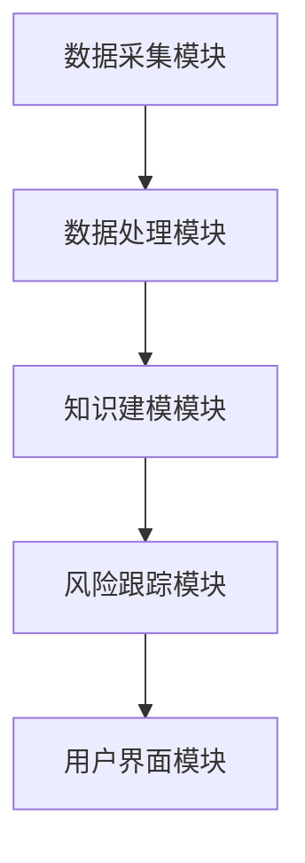
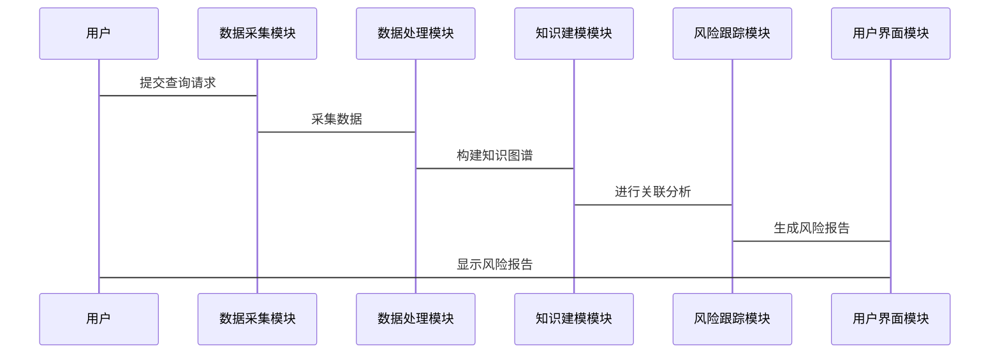

                 


# 构建基于知识图谱的金融产品全生命周期风险跟踪系统

> 关键词：知识图谱，金融产品，风险跟踪，全生命周期，系统架构

> 摘要：本文详细探讨了如何构建基于知识图谱的金融产品全生命周期风险跟踪系统。通过整合金融产品的全生命周期数据，构建知识图谱，并利用图分析和机器学习技术，实现对金融产品风险的实时跟踪和预测。本文从背景、核心概念、构建方法、系统架构、算法原理、项目实现等方面进行详细阐述，为金融行业提供一种高效的风险管理解决方案。

---

## 第一章：问题背景与目标

### 1.1 问题背景

#### 1.1.1 金融产品全生命周期管理的挑战
金融产品的全生命周期包括设计、发行、销售、监控和终止等阶段。在每个阶段中，都会产生大量复杂且异构的数据，例如产品文档、市场数据、交易记录等。传统的风险管理方法依赖于人工分析和报表，难以高效处理这些异构数据，并且容易遗漏潜在风险。

#### 1.1.2 传统风险管理的局限性
传统风险管理方法主要依赖于统计分析和规则引擎，难以处理非结构化数据，也无法有效捕捉跨领域的关联风险。例如，一个金融产品的设计缺陷可能会影响其发行、销售和终止等多个阶段，但传统方法难以发现这些跨阶段的关联性。

#### 1.1.3 知识图谱在金融领域的应用潜力
知识图谱是一种以图结构表示知识的技术，能够整合异构数据，发现数据之间的隐含关系。在金融领域，知识图谱可以用于构建金融实体之间的关联网络，帮助发现潜在风险。

---

### 1.2 问题描述

#### 1.2.1 金融产品风险跟踪的核心问题
金融产品风险跟踪的核心问题是如何实时监控产品在全生命周期中的风险因素，并预测可能的风险事件。这需要整合多源异构数据，并分析这些数据之间的关联性。

#### 1.2.2 知识图谱在风险跟踪中的作用
知识图谱可以通过构建金融产品、市场、客户等实体的关联网络，发现潜在风险。例如，如果一个金融产品的设计与多个高风险客户相关联，系统可以通过知识图谱发现这种关联性，并提前预警风险。

#### 1.2.3 系统目标与预期价值
系统的目标是构建一个基于知识图谱的金融产品全生命周期风险跟踪系统，实现对金融产品风险的实时监控、关联分析和预测。系统的预期价值包括提高风险管理效率、降低风险事件的发生概率以及增强金融机构的决策能力。

---

### 1.3 问题解决思路

#### 1.3.1 知识图谱构建的基本思路
1. 数据采集：从多个数据源（如产品文档、市场数据、交易记录等）采集异构数据。
2. 数据预处理：清洗数据，消除冗余和噪声。
3. 知识抽取：从文本数据中提取实体和关系。
4. 知识建模：构建知识图谱的结构，定义实体和关系的类型。
5. 知识可视化：将知识图谱可视化，便于理解和分析。

#### 1.3.2 基于知识图谱的风险跟踪方法
1. 数据整合：将金融产品全生命周期的异构数据整合到知识图谱中。
2. 关联分析：利用图分析技术发现数据之间的关联性。
3. 风险预测：结合机器学习算法，基于知识图谱进行风险预测。

#### 1.3.3 系统实现的关键技术
1. 知识图谱构建技术：包括数据采集、清洗、抽取、建模和可视化。
2. 图分析技术：包括路径分析、社区发现等。
3. 机器学习技术：包括风险分类、预测和关联规则挖掘。

---

### 1.4 系统边界与外延

#### 1.4.1 系统的功能边界
系统主要关注金融产品全生命周期中的风险跟踪，不涉及产品的具体设计和操作流程。

#### 1.4.2 系统的适用范围
系统适用于银行、证券、保险等金融机构，帮助其管理金融产品风险。

#### 1.4.3 系统与外部系统的交互
系统需要与金融机构的现有系统（如CRM、交易系统等）进行数据交互，获取必要的数据。

---

### 1.5 核心概念与组成

#### 1.5.1 知识图谱的基本组成
知识图谱由实体、关系和属性三部分组成：
- 实体：代表具体事物，如“金融产品”。
- 关系：表示实体之间的关联，如“属于”、“影响”。
- 属性：描述实体的特征，如“产品类型”。

#### 1.5.2 金融产品全生命周期的核心要素
- 产品设计：产品类型、风险等级。
- 产品发行：发行时间、发行机构。
- 产品销售：销售区域、销售渠道。
- 产品监控：实时数据、市场波动。
- 产品终止：终止原因、终止时间。

#### 1.5.3 风险跟踪的关键环节
- 数据采集与整合：整合异构数据。
- 关联分析：发现数据之间的关联性。
- 风险预测：预测潜在风险。

---

## 第二章：知识图谱与风险跟踪的核心概念

### 2.1 知识图谱的定义与特点

#### 2.1.1 知识图谱的定义
知识图谱是一种以图结构表示知识的技术，通过节点表示实体，边表示实体之间的关系。

#### 2.1.2 知识图谱的核心特点
1. **异构性**：能够表示多种类型的数据。
2. **可扩展性**：支持大规模数据的存储和分析。
3. **语义丰富性**：通过关系和属性描述数据的语义。

---

### 2.2 风险跟踪系统的基本原理

#### 2.2.1 风险跟踪的定义
风险跟踪是指对金融产品在全生命周期中的风险因素进行实时监控和分析。

#### 2.2.2 基于知识图谱的风险跟踪方法
1. **数据整合**：将异构数据整合到知识图谱中。
2. **关联分析**：利用图分析技术发现数据之间的关联性。
3. **风险预测**：结合机器学习算法，基于知识图谱进行风险预测。

---

### 2.3 知识图谱与风险跟踪的关系

#### 2.3.1 知识图谱在风险跟踪中的作用
知识图谱可以整合异构数据，发现数据之间的关联性，从而帮助识别潜在风险。

#### 2.3.2 知识图谱如何支持风险分析
知识图谱可以通过关联分析，发现金融产品与客户、市场之间的关系，帮助分析潜在风险。

#### 2.3.3 知识图谱与风险预测的结合
知识图谱可以为风险预测提供丰富的语义信息，提高预测的准确性和可靠性。

---

### 2.4 核心概念对比分析

#### 2.4.1 知识图谱与传统数据模型对比
| 特性 | 知识图谱 | 传统数据模型 |
|------|----------|--------------|
| 数据结构 | 图结构 | 行列结构 |
| 表达能力 | 高 | 低 |
| 处理复杂性 | 高 | 低 |

#### 2.4.2 风险跟踪与传统风险管理对比
| 特性 | 风险跟踪 | 传统风险管理 |
|------|----------|--------------|
| 数据来源 | 多源异构数据 | 结构化数据 |
| 分析方法 | 图分析、机器学习 | 统计分析、规则引擎 |
| 效率 | 高 | 低 |

#### 2.4.3 知识图谱在金融领域的独特优势
- 能够整合异构数据，发现潜在关联。
- 提供丰富的语义信息，支持智能分析。

---

### 2.5 本章小结

本章介绍了知识图谱的定义、特点以及其在金融风险管理中的作用。通过对比分析，突出了知识图谱在金融产品全生命周期风险跟踪中的独特优势。

---

## 第三章：知识图谱构建与应用

### 3.1 知识图谱构建的基本流程

#### 3.1.1 数据采集与预处理
1. 数据采集：从多个数据源采集异构数据，例如从产品文档中提取产品信息。
2. 数据清洗：去除冗余和噪声数据，确保数据的准确性和一致性。

#### 3.1.2 知识抽取与融合
1. 实体识别：从文本数据中识别出金融产品、客户等实体。
2. 关系抽取：识别实体之间的关系，例如“金融产品属于某个客户”。
3. 知识融合：将多个数据源中的知识进行整合，消除冲突。

#### 3.1.3 知识建模与存储
1. 知识建模：定义实体和关系的类型，构建知识图谱的结构。
2. 知识存储：将知识图谱存储在图数据库中，例如Neo4j。

---

### 3.2 知识图谱的表示与推理

#### 3.2.1 知识表示的基本方法
知识图谱通常使用三元组（头实体，关系，尾实体）表示知识，例如（“产品A”，“属于”，“客户B”）。

#### 3.2.2 基于图的推理算法
1. **路径分析**：查找实体之间的路径，发现隐含关系。
2. **社区发现**：识别知识图谱中的社区，分析实体之间的关联性。

#### 3.2.3 知识图谱的动态更新
知识图谱需要动态更新，以反映金融产品全生命周期中的变化。例如，当一个新的风险事件发生时，需要更新知识图谱中的相关知识。

---

### 3.3 知识图谱在金融领域的应用

#### 3.3.1 金融产品识别与分类
知识图谱可以帮助识别和分类金融产品，例如将产品分为“股票”、“债券”等类别。

#### 3.3.2 风险关联分析
知识图谱可以通过关联分析，发现金融产品与客户、市场之间的关系，帮助识别潜在风险。

#### 3.3.3 风险预测与评估
知识图谱可以为风险预测提供丰富的语义信息，结合机器学习算法，提高风险预测的准确性和可靠性。

---

### 3.4 本章小结

本章详细介绍了知识图谱的构建流程及其在金融领域的应用。通过知识图谱，可以整合异构数据，发现潜在关联，为金融产品全生命周期风险跟踪提供支持。

---

## 第四章：知识图谱构建的算法原理

### 4.1 知识抽取算法

#### 4.1.1 实体识别与关系抽取
1. **实体识别**：使用自然语言处理技术，从文本中识别出实体。例如，从“产品A属于客户B”中识别出“产品A”和“客户B”。
2. **关系抽取**：识别实体之间的关系，例如“属于”。

#### 4.1.2 基于规则的抽取方法
基于规则的抽取方法通过预定义的规则，从文本中提取实体和关系。例如，使用正则表达式匹配特定模式。

#### 4.1.3 基于深度学习的抽取方法
基于深度学习的抽取方法使用神经网络模型，例如LSTM和BERT，从文本中提取实体和关系。

---

### 4.2 知识融合算法

#### 4.2.1 数据清洗与去重
数据清洗包括去除冗余和噪声数据，例如去除重复记录。数据去重可以通过哈希表实现。

#### 4.2.2 知识对齐与合并
知识对齐是指将不同数据源中的实体进行对齐，例如将“客户A”和“客户B”合并为同一个实体。

#### 4.2.3 知识融合的评价指标
常用的评价指标包括精确率、召回率和F1值。

---

### 4.3 知识建模与存储

#### 4.3.1 图数据库的选择与设计
常用的图数据库包括Neo4j和ArangoDB。设计图数据库时需要考虑查询效率和存储容量。

#### 4.3.2 知识图谱的存储优化
存储优化可以通过索引优化和分区存储实现。

#### 4.3.3 知识图谱的查询与检索
知识图谱的查询可以使用SPARQL语言，例如查询“所有属于客户A的金融产品”。

---

### 4.4 本章小结

本章详细介绍了知识图谱构建中的算法原理，包括知识抽取、融合和建模。这些算法为金融产品全生命周期风险跟踪系统提供了技术支持。

---

## 第五章：系统架构与设计

### 5.1 系统功能设计

#### 5.1.1 知识图谱构建模块
1. 数据采集：从多个数据源采集异构数据。
2. 数据处理：清洗、抽取和融合数据。
3. 知识建模：构建知识图谱的结构。

#### 5.1.2 风险跟踪模块
1. 关联分析：利用图分析技术发现数据之间的关联性。
2. 风险预测：结合机器学习算法，基于知识图谱进行风险预测。

#### 5.1.3 用户界面模块
1. 数据可视化：将知识图谱可视化，便于用户理解和分析。
2. 风险报告：生成风险报告，帮助用户制定风险管理策略。

---

### 5.2 系统架构设计

#### 5.2.1 系统功能模块设计
- 数据采集模块：负责采集异构数据。
- 数据处理模块：负责数据清洗、抽取和融合。
- 知识建模模块：负责构建知识图谱的结构。
- 风险跟踪模块：负责关联分析和风险预测。
- 用户界面模块：负责数据可视化和风险报告。

#### 5.2.2 系统架构图


---

### 5.3 系统接口设计

#### 5.3.1 数据接口
- 数据采集模块需要与多个数据源对接，例如产品文档系统、交易系统等。

#### 5.3.2 API接口
- 提供RESTful API接口，供其他系统调用知识图谱的查询和分析功能。

---

### 5.4 系统交互设计

#### 5.4.1 用户与系统的交互流程
1. 用户通过用户界面模块提交查询请求。
2. 系统通过知识建模模块构建知识图谱。
3. 系统通过风险跟踪模块进行关联分析和风险预测。
4. 系统将结果返回给用户，生成风险报告。

#### 5.4.2 系统交互图


---

### 5.5 本章小结

本章详细介绍了系统架构与设计，包括功能模块、架构图、接口设计和交互流程。系统架构的设计为金融产品全生命周期风险跟踪提供了技术保障。

---

## 第六章：项目实战

### 6.1 环境安装与配置

#### 6.1.1 系统环境
- 操作系统：Linux或Windows。
- 图数据库：安装Neo4j或其他图数据库。
- 开发工具：安装Python、Jupyter Notebook等。

#### 6.1.2 依赖库安装
- Python库：安装pandas、numpy、networkx、py2neo等。

---

### 6.2 系统核心实现

#### 6.2.1 数据采集与处理
```python
import pandas as pd
import requests

# 数据采集
response = requests.get("http://example.com/api/products")
products = response.json()

# 数据处理
df = pd.DataFrame(products)
df = df.drop_duplicates()
df.to_csv("products.csv", index=False)
```

#### 6.2.2 知识图谱构建
```python
from py2neo import Graph, Node, Relationship

# 连接图数据库
graph = Graph("http://localhost:7474", auth=("neo4j", "password"))

# 创建实体
product = Node("Product", name="产品A")
customer = Node("Customer", name="客户B")
Relationship(product, "BELONGS_TO", customer).save()
```

#### 6.2.3 风险预测
```python
from sklearn.ensemble import RandomForestClassifier

# 数据准备
X = df.drop(columns=["风险等级"])
y = df["风险等级"]

# 训练模型
model = RandomForestClassifier()
model.fit(X, y)

# 预测风险
new_product = df.iloc[0]
print(model.predict([new_product]))
```

---

### 6.3 案例分析与解读

#### 6.3.1 案例背景
假设我们有一个金融产品“产品A”，我们需要预测其风险等级。

#### 6.3.2 数据分析
通过对“产品A”的数据分析，发现其与多个高风险客户相关联，可能会影响其风险等级。

#### 6.3.3 风险预测
基于知识图谱和随机森林模型，预测“产品A”的风险等级为高风险。

---

### 6.4 本章小结

本章通过实际案例，详细展示了系统的核心实现和应用。通过知识图谱和机器学习技术，可以帮助金融机构实现金融产品全生命周期风险跟踪。

---

## 第七章：总结与展望

### 7.1 最佳实践 Tips
1. 数据预处理是构建知识图谱的关键，需要仔细清洗和融合数据。
2. 知识图谱的构建需要结合具体业务场景，选择合适的算法和技术。
3. 系统设计时需要考虑扩展性和安全性，确保系统的稳定运行。

### 7.2 小结
本文详细探讨了构建基于知识图谱的金融产品全生命周期风险跟踪系统的各个方面，包括背景、核心概念、构建方法、系统架构和项目实现。通过知识图谱和机器学习技术，可以有效整合异构数据，发现潜在风险，提高风险管理效率。

### 7.3 注意事项
- 数据隐私和安全问题需要高度重视。
- 系统的实时性和响应速度需要优化。
- 知识图谱的动态更新需要结合业务需求进行设计。

### 7.4 拓展阅读
1. 知识图谱相关书籍：《知识图谱：概念、方法与应用》。
2. 机器学习相关书籍：《机器学习实战》。
3. 图数据库相关书籍：《Neo4j图数据库实战》。

---

## 作者：AI天才研究院/AI Genius Institute & 禅与计算机程序设计艺术/Zen And The Art of Computer Programming

---

通过本文的详细阐述，您可以系统地了解如何构建基于知识图谱的金融产品全生命周期风险跟踪系统。从理论到实践，从概念到实现，本文为金融行业提供了一种高效的风险管理解决方案。

