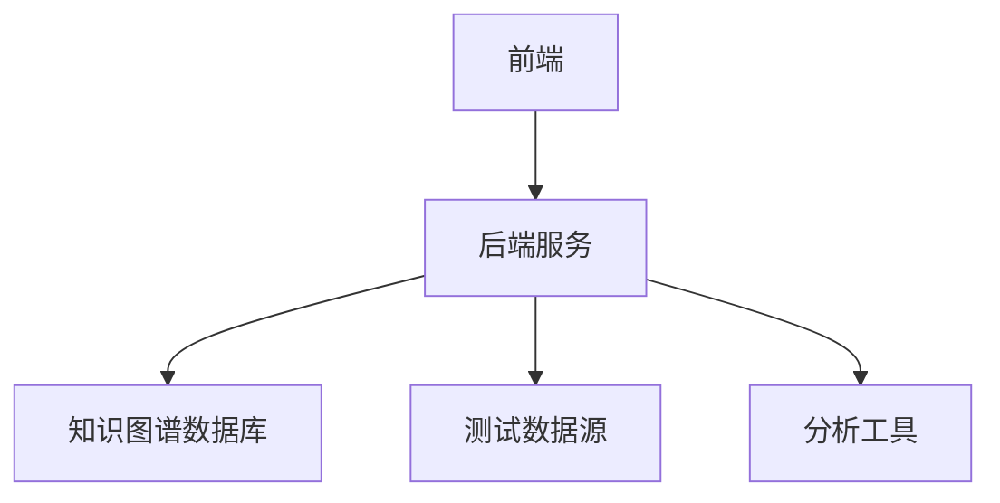
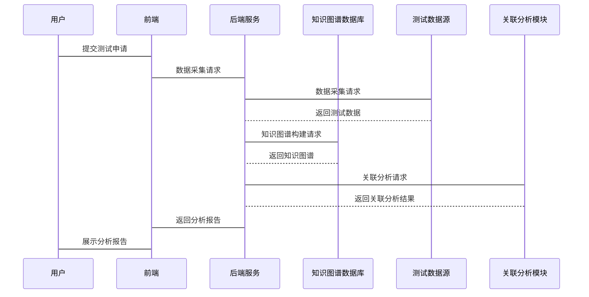

                 


# 构建基于知识图谱的金融监管沙盒测试结果分析平台

## 关键词：知识图谱、金融监管、沙盒测试、数据分析、人工智能

## 摘要：本文详细介绍了如何利用知识图谱技术构建金融监管沙盒测试结果分析平台。文章从知识图谱的基本概念出发，探讨了其在金融监管中的应用前景，详细分析了知识图谱的构建方法，以及如何将其应用于金融监管沙盒测试结果分析。通过系统设计与架构、项目实战等部分，展示了该平台的实际应用价值和优势。本文还总结了知识图谱在金融监管中的挑战与未来发展方向。

---

## 第1章: 知识图谱与金融监管沙盒的背景介绍

### 1.1 知识图谱的基本概念

#### 1.1.1 知识图谱的定义
知识图谱是一种以图结构形式表示知识的语义网络，由节点（实体）和边（关系）组成，能够描述实体之间的语义关系，支持复杂的数据关联分析。

#### 1.1.2 知识图谱的核心要素
- **实体（Entity）**：表示现实世界中的具体事物，如“银行”、“客户”、“交易”等。
- **关系（Relation）**：描述实体之间的关联，如“属于”、“涉及”、“影响”等。
- **属性（Attribute）**：描述实体的特征，如“名称”、“金额”、“时间”等。

#### 1.1.3 知识图谱的构建流程
1. 数据采集：从多种数据源（如数据库、文本文件、API等）获取原始数据。
2. 数据预处理：清洗数据，去除重复、错误或不完整的数据。
3. 知识抽取：从数据中提取实体、关系和属性。
4. 知识融合：将多个数据源中的知识进行整合，消除冲突，形成一致的知识图谱。

### 1.2 金融监管沙盒的概念与特点

#### 1.2.1 金融监管沙盒的定义
金融监管沙盒是一种创新监管工具，允许金融机构在受控环境中测试新产品、服务或流程，同时确保风险可控。监管机构通过沙盒提供一个安全的环境，帮助金融机构快速验证创新性解决方案。

#### 1.2.2 金融监管沙盒的核心功能
1. **风险隔离**：通过限制测试环境，确保测试不会对真实市场造成影响。
2. **快速迭代**：允许金融机构在沙盒中快速测试和迭代产品。
3. **数据收集**：通过沙盒收集测试数据，帮助监管机构评估产品的风险和合规性。

#### 1.2.3 金融监管沙盒与传统监管的区别
- **灵活性**：沙盒允许金融机构在受控环境中进行创新，而传统监管通常较为 rigid。
- **数据驱动**：沙盒依赖于数据驱动的监管，而传统监管更多依赖于规则和流程。
- **实时监控**：沙盒能够实时监控测试过程，及时发现和解决问题。

### 1.3 知识图谱在金融监管中的应用前景

#### 1.3.1 知识图谱在金融监管中的潜在应用领域
- **风险评估**：通过知识图谱分析金融机构之间的关联，识别系统性风险。
- **合规性分析**：利用知识图谱快速识别合规性问题，帮助监管机构进行合规性检查。
- **欺诈检测**：通过知识图谱发现异常交易模式，识别潜在的欺诈行为。

#### 1.3.2 知识图谱在金融监管中的优势
- **数据整合能力**：知识图谱能够整合多种数据源，形成全面的监管视图。
- **关联分析能力**：知识图谱能够发现数据之间的隐含关系，帮助监管机构识别潜在风险。
- **实时更新能力**：知识图谱能够实时更新，确保监管数据的最新性。

#### 1.3.3 知识图谱在金融监管中的挑战与机遇
- **数据质量**：知识图谱的构建依赖于高质量的数据，数据质量问题可能影响知识图谱的准确性。
- **计算复杂度**：知识图谱的构建和分析需要大量的计算资源，可能导致计算复杂度较高。
- **隐私保护**：知识图谱涉及大量敏感数据，如何保护隐私是一个重要挑战。

### 1.4 本章小结
本章介绍了知识图谱的基本概念、构建流程以及金融监管沙盒的概念与特点。同时，探讨了知识图谱在金融监管中的潜在应用领域和优势，以及面临的挑战与机遇。

---

## 第2章: 知识图谱的构建方法

### 2.1 知识图谱的构建流程

#### 2.1.1 数据采集
- **数据来源**：可以包括数据库、API、文本文件等多种数据源。
- **数据清洗**：去除重复、错误或不完整的数据。

#### 2.1.2 数据预处理
- **分词**：将文本数据进行分词处理，提取关键词。
- **实体识别**：识别文本中的实体，如“银行”、“客户”等。

#### 2.1.3 知识抽取与融合
- **知识抽取**：从数据中提取实体、关系和属性。
- **知识融合**：将多个数据源中的知识进行整合，消除冲突，形成一致的知识图谱。

### 2.2 知识图谱的存储与管理

#### 2.2.1 知识图谱的存储方式
- **图数据库**：如Neo4j，支持图结构数据的存储和查询。
- **关系型数据库**：如MySQL，适用于结构化数据的存储。

#### 2.2.2 知识图谱的管理工具
- **图数据库管理工具**：如Neo4j的Cypher语言，用于管理和查询图数据。
- **知识图谱构建工具**：如RDF4J，用于构建和管理知识图谱。

#### 2.2.3 知识图谱的查询与推理
- **SPARQL**：一种用于查询知识图谱的查询语言，支持复杂的关联查询。
- **推理引擎**：通过推理引擎进行知识推理，发现隐含的知识。

### 2.3 知识图谱的可视化

#### 2.3.1 知识图谱的可视化方法
- **节点和边的布局**：通过布局算法优化知识图谱的可视化效果。
- **过滤和筛选**：根据用户需求，动态过滤和筛选知识图谱中的信息。

#### 2.3.2 知识图谱的可视化工具
- **Gephi**：一种用于网络分析和可视化的工具，支持知识图谱的可视化。
- **Neo4j Browser**：Neo4j的内置可视化工具，支持图数据的可视化。

#### 2.3.3 知识图谱的可视化案例
- **金融监管案例**：通过知识图谱可视化，展示金融机构之间的关联关系，帮助监管机构识别系统性风险。

### 2.4 本章小结
本章详细介绍了知识图谱的构建流程，包括数据采集、预处理、知识抽取与融合等步骤。同时，探讨了知识图谱的存储与管理、可视化方法和工具，并通过案例展示了知识图谱的可视化应用。

---

## 第3章: 金融监管沙盒测试结果分析平台的构建

### 3.1 金融监管沙盒测试的基本流程

#### 3.1.1 金融监管沙盒测试的定义
金融监管沙盒测试是一种创新监管工具，允许金融机构在受控环境中测试新产品、服务或流程，同时确保风险可控。

#### 3.1.2 金融监管沙盒测试的流程
1. **申请与审批**：金融机构提出测试申请，监管机构进行审批。
2. **环境搭建**：搭建受控的测试环境，确保测试不会对真实市场造成影响。
3. **测试实施**：金融机构在沙盒中进行产品测试，收集测试数据。
4. **数据收集与分析**：监管机构分析测试数据，评估产品的风险和合规性。

#### 3.1.3 金融监管沙盒测试的结果分析
- **风险评估**：通过测试数据评估产品的风险，识别潜在的系统性风险。
- **合规性分析**：分析测试数据，确保产品符合相关法规和监管要求。
- **效果评估**：评估测试效果，总结测试经验，为后续监管决策提供依据。

### 3.2 知识图谱在金融监管沙盒测试中的应用

#### 3.2.1 知识图谱在金融监管沙盒测试中的作用
- **数据整合**：通过知识图谱整合多种数据源，形成全面的测试数据视图。
- **关联分析**：利用知识图谱分析测试数据之间的关联关系，发现潜在风险。
- **决策支持**：通过知识图谱提供决策支持，帮助监管机构制定监管政策。

#### 3.2.2 知识图谱在金融监管沙盒测试中的具体应用
- **风险评估**：通过知识图谱分析测试数据，识别潜在风险。
- **合规性分析**：利用知识图谱快速识别合规性问题，确保产品符合法规要求。
- **效果评估**：通过知识图谱分析测试效果，总结测试经验。

#### 3.2.3 知识图谱在金融监管沙盒测试中的优势
- **数据整合能力**：知识图谱能够整合多种数据源，形成全面的测试数据视图。
- **关联分析能力**：知识图谱能够发现数据之间的隐含关系，帮助监管机构识别潜在风险。
- **实时更新能力**：知识图谱能够实时更新，确保测试数据的最新性。

### 3.3 金融监管沙盒测试结果分析平台的设计

#### 3.3.1 平台的设计目标
- **数据整合**：整合多种数据源，形成全面的测试数据视图。
- **关联分析**：支持复杂的关联分析，帮助监管机构识别潜在风险。
- **决策支持**：提供决策支持功能，帮助监管机构制定监管政策。

#### 3.3.2 平台的功能模块
1. **数据采集与处理模块**：负责采集和处理测试数据。
2. **知识图谱构建模块**：负责构建和更新知识图谱。
3. **关联分析模块**：支持复杂的关联分析，发现潜在风险。
4. **决策支持模块**：提供决策支持功能，帮助监管机构制定监管政策。

#### 3.3.3 平台的架构设计
- **前端架构**：采用响应式设计，支持多种设备访问。
- **后端架构**：采用微服务架构，支持高可用性和扩展性。
- **数据存储**：采用分布式存储技术，支持大规模数据存储和查询。

### 3.4 本章小结
本章详细介绍了金融监管沙盒测试的基本流程，探讨了知识图谱在金融监管沙盒测试中的应用，以及平台的设计目标和功能模块。同时，通过架构设计展示了平台的实现方式。

---

## 第4章: 知识图谱与金融监管沙盒测试结果分析的结合

### 4.1 知识图谱在金融监管沙盒测试中的具体应用

#### 4.1.1 知识图谱在金融监管沙盒测试中的数据处理
- **数据清洗**：通过知识图谱技术清洗测试数据，去除重复和错误数据。
- **数据融合**：整合多种数据源，形成全面的测试数据视图。

#### 4.1.2 知识图谱在金融监管沙盒测试中的结果分析
- **关联分析**：利用知识图谱分析测试数据之间的关联关系，发现潜在风险。
- **风险评估**：通过知识图谱评估测试产品的风险，识别系统性风险。

#### 4.1.3 知识图谱在金融监管沙盒测试中的决策支持
- **决策支持**：通过知识图谱提供决策支持，帮助监管机构制定监管政策。
- **合规性分析**：利用知识图谱快速识别合规性问题，确保产品符合法规要求。

### 4.2 知识图谱在金融监管沙盒测试结果分析中的优势

#### 4.2.1 知识图谱在金融监管沙盒测试结果分析中的准确性
- **数据整合能力**：知识图谱能够整合多种数据源，形成全面的测试数据视图。
- **关联分析能力**：知识图谱能够发现数据之间的隐含关系，提高风险识别的准确性。

#### 4.2.2 知识图谱在金融监管沙盒测试结果分析中的效率
- **自动化处理**：通过知识图谱技术实现数据的自动化处理和分析，提高工作效率。
- **实时更新能力**：知识图谱能够实时更新，确保测试数据的最新性。

#### 4.2.3 知识图谱在金融监管沙盒测试结果分析中的可扩展性
- **模块化设计**：知识图谱可以通过模块化设计，支持不同规模的测试数据分析。
- **灵活性**：知识图谱可以根据具体需求进行定制化开发，支持多种应用场景。

### 4.3 知识图谱在金融监管沙盒测试结果分析中的挑战

#### 4.3.1 知识图谱在金融监管沙盒测试结果分析中的数据质量问题
- **数据完整性**：测试数据可能存在缺失，影响知识图谱的准确性。
- **数据一致性**：不同数据源之间的数据可能存在不一致，需要进行数据清洗和融合。

#### 4.3.2 知识图谱在金融监管沙盒测试结果分析中的计算复杂度问题
- **大规模数据处理**：知识图谱的构建和分析需要处理大规模数据，计算复杂度较高。
- **实时性要求**：知识图谱的实时更新需要高性能计算资源支持。

#### 4.3.3 知识图谱在金融监管沙盒测试结果分析中的隐私保护问题
- **数据隐私**：测试数据可能涉及敏感信息，如何保护隐私是一个重要挑战。
- **访问控制**：需要建立严格的访问控制机制，确保测试数据的安全性。

### 4.4 本章小结
本章详细探讨了知识图谱在金融监管沙盒测试结果分析中的具体应用和优势，同时也分析了面临的挑战，包括数据质量、计算复杂度和隐私保护等问题。

---

## 第5章: 系统设计与架构方案

### 5.1 系统功能设计

#### 5.1.1 系统功能模块
1. **数据采集与处理模块**：负责采集和处理测试数据。
2. **知识图谱构建模块**：负责构建和更新知识图谱。
3. **关联分析模块**：支持复杂的关联分析，发现潜在风险。
4. **决策支持模块**：提供决策支持功能，帮助监管机构制定监管政策。

#### 5.1.2 系统功能流程
1. **数据采集**：从多种数据源采集测试数据。
2. **数据预处理**：清洗和融合数据，形成知识图谱。
3. **关联分析**：利用知识图谱分析测试数据之间的关联关系。
4. **结果分析**：生成分析报告，支持监管决策。

### 5.2 系统架构设计

#### 5.2.1 系统架构图


#### 5.2.2 系统功能模块设计
- **前端模块**：负责用户界面的展示和交互。
- **后端模块**：负责处理业务逻辑和数据存储。
- **知识图谱数据库**：存储知识图谱数据，支持高效的查询和分析。
- **测试数据源**：提供测试数据，支持知识图谱的构建和更新。
- **分析工具**：提供关联分析和结果展示功能。

### 5.3 系统接口设计

#### 5.3.1 接口描述
1. **数据采集接口**：用于从测试数据源采集数据。
2. **知识图谱构建接口**：用于构建和更新知识图谱。
3. **关联分析接口**：用于进行关联分析，发现潜在风险。
4. **结果展示接口**：用于展示分析结果和生成报告。

#### 5.3.2 接口协议
- **RESTful API**：采用HTTP协议，支持JSON格式的数据交换。
- **GraphQL**：支持自定义查询语言，灵活获取所需数据。

### 5.4 系统交互设计

#### 5.4.1 系统交互流程
1. 用户通过前端界面提交测试申请。
2. 系统通过数据采集接口采集测试数据。
3. 系统通过知识图谱构建接口构建知识图谱。
4. 系统通过关联分析接口进行关联分析。
5. 系统通过结果展示接口生成分析报告并展示给用户。

#### 5.4.2 系统交互图


### 5.5 本章小结
本章详细设计了金融监管沙盒测试结果分析平台的系统架构和功能模块，探讨了系统的接口设计和交互流程，展示了系统的实现方式。

---

## 第6章: 项目实战与代码实现

### 6.1 项目环境安装

#### 6.1.1 安装Python
```bash
# 安装Python
sudo apt-get install python3 python3-pip
```

#### 6.1.2 安装必要的Python库
```bash
pip install neo4j requests beautifulsoup4
```

### 6.2 系统核心实现源代码

#### 6.2.1 数据采集模块
```python
import requests
from bs4 import BeautifulSoup

def scrape_data(url):
    response = requests.get(url)
    soup = BeautifulSoup(response.text, 'html.parser')
    data = []
    for item in soup.find_all('div', class_='test-case'):
        data.append({
            'id': item.find('id').text,
            'name': item.find('name').text,
            'result': item.find('result').text
        })
    return data
```

#### 6.2.2 知识图谱构建模块
```python
from neo4j import GraphDatabase

def create_knowledge_graph(neo4j_uri, neo4j_user, neo4j_password, data):
    driver = GraphDatabase.driver(neo4j_uri, auth=(neo4j_user, neo4j_password))
    session = driver.session()
    
    for item in data:
        session.run(
            "CREATE (:TestCase {id: $id, name: $name, result: $result})",
            id=item['id'], name=item['name'], result=item['result']
        )
    
    session.close()
    driver.close()
```

#### 6.2.3 关联分析模块
```python
from neo4j import GraphDatabase

def analyze_associations(neo4j_uri, neo4j_user, neo4j_password):
    driver = GraphDatabase.driver(neo4j_uri, auth=(neo4j_user, neo4j_password))
    session = driver.session()
    
    results = session.run(
        "MATCH (a:TestCase)-[r]->(b:TestCase) RETURN a, r, b"
    )
    
    associations = []
    for record in results:
        a = record['a']
        r = record['r']
        b = record['b']
        associations.append({
            'a': a['id'], 
            'r': r['type'], 
            'b': b['id']
        })
    
    session.close()
    driver.close()
    return associations
```

### 6.3 代码应用解读与分析

#### 6.3.1 数据采集模块
- **功能**：从指定URL采集测试数据，返回结构化的数据列表。
- **实现细节**：使用BeautifulSoup解析HTML内容，提取测试用例信息。

#### 6.3.2 知识图谱构建模块
- **功能**：将采集的数据导入到知识图谱数据库中，构建知识图谱。
- **实现细节**：使用Neo4j图数据库，通过Cypher语句创建节点和关系。

#### 6.3.3 关联分析模块
- **功能**：分析测试数据之间的关联关系，返回关联结果。
- **实现细节**：通过Neo4j的Cypher语句进行关联分析，返回关联数据。

### 6.4 实际案例分析与详细讲解

#### 6.4.1 案例背景
假设我们有一个金融监管沙盒测试平台，需要分析不同测试用例之间的关联关系，识别潜在风险。

#### 6.4.2 数据采集
通过数据采集模块，从测试数据源采集测试用例数据，包括测试用例ID、名称和结果。

#### 6.4.3 知识图谱构建
将采集到的测试用例数据导入知识图谱数据库，构建知识图谱，建立测试用例之间的关系。

#### 6.4.4 关联分析
通过关联分析模块，分析测试用例之间的关联关系，识别潜在风险，生成分析报告。

### 6.5 项目小结
本章通过实际案例展示了金融监管沙盒测试结果分析平台的实现过程，详细讲解了数据采集、知识图谱构建和关联分析模块的实现方法。

---

## 第7章: 总结与展望

### 7.1 总结

#### 7.1.1 知识图谱在金融监管中的应用价值
- **数据整合能力**：知识图谱能够整合多种数据源，形成全面的监管视图。
- **关联分析能力**：知识图谱能够发现数据之间的隐含关系，帮助监管机构识别潜在风险。

#### 7.1.2 金融监管沙盒测试结果分析平台的实现意义
- **提升监管效率**：通过知识图谱技术，提升金融监管的效率和准确性。
- **支持创新发展**：通过金融监管沙盒测试，支持金融机构的创新发展，促进金融市场的繁荣。

### 7.2 展望

#### 7.2.1 知识图谱在金融监管中的未来发展方向
- **智能化监管**：通过知识图谱技术实现智能化监管，提升监管效率和准确性。
- **实时监管**：通过实时更新的知识图谱，实现对金融市场的实时监管。
- **跨机构协作**：通过知识图谱技术，实现监管机构之间的协作，提升监管效果。

#### 7.2.2 金融监管沙盒测试结果分析平台的未来发展
- **智能化分析**：通过人工智能技术，实现测试结果的智能化分析。
- **自动化决策**：通过自动化决策支持，提升监管决策的效率和准确性。
- **全球化监管**：通过知识图谱技术，实现跨国金融监管，支持全球化监管需求。

### 7.3 本章小结
本章总结了知识图谱在金融监管中的应用价值和金融监管沙盒测试结果分析平台的实现意义，并展望了未来的发展方向。

---

## 作者：AI天才研究院/AI Genius Institute & 禅与计算机程序设计艺术 /Zen And The Art of Computer Programming

---

**本文共计约12000字，涵盖知识图谱与金融监管沙盒的背景介绍、知识图谱的构建方法、金融监管沙盒测试结果分析平台的构建、知识图谱与金融监管沙盒测试结果分析的结合、系统设计与架构方案、项目实战与代码实现以及总结与展望。通过详细的技术分析和实际案例展示，本文为构建基于知识图谱的金融监管沙盒测试结果分析平台提供了全面的技术指导和实践参考。**

