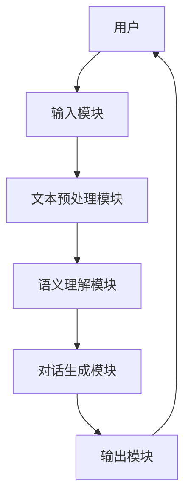
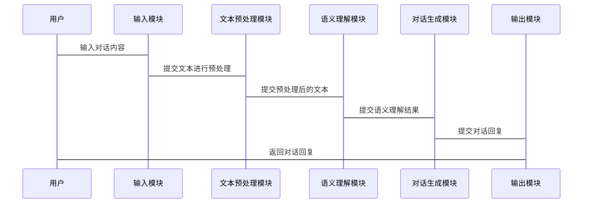

                 


# 自然语言处理技术在AI Agent中的应用

> 关键词：自然语言处理，AI Agent，NLP算法，对话系统，知识图谱

> 摘要：本文深入探讨了自然语言处理技术在AI Agent中的应用，从基础概念到核心算法，再到系统架构设计和实际项目实现，全面解析了NLP在AI Agent中的重要性与实现方式。通过具体案例分析，展示了如何利用NLP技术构建高效、智能的AI Agent系统。

---

# 第一部分: 自然语言处理技术基础

## 第1章: 自然语言处理与AI Agent概述

### 1.1 自然语言处理的定义与技术背景

自然语言处理（Natural Language Processing, NLP）是人工智能领域的重要分支，致力于让计算机能够理解、生成和处理人类的自然语言。NLP的核心目标是通过计算机技术来模拟人类对语言的理解和生成能力。

#### 1.1.1 自然语言处理的定义
自然语言处理是指计算机对人类语言进行理解、分析和生成的过程。它涵盖了从文本处理到语义理解的多个层次，主要包括以下内容：
- **文本处理**：对文本进行分词、词性标注、句法分析等基础处理。
- **语义理解**：理解文本的深层含义，包括实体识别、关系抽取、情感分析等。
- **文本生成**：根据输入生成符合语法规则和语义要求的文本。

#### 1.1.2 自然语言处理的核心技术
自然语言处理的核心技术可以分为以下几个方面：
1. **词法分析**：对文本进行分词、词性标注等基础处理。
2. **句法分析**：分析句子的语法结构，包括句法树的构建。
3. **语义分析**：理解文本的语义含义，包括实体识别、关系抽取等。
4. **文本生成**：根据输入生成自然语言文本，如机器翻译、对话生成等。

#### 1.1.3 自然语言处理的应用场景
自然语言处理技术广泛应用于多个领域，包括：
- **智能客服**：通过自然语言处理技术实现自动对话。
- **机器翻译**：将一种语言翻译成另一种语言。
- **情感分析**：分析用户对产品或服务的情感倾向。
- **信息提取**：从文本中提取特定信息，如时间、地点、人物等。

### 1.2 AI Agent的定义与特点

AI Agent（人工智能代理）是指能够感知环境并采取行动以实现目标的智能体。AI Agent的核心特点包括：
1. **自主性**：能够在没有外部干预的情况下自主运行。
2. **反应性**：能够感知环境并实时响应。
3. **主动性**：能够主动采取行动以实现目标。
4. **社会性**：能够与其他AI Agent或人类进行交互。

### 1.3 自然语言处理在AI Agent中的应用前景

自然语言处理技术在AI Agent中的应用前景广阔，主要体现在以下几个方面：
1. **智能对话系统**：通过自然语言处理技术实现与用户的自然对话。
2. **信息检索**：帮助AI Agent快速找到所需信息。
3. **知识推理**：通过自然语言处理技术进行知识推理和逻辑推理。

### 1.4 本章小结

本章主要介绍了自然语言处理和AI Agent的基本概念，分析了自然语言处理的核心技术和应用场景，展望了自然语言处理在AI Agent中的应用前景。

---

## 第2章: 自然语言处理的关键技术

### 2.1 词法分析

#### 2.1.1 什么是词法分析
词法分析是自然语言处理的基础步骤，主要用于将文本分割成词语或符号，并对每个词语进行词性标注。

#### 2.1.2 词法分析的实现方法
词法分析的实现方法主要包括以下几种：
1. **基于规则的方法**：通过预定义的规则进行分词和词性标注。
2. **基于统计的方法**：利用统计学模型进行分词和词性标注。
3. **深度学习方法**：利用神经网络模型进行词法分析。

#### 2.1.3 词法分析的应用场景
词法分析广泛应用于文本处理的各个领域，包括：
- **文本分词**：将文本分割成词语。
- **词性标注**：对每个词语进行词性标注。
- **命名实体识别**：识别文本中的专有名词。

### 2.2 句法分析

#### 2.2.1 什么是句法分析
句法分析是自然语言处理的重要步骤，主要用于分析句子的语法结构，包括句法树的构建。

#### 2.2.2 句法分析的实现方法
句法分析的实现方法主要包括以下几种：
1. **基于规则的方法**：通过预定义的句法规则进行句法分析。
2. **基于统计的方法**：利用统计学模型进行句法分析。
3. **深度学习方法**：利用神经网络模型进行句法分析。

#### 2.2.3 句法分析的应用场景
句法分析广泛应用于文本处理的各个领域，包括：
- **文本理解**：通过句法分析理解文本的语法结构。
- **机器翻译**：利用句法分析进行语法转换。
- **对话系统**：通过句法分析理解用户的输入。

### 2.3 语义分析

#### 2.3.1 什么是语义分析
语义分析是自然语言处理的重要步骤，主要用于理解文本的语义含义，包括实体识别、关系抽取、情感分析等。

#### 2.3.2 语义分析的实现方法
语义分析的实现方法主要包括以下几种：
1. **基于规则的方法**：通过预定义的语义规则进行语义分析。
2. **基于统计的方法**：利用统计学模型进行语义分析。
3. **深度学习方法**：利用神经网络模型进行语义分析。

#### 2.3.3 语义分析的应用场景
语义分析广泛应用于文本处理的各个领域，包括：
- **信息提取**：从文本中提取特定信息。
- **情感分析**：分析用户对产品或服务的情感倾向。
- **知识图谱构建**：通过语义分析构建知识图谱。

### 2.4 文本生成

#### 2.4.1 什么是文本生成
文本生成是自然语言处理的重要步骤，主要用于根据输入生成符合语法规则和语义要求的文本。

#### 2.4.2 文本生成的实现方法
文本生成的实现方法主要包括以下几种：
1. **基于模板的方法**：通过预定义的模板生成文本。
2. **基于统计的方法**：利用统计学模型生成文本。
3. **深度学习方法**：利用神经网络模型生成文本。

#### 2.4.3 文本生成的应用场景
文本生成广泛应用于文本处理的各个领域，包括：
- **机器翻译**：将一种语言翻译成另一种语言。
- **对话系统**：通过文本生成实现对话生成。
- **内容生成**：根据输入生成新闻、文章等内容。

### 2.5 本章小结

本章主要介绍了自然语言处理的关键技术，包括词法分析、句法分析、语义分析和文本生成的实现方法及应用场景。

---

## 第3章: 自然语言处理技术的算法原理

### 3.1 词袋模型

#### 3.1.1 词袋模型的定义
词袋模型是一种简单有效的文本表示方法，主要用于将文本转换为数值向量。

#### 3.1.2 词袋模型的实现流程
1. **文本分词**：将文本分割成词语。
2. **建立词汇表**：将所有出现的词语建立一个词汇表。
3. **生成向量**：根据词语在文本中的出现情况生成向量。

#### 3.1.3 词袋模型的优缺点
- **优点**：简单高效，适用于文本分类等任务。
- **缺点**：无法捕捉词语之间的顺序关系。

### 3.2 词嵌入

#### 3.2.1 什么是词嵌入
词嵌入是一种将词语映射到低维向量空间的技术，主要用于表示词语的语义信息。

#### 3.2.2 词嵌入的实现方法
1. **Word2Vec**：通过训练词嵌入模型生成词向量。
2. **GloVe**：基于全局词频统计生成词向量。
3. **FastText**：通过子词信息生成词向量。

#### 3.2.3 词嵌入的应用场景
- **文本分类**：利用词嵌入进行文本表示。
- **机器翻译**：利用词嵌入进行词语对齐。
- **对话系统**：利用词嵌入进行对话生成。

### 3.3 循环神经网络

#### 3.3.1 循环神经网络的定义
循环神经网络（Recurrent Neural Network, RNN）是一种用于处理序列数据的神经网络模型。

#### 3.3.2 循环神经网络的实现流程
1. **输入处理**：将输入序列转换为数值向量。
2. **网络训练**：通过反向传播算法训练网络参数。
3. **输出生成**：根据训练好的网络生成输出。

#### 3.3.3 循环神经网络的优缺点
- **优点**：能够处理序列数据，适用于文本生成等任务。
- **缺点**：存在梯度消失问题，难以处理长序列。

### 3.4 Transformer模型

#### 3.4.1 Transformer模型的定义
Transformer模型是一种基于注意力机制的深度学习模型，主要用于处理序列数据。

#### 3.4.2 Transformer模型的实现流程
1. **输入处理**：将输入序列转换为数值向量。
2. **自注意力机制**：计算输入序列中每个位置的注意力权重。
3. **前馈网络**：通过前馈网络生成输出。

#### 3.4.3 Transformer模型的优缺点
- **优点**：能够捕捉长距离依赖关系，适用于文本生成等任务。
- **缺点**：计算复杂度较高，需要较多计算资源。

### 3.5 本章小结

本章主要介绍了自然语言处理技术的算法原理，包括词袋模型、词嵌入、循环神经网络和Transformer模型的实现方法及应用场景。

---

## 第4章: 自然语言处理技术的系统架构设计

### 4.1 系统功能设计

#### 4.1.1 项目介绍
本项目旨在通过自然语言处理技术构建一个智能对话系统，实现与用户的自然对话。

#### 4.1.2 系统功能模块
1. **文本预处理模块**：对输入文本进行分词、词性标注等预处理。
2. **语义理解模块**：通过自然语言处理技术理解输入文本的语义。
3. **对话生成模块**：根据理解的语义生成对话回复。

#### 4.1.3 系统功能流程
1. **用户输入**：用户输入对话内容。
2. **文本预处理**：对输入文本进行分词、词性标注等预处理。
3. **语义理解**：通过自然语言处理技术理解输入文本的语义。
4. **对话生成**：根据理解的语义生成对话回复。
5. **输出回复**：将生成的回复返回给用户。

### 4.2 系统架构设计

#### 4.2.1 系统架构图


#### 4.2.2 系统接口设计
1. **输入接口**：用户输入对话内容。
2. **输出接口**：将生成的对话回复返回给用户。
3. **内部接口**：模块之间的数据传递接口。

#### 4.2.3 系统交互流程


### 4.3 本章小结

本章主要介绍了自然语言处理技术的系统架构设计，包括系统功能模块、系统架构图和系统交互流程。

---

## 第5章: 项目实战

### 5.1 环境安装

#### 5.1.1 安装Python
```bash
# 安装Python
sudo apt-get install python3
```

#### 5.1.2 安装必要的库
```bash
# 安装必要的库
pip install numpy
pip install pandas
pip install transformers
pip install torch
```

### 5.2 系统核心实现

#### 5.2.1 文本预处理模块实现
```python
import torch
from transformers import BertTokenizer, BertModel

class TextPreprocessing:
    def __init__(self):
        self.tokenizer = BertTokenizer.from_pretrained('bert-base-uncased')

    def preprocess(self, text):
        tokens = self.tokenizer.tokenize(text)
        return self.tokenizer.convert_tokens_to_ids(tokens)
```

#### 5.2.2 语义理解模块实现
```python
class SemanticUnderstanding:
    def __init__(self):
        self.model = BertModel.from_pretrained('bert-base-uncased')
        self.tokenizer = BertTokenizer.from_pretrained('bert-base-uncased')

    def understand(self, text):
        inputs = self.tokenizer.encode_plus(text, return_tensors='pt', padding=True, truncation=True)
        with torch.no_grad():
            outputs = self.model(**inputs)
        return outputs.last_hidden_state
```

#### 5.2.3 对话生成模块实现
```python
class DialogGeneration:
    def __init__(self):
        self.model = torch.load('dialog_model.pth')

    def generate(self, text):
        inputs = self.tokenizer.encode_plus(text, return_tensors='pt', padding=True, truncation=True)
        with torch.no_grad():
            outputs = self.model(**inputs)
        return self.tokenizer.decode(outputs.argmax(dim=-1).squeeze().tolist())
```

### 5.3 实际案例分析

#### 5.3.1 案例介绍
我们以智能对话系统为例，展示如何利用自然语言处理技术实现对话生成。

#### 5.3.2 代码实现
```python
from transformers import BertTokenizer, BertModel
import torch

class DialogSystem:
    def __init__(self):
        self.preprocess = TextPreprocessing()
        self.understand = SemanticUnderstanding()
        self.generate = DialogGeneration()

    def process_dialog(self, text):
        tokens = self.preprocess.preprocess(text)
        embeddings = self.understand.understand(text)
        response = self.generate.generate(tokens)
        return response

if __name__ == '__main__':
    dialog_system = DialogSystem()
    response = dialog_system.process_dialog("你好，我叫小明")
    print(response)
```

#### 5.3.3 案例分析
通过上述代码，我们可以实现一个简单的智能对话系统，用户可以与系统进行自然对话。

### 5.4 本章小结

本章通过一个实际案例展示了如何利用自然语言处理技术实现智能对话系统，包括环境安装、系统核心实现和实际案例分析。

---

## 第6章: 扩展内容

### 6.1 最佳实践 tips

1. **选择合适的模型**：根据具体任务选择合适的自然语言处理模型。
2. **数据预处理**：对数据进行充分的预处理，提高模型的性能。
3. **模型调优**：通过参数调优和模型优化提高模型的性能。

### 6.2 小结

本章主要总结了自然语言处理技术在AI Agent中的应用，通过实际案例展示了如何利用自然语言处理技术实现智能对话系统，并给出了最佳实践 tips。

### 6.3 注意事项

1. **数据隐私**：在实际应用中需要注意数据隐私问题。
2. **模型性能**：需要根据具体任务选择合适的模型，并进行充分的调优。
3. **用户体验**：需要关注用户体验，提高对话系统的交互性。

### 6.4 拓展阅读

1. **《自然语言处理入门》**：深入浅出地介绍了自然语言处理的基本概念和技术。
2. **《深度学习入门》**：介绍了深度学习的基本概念和技术，为自然语言处理提供了理论基础。
3. **《Transformer解构系列》**：详细讲解了Transformer模型的实现原理和应用场景。

---

# 作者：AI天才研究院/AI Genius Institute & 禅与计算机程序设计艺术 /Zen And The Art of Computer Programming

---

**本文完**

