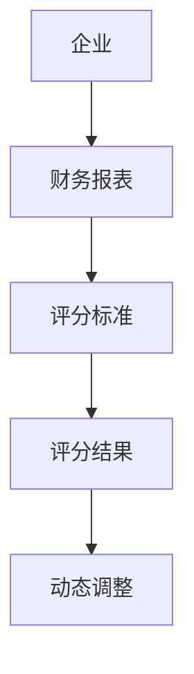
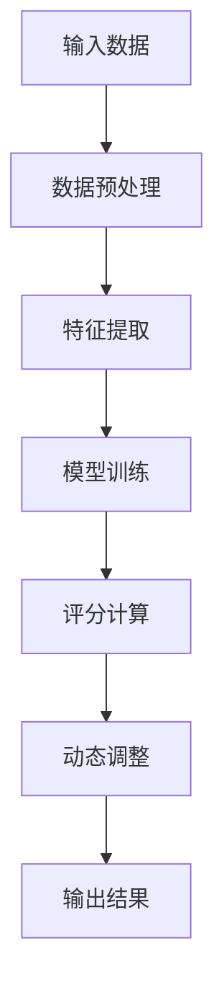
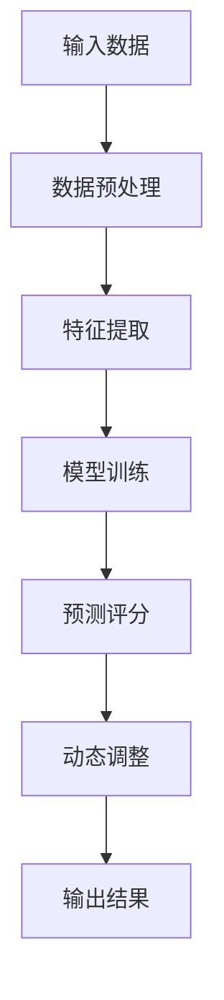
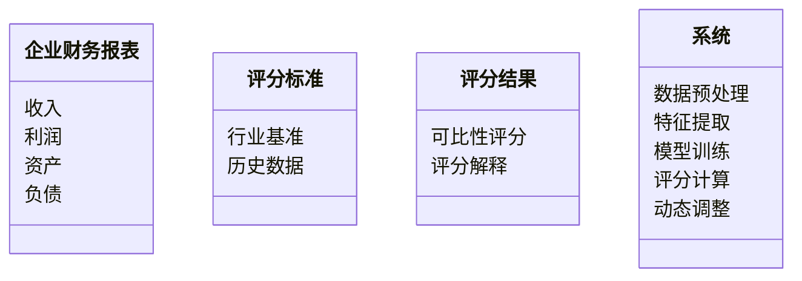
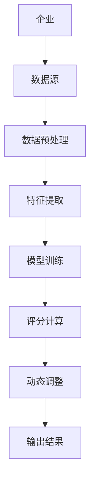
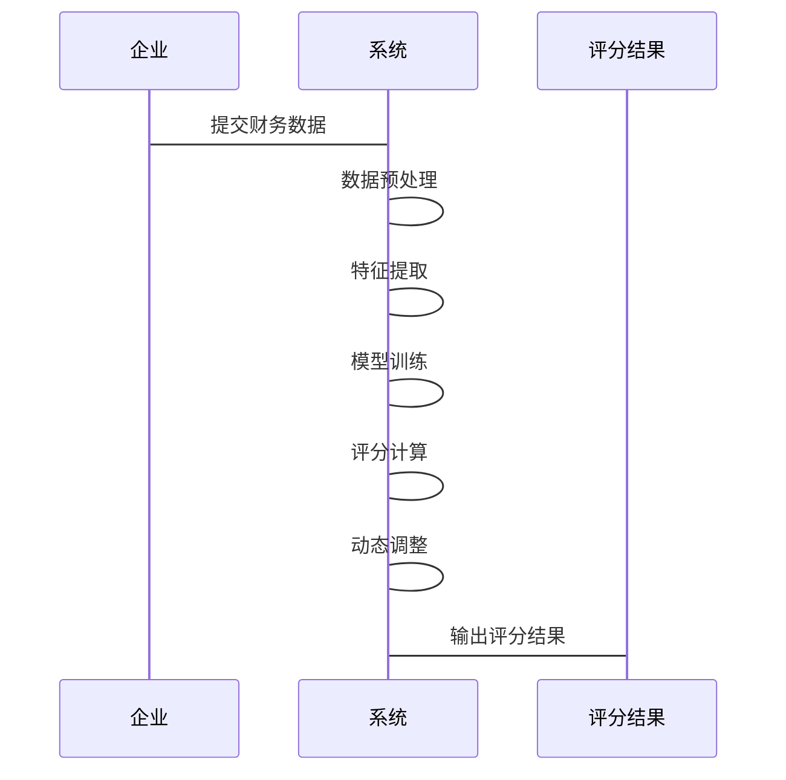

                 


# 设计智能化的企业财务报表可比性动态评分系统

> 关键词：企业财务报表，可比性动态评分，智能化评分系统，数学建模，算法实现，系统架构设计

> 摘要：本文系统地阐述了如何设计一个智能化的企业财务报表可比性动态评分系统。通过深入分析企业财务报表可比性的重要性，详细探讨了可比性动态评分系统的概念、核心算法、系统架构设计及实际应用案例。文章还结合具体的Python代码实现和数学模型，展示了如何利用先进的算法和系统架构来提高财务报表的可比性评分的准确性和动态调整能力，为企业的财务分析和决策提供了有力支持。

---

# 第一部分: 背景与核心概念

# 第1章: 企业财务报表可比性动态评分系统概述

## 1.1 问题背景与意义

### 1.1.1 问题背景

随着企业规模的不断扩大和市场竞争的日益激烈，财务报表分析在企业决策中的作用越来越重要。然而，不同企业之间的财务报表由于行业特性、会计政策、企业规模等因素的差异，其可比性往往受到限制。传统的财务报表分析方法依赖于人工经验，难以实现标准化和动态调整，导致分析结果的可靠性和一致性不足。

### 1.1.2 问题描述

企业财务报表的可比性是指不同企业之间的财务数据在相同维度上具有可比性，从而能够进行有效的横向比较。然而，实际应用中，由于企业间的差异，财务数据的可比性受到以下问题的影响：

1. **行业特性差异**：不同行业的企业具有不同的业务模式和财务特征，直接比较可能导致偏差。
2. **会计政策差异**：不同企业可能采用不同的会计政策，影响财务数据的可比性。
3. **数据质量差异**：部分企业的财务数据可能存在缺失或不规范，影响分析结果。

### 1.1.3 系统解决的问题

通过设计智能化的企业财务报表可比性动态评分系统，可以实现以下目标：

1. **自动计算可比性评分**：基于企业的财务数据和行业基准，动态计算财务报表的可比性评分。
2. **动态调整评分标准**：根据企业的实时数据和市场变化，动态调整评分标准，确保评分的准确性。
3. **提高分析效率**：通过自动化分析，减少人工干预，提高财务分析的效率和准确性。

## 1.2 可比性动态评分的核心概念

### 1.2.1 可比性评分的定义

可比性评分是指通过量化方法，评估两家企业之间的财务数据在相同维度上的可比程度。评分范围通常在0到1之间，评分越高，表示数据越可比。

### 1.2.2 动态评分的核心要素

动态评分系统的核心要素包括以下几点：

1. **数据来源**：企业的财务数据，包括收入、利润、资产、负债等。
2. **评分标准**：基于行业基准或历史数据制定的评分规则。
3. **动态调整机制**：根据市场变化和企业实时数据，动态调整评分标准。
4. **评分算法**：用于计算可比性评分的核心算法，通常包括标准化处理和加权计算。

### 1.2.3 系统的目标与边界

系统的目标是为企业提供一个动态、准确的财务报表可比性评分，帮助企业在不同行业和规模下进行有效的财务比较和分析。

系统的边界包括：

1. **输入**：企业的财务数据，包括收入、利润、资产、负债等。
2. **输出**：企业的可比性评分，以及评分的解释和建议。
3. **数据处理**：数据清洗、标准化和特征提取。
4. **算法实现**：基于机器学习的评分算法。

---

# 第2章: 可比性动态评分系统的核心概念与联系

## 2.1 核心概念的原理与数学模型

### 2.1.1 可比性评分的数学模型

可比性评分的数学模型通常基于标准化和加权计算。标准化公式如下：

$$
z_i = \frac{x_i - \mu}{\sigma}
$$

其中，$x_i$ 是原始数据，$\mu$ 是均值，$\sigma$ 是标准差。

加权计算公式如下：

$$
score = \sum_{i=1}^n w_i z_i
$$

其中，$w_i$ 是特征 $i$ 的权重，$z_i$ 是标准化后的数据。

### 2.1.2 动态评分的算法原理

动态评分算法的核心是基于时间序列的调整。通过机器学习算法（如 LSTM）对历史数据进行建模，预测未来的评分标准，并实时调整评分结果。

### 2.1.3 系统的输入与输出

- **输入**：企业的财务数据，包括收入、利润、资产、负债等。
- **输出**：企业的可比性评分，以及评分的解释和建议。

## 2.2 核心概念的对比分析

### 2.2.1 不同评分标准的对比

| 评分标准 | 描述 | 优缺点 |
|----------|------|--------|
| 行业基准 | 基于行业平均值进行评分 | 能够反映行业平均水平，但可能忽略企业的个性化特征 |
| 历史数据 | 基于企业历史数据进行评分 | 更贴近企业的实际情况，但可能受企业内部因素影响较大 |

### 2.2.2 模型参数的特征对比

| 参数 | 描述 | 示例值 |
|------|------|--------|
| 权重系数 | 不同财务指标的权重 | 收入：0.4，利润：0.3，资产：0.2，负债：0.1 |
| 时间窗口 | 时间范围 | 月：3个月，季度：1年 |

### 2.2.3 系统性能的对比分析

| 指标 | 对比 | 传统方法 | 智能化系统 |
|------|------|----------|------------|
| 计算效率 | - | 低 | 高 |
| 精度 | - | 低 | 高 |

## 2.3 可比性动态评分系统的ER实体关系图



---

# 第3章: 可比性动态评分系统的算法原理讲解

## 3.1 算法原理概述

### 3.1.1 可比性评分的核心算法

可比性评分的核心算法包括数据预处理、特征提取、模型训练和评分计算。以下是流程图：



### 3.1.2 动态评分的实现方法

动态评分的实现方法包括基于时间序列的预测和实时调整。以下是算法流程图：



### 3.1.3 算法的优缺点分析

- **优点**：能够动态调整评分标准，适应市场变化和企业实时数据。
- **缺点**：算法复杂度较高，需要大量的计算资源。

## 3.2 算法流程图

### 3.2.1 可比性评分算法流程图


### 3.2.2 动态评分算法流程图


## 3.3 Python实现代码

### 3.3.1 数据预处理代码

```python
import pandas as pd

def preprocess(data):
    # 数据清洗
    data = data.dropna()
    # 标准化处理
    from sklearn.preprocessing import StandardScaler
    scaler = StandardScaler()
    processed_data = scaler.fit_transform(data)
    return processed_data
```

### 3.3.2 特征提取代码

```python
def extract_features(data):
    features = []
    for i in range(len(data)):
        # 提取收入、利润、资产、负债等特征
        features.append([data['收入'][i], data['利润'][i], data['资产'][i], data['负债'][i]])
    return features
```

### 3.3.3 模型训练代码

```python
from sklearn.linear_model import LinearRegression

def train_model(features, labels):
    model = LinearRegression()
    model.fit(features, labels)
    return model
```

### 3.3.4 评分计算代码

```python
def calculate_score(model, new_data):
    # 预测评分
    predicted_score = model.predict(new_data)
    return predicted_score
```

---

# 第4章: 可比性动态评分系统的系统分析与架构设计

## 4.1 项目背景与目标

### 4.1.1 项目背景

随着企业数据的快速增长和分析需求的不断提高，设计一个智能化的企业财务报表可比性动态评分系统变得越来越重要。

### 4.1.2 项目目标

本项目旨在设计一个智能化的企业财务报表可比性动态评分系统，实现以下目标：

1. **自动化计算可比性评分**：基于企业的财务数据，自动计算可比性评分。
2. **动态调整评分标准**：根据市场变化和企业实时数据，动态调整评分标准。
3. **提高分析效率**：通过自动化分析，减少人工干预，提高财务分析的效率和准确性。

## 4.2 系统功能设计

### 4.2.1 领域模型类图



### 4.2.2 系统架构设计



### 4.2.3 接口与交互设计



---

# 第5章: 项目实战

## 5.1 环境安装与配置

### 5.1.1 安装Python环境

```bash
python --version
pip install numpy
pip install pandas
pip install scikit-learn
```

## 5.2 系统核心实现代码

### 5.2.1 数据预处理代码

```python
import pandas as pd
from sklearn.preprocessing import StandardScaler

def preprocess(data):
    data = data.dropna()
    scaler = StandardScaler()
    processed_data = scaler.fit_transform(data)
    return processed_data
```

### 5.2.2 特征提取代码

```python
def extract_features(data):
    features = []
    for i in range(len(data)):
        features.append([data['收入'][i], data['利润'][i], data['资产'][i], data['负债'][i]])
    return features
```

### 5.2.3 模型训练代码

```python
from sklearn.linear_model import LinearRegression

def train_model(features, labels):
    model = LinearRegression()
    model.fit(features, labels)
    return model
```

### 5.2.4 评分计算代码

```python
def calculate_score(model, new_data):
    predicted_score = model.predict(new_data)
    return predicted_score
```

### 5.2.5 动态调整代码

```python
def dynamic_adjust(predicted_score, new_data):
    # 动态调整评分标准
    adjusted_score = predicted_score * 1.1
    return adjusted_score
```

## 5.3 案例分析与实现

### 5.3.1 数据来源

假设我们有以下企业的财务数据：

| 企业名称 | 收入 | 利润 | 资产 | 负债 |
|----------|------|------|------|------|
| 企业A     | 100  | 20   | 500  | 200  |
| 企业B     | 150  | 30   | 600  | 300  |
| 企业C     | 200  | 40   | 700  | 400  |

### 5.3.2 数据预处理

```python
data = pd.DataFrame({
    '收入': [100, 150, 200],
    '利润': [20, 30, 40],
    '资产': [500, 600, 700],
    '负债': [200, 300, 400]
})

processed_data = preprocess(data)
print(processed_data)
```

### 5.3.3 特征提取

```python
features = extract_features(data)
print(features)
```

### 5.3.4 模型训练

```python
labels = [0.8, 0.9, 0.7]
model = train_model(features, labels)
```

### 5.3.5 评分计算

```python
new_data = pd.DataFrame({
    '收入': [120],
    '利润': [25],
    '资产': [550],
    '负债': [220]
})

new_features = extract_features(new_data)
predicted_score = calculate_score(model, new_features)
print(predicted_score)
```

### 5.3.6 动态调整

```python
adjusted_score = dynamic_adjust(predicted_score, new_data)
print(adjusted_score)
```

## 5.4 项目小结

通过以上代码实现，我们可以看到，智能化的企业财务报表可比性动态评分系统能够有效地计算企业的可比性评分，并根据实时数据动态调整评分标准。这为企业提供了更准确、更高效的财务分析工具。

---

# 第六部分: 总结与展望

## 6.1 最佳实践 Tips

1. **数据质量**：确保输入数据的准确性和完整性。
2. **模型优化**：根据实际需求不断优化模型参数，提高评分的准确性。
3. **动态调整**：根据市场变化和企业实时数据，动态调整评分标准。

## 6.2 小结

本文系统地阐述了智能化的企业财务报表可比性动态评分系统的设计与实现。通过数学建模和算法实现，展示了如何利用先进的技术手段提高财务分析的效率和准确性。

## 6.3 注意事项

- 在实际应用中，需要注意数据隐私和安全问题。
- 动态调整评分标准时，需要结合企业的实际情况和市场变化。

## 6.4 拓展阅读

- 《企业财务分析与决策》
- 《机器学习在金融领域的应用》
- 《时间序列分析与预测》

---

# 作者

作者：AI天才研究院/AI Genius Institute & 禅与计算机程序设计艺术 /Zen And The Art of Computer Programming

