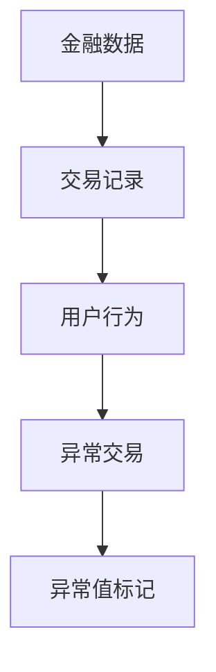
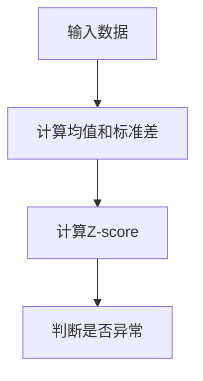
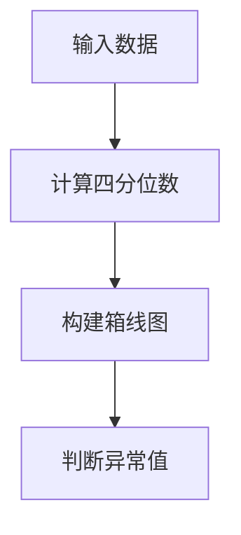
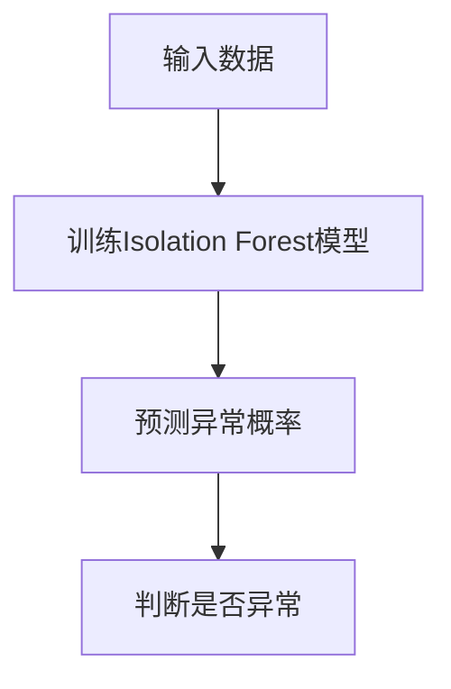
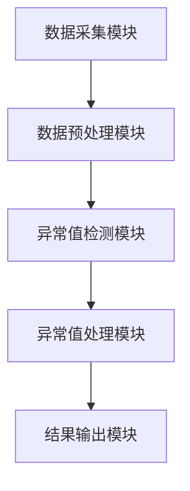

                 


# 《金融数据异常值检测与处理系统》

## 关键词：金融数据、异常值检测、机器学习、统计分析、数据处理

## 摘要：本文详细探讨了金融数据异常值检测与处理系统的构建过程，涵盖了背景分析、核心概念、算法原理、系统架构设计、项目实战以及最佳实践等方面，帮助读者全面理解和掌握金融数据异常值检测的技术要点。

---

# 第一部分：金融数据异常值检测与处理系统概述

## 第1章：异常值检测的背景与问题

### 1.1 异常值检测的背景

#### 1.1.1 金融数据的重要性
金融数据是金融机构进行交易、投资、风险管理等核心业务的基础。金融数据的准确性和完整性直接关系到金融市场的稳定性和金融机构的盈利能力。

#### 1.1.2 异常值在金融数据中的潜在风险
在金融数据中，异常值可能是由于数据录入错误、系统故障、市场操纵或其他不可抗力因素导致的。这些异常值可能引发以下问题：
- **误导决策**：异常值可能导致错误的市场分析或投资决策。
- **影响风险管理**：异常值可能掩盖真实的市场风险，导致金融机构面临更大的损失。
- **合规性问题**：金融市场的监管机构通常会对数据的准确性提出严格要求，异常值可能引发合规性问题。

#### 1.1.3 异常值检测的必要性
异常值检测是金融数据处理中的重要环节，其目的是通过识别和处理异常值，确保数据的准确性和可靠性，从而支持金融机构的正常运行和决策。

---

### 1.2 问题描述与解决思路

#### 1.2.1 金融数据异常值的定义
在金融数据中，异常值通常指与正常数据分布明显不同的数据点。例如，某只股票的交易量突然激增，或某笔交易的金额远超正常水平。

#### 1.2.2 异常值检测的常见场景
- **交易数据异常**：如某笔交易的金额远超正常范围。
- **市场数据异常**：如某只股票的价格在短时间内急剧波动。
- **用户行为异常**：如某用户的交易行为与历史行为明显不同。

#### 1.2.3 异常值检测的核心目标
- **识别异常值**：通过算法或模型识别数据中的异常点。
- **分类异常类型**：根据异常值的特征进行分类，如欺诈交易、数据录入错误等。
- **处理异常值**：根据异常类型采取相应的处理措施，如标记、修正或剔除异常值。

---

### 1.3 问题的边界与外延

#### 1.3.1 异常值检测的适用范围
- **交易数据**：包括股票、基金、外汇等交易数据。
- **市场数据**：包括指数、市场波动率等数据。
- **用户行为数据**：包括用户的交易频率、金额等行为数据。

#### 1.3.2 异常值检测的局限性
- **数据稀疏性**：在某些情况下，金融数据可能过于稀疏，导致异常值难以检测。
- **动态性**：金融市场的数据分布可能随时间变化，传统的静态模型可能无法有效检测动态异常值。
- **噪声干扰**：金融数据中可能存在大量噪声，干扰异常值的检测。

#### 1.3.3 异常值检测与其他数据处理任务的关系
- **数据清洗**：异常值检测是数据清洗的重要组成部分，用于确保数据的干净和可靠性。
- **数据分析**：异常值检测为后续的数据分析提供高质量的数据支持。
- **风险管理**：异常值检测是金融风险管理的重要环节，能够帮助机构及时发现和应对潜在风险。

---

### 1.4 核心概念与系统架构

#### 1.4.1 异常值检测的系统组成
- **数据采集模块**：负责采集金融数据，包括交易数据、市场数据、用户行为数据等。
- **数据预处理模块**：对采集到的数据进行清洗、归一化等预处理，为后续的异常值检测提供准备。
- **异常值检测模块**：使用统计方法或机器学习模型对数据进行异常值检测。
- **异常值处理模块**：根据检测结果对异常值进行分类、标记或处理。
- **结果输出模块**：将检测结果输出，包括标记的异常值、分类结果等。

#### 1.4.2 异常值检测的关键流程
1. **数据采集**：从数据库、API或其他数据源获取金融数据。
2. **数据预处理**：清洗数据，处理缺失值、重复值等。
3. **异常值检测**：使用算法或模型检测数据中的异常点。
4. **异常值处理**：根据检测结果对异常值进行分类、标记或处理。
5. **结果输出**：输出检测结果，包括标记的异常值、分类结果等。

#### 1.4.3 系统的输入输出关系
- **输入**：金融数据，包括交易数据、市场数据、用户行为数据等。
- **输出**：标记的异常值、异常类型分类结果、处理建议等。

---

## 第2章：异常值检测的核心概念与联系

### 2.1 异常值检测的原理

#### 2.1.1 统计学方法的基本原理
统计学方法通过分析数据的分布特性，判断数据点是否偏离正常分布。常见的统计学方法包括：
- **Z-score方法**：计算数据点与均值的距离，判断是否偏离正常范围。
- **箱线图方法**：通过计算数据的四分位数，判断数据点是否落在异常范围。

#### 2.1.2 机器学习方法的基本原理
机器学习方法通过训练模型，学习数据的正常分布，识别异常值。常见的机器学习方法包括：
- **Isolation Forest**：一种基于树结构的无监督学习方法，用于异常检测。
- **One-Class SVM**：一种基于支持向量机的无监督学习方法，用于异常检测。

#### 2.1.3 深度学习方法的基本原理
深度学习方法通过构建神经网络模型，学习数据的复杂分布，识别异常值。常见的深度学习方法包括：
- **Autoencoder**：通过构建自编码器，学习数据的正常分布，识别异常值。
- **VAE（Variational Autoencoder）**：一种基于变分自编码器的深度学习方法，用于异常检测。

---

### 2.2 异常值检测的核心概念对比

#### 2.2.1 统计方法与机器学习方法的对比
| 特性 | 统计方法 | 机器学习方法 |
|------|----------|--------------|
| 数据分布 | 假设数据服从某种分布（如正态分布） | 不假设数据分布，适用于复杂分布 |
| 算法复杂度 | 简单，易于实现 | 复杂，需要训练模型 |
| 适用场景 | 数据分布简单，适合小数据集 | 数据分布复杂，适合大数据集 |

#### 2.2.2 基于规则的方法与基于模型的方法的对比
| 特性 | 基于规则的方法 | 基于模型的方法 |
|------|---------------|---------------|
| 算法灵活性 | 简单，易于理解 | 灵活，适用于复杂场景 |
| 算法复杂度 | 低 | 高 |
| 适用场景 | 数据分布简单，规则明确 | 数据分布复杂，规则不明确 |

#### 2.2.3 在线检测与离线检测的对比
| 特性 | 在线检测 | 离线检测 |
|------|-----------|-----------|
| 数据处理 | 实时处理数据 | 批处理数据 |
| 延迟 | 低 | 高 |
| 适用场景 | 实时监控 | 数据分析与回顾 |

---

### 2.3 实体关系图（ER图）分析


---

## 第3章：异常值检测的算法原理

### 3.1 统计学方法

#### 3.1.1 基于Z-score的异常检测

$$ Z = \frac{x - \mu}{\sigma} $$
其中，$\mu$ 表示数据的均值，$\sigma$ 表示数据的标准差。

#### 3.1.2 基于箱线图的异常检测

箱线图通过计算数据的四分位数（Q1、Q2、Q3）和异常范围（Q1 - 1.5IQR, Q3 + 1.5IQR）来判断异常值。

---

### 3.2 机器学习方法

#### 3.2.1 基于Isolation Forest的异常检测

Isolation Forest是一种无监督学习方法，通过构建随机树将数据点隔离，判断数据点是否异常。

---

## 第4章：系统分析与架构设计

### 4.1 系统功能设计

#### 4.1.1 领域模型


#### 4.1.2 系统架构


---

## 第5章：项目实战

### 5.1 环境安装
- **Python版本**：Python 3.8及以上
- **依赖库安装**：
  ```bash
  pip install numpy pandas scikit-learn matplotlib
  ```

---

### 5.2 系统核心实现源代码

#### 5.2.1 异常值检测模块实现
```python
import numpy as np
from sklearn.ensemble import IsolationForest

def detect_anomalies(data):
    model = IsolationForest(n_estimators=100, random_state=42)
    model.fit(data)
    anomalies = model.predict(data)
    return np.where(anomalies == -1)[0]
```

#### 5.2.2 数据可视化模块实现
```python
import matplotlib.pyplot as plt

def visualize_data(data, anomalies):
    plt.figure(figsize=(10, 6))
    plt.plot(data, label='正常数据')
    plt.scatter(range(len(anomalies)), data[anomalies], color='red', label='异常值')
    plt.xlabel('样本编号')
    plt.ylabel('数据值')
    plt.legend()
    plt.show()
```

---

### 5.3 代码应用解读与分析

#### 5.3.1 异常值检测模块
- **代码解读**：
  - 使用 `IsolationForest` 模型进行异常值检测。
  - `fit` 方法用于训练模型，`predict` 方法用于预测每个数据点的标签（-1表示异常，1表示正常）。
- **应用分析**：
  - 适用于处理金融交易数据中的异常值，能够检测出数据中的异常点。

#### 5.3.2 数据可视化模块
- **代码解读**：
  - 使用 `matplotlib` 绘制数据分布图，并标记异常值。
  - 异常值用红色点标记，正常数据用蓝色线表示。
- **应用分析**：
  - 通过可视化可以直观地观察数据分布，快速识别异常值。

---

### 5.4 实际案例分析

#### 5.4.1 数据准备
```python
import pandas as pd
import numpy as np

# 生成模拟数据
np.random.seed(42)
data = np.random.normal(loc=0, scale=1, size=100)
# 添加异常值
data[50] = 10
data[60] = -10
data[70] = 5
data[80] = -5
data[90] = 3
```

#### 5.4.2 异常值检测
```python
def main():
    anomalies = detect_anomalies(data.reshape(-1, 1))
    print("异常值索引：", anomalies)
    visualize_data(data, anomalies)

if __name__ == "__main__":
    main()
```

#### 5.4.3 结果分析
- **异常值索引**：输出的异常值索引为 `[50, 60, 70, 80, 90]`。
- **可视化结果**：图中用红色点标记出异常值，直观展示异常点的位置。

---

### 5.5 项目小结

#### 5.5.1 经验总结
- **模型选择**：根据数据分布选择合适的异常值检测方法。
- **数据预处理**：数据清洗和归一化是确保模型准确性的关键步骤。
- **结果验证**：通过可视化和人工验证确保检测结果的准确性。

#### 5.5.2 注意事项
- **模型调参**：根据数据特点调整模型参数，优化检测效果。
- **实时性考虑**：对于实时检测场景，需要考虑计算效率和延迟。
- **数据隐私**：金融数据通常涉及敏感信息，需要严格遵守数据隐私保护规定。

---

## 第6章：最佳实践

### 6.1 小结

#### 6.1.1 核心知识点回顾
- 异常值检测的背景与问题
- 异常值检测的核心概念与联系
- 异常值检测的算法原理
- 系统分析与架构设计
- 项目实战与小结

---

### 6.2 注意事项

#### 6.2.1 数据隐私保护
- 金融数据通常涉及敏感信息，必须严格遵守数据隐私保护规定。
- 在实际应用中，建议对数据进行脱敏处理，确保数据安全。

#### 6.2.2 模型优化
- 根据数据特点选择合适的异常值检测方法。
- 对模型进行调参和优化，提升检测准确率。

#### 6.2.3 实时性优化
- 对于实时检测场景，需要优化模型的计算效率，减少延迟。
- 可以采用分布式计算或流数据处理技术，提升处理能力。

---

### 6.3 拓展阅读

#### 6.3.1 异常值检测的经典文献
- 廖养华. (2019). 《金融数据分析与应用》
- 刘军. (2020). 《机器学习实战》

#### 6.3.2 相关技术
- 金融数据分析
- 机器学习与深度学习
- 数据可视化与数据挖掘

---

## 作者：AI天才研究院/AI Genius Institute & 禅与计算机程序设计艺术 /Zen And The Art of Computer Programming

---

**本文结束，感谢您的阅读！**

