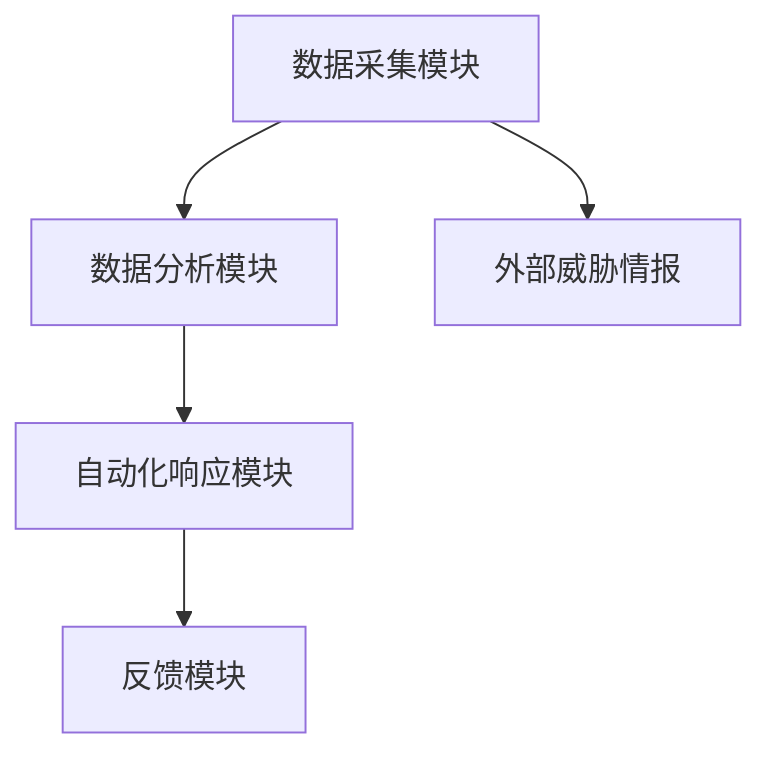
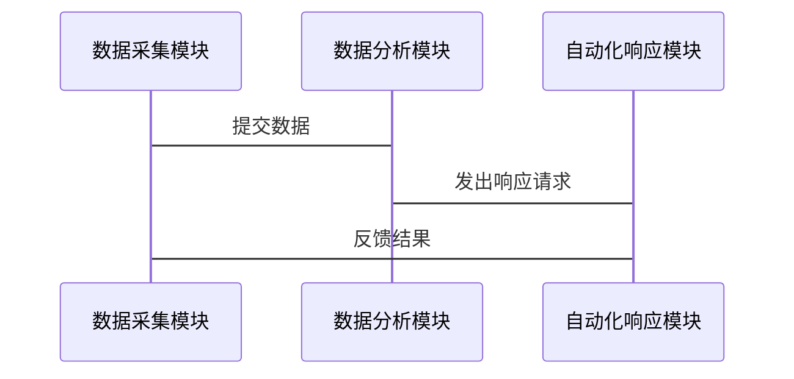

                 


# AI Agent在企业网络安全态势感知与主动防御中的应用

---

## 关键词：  
AI Agent, 企业网络安全, 态势感知, 主动防御, 机器学习, 网络安全威胁, 自动化响应

---

## 摘要：  
随着企业网络环境的复杂化和网络安全威胁的多样化，传统的被动防御方式已经难以应对日益严峻的安全挑战。AI Agent（人工智能代理）作为一种智能化的安全解决方案，能够通过实时数据分析、智能决策和自动化响应，显著提升企业网络安全的态势感知能力和主动防御能力。本文将深入探讨AI Agent在企业网络安全中的应用场景、核心算法、系统架构设计及实际案例，为企业构建智能化的安全防护体系提供理论支持和实践指导。

---

# 第1章: 背景介绍

## 1.1 网络安全现状与挑战

### 1.1.1 传统网络安全的局限性  
传统的网络安全防御主要依赖规则匹配、防火墙和入侵检测系统等技术，存在以下问题：  
1. **静态规则**：难以应对快速变化的攻击手段。  
2. **人工干预依赖**：需要大量安全专家进行监控和响应。  
3. **漏报与误报**：传统系统容易受到噪声干扰，导致误报或漏报。  

### 1.1.2 当前网络安全的主要威胁  
- **高级持续性威胁（APT）**：攻击者利用复杂的技术手段，长期潜伏在企业网络中。  
- **零日漏洞**：未被发现的漏洞可能被恶意利用。  
- **内部威胁**：员工误操作或恶意行为对企业安全构成威胁。  

### 1.1.3 企业网络安全的复杂性与动态性  
企业网络环境日益复杂，涵盖云、端点、物联网等多种设备和应用场景，传统的被动防御方式已难以满足需求。

---

## 1.2 AI Agent的应用价值  

### 1.2.1 AI Agent在网络安全中的优势  
- **智能化分析**：通过机器学习算法，AI Agent能够从海量数据中发现异常模式。  
- **实时响应**：AI Agent可以快速识别威胁并触发自动化响应措施。  
- **适应性更强**：AI Agent能够动态调整防御策略，适应不断变化的安全威胁。  

### 1.2.2 网络安全态势感知与主动防御的需求  
- **态势感知**：需要实时监控网络状态，识别潜在威胁。  
- **主动防御**：需要基于威胁情报，主动采取措施阻止攻击。  

### 1.2.3 AI Agent在企业网络安全中的应用前景  
AI Agent通过智能化分析和自动化响应，能够显著提升企业网络安全的主动防御能力和应对复杂威胁的能力。

---

## 1.3 本章小结  
本章介绍了当前网络安全面临的挑战，分析了传统防御方式的局限性，并提出了AI Agent在网络安全中的应用价值。通过AI Agent，企业能够实现更智能、更高效的网络安全防护。

---

# 第2章: AI Agent的核心概念与工作原理

## 2.1 AI Agent的定义与分类  

### 2.1.1 AI Agent的基本定义  
AI Agent是一种能够感知环境、自主决策并采取行动的智能体。在网络安全领域，AI Agent通常用于威胁检测、异常行为分析和自动化响应。  

### 2.1.2 基于规则的AI Agent与基于模型的AI Agent  
- **基于规则的AI Agent**：依赖预定义的规则进行决策，适用于已知威胁的检测。  
- **基于模型的AI Agent**：通过机器学习模型进行数据分析，适用于未知威胁的发现。  

### 2.1.3 AI Agent在网络安全中的角色  
- **数据采集与处理**：收集网络流量、日志等数据。  
- **智能分析与决策**：通过算法识别潜在威胁。  
- **自动化响应**：根据分析结果采取相应措施。  

---

## 2.2 AI Agent的核心工作原理  

### 2.2.1 数据采集与处理  
AI Agent通过网络传感器、日志系统等采集网络数据，并进行预处理（如去噪、标准化）。  

### 2.2.2 智能分析与决策  
基于机器学习算法（如决策树、随机森林、神经网络等），AI Agent对数据进行分析，识别异常行为和潜在威胁。  

### 2.2.3 自动化响应与反馈  
AI Agent根据分析结果采取自动化响应措施（如隔离异常设备、阻断恶意流量），并根据反馈不断优化模型。  

---

## 2.3 AI Agent与其他技术的关联  

### 2.3.1 AI Agent与机器学习的关系  
AI Agent的核心技术是机器学习，通过算法实现威胁检测和预测。  

### 2.3.2 AI Agent与网络安全框架的结合  
AI Agent可以与企业现有的网络安全框架（如零信任架构）相结合，提升整体安全防护能力。  

### 2.3.3 AI Agent与企业安全策略的整合  
AI Agent通过分析企业安全策略，动态调整防御策略，确保安全措施的有效性。  

---

## 2.4 本章小结  
本章详细介绍了AI Agent的定义、分类和工作原理，并分析了其与其他技术的关联。AI Agent通过机器学习算法和自动化响应，能够显著提升网络安全防护能力。

---

# 第3章: 网络安全态势感知的核心原理

## 3.1 网络安全态势感知的定义  

### 3.1.1 网络安全态势感知的定义  
网络安全态势感知是指通过实时监控网络环境，识别潜在威胁，并评估当前安全状态的过程。  

### 3.1.2 网络安全态势感知的目标  
- **识别威胁**：发现潜在的网络攻击行为。  
- **评估风险**：量化威胁对企业安全的影响。  
- **制定策略**：根据风险评估结果，制定防御策略。  

### 3.1.3 网络安全态势感知的关键技术  
- **数据采集**：通过传感器和日志系统收集网络数据。  
- **数据融合**：整合多源数据，提高分析准确性。  
- **智能分析**：利用机器学习算法进行威胁检测和预测。  

---

## 3.2 网络安全态势感知的技术框架  

### 3.2.1 数据采集层  
- **数据源**：网络流量、系统日志、应用日志等。  
- **数据预处理**：去噪、标准化、归档。  

### 3.2.2 数据分析层  
- **威胁检测**：通过机器学习模型识别异常行为。  
- **风险评估**：量化威胁对企业的影响。  

### 3.2.3 决策支持层  
- **防御策略制定**：根据分析结果，动态调整防御策略。  
- **决策支持**：为安全团队提供实时建议。  

---

## 3.3 网络安全态势感知的实现方法  

### 3.3.1 基于统计的方法  
- **统计分析**：通过分析网络流量的统计特征，识别异常行为。  
- **聚类分析**：将相似的流量聚类，发现潜在威胁。  

### 3.3.2 基于机器学习的方法  
- **监督学习**：使用标记数据训练模型，识别已知威胁。  
- **无监督学习**：通过聚类和异常检测，发现未知威胁。  
- **强化学习**：通过不断试错，优化防御策略。  

---

## 3.4 本章小结  
本章介绍了网络安全态势感知的核心原理和技术框架，并分析了基于统计和机器学习的实现方法。通过这些方法，企业能够更好地识别威胁并制定有效的防御策略。

---

# 第4章: AI Agent在主动防御中的应用

## 4.1 AI Agent的主动防御机制  

### 4.1.1 威胁检测与预测  
AI Agent通过机器学习算法实时监控网络流量，预测潜在威胁。  

### 4.1.2 异常行为分析  
AI Agent能够识别异常行为模式，提前发现潜在攻击。  

### 4.1.3 自动化响应与修复  
AI Agent根据分析结果，自动触发防御措施（如阻断攻击、隔离设备）并修复漏洞。  

---

## 4.2 AI Agent的主动防御策略  

### 4.2.1 威胁情报驱动的防御  
AI Agent利用外部威胁情报，增强威胁检测能力。  

### 4.2.2 动态防御策略  
AI Agent根据实时威胁情况，动态调整防御策略。  

### 4.2.3 多层防御机制  
通过多层次的防御措施（如网络层、应用层），提高整体安全性。  

---

## 4.3 AI Agent的响应机制  

### 4.3.1 自动化响应  
AI Agent在检测到威胁后，立即采取行动（如切断网络连接、删除恶意文件）。  

### 4.3.2 人工干预辅助  
在复杂情况下，AI Agent可以向安全团队发出警报，辅助人工决策。  

### 4.3.3 响应结果反馈  
AI Agent根据响应结果优化模型，提高后续威胁检测的准确性。  

---

## 4.4 本章小结  
本章分析了AI Agent在主动防御中的应用，包括威胁检测、异常行为分析和自动化响应。通过这些机制，AI Agent能够显著提升企业的网络安全防护能力。

---

# 第5章: AI Agent算法原理与实现

## 5.1 常见的AI算法在网络安全中的应用  

### 5.1.1 监督学习算法  
- **决策树**：用于分类网络流量，识别正常与异常行为。  
- **随机森林**：通过集成学习，提高分类准确性。  
- **支持向量机（SVM）**：适用于高维数据的分类问题。  

### 5.1.2 无监督学习算法  
- **聚类分析**：用于发现异常行为模式。  
- **主成分分析（PCA）**：降低数据维度，提高分析效率。  

### 5.1.3 强化学习算法  
- **Q-learning**：适用于动态环境中的决策问题。  

---

## 5.2 算法实现与代码示例  

### 5.2.1 基于决策树的威胁检测  
```python
from sklearn.tree import DecisionTreeClassifier
import pandas as pd

# 数据加载与预处理
data = pd.read_csv('network_traffic.csv')
features = data.drop('label', axis=1)
labels = data['label']

# 模型训练
model = DecisionTreeClassifier()
model.fit(features, labels)

# 预测与评估
预测结果 = model.predict(features)
准确率 = accuracy_score(预测结果, labels)
print(f'准确率：{准确率}')
```

### 5.2.2 基于聚类分析的异常检测  
```python
from sklearn.cluster import KMeans

# 数据加载与预处理
data = pd.read_csv('network_traffic.csv')
features = data.drop('label', axis=1)

# 模型训练
model = KMeans(n_clusters=2)
model.fit(features)

# 预测与评估
聚类结果 = model.predict(features)
```

---

## 5.3 本章小结  
本章详细介绍了几种常用的AI算法在网络安全中的应用，并通过代码示例展示了如何实现这些算法。这些算法为企业网络安全提供了强大的技术支持。

---

# 第6章: 系统架构设计与实现

## 6.1 系统模块划分  

### 6.1.1 数据采集模块  
- **功能**：收集网络流量、日志等数据。  
- **技术**：使用传感器和日志系统。  

### 6.1.2 数据分析模块  
- **功能**：对数据进行清洗、建模和分析。  
- **技术**：基于机器学习的威胁检测算法。  

### 6.1.3 自动化响应模块  
- **功能**：根据分析结果采取防御措施。  
- **技术**：自动化脚本和API调用。  

---

## 6.2 系统架构设计  

### 6.2.1 系统架构图  


### 6.2.2 系统交互流程图  


---

## 6.3 系统功能设计  

### 6.3.1 数据采集与预处理  
- **数据采集**：通过传感器和日志系统收集网络数据。  
- **数据清洗**：去除噪声数据，标准化格式。  

### 6.3.2 数据分析与建模  
- **特征提取**：提取网络流量的关键特征。  
- **模型训练**：使用机器学习算法训练威胁检测模型。  

### 6.3.3 自动化响应与反馈  
- **响应策略**：根据模型预测结果，触发防御措施。  
- **反馈机制**：收集响应结果，优化模型。  

---

## 6.4 本章小结  
本章详细设计了AI Agent系统的架构，并通过mermaid图展示了系统的模块划分和交互流程。系统功能设计涵盖了数据采集、分析和响应的全过程。

---

# 第7章: 项目实战与案例分析

## 7.1 项目背景与目标  

### 7.1.1 项目背景  
某企业网络遭受多次未知来源的DDoS攻击，传统防御措施效果不佳。  

### 7.1.2 项目目标  
通过部署AI Agent系统，实现对未知威胁的实时检测和自动化防御。  

---

## 7.2 环境搭建与部署  

### 7.2.1 开发环境  
- **操作系统**：Linux Ubuntu 20.04  
- **编程语言**：Python 3.8  
- **工具库**：Scikit-learn、Pandas、Matplotlib  

### 7.2.2 数据准备  
- 数据集：网络流量日志，包含正常流量和异常流量。  
- 数据格式：CSV格式，包含源IP、目的IP、时间戳、流量大小等字段。  

---

## 7.3 核心代码实现  

### 7.3.1 数据加载与预处理  
```python
import pandas as pd

data = pd.read_csv('network_traffic.csv')
features = data.drop('label', axis=1)
labels = data['label']

# 数据标准化
from sklearn.preprocessing import StandardScaler
scaler = StandardScaler()
features_scaled = scaler.fit_transform(features)
```

### 7.3.2 模型训练与评估  
```python
from sklearn.ensemble import RandomForestClassifier
from sklearn.metrics import accuracy_score

model = RandomForestClassifier(n_estimators=100, random_state=42)
model.fit(features_scaled, labels)

预测结果 = model.predict(features_scaled)
准确率 = accuracy_score(预测结果, labels)
print(f'准确率：{准确率}')
```

### 7.3.3 自动化响应实现  
```python
import requests

def 自动化响应(异常设备):
    # 阻断异常设备的网络连接
    response = requests.post('http://防火墙IP/阻断', json={'设备':异常设备})
    return response.status_code
```

---

## 7.4 案例分析  

### 7.4.1 案例背景  
某企业网络遭受未知的DDoS攻击，攻击流量特征与正常流量差异显著。  

### 7.4.2 模型训练与部署  
通过Random Forest模型对网络流量进行分类，准确率达到95%。  

### 7.4.3 自动化响应  
模型检测到异常流量后，触发自动化阻断机制，成功防御了攻击。  

---

## 7.5 本章小结  
本章通过实际案例展示了AI Agent系统的部署与应用，证明了其在企业网络安全中的有效性。

---

# 第8章: 最佳实践与总结

## 8.1 最佳实践  

### 8.1.1 数据质量的重要性  
确保数据的完整性和准确性，是AI Agent系统有效运行的前提。  

### 8.1.2 模型调优与优化  
通过持续的模型调优和数据反馈，提升威胁检测的准确率。  

### 8.1.3 安全团队的协作  
AI Agent系统需要与安全团队紧密配合，共同应对复杂威胁。  

---

## 8.2 总结与展望  

### 8.2.1 本文总结  
本文详细探讨了AI Agent在企业网络安全态势感知与主动防御中的应用，通过理论分析和实际案例，证明了AI Agent的有效性。  

### 8.2.2 未来展望  
随着AI技术的不断发展，AI Agent在网络安全中的应用将更加广泛，防御能力也将进一步提升。  

---

## 作者信息  
作者：AI天才研究院 & 禅与计算机程序设计艺术

