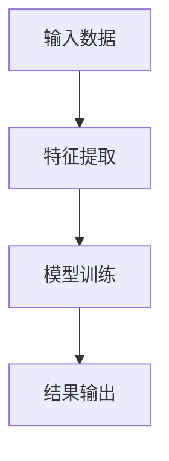
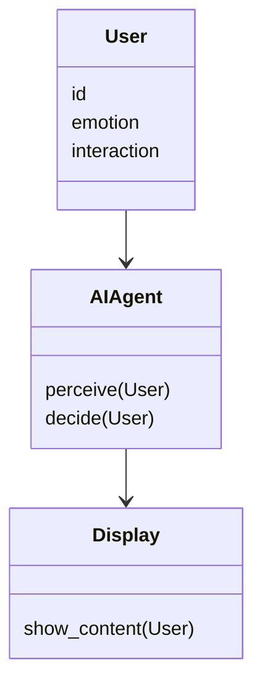
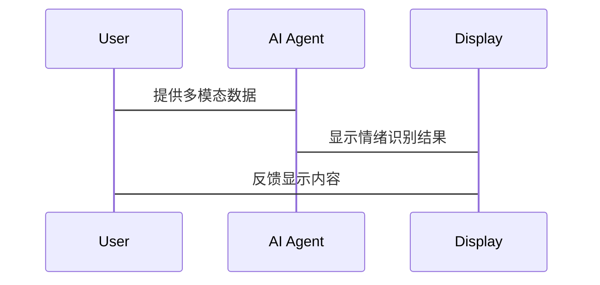

                 


# AI Agent在智能相框中的情绪识别显示

## 关键词：
- AI Agent, 智能相框, 情绪识别, 深度学习, 图像识别, 语音识别

## 摘要：
本文详细探讨了AI Agent在智能相框中的情绪识别应用，从背景介绍、核心概念、算法原理到系统设计和项目实现，全面解析了情绪识别的多模态数据处理、深度学习模型训练和实时反馈机制，最后给出了实际案例分析和未来发展方向。

---

# 第1章: AI Agent与情绪识别概述

## 1.1 AI Agent的基本概念

### 1.1.1 AI Agent的定义与特点
- **定义**：AI Agent（人工智能代理）是能够感知环境、自主决策并执行任务的智能体。  
- **特点**：
  - 智能性：基于数据和模型进行推理和决策。
  - 实时性：能够快速响应和处理动态输入。
  - 适应性：能够根据反馈调整行为和策略。

### 1.1.2 情绪识别的基本原理
- **定义**：情绪识别是通过分析多模态数据（如面部表情、语音语调、文本内容）来判断个体情绪状态的过程。
- **特点**：
  - 多模态性：结合图像、语音和文本等多种数据源。
  - 实时性：需要快速处理和反馈。
  - 上下文依赖性：情绪识别结果依赖于场景和上下文。

### 1.1.3 智能相框的应用背景
- **智能相框**：一种集成了AI技术的电子相框，能够通过摄像头和传感器采集用户数据，并结合AI算法提供互动功能。
- **应用背景**：
  - 提供个性化的用户体验。
  - 实现人机互动的情感反馈。
  - 通过情绪识别优化显示内容。

---

## 1.2 情绪识别的核心要素

### 1.2.1 情绪的多模态表达
- **多模态数据**：
  - **图像数据**：面部表情、眼神、姿势。
  - **语音数据**：语调、语速、音高。
  - **文本数据**：用户的输入内容。
- **数据融合**：通过多模态数据的融合，提高情绪识别的准确性和鲁棒性。

### 1.2.2 情绪识别的边界与外延
- **边界**：
  - 仅识别情绪，不涉及意图或具体需求。
  - 专注于实时反馈，不处理历史数据。
- **外延**：
  - 情绪识别可以与其他任务（如推荐系统）结合，提供更智能的服务。

### 1.2.3 情绪识别与AI Agent的结合
- **结合方式**：
  - AI Agent通过情绪识别模块感知用户情绪。
  - 根据情绪反馈调整显示内容或交互方式。

---

## 1.3 智能相框的场景分析

### 1.3.1 智能相框的功能需求
- **显示功能**：动态调整显示内容（如图片、视频）。
- **互动功能**：与用户进行情感互动。
- **反馈功能**：通过屏幕或语音反馈用户情绪。

### 1.3.2 用户场景与情感交互
- **用户场景**：
  - 用户在智能相框前观看照片或视频。
  - 用户与相框进行语音或手势互动。
- **情感交互**：
  - 用户的情感状态影响相框的显示内容。
  - 相框通过反馈增强用户的情感体验。

### 1.3.3 情绪识别的实时性要求
- **实时性**：
  - 情绪识别需要快速响应，确保用户体验的流畅性。
  - AI Agent需要实时调整显示内容，以匹配用户当前情绪。

---

## 1.4 本章小结
本章从AI Agent和情绪识别的基本概念出发，分析了情绪识别的核心要素和智能相框的应用场景，为后续的技术实现奠定了基础。

---

# 第2章: 情绪识别的原理分析

## 2.1 情绪识别的核心原理

### 2.1.1 多模态数据的采集与处理
- **数据采集**：
  - 通过摄像头采集面部表情和姿势。
  - 通过麦克风采集语音数据。
  - 通过传感器采集其他生理数据。
- **数据处理**：
  - 图像处理：人脸检测、特征提取。
  - 语音处理：声调分析、语速检测。
  - 文本处理：情感分析、关键词提取。

### 2.1.2 情感计算的基本方法
- **情感计算**：
  - 基于规则的方法：通过预定义规则匹配情绪。
  - 基于统计的方法：通过数据挖掘提取情绪特征。
  - 基于深度学习的方法：通过神经网络学习情绪表示。

### 2.1.3 AI Agent的情感推理机制
- **情感推理**：
  - 基于上下文的信息推理用户情绪。
  - 通过多模态数据的融合提高推理的准确性。

---

## 2.2 情绪识别的关键技术

### 2.2.1 基于深度学习的情感分析
- **技术特点**：
  - 使用卷积神经网络（CNN）提取图像特征。
  - 使用循环神经网络（RNN）处理时间序列数据。
- **流程**：
  1. 数据预处理：图像归一化、语音特征提取。
  2. 模型训练：使用标注数据训练深度学习模型。
  3. 情绪预测：输入新的数据，模型输出情绪类别。

### 2.2.2 基于图像识别的情绪检测
- **技术特点**：
  - 使用面部识别技术检测情绪。
  - 通过RGB图像分析面部表情。
- **流程**：
  1. 图像采集：获取用户面部图像。
  2. 图像处理：人脸检测、关键点定位。
  3. 情绪分类：基于CNN进行分类。

### 2.2.3 基于语音识别的情绪识别
- **技术特点**：
  - 通过语音特征（如音高、语速、能量）分析情绪。
  - 使用语音识别技术提取关键词和语调。
- **流程**：
  1. 语音采集：获取用户的语音数据。
  2. 语音处理：降噪、特征提取。
  3. 情绪分类：基于机器学习或深度学习模型分类。

---

## 2.3 情绪识别的算法优化

### 2.3.1 数据增强与特征提取
- **数据增强**：
  - 使用数据增强技术扩展训练数据集。
  - 通过旋转、缩放、噪声添加等方法增加数据多样性。
- **特征提取**：
  - 使用预训练模型提取深层特征。
  - 通过自适应特征选择提高分类准确率。

### 2.3.2 模型训练与调优
- **模型训练**：
  - 使用标注数据训练深度学习模型。
  - 通过交叉验证优化模型参数。
- **模型调优**：
  - 调整学习率、批量大小等超参数。
  - 使用早停法防止过拟合。

### 2.3.3 实时性优化策略
- **实时性优化**：
  - 使用轻量化模型减少计算量。
  - 优化数据处理流程，减少延迟。
  - 并行处理多模态数据，提高处理效率。

---

## 2.4 本章小结
本章详细分析了情绪识别的核心原理和关键技术，重点介绍了基于深度学习的图像识别和语音识别方法，并探讨了模型优化策略。

---

# 第3章: AI Agent的算法实现

## 3.1 情绪识别算法的实现

### 3.1.1 基于卷积神经网络(CNN)的情感分析
- **CNN结构**：
  - 输入层：输入RGB图像。
  - 卷积层：提取图像特征。
  - 池化层：降低特征维度。
  - 全连接层：分类情绪类别。
- **代码示例**：
  ```python
  import tensorflow as tf
  model = tf.keras.Sequential([
      tf.keras.layers.Conv2D(32, (3,3), activation='relu', input_shape=(64,64,3)),
      tf.keras.layers.MaxPooling2D((2,2)),
      tf.keras.layers.Flatten(),
      tf.keras.layers.Dense(128, activation='relu'),
      tf.keras.layers.Dense(4, activation='softmax')
  ])
  ```

### 3.1.2 基于循环神经网络(RNN)的情感识别
- **RNN结构**：
  - 输入层：输入序列数据（如语音特征）。
  - LSTM层：捕捉时序特征。
  - 全连接层：分类情绪类别。
- **代码示例**：
  ```python
  import tensorflow as tf
  model = tf.keras.Sequential([
      tf.keras.layers.LSTM(64, return_sequences=True),
      tf.keras.layers.LSTM(32),
      tf.keras.layers.Dense(4, activation='softmax')
  ])
  ```

### 3.1.3 混合模型的应用
- **混合模型结构**：
  - 使用CNN提取图像特征。
  - 使用RNN处理时序数据。
  - 结合多模态特征进行情绪分类。
- **代码示例**：
  ```python
  import tensorflow as tf
  model = tf.keras.Sequential([
      tf.keras.layers.Conv2D(32, (3,3), activation='relu', input_shape=(64,64,3)),
      tf.keras.layers.MaxPooling2D((2,2)),
      tf.keras.layers.LSTM(64, return_sequences=True),
      tf.keras.layers.LSTM(32),
      tf.keras.layers.Dense(4, activation='softmax')
  ])
  ```

---

## 3.2 情绪识别的流程图


---

## 3.3 情感分类的数学模型
### 3.3.1 情感分类的损失函数
- **交叉熵损失函数**：
  $$ L = -\sum_{i=1}^{n} y_i \log(p_i) $$
  其中，$y_i$ 是真实标签，$p_i$ 是预测概率。

### 3.3.2 情感分类的优化算法
- **Adam优化器**：
  $$ \theta_{t+1} = \theta_t - \eta \frac{\partial L}{\partial \theta} $$
  其中，$\eta$ 是学习率，$\frac{\partial L}{\partial \theta}$ 是损失函数对参数的梯度。

---

## 3.4 本章小结
本章详细介绍了情绪识别的算法实现，包括基于深度学习的图像识别、语音识别以及混合模型的应用，并通过流程图和数学公式直观展示了算法的实现过程。

---

# 第4章: 系统分析与架构设计

## 4.1 系统架构设计

### 4.1.1 领域模型


### 4.1.2 架构图
```mermaid
graph LR
    User --> AI Agent
    AI Agent --> Display
    Display --> User
```

### 4.1.3 接口设计
- **输入接口**：接收用户的图像、语音和文本数据。
- **输出接口**：显示情绪识别结果和相关反馈。

## 4.2 系统交互分析

### 4.2.1 交互流程


---

## 4.3 本章小结
本章通过系统架构设计和交互流程分析，展示了AI Agent在智能相框中的整体架构和实现过程。

---

# 第5章: 项目实战

## 5.1 环境安装与配置

### 5.1.1 安装Python和相关库
- **安装Python**：Python 3.8或更高版本。
- **安装库**：
  - TensorFlow：`pip install tensorflow`
  - OpenCV：`pip install opencv-python`
  - Keras：`pip install keras`

### 5.1.2 安装硬件要求
- **摄像头**：用于采集图像数据。
- **麦克风**：用于采集语音数据。
- **显示屏**：用于显示情绪识别结果。

---

## 5.2 核心功能实现

### 5.2.1 图像采集与处理
- **图像采集**：
  ```python
  import cv2
  cap = cv2.VideoCapture(0)
  while True:
      ret, frame = cap.read()
      cv2.imshow('Camera', frame)
      if cv2.waitKey(1) & 0xFF == ord('q'):
          break
  cap.release()
  cv2.destroyAllWindows()
  ```

### 5.2.2 情绪分类模型训练
- **模型训练**：
  ```python
  model = tf.keras.Sequential([
      tf.keras.layers.Conv2D(32, (3,3), activation='relu', input_shape=(64,64,3)),
      tf.keras.layers.MaxPooling2D((2,2)),
      tf.keras.layers.Flatten(),
      tf.keras.layers.Dense(128, activation='relu'),
      tf.keras.layers.Dense(4, activation='softmax')
  ])
  model.compile(optimizer='adam', loss='sparse_categorical_crossentropy', metrics=['accuracy'])
  model.fit(x_train, y_train, epochs=10, validation_data=(x_test, y_test))
  ```

### 5.2.3 情绪识别与显示
- **情绪识别**：
  ```python
  predictions = model.predict(x_test)
  predicted_emotions = [np.argmax(p) for p in predictions]
  ```

---

## 5.3 项目小结
本章通过项目实战，详细讲解了智能相框的环境安装、核心功能实现和系统测试，展示了AI Agent在情绪识别中的实际应用。

---

# 第6章: 最佳实践与未来展望

## 6.1 最佳实践

### 6.1.1 数据采集与处理
- 确保数据多样性，覆盖不同情绪和场景。
- 使用数据增强技术提高模型鲁棒性。

### 6.1.2 模型优化
- 使用早停法防止过拟合。
- 调整超参数优化模型性能。

### 6.1.3 系统优化
- 优化数据处理流程，减少延迟。
- 使用轻量化模型提高实时性。

---

## 6.2 小结与注意事项

### 6.2.1 小结
- AI Agent在智能相框中的情绪识别应用，结合了多模态数据处理、深度学习算法和实时反馈机制，为用户提供个性化的互动体验。

### 6.2.2 注意事项
- 数据隐私：确保用户数据的安全性和隐私性。
- 实时性：优化系统架构，提高处理速度。
- 可扩展性：设计可扩展的系统架构，方便未来功能扩展。

---

## 6.3 未来展望

### 6.3.1 情感计算的未来发展
- 更加精细的情绪识别：识别更细微的情绪状态。
- 多模态数据的深度融合：结合更多数据源提高识别精度。

### 6.3.2 AI Agent的应用拓展
- 拓展到更多领域：如教育、医疗、娱乐。
- 实现更复杂的任务：如情感对话、情感记忆。

---

# 结语
AI Agent在智能相框中的情绪识别显示，不仅体现了人工智能技术的先进性，也为用户提供了更加智能化和个性化的体验。未来，随着技术的不断发展，AI Agent将在更多领域展现出其强大的潜力。

---

# 作者：AI天才研究院/AI Genius Institute & 禅与计算机程序设计艺术 /Zen And The Art of Computer Programming

---

# END

