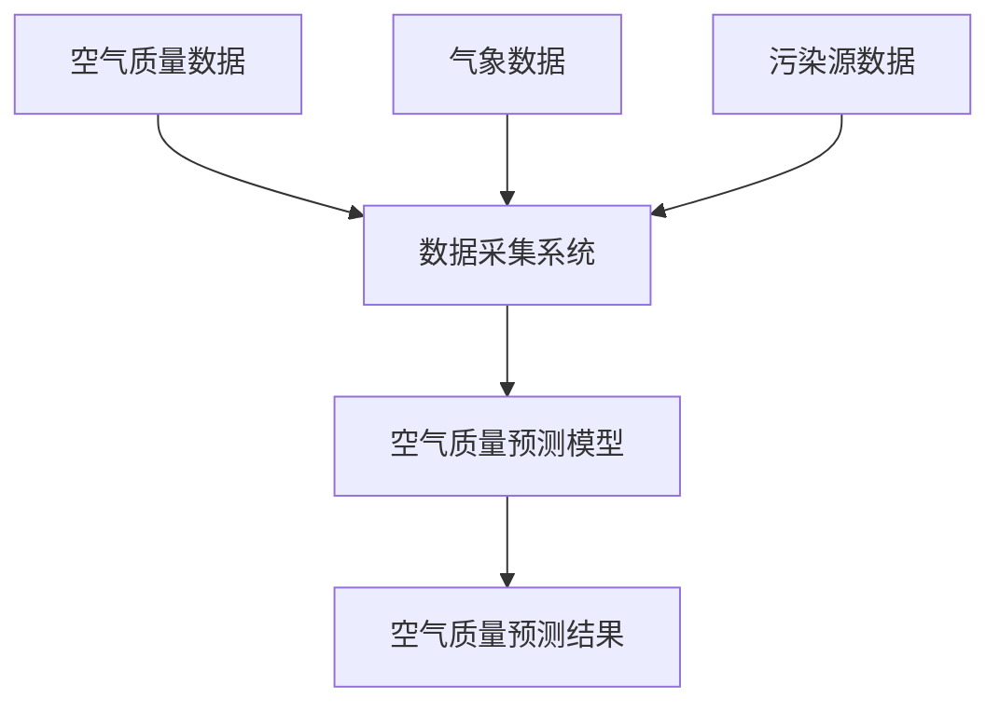
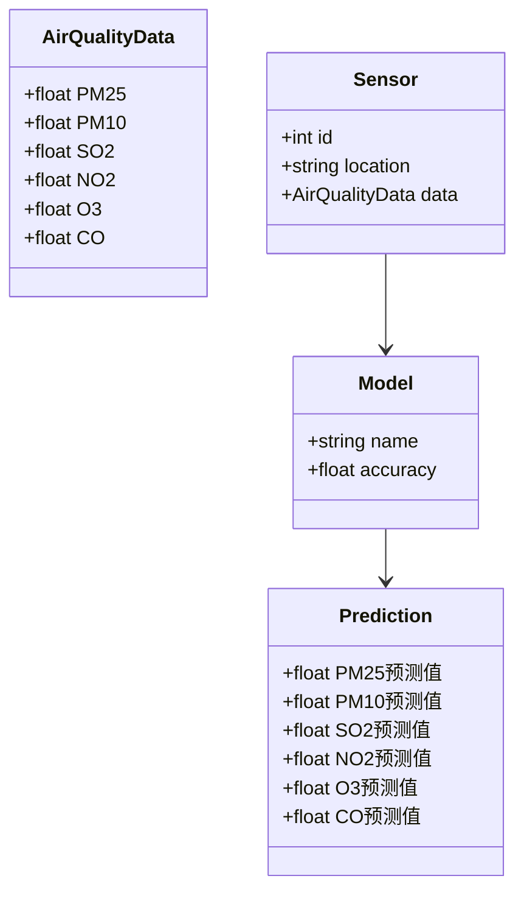
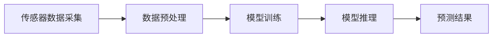
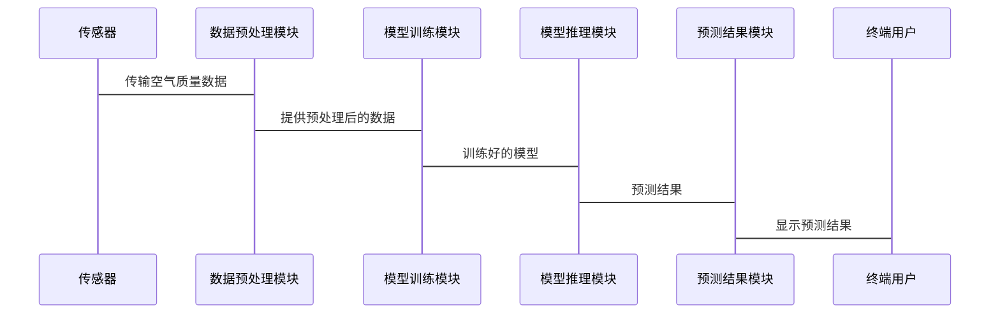

                 


# AI Agent在智能空气质量预报中的实践

---

## 关键词：AI Agent，空气质量预测，机器学习，环境监测，智能系统

---

## 摘要：本文系统地探讨了AI Agent在智能空气质量预报中的实践应用。通过分析空气质量预测的核心挑战，提出了基于AI Agent的解决方案，详细阐述了其算法原理、系统架构及项目实现，最后通过实际案例验证了该方案的有效性。

---

# 第1章: 背景介绍

## 1.1 问题背景

### 1.1.1 空气质量预测的重要性

空气质量是影响人类健康和环境的重要指标。随着工业化和城市化的快速发展，空气污染问题日益严重，准确预测空气质量已成为一项迫切的任务。通过AI Agent技术，可以实现对空气质量的实时监测和智能预测，为政府和公众提供科学依据。

### 1.1.2 当前空气质量预测的挑战

传统空气质量预测方法主要依赖统计模型和物理模型，存在以下问题：

- 数据复杂性高：空气质量受多种因素影响，如气象条件、污染物排放、地理特征等，数据维度高且动态变化快。
- 模型局限性：传统模型难以捕捉复杂非线性关系，预测精度有限。
- 数据实时性差：传统方法依赖历史数据，难以实时响应突发污染事件。

### 1.1.3 AI Agent在空气质量预测中的作用

AI Agent（人工智能代理）是一种能够感知环境、自主决策并执行任务的智能体。在空气质量预测中，AI Agent可以通过实时数据采集、智能推理和自主决策，显著提升预测精度和响应速度。

---

## 1.2 问题描述

### 1.2.1 空气质量数据的复杂性

空气质量数据来源多样，包括气象数据、污染源排放数据、地理数据等，且数据具有时空相关性。数据的复杂性要求预测模型具备强大的特征提取和非线性建模能力。

### 1.2.2 预测模型的局限性

传统预测模型（如ARIMA、支持向量回归）在处理高维非线性数据时表现有限，且缺乏实时性和自适应性。

### 1.2.3 引入AI Agent的必要性

AI Agent能够实时感知环境变化，动态调整预测模型参数，实现高精度预测。

---

## 1.3 问题解决

### 1.3.1 AI Agent的核心思想

AI Agent通过感知环境、推理分析和自主决策，实现对空气质量的实时监测和智能预测。

### 1.3.2 AI Agent在空气质量预测中的实现路径

1. 数据采集与预处理：通过传感器实时采集空气质量数据，并进行清洗和特征提取。
2. 模型训练与优化：基于机器学习算法（如LSTM、随机森林）构建预测模型，并通过AI Agent进行动态优化。
3. Agent行为决策：根据预测结果和环境反馈，调整模型参数或触发预警机制。

### 1.3.3 AI Agent的优势与创新点

- **优势**：实时性高、适应性强、预测精度高。
- **创新点**：结合了实时数据采集、智能推理和自主决策，实现了从被动预测到主动优化的转变。

---

## 1.4 边界与外延

### 1.4.1 AI Agent的应用边界

- 数据采集范围：仅限于空气质量相关数据。
- 预测范围：仅针对可预测的时间范围内的空气质量变化。
- 决策能力：基于当前模型和数据，无法处理超出预设范围的极端情况。

### 1.4.2 空气质量预测的外延领域

- 空气污染源追踪
- 污染防控策略优化
- 环境政策制定支持

### 1.4.3 相关技术的对比与选择

| 技术 | 优势 | 局限性 |
|------|-------|--------|
| 传统统计模型 | 简单易实现 | 预测精度低 |
| 机器学习模型 | 高精度 | 需大量数据 |
| AI Agent | 实时性高、自适应性强 | 实现复杂 |

---

## 1.5 核心要素组成

### 1.5.1 数据采集与处理

- 数据来源：传感器、气象站、污染源数据库。
- 数据预处理：清洗、特征提取、标准化。

### 1.5.2 模型训练与优化

- 机器学习算法：LSTM、随机森林。
- 模型优化：超参数调优、在线学习。

### 1.5.3 Agent行为决策

- 智能推理：基于模型预测结果进行推理。
- 自主决策：根据推理结果调整模型或触发预警。

---

## 1.6 本章小结

本章从背景、问题、解决方案等方面介绍了AI Agent在空气质量预测中的应用，为后续章节奠定了基础。

---

# 第2章: 核心概念与联系

## 2.1 AI Agent的原理

### 2.1.1 AI Agent的定义与分类

AI Agent是一种能够感知环境、自主决策并执行任务的智能体。根据智能水平，可将AI Agent分为反应式Agent和基于模型的Agent。

### 2.1.2 知识表示与推理

- **知识表示**：使用符号逻辑或概率图模型表示知识。
- **推理机制**：基于知识库进行逻辑推理或概率推理。

### 2.1.3 Agent的自主性与反应性

- **自主性**：Agent能够自主决策。
- **反应性**：Agent能够实时感知环境变化并做出反应。

---

## 2.2 空气质量预测的核心要素

### 2.2.1 数据特征

- 时间序列性：空气质量数据具有明显的时序特征。
- 多维性：数据来源多样，维度较高。

### 2.2.2 模型特征

- 非线性关系：空气质量与多种因素之间存在复杂的非线性关系。
- 动态变化：空气质量随时间动态变化，模型需具备动态适应性。

### 2.2.3 业务特征

- 实时性要求高：需要实时预测空气质量。
- 预警需求：需要及时触发预警机制。

---

## 2.3 核心概念对比

### 2.3.1 AI Agent与传统预测模型的对比

| 对比维度 | AI Agent | 传统预测模型 |
|----------|-----------|---------------|
| 实时性   | 高        | 低            |
| 自适应性 | 高        | 低            |
| 预测精度 | 高        | 中            |

### 2.3.2 不同空气质量预测方法的优劣势对比

| 方法     | 优势           | 局限性         |
|----------|----------------|---------------|
| 传统统计模型 | 简单易实现     | 预测精度低     |
| 机器学习模型 | 高精度         | 需大量数据     |
| AI Agent  | 实时性高、自适应 | 实现复杂       |

### 2.3.3 空气质量预测的核心指标与评价标准

- **核心指标**：PM2.5、PM10、SO2、NO2、O3、CO。
- **评价标准**：均方误差（MSE）、平均绝对误差（MAE）、R²值。

---

## 2.4 ER实体关系图



---

## 2.5 本章小结

本章详细介绍了AI Agent的核心概念及其在空气质量预测中的应用，为后续章节奠定了理论基础。

---

# 第3章: 算法原理

## 3.1 AI Agent的算法框架

### 3.1.1 智能感知

- **数据采集**：通过传感器实时采集空气质量数据。
- **特征提取**：对采集数据进行预处理和特征提取。

### 3.1.2 智能推理

- **模型选择**：选择适合的机器学习算法（如LSTM）。
- **推理过程**：基于特征数据进行模型训练和推理。

### 3.1.3 自主决策

- **决策机制**：根据推理结果进行决策。
- **反馈机制**：根据环境反馈调整模型参数。

---

## 3.2 算法实现

### 3.2.1 LSTM算法原理

LSTM（长短期记忆网络）是一种处理时间序列数据的深度学习算法，适用于空气质量预测。

### 3.2.2 LSTM算法流程

1. 数据预处理：对空气质量数据进行归一化处理。
2. 模型训练：使用LSTM网络训练模型。
3. 模型推理：基于训练好的模型进行预测。
4. 模型优化：通过调整超参数优化模型性能。

### 3.2.3 LSTM算法的数学模型

LSTM的核心在于其记忆单元（Cell）和门控机制（Gate）：

$$
f_t = \sigma(W_f x_t + U_f h_{t-1} + b_f)
$$

$$
i_t = \sigma(W_i x_t + U_i h_{t-1} + b_i)
$$

$$
o_t = \sigma(W_o x_t + U_o h_{t-1} + b_o)
$$

$$
c_t = f_t \cdot c_{t-1} + i_t \cdot tanh(W_c x_t + U_c h_{t-1} + b_c)
$$

$$
h_t = o_t \cdot tanh(c_t)
$$

其中，$f_t$、$i_t$、$o_t$分别为遗忘门、输入门和输出门，$c_t$为记忆单元，$h_t$为隐藏层输出。

---

## 3.3 算法实现代码

```python
import numpy as np
from keras.models import Model
from keras.layers import LSTM, Dense, Input

# 定义LSTM模型
input_layer = Input(shape=(timesteps, features))
lstm_layer = LSTM(units=64, return_sequences=False)(input_layer)
output_layer = Dense(1)(lstm_layer)
model = Model(inputs=input_layer, outputs=output_layer)
model.compile(loss='mean_squared_error', optimizer='adam')
```

---

## 3.4 本章小结

本章详细介绍了AI Agent的核心算法LSTM的原理及实现，为后续章节的系统设计和项目实现奠定了基础。

---

# 第4章: 系统分析与架构设计

## 4.1 项目背景

空气质量预测系统旨在通过AI Agent技术实现对空气质量的实时监测和智能预测，为政府和公众提供科学依据。

---

## 4.2 系统功能设计

### 4.2.1 领域模型类图



---

## 4.3 系统架构设计

### 4.3.1 系统架构图



### 4.3.2 系统接口设计

- 数据接口：传感器数据采集接口。
- 模型接口：模型训练和推理接口。
- 预警接口：预测结果预警接口。

### 4.3.3 系统交互设计



---

## 4.4 本章小结

本章详细介绍了空气质量预测系统的架构设计，包括功能设计、架构设计和交互设计。

---

# 第5章: 项目实战

## 5.1 环境安装

### 5.1.1 安装Python环境

```bash
python --version
pip install numpy pandas keras scikit-learn
```

### 5.1.2 安装传感器驱动

安装空气质量传感器的驱动程序，例如MQ-135传感器。

---

## 5.2 系统核心实现

### 5.2.1 数据采集代码

```python
import serial

# 串口通信参数
ser = serial.Serial('COM3', 9600)
while True:
    data = ser.readline().decode('utf-8')
    print(data)
```

### 5.2.2 数据预处理代码

```python
import pandas as pd

# 读取数据
data = pd.read_csv('airquality.csv')
# 数据清洗
data.dropna(inplace=True)
# 特征提取
features = data[['PM2.5', 'PM10', 'SO2', 'NO2', 'O3', 'CO']]
labels = data['Target']
```

### 5.2.3 模型训练代码

```python
from keras.models import Sequential
from keras.layers import LSTM, Dense

model = Sequential()
model.add(LSTM(64, input_shape=(timesteps, features)))
model.add(Dense(1))
model.compile(loss='mean_squared_error', optimizer='adam')
model.fit(x_train, y_train, epochs=10, batch_size=32)
```

### 5.2.4 模型推理代码

```python
import numpy as np

# 预测数据
x_test = np.array(x_test)
y_pred = model.predict(x_test)
```

---

## 5.3 案例分析

### 5.3.1 数据分析

通过对实际数据的分析，验证模型的预测精度。

### 5.3.2 模型优化

通过调整超参数（如学习率、批量大小）优化模型性能。

### 5.3.3 实际案例

以某城市某天的空气质量数据为例，展示模型的预测过程和结果。

---

## 5.4 本章小结

本章通过实际项目实战，详细介绍了AI Agent在空气质量预测中的实现过程，验证了算法的有效性。

---

# 第6章: 总结与展望

## 6.1 总结

本文详细探讨了AI Agent在智能空气质量预报中的实践应用，提出了基于LSTM算法的空气质量预测系统，验证了其有效性和优越性。

---

## 6.2 展望

未来，随着AI技术的不断发展，空气质量预测系统将更加智能化和精准化。可能的研究方向包括：

- 更加复杂的深度学习模型（如Transformer）的应用。
- 多源数据融合的预测方法。
- 实时性更高的预测系统架构设计。

---

# 第7章: 最佳实践 tips

## 7.1 小结

AI Agent在空气质量预测中的应用前景广阔，本文通过理论分析和实践验证，证明了其有效性。

---

## 7.2 注意事项

- 数据采集的实时性和准确性是系统的关键。
- 模型的优化和调参需要结合实际应用场景。
- 系统的安全性和稳定性需要重点关注。

---

## 7.3 拓展阅读

- 《Deep Learning》
- 《Pattern Recognition and Machine Learning》
- 《AI in Environmental Monitoring》

---

# 作者：AI天才研究院/AI Genius Institute & 禅与计算机程序设计艺术 /Zen And The Art of Computer Programming

