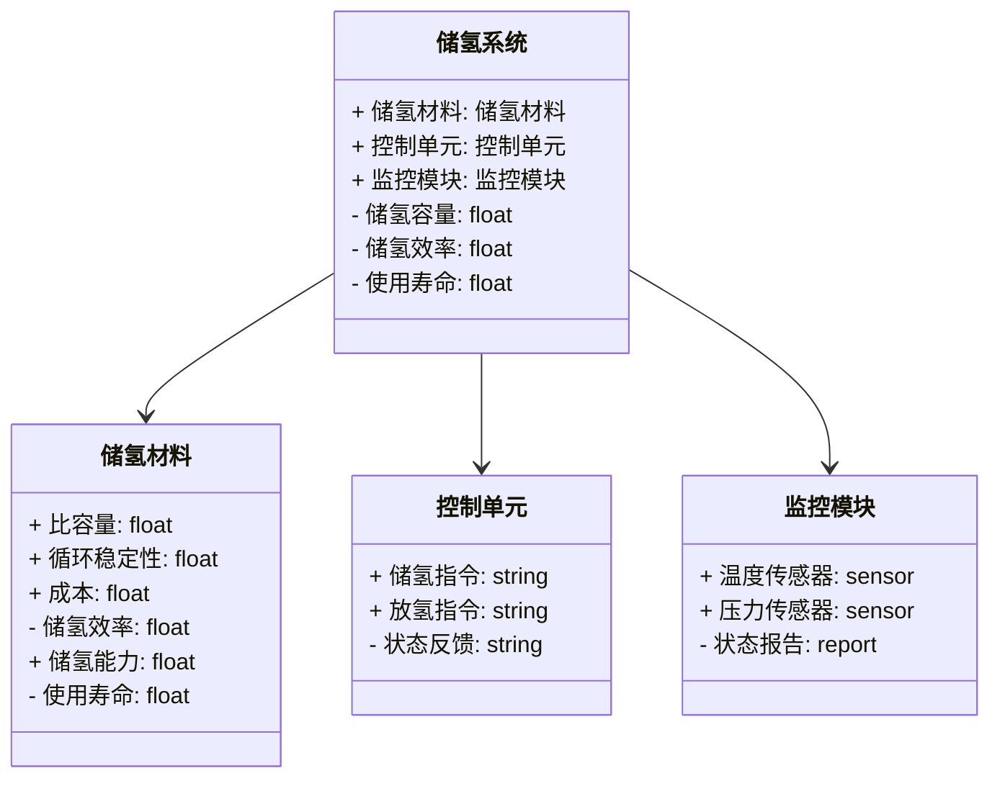
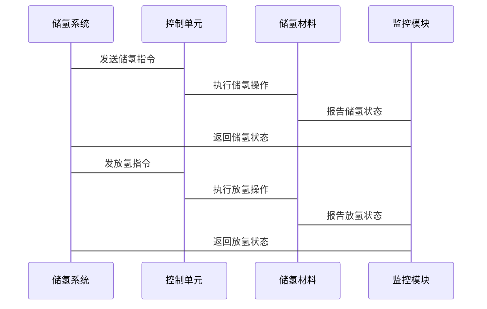

                 


---

# 价值投资中的新型高效储氢材料技术前景

---

## 关键词

- 价值投资
- 储氢材料
- 新型高效储氢
- 技术前景
- 能源存储
- 投资回报
- 新能源技术

---

## 摘要

本文从价值投资的角度，深入分析新型高效储氢材料的技术前景及其对投资决策的影响。通过对储氢材料的性能、成本、市场潜力等方面的详细探讨，结合数学模型和系统架构分析，为投资者提供科学的决策依据。文章还通过实际案例分析，展示了储氢材料技术在投资中的应用前景，并总结了最佳实践建议。

---

## 第一部分: 价值投资中的储氢材料技术背景

### 第1章: 储氢材料技术的现状与发展趋势

#### 1.1 储氢技术的背景与意义

##### 1.1.1 能源危机与储氢技术的重要性

能源危机是全球面临的重大挑战之一。随着化石能源的枯竭和环境问题的加剧，清洁能源的开发和利用成为全球关注的焦点。储氢技术作为一种重要的能源存储方式，能够有效解决可再生能源（如风能、太阳能）的间歇性问题，为能源供应的稳定性提供保障。储氢技术的重要性体现在以下几个方面：

1. **能源存储**：通过储氢技术，可以将多余的能源存储起来，在需要时释放使用，提高能源利用效率。
2. **能源安全**：储氢技术能够帮助国家减少对化石能源的依赖，提高能源供应的安全性。
3. **环保减排**：储氢技术可以减少化石燃料的使用，降低碳排放，助力实现碳中和目标。

##### 1.1.2 储氢技术在能源存储中的应用领域

储氢技术的应用领域非常广泛，主要包括以下几个方面：

1. **可再生能源存储**：风能和太阳能等可再生能源具有间歇性，储氢技术可以将多余的能源存储起来，用于高峰期的能源供应。
2. **燃料电池汽车**：燃料电池汽车需要氢气作为燃料，储氢技术是实现氢燃料电池汽车商业化的重要基础。
3. **工业领域**：许多工业过程需要氢气作为原料，储氢技术可以为这些工业过程提供稳定的氢气供应。
4. **电网储能**：通过储氢技术，可以将电网中多余的电力转化为氢能存储，用于电网调峰和应急备用。

##### 1.1.3 储氢技术对价值投资的潜在影响

储氢技术作为一项新兴技术，其发展和应用对投资具有重要的影响。以下是一些潜在的影响：

1. **技术进步带来的投资机会**：储氢技术的进步将推动相关产业的发展，带来新的投资机会。
2. **市场潜力巨大**：随着可再生能源的快速发展和能源结构的转型，储氢技术的市场需求将快速增长，为投资者带来丰厚的回报。
3. **政策支持**：各国政府纷纷出台政策支持储氢技术的发展，为投资者提供了良好的政策环境。

#### 1.2 价值投资与储氢材料的结合

##### 1.2.1 价值投资的基本概念

价值投资是一种以低于内在价值的价格购买优质资产的投资策略。其核心思想是通过深入分析企业的基本面，寻找那些被市场低估的企业进行投资。价值投资的关键在于找到具有持续竞争优势和良好发展前景的企业。

##### 1.2.2 储氢材料技术的市场前景

储氢材料技术的市场前景非常广阔。随着全球能源结构的转型和可再生能源的快速发展，储氢技术的需求将快速增长。特别是在氢能源产业链中，储氢技术是实现氢气存储和运输的关键环节，其发展将直接影响氢能源产业的商业化进程。

##### 1.2.3 储氢材料技术对投资决策的影响

储氢材料技术的发展对投资决策具有重要的影响。投资者需要关注以下方面：

1. **技术可行性**：储氢材料的技术可行性是投资决策的重要因素。投资者需要评估储氢材料的技术成熟度、成本效益和市场竞争力。
2. **市场需求**：投资者需要分析储氢材料的市场需求，包括市场规模、增长速度和竞争格局。
3. **政策环境**：政策环境对储氢技术的发展和应用具有重要影响。投资者需要关注相关政策的变化，及时调整投资策略。

---

### 第2章: 新型高效储氢材料的核心概念

#### 2.1 储氢材料的基本原理

##### 2.1.1 储氢材料的定义与分类

储氢材料是指能够有效地存储和释放氢气的材料。根据其存储原理，储氢材料可以分为以下几类：

1. **物理吸附储氢材料**：通过物理吸附作用存储氢气，如碳基材料和金属有机框架材料。
2. **化学储氢材料**：通过化学反应存储氢气，如化学储氢材料和氢化物储氢材料。
3. **高压储氢材料**：通过高压容器存储氢气，主要用于燃料电池汽车的储氢。

##### 2.1.2 吸附储氢与化学储氢的原理

吸附储氢是指通过材料的表面吸附作用存储氢气。其基本原理是氢气分子与材料表面的活性位点发生物理或化学吸附作用，从而实现氢气的存储。吸附储氢的优点是储氢密度较高，且储氢过程可逆。

化学储氢是指通过化学反应将氢气存储在材料中。其基本原理是氢气与材料发生化学反应，生成氢化物或其他化合物，从而实现氢气的存储。化学储氢的优点是储氢密度高，且可以通过化学反应释放氢气。

##### 2.1.3 储氢材料的物理化学特性

储氢材料的物理化学特性是决定其储氢性能的关键因素。主要包括以下几点：

1. **比表面积**：比表面积越大，储氢容量越高。
2. **表面活性**：表面活性越高，氢气的吸附和释放能力越强。
3. **化学稳定性**：储氢材料需要具有较高的化学稳定性，以保证其长期使用。

#### 2.2 储氢材料的性能指标

##### 2.2.1 比容量与储氢效率

比容量是指单位质量或单位体积的储氢材料存储的氢气量。储氢效率是指储氢材料存储氢气的能力与理论容量的比值。比容量和储氢效率是衡量储氢材料性能的重要指标。

##### 2.2.2 储氢材料的循环稳定性

循环稳定性是指储氢材料在多次充放过程中保持其储氢性能的能力。储氢材料的循环稳定性是决定其使用寿命的重要因素。

##### 2.2.3 储氢材料的安全性与经济性

安全性是指储氢材料在使用过程中不会发生泄漏、爆炸等危险情况。经济性是指储氢材料的生产成本和使用成本。安全性与经济性是储氢材料能否大规模应用的重要因素。

#### 2.3 储氢材料与投资价值的关系

##### 2.3.1 储氢材料性能对投资价值的影响

储氢材料的性能直接决定了其市场竞争力和投资价值。性能优越的储氢材料更容易获得市场的认可，从而为投资者带来更高的回报。

##### 2.3.2 储氢材料成本与市场需求的平衡

储氢材料的成本是影响其市场竞争力的重要因素。投资者需要关注储氢材料的成本与市场需求的平衡，寻找具有成本优势的储氢材料进行投资。

##### 2.3.3 储氢材料技术进步对投资回报的推动

技术进步是储氢材料发展的主要驱动力。投资者需要关注储氢材料技术的发展趋势，选择具有技术优势的储氢材料进行投资。

---

## 第二部分: 储氢材料技术的数学模型与分析

### 第3章: 储氢材料的数学模型

#### 3.1 储氢材料的比容量模型

##### 3.1.1 比容量的定义与公式

比容量是指单位质量或单位体积的储氢材料存储的氢气量。其计算公式为：

$$ \text{比容量} = \frac{\text{储氢量}}{\text{材料质量或体积}} $$

##### 3.1.2 影响比容量的因素分析

影响比容量的因素包括材料的比表面积、表面活性、化学组成等。

##### 3.1.3 比容量与储氢效率的关系

储氢效率是指储氢材料存储氢气的能力与理论容量的比值。比容量与储氢效率的关系可以通过以下公式表示：

$$ \text{储氢效率} = \frac{\text{储氢量}}{\text{理论容量}} \times 100\% $$

#### 3.2 储氢材料的循环稳定性模型

##### 3.2.1 循环稳定性的影响因素

循环稳定性的影响因素包括材料的化学稳定性、表面活性、使用环境等。

##### 3.2.2 循环稳定性预测的数学公式

循环稳定性预测可以通过以下公式表示：

$$ \text{循环稳定性} = 1 - \frac{\text{性能衰减}}{\text{初始性能}} $$

##### 3.2.3 模型在投资决策中的应用

通过循环稳定性模型，投资者可以评估储氢材料的使用寿命，从而做出科学的投资决策。

#### 3.3 储氢材料的成本分析模型

##### 3.3.1 成本构成的分解

储氢材料的成本构成包括材料成本、制造成本、研发成本等。

##### 3.3.2 成本与市场需求的平衡分析

通过成本分析模型，投资者可以评估储氢材料的成本与市场需求的平衡，从而选择具有成本优势的储氢材料进行投资。

---

### 第4章: 储氢材料技术的系统架构设计

#### 4.1 问题场景介绍

储氢材料技术的系统架构设计需要考虑储氢材料的性能、成本、安全性等因素，以实现储氢系统的高效运行。

#### 4.2 项目介绍

本项目旨在设计一个高效的储氢系统，包括储氢材料的选择、储氢系统的功能设计、系统架构设计等。

#### 4.3 系统功能设计

##### 4.3.1 领域模型设计

领域模型设计需要考虑储氢系统的功能需求，包括氢气的存储、释放、监控等。

##### 4.3.2 领域模型 mermaid 类图



#### 4.4 系统架构设计

##### 4.4.1 系统架构 mermaid 架构图


#### 4.5 系统接口设计

##### 4.5.1 接口设计

储氢系统的接口设计需要考虑储氢材料与控制单元、监控模块之间的通信接口。

##### 4.5.2 接口协议

储氢系统的接口协议包括串口通信、网络通信等。

#### 4.6 系统交互设计

##### 4.6.1 系统交互 mermaid 序列图



---

### 第5章: 项目实战

#### 5.1 环境安装

##### 5.1.1 开发环境搭建

开发环境包括计算机、编程语言、开发工具等。推荐使用 Python 和相关开发工具。

##### 5.1.2 依赖安装

需要安装的依赖包括 matplotlib、numpy、pandas 等。

#### 5.2 系统核心实现源代码

##### 5.2.1 储氢材料性能计算

```python
# 储氢材料性能计算代码
import numpy as np

def calculate_capacity(material_properties):
    # 材料性能参数
    surface_area = material_properties['surface_area']
    density = material_properties['density']
    # 比容量计算
    capacity = (surface_area * density) / 1000
    return capacity

# 示例输入
material_properties = {
    'surface_area': 2000,  # 表面积，单位：m²/g
    'density': 2.0,  # 密度，单位：g/cm³
}
# 计算比容量
capacity = calculate_capacity(material_properties)
print(f"比容量为：{capacity} MWh/kg")
```

##### 5.2.2 储氢效率分析

```python
# 储氢效率分析代码
import pandas as pd

def analyze_efficiency(capacity_data):
    # 数据分析
    mean_efficiency = np.mean(capacity_data['efficiency'])
    max_efficiency = np.max(capacity_data['efficiency'])
    min_efficiency = np.min(capacity_data['efficiency'])
    return {
        '平均效率': mean_efficiency,
        '最大效率': max_efficiency,
        '最小效率': min_efficiency
    }

# 示例数据
data = {
    'efficiency': [0.85, 0.90, 0.88, 0.92, 0.89]
}
capacity_data = pd.DataFrame(data)
# 分析效率
efficiency_analysis = analyze_efficiency(capacity_data)
print(efficiency_analysis)
```

#### 5.3 代码应用解读与分析

##### 5.3.1 储氢材料性能计算代码解读

上述代码通过输入材料的表面积和密度，计算其比容量。比容量是衡量储氢材料性能的重要指标之一。通过该代码，投资者可以快速评估不同储氢材料的性能。

##### 5.3.2 储氢效率分析代码解读

上述代码通过分析储氢效率数据，评估储氢材料的效率分布情况。平均效率、最大效率和最小效率是评估储氢材料性能的重要指标。通过该代码，投资者可以快速评估储氢材料的效率表现。

#### 5.4 实际案例分析

##### 5.4.1 案例背景

假设某公司开发了一种新型储氢材料，其性能数据如下：

- 比容量：1.2 MWh/kg
- 储氢效率：90%
- 循环稳定性：95%
- 成本：$10/kg

##### 5.4.2 投资评估

根据上述性能数据，投资者可以评估该储氢材料的市场竞争力。假设市场需求为每年100,000 kg，售价为$15/kg，利润率为20%。通过成本分析模型，投资者可以计算出该储氢材料的投资回报率。

#### 5.5 项目小结

通过实际案例分析，投资者可以更好地理解储氢材料技术的应用前景。在实际投资中，需要综合考虑储氢材料的性能、成本、市场需求等因素，做出科学的投资决策。

---

## 第三部分: 最佳实践与总结

### 第6章: 投资策略与最佳实践

#### 6.1 投资策略

##### 6.1.1 长期投资与短期投资的结合

投资者需要根据市场趋势和自身需求，制定长期和短期相结合的投资策略。

##### 6.1.2 风险管理与收益平衡

在投资储氢材料技术时，投资者需要注重风险管理，平衡收益与风险。

##### 6.1.3 技术跟踪与市场调研

投资者需要持续跟踪储氢材料技术的发展趋势，进行市场调研，以把握市场机会。

#### 6.2 技术发展趋势

##### 6.2.1 新型储氢材料的研发方向

未来，储氢材料的技术研发将主要集中在提高比容量、循环稳定性、降低成本等方面。

##### 6.2.2 储氢技术的产业化应用

随着技术的不断进步，储氢技术的产业化应用将逐步扩大，市场需求将快速增长。

##### 6.2.3 政策支持与国际合作

各国政府将继续加大对储氢技术的支持力度，同时加强国际合作，推动储氢技术的发展。

#### 6.3 投资建议

##### 6.3.1 关注技术领先的企业

投资者应关注那些在储氢材料技术上具有领先地位的企业，投资具有技术优势的项目。

##### 6.3.2 重视成本控制

储氢材料的成本是影响其市场竞争力的重要因素。投资者应关注那些具有成本优势的企业。

##### 6.3.3 长期持有与灵活调整

投资者应根据市场变化和技术进步，灵活调整投资策略，同时注重长期持有，以实现稳定的投资回报。

### 第7章: 总结与展望

#### 7.1 总结

本文从价值投资的角度，深入分析了新型高效储氢材料的技术前景及其对投资决策的影响。通过详细探讨储氢材料的性能、成本、市场潜力等方面，结合数学模型和系统架构分析，为投资者提供了科学的决策依据。

#### 7.2 展望

随着全球能源结构的转型和可再生能源的快速发展，储氢技术的市场需求将快速增长。未来，储氢材料的技术研发和产业化应用将更加受到重视。投资者应密切关注储氢技术的发展趋势，抓住市场机会，实现投资回报。

---

## 作者：AI天才研究院/AI Genius Institute & 禅与计算机程序设计艺术/Zen And The Art of Computer Programming

---

**声明：本文为AI天才研究院（AI Genius Institute）原创，未经授权不得转载、摘编或利用其他方式使用本文内容。**

