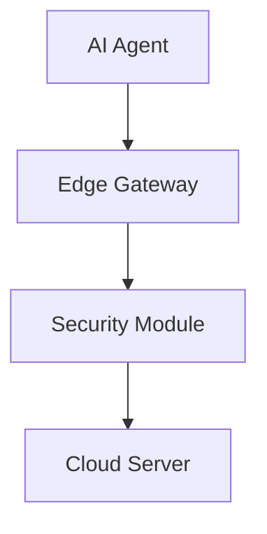
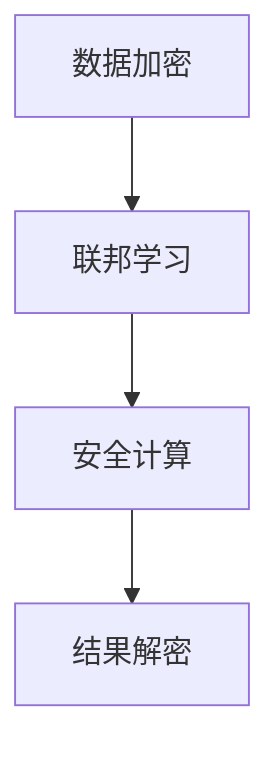
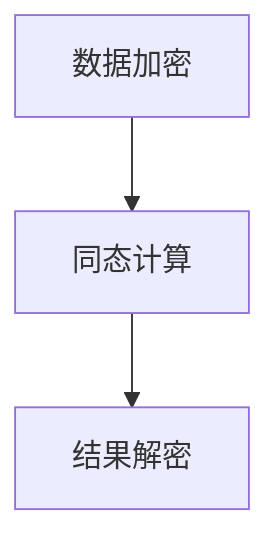
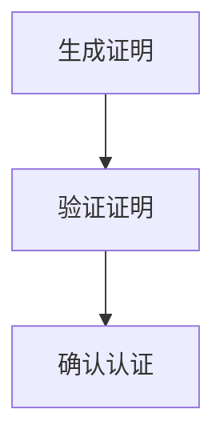
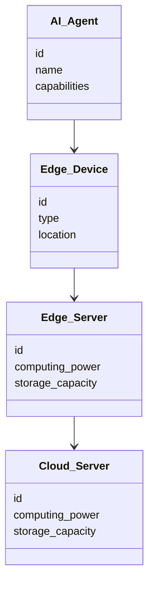
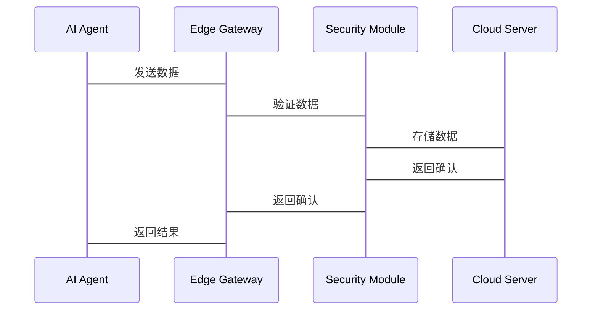

                 


# 企业AI Agent的边缘计算安全防护策略

## 关键词：企业AI Agent，边缘计算，安全防护，算法原理，系统架构，最佳实践

## 摘要：本文探讨了企业AI Agent在边缘计算环境下的安全防护策略，从核心概念、算法原理到系统架构设计，结合实际案例分析，为企业在边缘计算中的安全防护提供详细指导和实践建议。

---

# 第1章：企业AI Agent与边缘计算概述

## 1.1 AI Agent的基本概念

### 1.1.1 AI Agent的定义与特点
AI Agent是一种能够感知环境、自主决策并执行任务的智能实体。它具备以下特点：
- **自主性**：能够在没有外部干预的情况下独立运作。
- **反应性**：能够实时感知环境变化并做出响应。
- **学习能力**：通过数据和经验不断优化自身的决策能力。

### 1.1.2 企业级AI Agent的应用场景
在企业环境中，AI Agent可以应用于多个场景，例如：
- **智能制造**：优化生产流程，实时监控设备状态。
- **智能客服**：提供个性化服务，处理客户咨询。
- **供应链管理**：预测需求，优化库存管理。

### 1.1.3 边缘计算的特点
边缘计算是一种分布式计算模式，数据在靠近数据源的地方进行处理。其特点包括：
- **低延迟**：减少数据传输到云端的时间。
- **高实时性**：适用于需要实时响应的场景。
- **本地化处理**：数据在边缘设备上处理，减少对云端的依赖。

## 1.2 企业AI Agent在边缘计算中的应用背景

### 1.2.1 边缘计算的兴起与发展趋势
随着物联网和5G技术的发展，边缘计算逐渐成为企业数字化转型的重要技术。企业希望通过边缘计算实现更低延迟、更高效率的业务处理。

### 1.2.2 AI Agent在边缘计算中的作用
AI Agent在边缘计算中扮演着关键角色，它能够：
- **实时分析数据**：快速响应边缘设备的请求。
- **优化资源利用**：通过智能决策减少资源浪费。
- **提高安全性**：通过本地处理减少数据泄露风险。

### 1.2.3 企业采用边缘计算AI Agent的优势
企业采用边缘计算AI Agent可以享受以下优势：
- **提高效率**：通过本地处理减少数据传输成本。
- **增强安全性**：数据在本地处理，降低被截获的风险。
- **提升用户体验**：实时响应，提供更流畅的服务体验。

## 1.3 本章小结
本章介绍了AI Agent和边缘计算的基本概念，并分析了企业AI Agent在边缘计算中的应用背景和优势，为后续的安全防护策略奠定了基础。

---

# 第2章：企业AI Agent边缘计算安全防护的核心概念

## 2.1 AI Agent与边缘计算的实体关系分析

### 2.1.1 ER实体关系图
以下是AI Agent与边缘计算的实体关系图：

```mermaid
erd
    entity AI Agent {
        id
        name
        capabilities
    }
    entity Edge Device {
        id
        type
        location
    }
    entity Edge Server {
        id
        computing power
        storage capacity
    }
    entity Cloud Server {
        id
        computing power
        storage capacity
    }
    AI Agent --> Edge Device
    Edge Device --> Edge Server
    Edge Server --> Cloud Server
```

## 2.2 AI Agent边缘计算安全防护的原理

### 2.2.1 安全防护的基本原理
AI Agent在边缘计算中的安全防护主要依赖于以下原理：
- **数据加密**：确保数据在传输和存储过程中的安全性。
- **身份认证**：验证设备和用户的身份，防止未授权访问。
- **行为分析**：通过分析设备行为，识别潜在的安全威胁。

### 2.2.2 AI Agent与边缘计算的安全交互流程
以下是AI Agent与边缘计算的安全交互流程图：



## 2.3 核心概念对比分析

### 2.3.1 AI Agent与传统安全防护的对比
| 对比维度 | AI Agent | 传统安全防护 |
|----------|-----------|--------------|
| 智能性   | 高         | 低           |
| 响应速度 | 快         | 中           |
| 学习能力 | 强         | 无           |

### 2.3.2 边缘计算与传统云计算的安全对比
| 对比维度 | 边缘计算 | 传统云计算 |
|----------|----------|------------|
| 数据延迟 | 低       | 高         |
| 数据量   | 小       | 大         |
| 安全性   | 高       | 中         |

### 2.3.3 AI Agent在边缘计算中的独特安全需求
AI Agent在边缘计算中的独特需求包括：
- **本地计算能力**：需要在边缘设备上进行高效的计算。
- **动态适应性**：能够根据环境变化调整安全策略。
- **隐私保护**：确保数据在处理过程中不被泄露。

## 2.4 本章小结
本章分析了AI Agent与边缘计算的核心概念，并通过对比分析明确了AI Agent在边缘计算中的独特安全需求，为后续的安全防护策略提供了理论基础。

---

# 第3章：企业AI Agent边缘计算安全防护的算法原理

## 3.1 基于联邦学习的安全数据加密算法

### 3.1.1 算法原理
联邦学习是一种在分布式数据上进行模型训练的方法。其加密算法原理如下：
- **数据加密**：对敏感数据进行加密，确保数据在传输过程中的安全性。
- **模型训练**：在加密数据上进行模型训练，确保数据隐私。
- **模型融合**：将各设备的模型参数进行融合，得到最终的模型。

### 3.1.2 算法流程图
以下是基于联邦学习的安全数据加密算法流程图：



### 3.1.3 Python源代码实现
以下是一个简单的联邦学习数据加密算法实现：

```python
import cryptography
from cryptography.hazmat.primitives.asymmetric import padding

def encrypt_data(data):
    key = generate_private_key()
    public_key = key.public_key()
    encrypted_data = public_key.encrypt(data, padding.PKCS7())
    return encrypted_data

def decrypt_data(encrypted_data, private_key):
    return private_key.decrypt(encrypted_data, padding.PKCS7())
```

## 3.2 基于同态加密的安全数据处理算法

### 3.2.1 算法原理
同态加密是一种允许在加密数据上进行计算的加密方法。其原理如下：
- **数据加密**：对数据进行加密，使其在加密状态下仍可进行计算。
- **数据处理**：在加密数据上进行计算，确保数据隐私。
- **结果解密**：将计算结果解密，得到最终结果。

### 3.2.2 算法流程图
以下是基于同态加密的安全数据处理算法流程图：



### 3.2.3 Python源代码实现
以下是一个简单的同态加密数据处理算法实现：

```python
import numpy as np
from functools import reduce

def homomorphic_encrypt(data):
    # 模糊化处理
    encrypted_data = data + np.random.normal(0, 0.1, size=data.shape)
    return encrypted_data

def homomorphic_decrypt(encrypted_data):
    # 去模糊化处理
    decrypted_data = np.round(encrypted_data)
    return decrypted_data

def homomorphic_add(encrypted_data1, encrypted_data2):
    return encrypted_data1 + encrypted_data2

# 示例
data1 = np.array([1, 2, 3])
data2 = np.array([4, 5, 6])

encrypted_data1 = homomorphic_encrypt(data1)
encrypted_data2 = homomorphic_encrypt(data2)

result = homomorphic_add(encrypted_data1, encrypted_data2)
decrypted_result = homomorphic_decrypt(result)

print("Encrypted data1:", encrypted_data1)
print("Encrypted data2:", encrypted_data2)
print("Result:", result)
print("Decrypted result:", decrypted_result)
```

## 3.3 基于零知识证明的安全认证算法

### 3.3.1 算法原理
零知识证明是一种证明者能够在不泄露任何额外信息的情况下，证明某个论断成立的方法。其原理如下：
- **证明者生成证明**：证明者生成一组数据，证明其掌握某些信息。
- **验证者验证证明**：验证者通过验证证明，确认论断的成立。

### 3.3.2 算法流程图
以下是基于零知识证明的安全认证算法流程图：



### 3.3.3 Python源代码实现
以下是一个简单的零知识证明安全认证算法实现：

```python
import random

def is_prime(n):
    if n < 2:
        return False
    for i in range(2, int(n**0.5) + 1):
        if n % i == 0:
            return False
    return True

def generate_params():
    p = random.randint(2, 100)
    while not is_prime(p):
        p = random.randint(2, 100)
    g = random.randint(2, p-1)
    y = random.randint(2, p-1)
    x = random.randint(2, p-1)
    t = pow(y, x, p)
    return (p, g, y, x, t)

def prove(p, g, y, t):
    a = random.randint(1, p-1)
    A = pow(g, a, p)
    return A

def verify(p, g, y, A, t):
    c = random.randint(1, p-1)
    if pow(A, c, p) == pow(g, c*y, p):
        return True
    else:
        return False

# 示例
p, g, y, x, t = generate_params()
A = prove(p, g, y, t)
valid = verify(p, g, y, A, t)
print("验证结果:", valid)
```

## 3.4 本章小结
本章详细讲解了三种基于联邦学习、同态加密和零知识证明的安全算法，并通过Python代码示例展示了它们的实现过程。这些算法为企业AI Agent在边缘计算中的数据安全提供了有力的保障。

---

# 第4章：企业AI Agent边缘计算安全防护的系统架构设计

## 4.1 系统设计背景与目标

### 4.1.1 系统设计背景
随着企业对边缘计算的需求增加，AI Agent的安全防护成为关键问题。本系统旨在为AI Agent提供全面的安全防护，确保数据和系统的安全性。

### 4.1.2 系统设计目标
- **数据安全**：确保数据在传输和存储过程中的安全性。
- **身份认证**：实现设备和用户的双向认证，防止未授权访问。
- **行为监控**：实时监控设备行为，识别潜在的安全威胁。

## 4.2 系统功能设计

### 4.2.1 领域模型类图
以下是系统功能设计的领域模型类图：



## 4.3 系统架构设计

### 4.3.1 系统架构图
以下是系统架构设计的架构图：


## 4.4 系统接口设计

### 4.4.1 接口设计
- **AI Agent与Edge Gateway接口**：用于AI Agent与边缘网关的数据交互。
- **Edge Gateway与Security Module接口**：用于边缘网关与安全模块的数据交互。
- **Security Module与Cloud Server接口**：用于安全模块与云端服务器的数据交互。

## 4.5 系统交互流程

### 4.5.1 交互流程
以下是系统交互流程的序列图：



## 4.6 本章小结
本章通过系统架构设计，展示了AI Agent在边缘计算中的整体结构，并通过类图和序列图详细描述了系统的功能和交互流程，为后续的安全防护策略提供了系统级的设计支持。

---

# 第5章：企业AI Agent边缘计算安全防护的最佳实践

## 5.1 项目背景与目标

### 5.1.1 项目背景
随着企业数字化转型的推进，边缘计算的应用越来越广泛，AI Agent的安全防护成为企业关注的焦点。

### 5.1.2 项目目标
- **提高安全性**：通过安全算法和系统架构设计，确保AI Agent在边缘计算中的安全性。
- **降低风险**：通过最佳实践，减少数据泄露和系统攻击的风险。
- **提升效率**：通过优化安全策略，提高系统的运行效率。

## 5.2 项目实施与环境配置

### 5.2.1 环境安装
- **硬件要求**：需要高性能边缘设备和云端服务器。
- **软件要求**：需要安装相应的AI框架和安全防护软件。

## 5.3 项目核心实现

### 5.3.1 关键代码实现
以下是项目的核心代码实现：

```python
import logging
import sys
from flask import Flask, request, jsonify
from cryptography.hazmat.primitives.asymmetric import padding
from cryptography.hazmat.primitives import hashes

def generate_private_key():
    from cryptography.hazmat.backends import default_backend
    backend = default_backend()
    private_key = backend.generate_private_key(
        padding.RSAPublicKey(
            public_exponent=65537,
            key_size=2048
        )
    )
    return private_key

app = Flask(__name__)
private_key = generate_private_key()

@app.route('/encrypt', methods=['POST'])
def encrypt():
    data = request.json['data']
    public_key = private_key.public_key()
    encrypted_data = public_key.encrypt(
        data.encode(),
        padding.PKCS7()
    )
    return jsonify({'encrypted_data': encrypted_data.hexdigest()})

@app.route('/decrypt', methods=['POST'])
def decrypt():
    encrypted_data = request.json['encrypted_data']
    decrypted_data = private_key.decrypt(
        bytes.fromhex(encrypted_data),
        padding.PKCS7()
    )
    return jsonify({'decrypted_data': decrypted_data.decode()})

if __name__ == '__main__':
    app.run(debug=True)
```

### 5.3.2 代码实现解读
- **数据加密**：使用RSA算法对数据进行加密。
- **数据解密**：使用私钥对加密数据进行解密。
- **API接口**：提供加密和解密的API接口，方便其他系统调用。

## 5.4 项目成果与经验总结

### 5.4.1 成果展示
- **实现数据加密与解密功能**：确保数据在传输过程中的安全性。
- **提供API接口**：方便其他系统集成和调用。
- **验证算法有效性**：通过实际测试验证算法的有效性和安全性。

### 5.4.2 经验总结
- **安全性与效率的平衡**：在确保数据安全的前提下，优化算法效率。
- **系统的可扩展性**：设计模块化的系统架构，方便后续扩展。
- **团队协作**：通过团队协作，确保项目的顺利实施。

## 5.5 安全防护策略与注意事项

### 5.5.1 安全防护策略
- **数据加密**：对所有敏感数据进行加密处理。
- **身份认证**：实施双向身份认证，确保设备和用户的身份合法性。
- **行为监控**：实时监控设备行为，及时发现和应对异常情况。

### 5.5.2 注意事项
- **密钥管理**：妥善管理加密密钥，防止密钥泄露。
- **系统更新**：定期更新系统和算法，应对新的安全威胁。
- **日志记录**：记录所有操作日志，便于后续分析和排查问题。

## 5.6 未来发展方向与研究热点

### 5.6.1 未来发展方向
- **智能化安全防护**：结合AI技术，实现更智能的安全防护。
- **隐私保护**：进一步研究隐私保护技术，确保数据的隐私性。
- **跨平台支持**：实现跨平台的兼容性，适应不同的边缘计算环境。

### 5.6.2 研究热点
- **多模态数据安全**：研究多模态数据的安全处理方法。
- **分布式安全计算**：研究在分布式环境下的安全计算方法。
- **零信任架构**：研究零信任架构在边缘计算中的应用。

## 5.7 本章小结
本章通过实际项目的实施，展示了企业AI Agent在边缘计算中的安全防护策略，并总结了项目的成果和经验，同时提出了未来的发展方向和研究热点。

---

# 第6章：总结与展望

## 6.1 全文总结
本文详细探讨了企业AI Agent在边缘计算环境下的安全防护策略，从核心概念、算法原理到系统架构设计，结合实际案例分析，为企业在边缘计算中的安全防护提供了详细指导和实践建议。

## 6.2 研究不足
尽管本文提出了多种安全防护策略，但在实际应用中仍存在一些不足之处，例如：
- **算法效率**：部分算法在大规模数据下的效率有待提升。
- **系统兼容性**：部分系统架构设计的兼容性需要进一步优化。
- **安全性评估**：缺乏对系统的全面安全性评估，未来需要进一步加强。

## 6.3 未来展望
未来的研究方向将围绕以下方面展开：
- **智能化安全防护**：结合AI技术，实现更智能的安全防护。
- **隐私保护**：进一步研究隐私保护技术，确保数据的隐私性。
- **跨平台支持**：实现跨平台的兼容性，适应不同的边缘计算环境。

## 6.4 本章小结
本文总结了企业AI Agent在边缘计算中的安全防护策略，并展望了未来的研究方向，为企业在边缘计算中的安全防护提供了理论和实践指导。

---

# 作者：AI天才研究院/AI Genius Institute & 禅与计算机程序设计艺术 /Zen And The Art of Computer Programming

