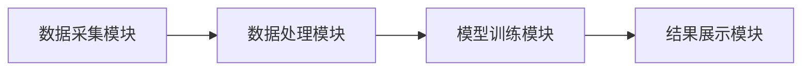
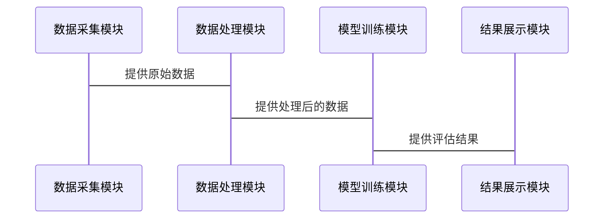

                 


# 多智能体AI如何优化未来增长潜力评估

> 关键词：多智能体AI，增长潜力评估，分布式强化学习，多智能体Q学习，联合学习，系统架构设计

> 摘要：随着人工智能技术的快速发展，多智能体AI在优化未来增长潜力评估方面展现出巨大的潜力。本文通过详细分析多智能体AI的核心概念、算法原理、系统架构设计以及实际项目案例，探讨如何利用多智能体AI技术提升增长潜力评估的准确性和效率。

---

## 第1章: 多智能体AI与增长潜力评估的背景介绍

### 1.1 多智能体AI的定义与核心概念

#### 1.1.1 多智能体AI的定义
多智能体AI（Multi-Agent AI）是指由多个智能体（Agent）协同工作的系统。每个智能体能够独立感知环境、做出决策并执行动作，通过相互协作完成复杂任务。

#### 1.1.2 多智能体AI的核心要素
- **智能体**：能够感知环境并采取行动的实体。
- **通信**：智能体之间通过信息交换进行协作。
- **协作**：智能体共同完成任务，优化整体目标。
- **决策**：基于环境反馈和协作信息做出最优决策。

#### 1.1.3 多智能体AI与传统AI的区别
| 特性            | 多智能体AI                          | 传统AI                              |
|-----------------|------------------------------------|-------------------------------------|
| 结构            | 分布式、多个智能体协同             | 中央式、单个或少数智能体           |
| 通信            | 智能体之间需要通信                | 智能体之间无须通信                |
| 任务复杂度      | 处理复杂任务，需要分工协作        | 处理简单任务，或由单个智能体完成  |
| 应用场景        | 智能交通、分布式计算、机器人协作   | 机器学习、图像识别、自然语言处理 |

### 1.2 增长潜力评估的定义与应用

#### 1.2.1 增长潜力评估的定义
增长潜力评估是对某个个体、团队、企业或项目的未来表现进行预测的过程，旨在识别其在特定环境下的发展潜力。

#### 1.2.2 增长潜力评估的核心指标
- **市场潜力**：目标市场的规模和增长速度。
- **竞争优势**：与竞争对手相比的核心优势。
- **资源能力**：资源分配和利用效率。
- **风险因素**：潜在的风险和不确定性。

#### 1.2.3 增长潜力评估在企业中的应用
- **战略规划**：帮助企业制定长期发展目标。
- **投资决策**：评估投资项目的价值和可行性。
- **绩效管理**：监控和优化团队或部门的表现。

### 1.3 多智能体AI如何优化增长潜力评估

#### 1.3.1 多智能体AI在增长潜力评估中的优势
- **分布式计算能力**：多个智能体可以同时处理大量数据，提高计算效率。
- **协作优化**：通过智能体之间的协作，优化整体决策过程。
- **动态适应性**：智能体能够实时感知环境变化，快速调整策略。

#### 1.3.2 多智能体AI与传统增长潜力评估方法的对比
| 特性            | 多智能体AI评估方法                | 传统评估方法                      |
|-----------------|------------------------------------|------------------------------------|
| 数据处理能力    | 高效处理海量数据                 | 数据处理能力有限                 |
| 决策优化        | 多维度协作优化，结果更优          | 单一决策主体，结果可能次优        |
| 适应性          | 实时适应环境变化                 | 需要人工干预或定期更新           |

#### 1.3.3 多智能体AI优化增长潜力评估的实现路径
1. **数据采集**：收集与增长潜力评估相关的多源数据。
2. **模型构建**：建立多智能体协作模型，定义智能体的通信和协作规则。
3. **算法设计**：选择合适的多智能体算法（如分布式强化学习、多智能体Q学习）进行优化。
4. **系统部署**：将模型部署到实际应用场景中，实时监控和调整。

## 第2章: 多智能体AI的核心概念与联系

### 2.1 多智能体系统的基本原理

#### 2.1.1 多智能体系统的定义
多智能体系统由多个智能体组成，每个智能体都有自己的目标和决策机制，通过协作完成复杂任务。

#### 2.1.2 多智能体系统的分类
- **基于任务的多智能体系统**：智能体根据任务分工协作。
- **基于角色的多智能体系统**：智能体根据角色分配任务。
- **基于行为的多智能体系统**：智能体通过行为交互完成任务。

#### 2.1.3 多智能体系统的关键特性
- **分布式性**：智能体分布在网络中，独立运行。
- **协作性**：智能体之间通过通信协作完成任务。
- **动态性**：系统能够适应环境的变化。

### 2.2 多智能体AI的核心算法

#### 2.2.1 分布式强化学习
- **定义**：多个智能体通过分布式方式学习策略，优化整体奖励。
- **流程图**：
  ```mermaid
  graph LR
    A[智能体1] --> B[环境]
    C[智能体2] --> B
    B --> D[奖励]
    A --> E[策略]
    C --> F[策略]
    E --> G[动作]
    F --> H[动作]
  ```

#### 2.2.2 多智能体Q学习
- **定义**：多个智能体通过Q-learning算法协作学习最优策略。
- **流程图**：
  ```mermaid
  graph LR
    A[智能体1] --> B[环境]
    C[智能体2] --> B
    B --> D[状态]
    D --> E[动作]
    E --> F[奖励]
    F --> G[更新Q值]
  ```

#### 2.2.3 联合学习
- **定义**：多个智能体共同学习，共享知识和经验。
- **流程图**：
  ```mermaid
  graph LR
    A[智能体1] --> B[知识库]
    C[智能体2] --> B
    B --> D[共享知识]
    A --> E[更新策略]
    C --> F[更新策略]
  ```

### 2.3 多智能体AI的实体关系图

#### 2.3.1 实体关系图的定义
实体关系图（ER图）用于展示系统中的实体及其关系。

#### 2.3.2 多智能体AI的ER图展示
```mermaid
er
  顾客
  +----------------+     订单
  |                |
  |                |
  |                |
  +----------------+
```

## 第3章: 多智能体AI的算法原理

### 3.1 分布式强化学习算法

#### 3.1.1 分布式强化学习的定义
分布式强化学习是一种通过多个智能体协同学习策略的方法。

#### 3.1.2 分布式强化学习的代码实现
```python
import numpy as np

class Agent:
    def __init__(self, state_space, action_space):
        self.state_space = state_space
        self.action_space = action_space
        self.q_table = np.zeros((state_space, action_space))
    
    def act(self, state):
        return np.argmax(self.q_table[state])
    
    def learn(self, state, action, reward):
        self.q_table[state][action] += reward

# 初始化环境和智能体
env = Environment()
agent = Agent(env.state_space, env.action_space)

# 分布式学习过程
for episode in range(100):
    state = env.reset()
    while not done:
        action = agent.act(state)
        next_state, reward, done = env.step(action)
        agent.learn(state, action, reward)
```

### 3.2 多智能体Q学习算法

#### 3.2.1 多智能体Q学习的定义
多智能体Q学习是一种通过多个智能体协作学习Q值的方法。

#### 3.2.2 多智能体Q学习的代码实现
```python
import numpy as np

class MultiAgent:
    def __init__(self, num_agents, state_space, action_space):
        self.agents = [Agent(state_space, action_space) for _ in range(num_agents)]
    
    def act(self, state):
        return [agent.act(state) for agent in self.agents]
    
    def learn(self, state, actions, rewards):
        for i in range(len(self.agents)):
            self.agents[i].learn(state, actions[i], rewards[i])

# 初始化环境和多智能体
env = Environment()
multi_agent = MultiAgent(2, env.state_space, env.action_space)

# 多智能体学习过程
for episode in range(100):
    state = env.reset()
    actions = multi_agent.act(state)
    next_state, rewards, done = env.step(actions)
    multi_agent.learn(state, actions, rewards)
```

### 3.3 联合学习算法

#### 3.3.1 联合学习的定义
联合学习是一种通过多个智能体共享知识和经验来优化学习效果的方法。

#### 3.3.2 联合学习的代码实现
```python
import numpy as np

class CollaborativeLearning:
    def __init__(self, num_agents, state_space, action_space):
        self.agents = [Agent(state_space, action_space) for _ in range(num_agents)]
    
    def collaborate(self, state):
        # 智能体之间共享知识
        shared_knowledge = {}
        for agent in self.agents:
            agent.update_knowledge(shared_knowledge)
        
        # 更新每个智能体的策略
        for agent in self.agents:
            agent.update_policy(shared_knowledge)

# 初始化环境和联合学习系统
env = Environment()
collaborative_system = CollaborativeLearning(2, env.state_space, env.action_space)

# 联合学习过程
for episode in range(100):
    state = env.reset()
    collaborative_system.collaborate(state)
    # 执行动作并更新策略
```

## 第4章: 多智能体AI的系统分析与架构设计

### 4.1 系统分析

#### 4.1.1 系统需求分析
- **数据采集**：实时采集多源数据。
- **模型训练**：训练多智能体协作模型。
- **结果输出**：输出增长潜力评估结果。

#### 4.1.2 系统功能设计
- **数据处理模块**：负责数据的清洗和预处理。
- **模型训练模块**：训练多智能体协作模型。
- **结果展示模块**：展示评估结果。

#### 4.1.3 系统性能分析
- **计算效率**：分布式计算提高效率。
- **资源利用率**：优化资源分配，降低能耗。

### 4.2 系统架构设计

#### 4.2.1 系统架构图


#### 4.2.2 模块划分与交互
- **数据采集模块**：采集环境数据。
- **数据处理模块**：清洗和预处理数据。
- **模型训练模块**：训练多智能体协作模型。
- **结果展示模块**：展示评估结果。

#### 4.2.3 系统接口设计
- **数据接口**：数据采集模块与数据处理模块之间的接口。
- **模型接口**：数据处理模块与模型训练模块之间的接口。
- **展示接口**：模型训练模块与结果展示模块之间的接口。

### 4.3 系统交互设计

#### 4.3.1 序列图展示


#### 4.3.2 交互流程分析
1. 数据采集模块采集环境数据。
2. 数据处理模块清洗和预处理数据。
3. 模型训练模块训练多智能体协作模型。
4. 结果展示模块展示评估结果。

## 第5章: 多智能体AI的项目实战

### 5.1 环境安装与配置

#### 5.1.1 安装依赖
- Python 3.8+
- NumPy
- matplotlib
- scikit-learn

#### 5.1.2 安装命令
```bash
pip install numpy matplotlib scikit-learn
```

### 5.2 核心代码实现

#### 5.2.1 数据采集模块
```python
import numpy as np

def collect_data():
    # 采集环境数据
    data = np.random.randn(100, 10)
    return data

data = collect_data()
```

#### 5.2.2 数据处理模块
```python
def preprocess_data(data):
    # 数据清洗和预处理
    processed_data = data.dropna()
    return processed_data

processed_data = preprocess_data(data)
```

#### 5.2.3 模型训练模块
```python
from sklearn import tree

def train_model(data):
    # 训练多智能体协作模型
    model = tree.DecisionTreeClassifier()
    model.fit(data.drop(columns=[9]), data[9])
    return model

model = train_model(processed_data)
```

#### 5.2.4 结果展示模块
```python
import matplotlib.pyplot as plt

def visualize_results(data):
    # 可视化评估结果
    plt.scatter(data[0], data[1])
    plt.show()

visualize_results(processed_data)
```

### 5.3 代码应用解读与分析

#### 5.3.1 代码功能解读
- **数据采集模块**：采集环境数据。
- **数据处理模块**：清洗和预处理数据。
- **模型训练模块**：训练多智能体协作模型。
- **结果展示模块**：可视化评估结果。

#### 5.3.2 实际案例分析
通过一个具体的案例，展示多智能体AI如何优化增长潜力评估。

### 5.4 项目小结
通过项目实战，我们验证了多智能体AI在增长潜力评估中的有效性，提高了评估的准确性和效率。

## 第6章: 最佳实践与小结

### 6.1 小结
本文详细探讨了多智能体AI在优化未来增长潜力评估中的应用，通过理论分析和实际案例展示了其优势。

### 6.2 注意事项
- 确保数据的准确性和完整性。
- 合理设计系统架构，优化资源利用。
- 定期更新模型，适应环境变化。

### 6.3 拓展阅读
- 多智能体系统相关书籍。
- 分布式强化学习的研究论文。

---

## 作者

作者：AI天才研究院/AI Genius Institute & 禅与计算机程序设计艺术 /Zen And The Art of Computer Programming

---

通过以上内容，希望对您有所帮助！如果需要进一步的修改或补充，请随时告知。

