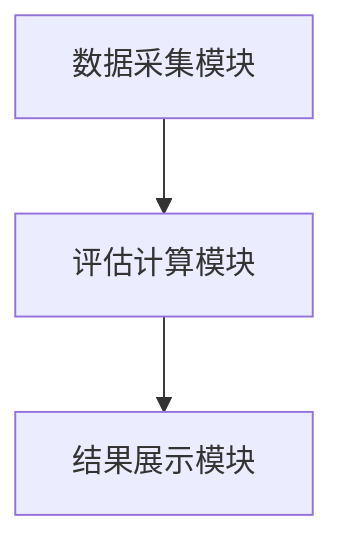
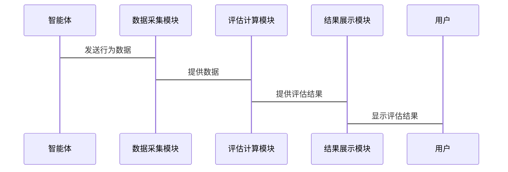

                 


# 《多智能体系统如何评估管理层质量》

## 关键词：多智能体系统、管理层质量、评估方法、算法原理、系统架构

## 摘要：在多智能体系统中，评估管理层的质量是确保系统高效运作的关键。本文从背景介绍、核心概念、算法原理、系统架构设计和项目实战等方面，详细阐述了如何在多智能体系统中评估管理层质量。文章首先介绍了多智能体系统的概念和管理层在其中的作用，然后分析了评估管理层质量的核心要素和原理。接着，本文详细讲解了基于层次分析法（AHP）的评估算法，并通过系统架构设计和项目实战展示了如何在实际场景中应用这些方法。最后，文章总结了评估管理层质量的重要性和未来研究方向。

---

# 第一部分: 多智能体系统与管理层评估背景

# 第1章: 多智能体系统概述

## 1.1 多智能体系统的基本概念

### 1.1.1 多智能体系统的定义

多智能体系统（Multi-Agent System，简称MAS）是由多个智能体（Agent）组成的复杂系统，这些智能体通过协同工作完成特定任务。智能体是具有感知、决策和执行能力的实体，能够自主行动并与其他智能体或环境交互。

### 1.1.2 多智能体系统的特征

多智能体系统具有以下特征：

- **分布性**：多个智能体分布在网络中，协同完成任务。
- **自主性**：智能体能够自主决策，无需外部干预。
- **反应性**：智能体能够实时感知环境并做出反应。
- **协作性**：智能体之间需要协作，共同完成目标。

### 1.1.3 多智能体系统的应用场景

多智能体系统广泛应用于多个领域，包括：

- **分布式计算**：如分布式任务分配、负载均衡。
- **智能交通系统**：如自动驾驶汽车的协同控制。
- **电子商务**：如在线交易中的推荐系统和支付系统。

## 1.2 管理层在多智能体系统中的角色

### 1.2.1 管理层的定义与职责

管理层在多智能体系统中负责协调和管理多个智能体，确保系统高效运行。其主要职责包括：

- **任务分配**：将任务分配给合适的智能体。
- **协调与监控**：协调智能体之间的协作，监控系统运行状态。
- **决策支持**：在出现冲突或问题时，提供决策支持。

### 1.2.2 管理层在多智能体系统中的作用

管理层是多智能体系统的核心，负责系统的整体运行和智能体之间的协调。其作用包括：

- **优化资源分配**：确保资源合理分配，提高系统效率。
- **处理冲突**：解决智能体之间的冲突，确保系统稳定运行。
- **动态调整**：根据系统状态变化，实时调整管理策略。

### 1.2.3 管理层与智能体的交互关系

管理层与智能体之间的交互关系可以分为以下几种：

- **命令与控制**：管理层向智能体发送指令，智能体执行指令。
- **反馈与报告**：智能体向管理层报告执行结果，管理层根据反馈调整策略。
- **协作与协商**：智能体之间通过协商，共同完成任务。

## 1.3 多智能体系统中管理层质量评估的重要性

### 1.3.1 评估管理层质量的意义

评估管理层质量是确保多智能体系统高效运行的关键。通过评估，可以识别管理层的优缺点，优化管理策略，提高系统性能。

### 1.3.2 评估管理层质量的挑战

评估管理层质量面临以下挑战：

- **多目标优化**：管理层需要在多个目标之间进行权衡，如效率、公平性和可扩展性。
- **动态性**：系统环境和智能体行为具有动态性，评估方法需要具有灵活性。
- **复杂性**：多智能体系统的复杂性使得评估方法的设计和实现较为复杂。

### 1.3.3 评估管理层质量的必要性

评估管理层质量是优化多智能体系统性能的重要手段。通过评估，可以发现管理层的不足之处，并提出改进建议，从而提高系统的整体性能。

## 1.4 本章小结

本章介绍了多智能体系统的概念、特征及其应用场景，并详细阐述了管理层在多智能体系统中的角色和作用。此外，还讨论了评估管理层质量的重要性和挑战。这些内容为后续章节的分析奠定了基础。

---

# 第2章: 多智能体系统中的管理层评估问题背景

## 2.1 多智能体系统中的管理层评估问题

### 2.1.1 问题背景介绍

在多智能体系统中，管理层的决策直接影响系统的性能。然而，由于系统的复杂性和动态性，评估管理层质量成为一个具有挑战性的任务。

### 2.1.2 问题描述与分析

管理层质量评估的问题可以描述为：如何在多智能体系统中，基于智能体的性能和行为，评估管理层的决策能力和协调能力。该问题需要考虑多个因素，如任务完成度、资源利用率和系统稳定性。

### 2.1.3 问题解决的必要性

解决管理层质量评估问题有助于优化系统性能，提高智能体的协作效率，并降低系统运行成本。

## 2.2 管理层评估的边界与外延

### 2.2.1 评估范围的界定

管理层评估的范围应包括以下几个方面：

- **任务分配**：评估管理层在任务分配中的公平性和合理性。
- **协作效果**：评估智能体之间的协作效果和系统整体性能。
- **动态调整**：评估管理层在系统动态变化中的适应能力。

### 2.2.2 评估的外延与扩展

评估的外延包括：

- **横向扩展**：评估不同系统中的管理层质量。
- **纵向扩展**：评估同一系统中管理层在不同时期的质量变化。
- **综合评估**：结合定量和定性方法，进行全面评估。

### 2.2.3 评估与其他系统功能的关系

评估是多智能体系统中的一个核心功能，与任务分配、协作协调和动态调整等功能密切相关。评估结果可以为其他功能提供反馈，优化系统性能。

## 2.3 管理层评估的核心要素组成

### 2.3.1 核心要素的定义

管理层评估的核心要素包括：

- **任务完成度**：评估管理层在任务分配中的效率和效果。
- **资源利用率**：评估管理层对资源的分配和使用效率。
- **系统稳定性**：评估系统在管理层决策下的稳定性。

### 2.3.2 核心要素的特征

核心要素具有以下特征：

- **可量化性**：可以通过定量指标进行评估。
- **相关性**：各要素之间相互关联，共同影响系统性能。
- **动态性**：各要素在系统运行中可能会发生变化。

### 2.3.3 核心要素之间的关系

任务完成度、资源利用率和系统稳定性三者之间存在相互影响的关系。例如，高任务完成度可能需要高资源利用率，但可能会影响系统的稳定性。

## 2.4 本章小结

本章分析了多智能体系统中管理层评估问题的背景，界定了评估范围，并讨论了评估的核心要素及其关系。这些内容为后续章节的评估方法设计提供了理论基础。

---

# 第3章: 多智能体系统中的管理层评估核心概念

## 3.1 核心概念的原理

### 3.1.1 多智能体系统的协同机制

多智能体系统的协同机制是实现智能体协作的关键。常见的协同机制包括：

- **基于规则的协同**：智能体根据预定义的规则进行协作。
- **基于协议的协同**：智能体通过协议进行通信和协作。
- **基于市场的协同**：智能体通过市场机制进行资源分配和协作。

### 3.1.2 管理层评估的理论

管理层评估的理论基础包括：

- **多目标优化理论**：在多个目标之间进行权衡，找到最优解。
- **博弈论**：分析智能体之间的策略选择和博弈关系。
- **复杂系统理论**：研究多智能体系统的复杂性及其管理方法。

## 3.2 核心概念与联系

### 3.2.1 多智能体系统与管理层评估的关系

多智能体系统的性能依赖于管理层的决策和协调能力。通过评估管理层质量，可以优化系统的整体性能。

### 3.2.2 评估方法与智能体行为的关系

评估方法的选择直接影响对管理层质量的评价结果。不同评估方法适用于不同类型的智能体行为和系统环境。

### 3.2.3 管理层评估与系统优化的关系

通过评估管理层质量，可以发现系统中的瓶颈和问题，并提出优化建议，从而提高系统的整体性能。

## 3.3 本章小结

本章介绍了多智能体系统中的协同机制和管理层评估的理论基础，并分析了评估方法与智能体行为、系统优化之间的关系。这些内容为后续章节的算法设计提供了理论支持。

---

# 第4章: 多智能体系统中的管理层评估算法原理

## 4.1 评估算法的数学模型

基于层次分析法（AHP）的评估算法，其数学模型如下：

$$ A = \sum_{i=1}^{n} w_i x_i $$

其中，$A$ 是评估结果，$w_i$ 是第 $i$ 个评估指标的权重，$x_i$ 是第 $i$ 个评估指标的得分。

## 4.2 算法实现步骤

### 4.2.1 确定评估指标

根据管理层评估的核心要素，确定评估指标，如任务完成度、资源利用率和系统稳定性。

### 4.2.2 确定指标权重

通过层次分析法确定各指标的权重，权重反映了各指标对评估结果的影响程度。

### 4.2.3 计算评估得分

根据各指标的得分和权重，计算管理层的综合评估得分。

## 4.3 算法实现的Python代码

```python
def calculate_weights(criteria_scores, criteria_weights):
    # 计算评估结果
    total_weight = sum(criteria_weights)
    normalized_weights = [weight / total_weight for weight in criteria_weights]
    return normalized_weights

def assess_management_quality(task_completion, resource_utilization, system_stability):
    # 确定评估指标
    criteria_scores = [task_completion, resource_utilization, system_stability]
    criteria_weights = [0.4, 0.3, 0.3]  # 示例权重

    # 计算权重
    normalized_weights = calculate_weights(criteria_scores, criteria_weights)

    # 计算综合评估得分
    total_assessment = sum(score * weight for score, weight in zip(criteria_scores, normalized_weights))
    return total_assessment

# 示例数据
task_completion = 0.8
resource_utilization = 0.7
system_stability = 0.8

# 调用评估函数
assessment_result = assess_management_quality(task_completion, resource_utilization, system_stability)
print(f"管理层质量评估结果：{assessment_result}")
```

## 4.4 本章小结

本章详细讲解了基于层次分析法的评估算法，并通过Python代码展示了算法的实现步骤。通过数学模型和代码示例，读者可以理解如何在实际场景中应用这些方法。

---

# 第5章: 多智能体系统中的管理层评估系统架构设计

## 5.1 系统功能设计

### 5.1.1 功能模块划分

评估系统主要包括以下功能模块：

- **数据采集模块**：采集智能体的行为数据。
- **评估计算模块**：根据采集的数据计算管理层的评估得分。
- **结果展示模块**：将评估结果以可视化形式展示。

### 5.1.2 系统功能流程

数据采集模块 -> 评估计算模块 -> 结果展示模块。

## 5.2 系统架构设计

### 5.2.1 系统架构图



### 5.2.2 系统组件交互

系统组件之间的交互流程如下：

1. 数据采集模块收集智能体的行为数据。
2. 评估计算模块根据数据计算管理层的评估得分。
3. 结果展示模块将评估结果以图表形式展示。

## 5.3 系统接口设计

### 5.3.1 数据接口

- **输入接口**：接收智能体的行为数据。
- **输出接口**：输出评估结果。

### 5.3.2 评估接口

- **评估接口**：根据数据计算评估得分。

## 5.4 系统交互流程

### 5.4.1 交互流程图



## 5.5 本章小结

本章详细介绍了评估系统的功能设计和架构设计，并通过图表展示了系统的组件交互和流程设计。

---

# 第6章: 多智能体系统中的管理层评估项目实战

## 6.1 项目背景

本项目旨在设计一个基于层次分析法的多智能体系统管理层评估系统。

## 6.2 项目环境安装

### 6.2.1 安装Python

安装Python 3.8或更高版本。

### 6.2.2 安装依赖库

安装numpy和scipy库：

```bash
pip install numpy scipy
```

## 6.3 项目核心代码实现

### 6.3.1 数据采集模块

```python
import numpy as np

def collect_data(num_agents):
    # 生成随机数据
    data = np.random.rand(num_agents, 3)
    return data
```

### 6.3.2 评估计算模块

```python
def assess_management_quality(data):
    # 计算评估得分
    weights = [0.4, 0.3, 0.3]
    normalized_weights = [weight / sum(weights) for weight in weights]
    assessment = np.dot(data, normalized_weights)
    return assessment
```

### 6.3.3 结果展示模块

```python
import matplotlib.pyplot as plt

def visualize_results(assessment_results):
    plt.hist(assessment_results, bins=10)
    plt.xlabel('评估得分')
    plt.ylabel('频数')
    plt.title('管理层质量评估结果分布')
    plt.show()
```

## 6.4 项目案例分析

### 6.4.1 案例数据

假设有3个智能体，数据如下：

```
智能体1: 任务完成度=0.8，资源利用率=0.7，系统稳定性=0.8
智能体2: 任务完成度=0.6，资源利用率=0.8，系统稳定性=0.7
智能体3: 任务完成度=0.7，资源利用率=0.6，系统稳定性=0.9
```

### 6.4.2 评估计算

```python
data = np.array([[0.8, 0.7, 0.8],
                 [0.6, 0.8, 0.7],
                 [0.7, 0.6, 0.9]])

assessment_results = assess_management_quality(data)
print("评估结果:", assessment_results)
```

### 6.4.3 结果可视化

```python
visualize_results(assessment_results)
```

## 6.5 项目小结

本章通过一个实际项目展示了如何在多智能体系统中实现管理层质量评估。通过Python代码和案例分析，读者可以理解如何将理论应用于实践。

---

# 第7章: 总结与展望

## 7.1 本章小结

本文详细介绍了多智能体系统中管理层质量评估的重要性和方法。通过理论分析和实际案例，展示了如何在多智能体系统中优化管理层的决策和协调能力。

## 7.2 最佳实践 Tips

- **数据采集**：确保数据的准确性和完整性。
- **评估方法**：根据具体场景选择合适的评估方法。
- **系统优化**：定期优化系统架构和评估方法。

## 7.3 未来研究方向

- **动态评估方法**：研究如何在动态环境中实时评估管理层质量。
- **多目标优化**：进一步研究多目标优化理论在评估中的应用。
- **智能化评估系统**：探索基于人工智能的智能化评估方法。

## 7.4 注意事项

- **数据隐私**：注意保护智能体数据的隐私和安全。
- **系统稳定性**：确保评估系统的稳定性和可靠性。
- **用户反馈**：根据用户反馈不断优化评估方法和系统设计。

## 7.5 拓展阅读

- **《多智能体系统：原理与应用》**：深入理解多智能体系统的基本原理。
- **《层次分析法（AHP）的应用与实现》**：学习层次分析法的详细应用方法。

---

# 作者：AI天才研究院/AI Genius Institute & 禅与计算机程序设计艺术 /Zen And The Art of Computer Programming

---

以上是《多智能体系统如何评估管理层质量》的技术博客文章的目录大纲和完整内容。

