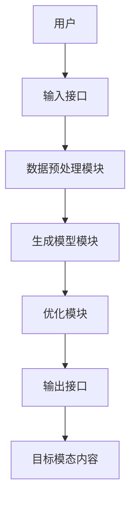

                 


# 开发AI Agent的跨模态内容生成系统

> 关键词：AI Agent，跨模态生成，深度学习，自然语言处理，计算机视觉，系统架构

> 摘要：本文将详细探讨AI Agent在跨模态内容生成系统中的应用，从基础概念到算法实现，再到系统架构设计和项目实战，全面解析跨模态生成的核心原理与实践方法。

---

# 第一部分: AI Agent与跨模态内容生成系统基础

## 第1章: AI Agent与跨模态内容生成系统概述

### 1.1 AI Agent的基本概念

#### 1.1.1 AI Agent的定义与特点
AI Agent（人工智能代理）是指能够感知环境、自主决策并执行任务的智能实体。它具有以下特点：
- **自主性**：能够自主决策，无需外部干预。
- **反应性**：能够实时感知环境并做出响应。
- **目标导向**：具有明确的目标，能够优化行为以达到目标。
- **学习能力**：能够通过经验或数据优化自身的性能。

#### 1.1.2 跨模态内容生成的背景与意义
跨模态内容生成是指从一种模态（如文本）生成另一种模态（如图像或音频）的过程。随着AI技术的发展，跨模态生成在多个领域展现出巨大的潜力，例如：
- **多模态对话系统**：能够同时处理文本、图像和语音，提供更自然的交互体验。
- **智能助手**：能够根据用户的输入生成多种模态的内容，提升用户体验。
- **内容创作**：通过跨模态生成，可以自动化创作文本、图像和视频等内容。

#### 1.1.3 AI Agent在跨模态生成中的作用
AI Agent在跨模态生成中扮演着关键角色，它能够：
- **协调多种模态数据**：整合文本、图像、语音等多种数据源，提供统一的表示。
- **驱动生成过程**：通过算法生成目标模态的内容，并实时调整生成策略以满足用户需求。
- **优化生成结果**：基于反馈不断优化生成内容的质量和相关性。

### 1.2 跨模态内容生成的背景与挑战

#### 1.2.1 跨模态数据的定义与特点
跨模态数据是指来自不同感知渠道的数据，例如：
- **文本**：包括自然语言文本、标记等。
- **图像**：包括RGB图像、深度图像等。
- **语音**：包括音频信号、语音识别结果等。
- **视频**：包括连续的图像序列和音频信号。

跨模态数据的特点：
- **异构性**：不同模态的数据具有不同的特征和表示方式。
- **多样性**：跨模态数据能够提供更丰富的信息，但同时也增加了处理的复杂性。
- **关联性**：不同模态的数据之间存在语义上的关联。

#### 1.2.2 跨模态生成的主要挑战
跨模态生成面临以下主要挑战：
1. **跨模态对齐**：如何在不同模态之间建立有效的关联和对齐，是跨模态生成的核心问题。
2. **生成多样性**：跨模态生成需要在保持语义一致性的前提下，生成多样化的内容。
3. **实时性与效率**：在实时交互场景中，跨模态生成需要高效处理数据，确保快速响应。
4. **数据不足**：跨模态数据的标注和收集成本较高，导致数据不足的问题。

#### 1.2.3 跨模态生成的应用场景
跨模态生成在多个领域都有广泛的应用，例如：
- **多模态对话系统**：结合文本和语音生成自然的对话。
- **智能客服**：通过文本和语音生成个性化的回复。
- **数字人**：结合文本、图像和语音生成逼真的虚拟人物。
- **内容创作**：生成跨模态的内容，如根据文本生成图像或视频。

### 1.3 本章小结
本章从AI Agent的基本概念出发，介绍了跨模态内容生成的背景和意义，并分析了跨模态生成的核心挑战和应用场景。这些内容为后续章节的深入探讨奠定了基础。

---

## 第2章: 跨模态内容生成的核心概念

### 2.1 AI Agent的核心概念

#### 2.1.1 AI Agent的智能体模型
AI Agent的智能体模型通常包括以下几个部分：
- **感知器**：负责从环境中获取信息。
- **决策器**：根据感知信息做出决策。
- **执行器**：根据决策执行具体的操作。
- **学习器**：通过经验或数据优化智能体的性能。

#### 2.1.2 跨模态交互的定义与实现
跨模态交互是指在不同模态之间进行信息交换和协同工作的过程。其实现可以通过以下步骤完成：
1. **数据融合**：将不同模态的数据进行融合，形成统一的表示。
2. **语义对齐**：在不同模态之间建立语义上的关联。
3. **协同生成**：基于对齐的语义信息，生成目标模态的内容。

#### 2.1.3 跨模态内容生成的流程与步骤
跨模态内容生成的流程通常包括以下步骤：
1. **输入处理**：接收用户的输入，解析输入的内容和需求。
2. **模态转换**：将输入的模态数据转换为统一的表示。
3. **生成策略**：基于统一的表示，制定生成目标模态内容的策略。
4. **内容生成**：根据生成策略，生成目标模态的内容。
5. **结果优化**：根据反馈优化生成结果，提升内容的质量和相关性。

### 2.2 跨模态内容生成的数学模型

#### 2.2.1 跨模态数据的表示方法
跨模态数据的表示方法需要能够将不同模态的数据统一表示。常用的方法包括：
- **模态嵌入**：将不同模态的数据映射到一个共享的嵌入空间。
- **联合表示**：将不同模态的数据进行融合，形成一个统一的表示。

#### 2.2.2 跨模态生成的数学公式
跨模态生成的数学公式通常包括以下几个部分：
- **输入表示**：将输入的模态数据表示为向量。
- **生成模型**：基于输入向量生成目标模态的内容。
- **损失函数**：定义生成内容与真实内容之间的差异，用于优化生成模型。

例如，假设输入是一个文本序列 \( x = (x_1, x_2, ..., x_T) \)，目标是生成图像 \( y \)。生成模型可以表示为：
$$ y = f(x) $$
其中 \( f \) 是一个深度学习模型，例如Transformer或GAN。

#### 2.2.3 跨模态生成的优化目标
跨模态生成的优化目标通常包括以下两个方面：
1. **内容保真度**：生成的内容需要与输入的内容在语义上保持一致。
2. **生成多样性**：生成的内容需要多样化，以满足不同的用户需求。

### 2.3 跨模态内容生成的算法原理

#### 2.3.1 基于Transformer的跨模态生成模型
基于Transformer的跨模态生成模型是一种常用的生成模型，其核心思想是通过自注意力机制捕捉输入数据的语义信息，并将其应用于目标模态的生成。

#### 2.3.2 跨模态注意力机制
跨模态注意力机制是一种用于不同模态之间注意力计算的方法，其核心思想是将不同模态的注意力权重进行融合，以实现跨模态的信息交互。

#### 2.3.3 跨模态生成的训练与推理过程
跨模态生成的训练过程包括以下步骤：
1. **数据预处理**：将不同模态的数据进行预处理，提取特征向量。
2. **模型训练**：基于预处理的数据，训练跨模态生成模型。
3. **损失函数优化**：通过优化损失函数，提升生成模型的性能。
4. **模型推理**：基于训练好的模型，生成目标模态的内容。

### 2.4 本章小结
本章详细介绍了跨模态内容生成的核心概念，包括AI Agent的智能体模型、跨模态交互的定义与实现、跨模态内容生成的流程与步骤，以及跨模态生成的数学模型和算法原理。

---

## 第3章: 跨模态内容生成的算法实现

### 3.1 跨模态生成模型的数学推导

#### 3.1.1 跨模态数据的表示与转换
跨模态数据的表示与转换需要将不同模态的数据映射到一个统一的表示空间。常用的方法包括：
- **模态嵌入**：将不同模态的数据映射到一个低维的嵌入空间。
- **模态融合**：将不同模态的数据进行融合，形成一个统一的表示。

#### 3.1.2 跨模态生成的损失函数
跨模态生成的损失函数通常包括以下几个部分：
- **重建损失**：衡量生成内容与真实内容之间的差异。
- **对抗损失**：用于对抗生成模型的判别器和生成器之间的博弈。
- **多样性损失**：用于提升生成内容的多样性。

例如，基于GAN的跨模态生成模型的损失函数可以表示为：
$$ \mathcal{L}_{\text{adv}} = \mathcal{L}_{\text{GAN}} + \lambda \mathcal{L}_{\text{rec}} $$
其中 \( \mathcal{L}_{\text{GAN}} \) 是GAN的对抗损失，\( \mathcal{L}_{\text{rec}} \) 是重建损失，\( \lambda \) 是超参数。

#### 3.1.3 跨模态生成的优化算法
跨模态生成的优化算法通常包括以下几种：
- **梯度下降**：常用的优化算法，例如Adam优化器。
- **对抗训练**：通过对抗训练提升生成模型的性能。
- **预训练与微调**：先在单模态数据上进行预训练，然后在跨模态数据上进行微调。

### 3.2 跨模态生成模型的代码实现

#### 3.2.1 环境安装
要实现跨模态生成模型，需要安装以下环境：
- **Python**：3.8+
- **深度学习框架**：如TensorFlow或PyTorch。
- **其他依赖库**：如numpy、pandas、matplotlib等。

#### 3.2.2 核心代码实现
以下是一个基于Transformer的跨模态生成模型的代码示例：
```python
import torch
import torch.nn as nn
import torch.nn.functional as F

class CrossModalGenerator(nn.Module):
    def __init__(self, input_dim, hidden_dim, output_dim):
        super(CrossModalGenerator, self).__init__()
        self.transformer = nn.Transformer(
            d_model=input_dim,
            nhead=8,
            num_encoder_layers=6,
            num_decoder_layers=6,
            dim_feedforward=512,
            dropout=0.1
        )
        self.output_layer = nn.Linear(hidden_dim, output_dim)
    
    def forward(self, x):
        x = self.transformer(x)
        x = self.output_layer(x)
        return x

# 初始化模型
input_dim = 512
hidden_dim = 256
output_dim = 256
generator = CrossModalGenerator(input_dim, hidden_dim, output_dim)

# 定义损失函数
criterion = nn.MSELoss()
optimizer = torch.optim.Adam(generator.parameters(), lr=0.0001)

# 训练过程
for epoch in range(100):
    for batch in data_loader:
        optimizer.zero_grad()
        x, y = batch['input'], batch['target']
        outputs = generator(x)
        loss = criterion(outputs, y)
        loss.backward()
        optimizer.step()
```

#### 3.2.3 代码应用解读与分析
上述代码实现了一个基于Transformer的跨模态生成模型，主要包括以下几个部分：
1. **模型定义**：定义了一个CrossModalGenerator类，继承自nn.Module。
2. **模型参数**：包括输入维度、隐藏层维度和输出维度。
3. **前向传播**：通过Transformer编码器和解码器生成目标模态的内容。
4. **损失函数**：使用均方误差损失函数。
5. **优化器**：使用Adam优化器进行参数优化。
6. **训练过程**：包括前向传播、损失计算、反向传播和参数更新。

### 3.3 本章小结
本章详细介绍了跨模态生成模型的数学推导和代码实现，包括跨模态数据的表示与转换、损失函数的定义、优化算法的选择，以及基于Transformer的跨模态生成模型的实现。

---

## 第4章: 跨模态内容生成系统的架构设计

### 4.1 系统分析与架构设计方案

#### 4.1.1 问题场景介绍
跨模态内容生成系统需要处理多种模态的数据，例如文本、图像和语音。系统需要能够根据输入的模态数据生成目标模态的内容，并提供高效的交互体验。

#### 4.1.2 系统功能设计
跨模态内容生成系统的功能设计包括以下几个方面：
- **数据输入**：接收用户的输入，解析输入的内容和需求。
- **数据处理**：将输入的数据进行预处理，提取特征向量。
- **生成策略**：基于特征向量，制定生成目标模态内容的策略。
- **内容生成**：根据生成策略，生成目标模态的内容。
- **结果优化**：根据反馈优化生成结果，提升内容的质量和相关性。

#### 4.1.3 系统架构设计
跨模态内容生成系统的架构设计包括以下几个部分：
- **数据预处理模块**：负责将输入的数据进行预处理，提取特征向量。
- **生成模型模块**：基于预处理的数据，生成目标模态的内容。
- **优化模块**：根据反馈优化生成结果，提升内容的质量和相关性。
- **交互模块**：负责与用户的交互，接收输入并返回生成结果。

#### 4.1.4 系统接口设计
跨模态内容生成系统的接口设计包括以下几个部分：
- **输入接口**：接收用户的输入，解析输入的内容和需求。
- **输出接口**：返回生成的内容，以及相关的反馈信息。
- **数据接口**：与外部数据源进行数据交互，获取必要的数据支持。

#### 4.1.5 系统交互流程
跨模态内容生成系统的交互流程包括以下几个步骤：
1. **用户输入**：用户输入需求，例如“生成一张描述‘秋天的枫叶’的图像”。
2. **数据预处理**：系统将输入的文本进行预处理，提取特征向量。
3. **生成策略**：系统根据特征向量，制定生成图像的策略。
4. **内容生成**：系统根据生成策略，生成目标模态的内容。
5. **结果优化**：系统根据反馈优化生成结果，提升内容的质量和相关性。
6. **返回结果**：系统将生成的图像返回给用户。

### 4.2 系统架构图



### 4.3 本章小结
本章详细介绍了跨模态内容生成系统的架构设计，包括系统功能设计、系统架构设计、系统接口设计和系统交互流程。这些内容为后续章节的系统实现奠定了基础。

---

## 第5章: 跨模态内容生成系统的项目实战

### 5.1 项目环境安装

#### 5.1.1 深度学习框架安装
安装TensorFlow或PyTorch等深度学习框架。

#### 5.1.2 其他依赖库安装
安装numpy、pandas、matplotlib等常用库。

#### 5.1.3 开发环境配置
配置Jupyter Notebook或PyCharm等开发环境。

### 5.2 系统核心实现

#### 5.2.1 数据预处理模块实现
实现数据预处理模块，包括数据加载、特征提取等功能。

#### 5.2.2 生成模型模块实现
实现基于Transformer的跨模态生成模型。

#### 5.2.3 优化模块实现
实现基于反馈的优化模块，提升生成内容的质量和相关性。

#### 5.2.4 交互模块实现
实现用户与系统之间的交互模块，包括输入处理和输出反馈。

### 5.3 代码实现与解读

#### 5.3.1 数据预处理代码
```python
import torch
import numpy as np

def preprocess_data(data):
    # 数据加载
    loader = DataLoader(data, batch_size=32, shuffle=True)
    # 特征提取
    features = []
    for batch in loader:
        feature = model.encode(batch)
        features.append(feature)
    return torch.cat(features)
```

#### 5.3.2 生成模型代码
```python
class CrossModalGenerator(nn.Module):
    def __init__(self, input_dim, hidden_dim, output_dim):
        super(CrossModalGenerator, self).__init__()
        self.transformer = nn.Transformer(
            d_model=input_dim,
            nhead=8,
            num_encoder_layers=6,
            num_decoder_layers=6,
            dim_feedforward=512,
            dropout=0.1
        )
        self.output_layer = nn.Linear(hidden_dim, output_dim)
    
    def forward(self, x):
        x = self.transformer(x)
        x = self.output_layer(x)
        return x
```

#### 5.3.3 优化模块代码
```python
def optimize_model(generator, optimizer, criterion, data_loader):
    for epoch in range(100):
        for batch in data_loader:
            optimizer.zero_grad()
            x, y = batch['input'], batch['target']
            outputs = generator(x)
            loss = criterion(outputs, y)
            loss.backward()
            optimizer.step()
```

### 5.4 案例分析与详细解读

#### 5.4.1 案例分析
以生成图像为例，用户输入“秋天的枫叶”，系统生成一张描述“秋天的枫叶”的图像。

#### 5.4.2 详细解读
1. **数据预处理**：将输入的文本进行预处理，提取特征向量。
2. **生成策略**：基于特征向量，制定生成图像的策略。
3. **内容生成**：根据生成策略，生成目标模态的内容。
4. **结果优化**：根据反馈优化生成结果，提升内容的质量和相关性。

### 5.5 项目小结
本章通过实际项目实战，详细介绍了跨模态内容生成系统的实现过程，包括环境安装、核心代码实现和案例分析。这些内容帮助读者更好地理解跨模态生成系统的实际应用。

---

## 第6章: 最佳实践与注意事项

### 6.1 最佳实践

#### 6.1.1 模型优化技巧
- **数据增强**：通过数据增强技术提升模型的泛化能力。
- **超参数调优**：通过网格搜索等方法优化模型的超参数。
- **模型复用**：在不同任务中复用已有的模型，减少训练成本。

#### 6.1.2 系统设计建议
- **模块化设计**：将系统设计为模块化结构，便于后续维护和扩展。
- **实时性优化**：通过优化算法和数据结构，提升系统的实时性。
- **可扩展性设计**：设计系统时考虑未来可能的功能扩展。

### 6.2 小结
跨模态内容生成系统是一项复杂的任务，需要综合考虑算法实现、系统设计和项目实战等多个方面。通过本文的详细讲解，读者可以更好地理解和掌握跨模态生成的核心原理与实践方法。

### 6.3 注意事项

#### 6.3.1 数据问题
跨模态生成系统需要处理多种模态的数据，数据的质量和一致性对生成效果有重要影响。

#### 6.3.2 算法选择
在选择生成算法时，需要根据具体任务和数据特点选择合适的算法，避免盲目跟风。

#### 6.3.3 系统优化
在系统设计和实现过程中，需要注重系统的实时性和可扩展性，确保系统能够应对实际应用中的各种挑战。

### 6.4 拓展阅读
推荐以下几本书籍和论文，供读者深入学习：
1. **《生成对抗网络：GAN的原理与实现》**：深入讲解GAN的原理和实现方法。
2. **《深度学习》**：系统介绍深度学习的核心理论和应用。
3. **《多模态学习：理论与应用》**：详细探讨多模态学习的理论和应用。

---

## 作者：AI天才研究院/AI Genius Institute & 禅与计算机程序设计艺术 /Zen And The Art of Computer Programming

---

以上就是《开发AI Agent的跨模态内容生成系统》的完整目录大纲和文章内容。希望本文能够为读者提供清晰的思路和深入的见解，帮助大家更好地理解和掌握跨模态生成的核心原理与实践方法。

