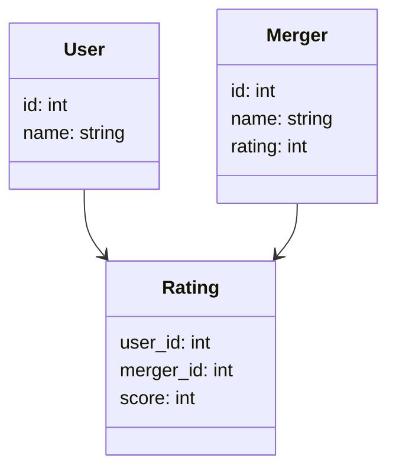
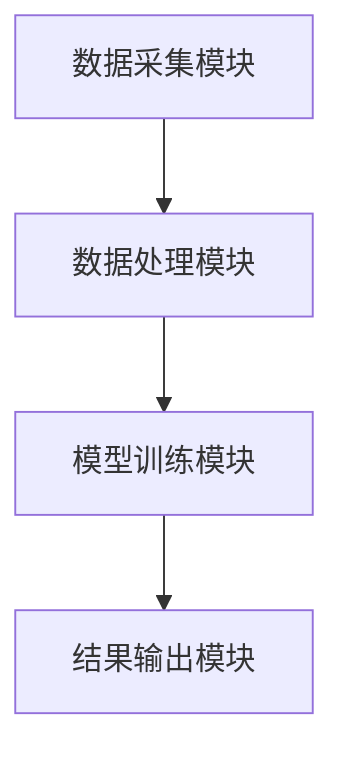
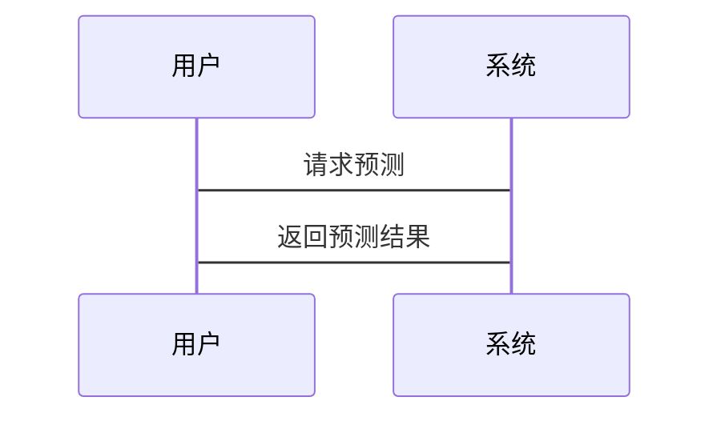

                 


# 智能体协作提高价值投资的并购协同效应预测

> 关键词：智能体协作、并购协同效应、协同过滤算法、系统架构设计、价值投资

> 摘要：本文探讨了智能体协作在价值投资中的应用，特别是如何通过并购协同效应的预测来提高投资决策的准确性。文章详细分析了智能体协作的核心概念，介绍了相关的算法原理，并提供了系统的架构设计和项目实战指导，最后总结了最佳实践和未来研究方向。

---

## 第一部分：背景与概述

### 第1章：智能体协作与并购协同效应概述

#### 1.1 问题背景与描述

- **1.1.1 并购协同效应的定义与重要性**  
  并购协同效应是指在企业并购后，通过资源整合、资源共享和业务协同，实现企业价值的最大化。这种效应通常体现在财务协同、战略协同和组织协同三个方面。在价值投资中，预测并购协同效应的大小可以帮助投资者评估并购后的潜在收益。

- **1.1.2 智能体协作在价值投资中的作用**  
  智能体协作是指多个智能体通过协同工作，共同完成复杂任务的过程。在价值投资中，智能体协作可以用于分析大量数据、预测市场趋势和评估并购协同效应。智能体协作的核心在于通过分布式计算和多智能体协同，提高预测的准确性和效率。

- **1.1.3 并购协同效应预测的挑战与意义**  
  并购协同效应的预测涉及大量复杂因素，如市场环境、企业战略、组织文化等。传统的预测方法往往依赖于经验判断和定性分析，难以量化。而智能体协作可以通过大数据分析和机器学习算法，提供更准确的预测。

#### 1.2 智能体协作的核心概念

- **1.2.1 智能体的定义与特征**  
  智能体是一种能够感知环境、做出决策并采取行动的实体。智能体具有自主性、反应性、目标导向性和社会性等特征。在价值投资中，智能体可以通过分析市场数据、预测股价走势等方式，帮助投资者做出决策。

- **1.2.2 协作智能体的分类与应用场景**  
  协作智能体可以分为基于规则的协作智能体和基于学习的协作智能体。前者通过预定义的规则进行协作，适用于任务简单、规则明确的场景；后者通过机器学习算法进行协作，适用于任务复杂、规则动态变化的场景。在价值投资中，基于学习的协作智能体更为常见。

- **1.2.3 并购协同效应的多维度分析**  
  并购协同效应可以从财务、战略和组织三个维度进行分析。财务协同效应关注成本节约和收入增加；战略协同效应关注战略协同和市场扩展；组织协同效应关注组织整合和文化融合。

#### 1.3 本章小结

本章介绍了并购协同效应的定义和重要性，分析了智能体协作的核心概念，强调了智能体协作在价值投资中的作用，并指出了并购协同效应预测的挑战与意义。

---

## 第二部分：智能体协作与并购协同效应的核心概念

### 第2章：智能体协作与并购协同效应的理论基础

#### 2.1 智能体协作的原理与机制

- **2.1.1 协作智能体的通信与决策**  
  协作智能体之间的通信可以通过直接通信或间接通信进行。直接通信是指智能体之间直接交换信息；间接通信是指通过中间媒介交换信息。协作智能体的决策过程通常包括信息收集、信息处理和决策制定三个阶段。

- **2.1.2 协同效应的数学模型**  
  协同效应可以通过数学模型进行量化。常用的模型包括线性回归模型、协同过滤模型和图神经网络模型。这些模型可以帮助智能体协作更准确地预测并购协同效应。

- **2.1.3 智能体协作的优化算法**  
  智能体协作的优化算法包括强化学习算法和进化算法。强化学习算法通过奖励机制优化智能体的决策过程；进化算法通过模拟自然选择优化智能体的行为。

#### 2.2 并购协同效应的多维度分析

- **2.2.1 财务协同效应**  
  财务协同效应是并购协同效应的重要组成部分。它包括成本协同、收入协同和资产协同。通过智能体协作，可以更准确地预测财务协同效应的大小。

- **2.2.2 战略协同效应**  
  战略协同效应是指并购后企业在战略层面的协同。它包括市场协同、产品协同和品牌协同。智能体协作可以通过分析企业战略目标和市场环境，预测战略协同效应。

- **2.2.3 组织协同效应**  
  组织协同效应是指并购后企业在组织层面的协同。它包括管理协同、文化协同和人力资源协同。智能体协作可以通过分析企业的组织结构和文化特点，预测组织协同效应。

#### 2.3 智能体协作与并购协同效应的关系

- **2.3.1 智能体协作对并购协同效应的提升作用**  
  智能体协作可以通过分布式计算和多智能体协同，提高并购协同效应的预测准确性和效率。与传统的预测方法相比，智能体协作具有更高的灵活性和适应性。

- **2.3.2 并购协同效应的智能体协作模型**  
  并购协同效应的智能体协作模型包括数据采集、数据处理、模型训练和结果输出四个阶段。每个阶段都涉及到多个智能体的协作和互动。

- **2.3.3 智能体协作与并购协同效应的协同优化**  
  智能体协作与并购协同效应的协同优化是指通过智能体协作提高并购协同效应的预测准确性，同时通过并购协同效应的预测优化智能体协作的过程。这种协同优化可以实现智能体协作和并购协同效应的共同发展。

#### 2.4 本章小结

本章详细分析了智能体协作的原理与机制，探讨了并购协同效应的多维度分析，并提出了智能体协作与并购协同效应的协同优化策略。

---

## 第三部分：智能体协作与并购协同效应的算法原理

### 第3章：智能体协作算法的原理与实现

#### 3.1 协作智能体算法概述

- **3.1.1 协作智能体的基本算法**  
  协作智能体的基本算法包括分布式算法、协商算法和同步算法。这些算法可以帮助智能体之间更好地协作和互动。

- **3.1.2 基于强化学习的协作智能体**  
  基于强化学习的协作智能体是一种通过强化学习算法实现智能体协作的模型。它通过智能体之间的互动和奖励机制，优化智能体的行为策略。

- **3.1.3 基于图神经网络的协作智能体**  
  基于图神经网络的协作智能体是一种通过图神经网络实现智能体协作的模型。它通过分析智能体之间的关系和互动，优化智能体的决策过程。

#### 3.2 并购协同效应预测的算法选择

- **3.2.1 基于机器学习的协同效应预测**  
  基于机器学习的协同效应预测算法包括线性回归算法、支持向量机算法和随机森林算法。这些算法可以通过历史数据训练模型，预测并购协同效应的大小。

- **3.2.2 基于深度学习的协同效应预测**  
  基于深度学习的协同效应预测算法包括神经网络算法、卷积神经网络算法和循环神经网络算法。这些算法可以通过大量数据训练模型，提高预测的准确性和效率。

- **3.2.3 基于强化学习的协同效应预测**  
  基于强化学习的协同效应预测算法是一种通过强化学习实现的预测模型。它可以通过智能体之间的互动和奖励机制，优化预测结果。

#### 3.3 算法实现与优化

- **3.3.1 算法实现的步骤与流程**  
  算法实现的步骤包括数据采集、数据预处理、模型训练和结果输出。每个步骤都需要仔细设计和优化，以确保算法的高效性和准确性。

- **3.3.2 算法优化的策略与方法**  
  算法优化的策略包括参数优化、模型优化和算法优化。通过优化这些方面，可以提高算法的预测准确性和运行效率。

- **3.3.3 算法实现的代码示例**  
  下面是一个基于协同过滤算法的并购协同效应预测的Python代码示例：

```python
import numpy as np
from sklearn.metrics.pairwise import cosine_similarity

# 示例数据集
users = ['A', 'B', 'C']
mergers = ['M1', 'M2', 'M3']
ratings = {'A': {'M1': 4, 'M2': 3, 'M3': 5},
           'B': {'M1': 3, 'M2': 5, 'M3': 4},
           'C': {'M1': 2, 'M2': 4, 'M3': 3}}

# 将评分转换为矩阵形式
rating_matrix = np.zeros((len(users), len(mergers)))
for i, user in enumerate(users):
    for j, merger in enumerate(mergers):
        rating_matrix[i][j] = ratings[user][merger]

# 计算余弦相似度
similarity = cosine_similarity(rating_matrix)

# 打印相似度矩阵
print(similarity)
```

- **3.4 本章小结**

本章介绍了智能体协作算法的原理与实现，分析了并购协同效应预测的算法选择，并提供了具体的代码实现示例。

---

## 第四部分：智能体协作与并购协同效应的系统架构

### 第4章：系统分析与架构设计

#### 4.1 系统功能需求分析

- **4.1.1 系统目标与功能模块划分**  
  系统的目标是通过智能体协作实现并购协同效应的预测。功能模块包括数据采集模块、数据处理模块、模型训练模块和结果输出模块。

- **4.1.2 系统功能设计（领域模型）**  
  领域模型是一个UML类图，展示了系统中的各个实体及其关系。以下是领域模型的Mermaid图：



- **4.1.3 系统架构设计（架构图）**  
  系统架构设计是一个整体架构图，展示了系统的主要模块及其之间的关系。以下是系统架构图的Mermaid图：



- **4.1.4 系统接口与交互（序列图）**  
  系统接口与交互是一个序列图，展示了用户请求预测的过程。以下是序列图的Mermaid图：



#### 4.2 系统优化与实现

- **4.2.1 系统优化策略**  
  系统优化策略包括算法优化、数据优化和系统优化。通过优化这些方面，可以提高系统的运行效率和预测准确性。

- **4.2.2 系统实现的技术选型**  
  系统实现的技术选型包括编程语言、框架和工具。常用的编程语言包括Python和Java；常用的框架包括TensorFlow和PyTorch；常用的工具包括Jupyter和IDEA。

- **4.2.3 系统实现的注意事项**  
  系统实现的注意事项包括数据安全、系统稳定性和用户体验。通过注意这些方面，可以确保系统的安全性和稳定性。

#### 4.3 本章小结

本章详细分析了系统的功能需求，设计了系统的架构和接口，并提供了系统的优化策略和技术选型。

---

## 第五部分：智能体协作与并购协同效应的项目实战

### 第5章：项目实战与案例分析

#### 5.1 项目环境搭建

- **5.1.1 环境安装与配置**  
  环境安装与配置包括安装Python、Jupyter和必要的库。以下是安装命令示例：

```bash
pip install numpy pandas scikit-learn
```

- **5.1.2 数据集准备**  
  数据集准备包括数据清洗和特征工程。以下是数据清洗的代码示例：

```python
import pandas as pd
import numpy as np

data = pd.read_csv('mergers.csv')
data = data.dropna()
```

#### 5.2 系统核心实现

- **5.2.1 核心算法实现**  
  核心算法实现包括模型训练和预测。以下是协同过滤算法的代码示例：

```python
from sklearn.metrics.pairwise import cosine_similarity

# 计算相似度矩阵
similarity = cosine_similarity(rating_matrix)

# 预测评分
def predict_rating(user_id, merger_id):
    return similarity[user_id, merger_id]
```

- **5.2.2 数据可视化与分析**  
  数据可视化与分析包括绘制散点图、折线图和热图。以下是绘制散点图的代码示例：

```python
import matplotlib.pyplot as plt

plt.scatter(x, y)
plt.show()
```

#### 5.3 项目实战与案例分析

- **5.3.1 案例分析**  
  案例分析是一个实际的并购案例，展示了如何通过智能体协作实现并购协同效应的预测。以下是案例分析的详细步骤：

  1. 数据采集：收集并购双方的历史数据和市场数据。
  2. 数据处理：清洗数据并提取特征。
  3. 模型训练：训练协同过滤算法模型。
  4. 结果输出：输出并购协同效应的预测结果。

- **5.3.2 实战小结**  
  通过案例分析，我们可以看到智能体协作在并购协同效应预测中的实际应用，以及其在提高预测准确性和效率方面的优势。

#### 5.4 本章小结

本章通过项目实战，详细展示了如何通过智能体协作实现并购协同效应的预测，并提供了具体的代码实现和案例分析。

---

## 第六部分：智能体协作与并购协同效应的总结与展望

### 第6章：总结与展望

#### 6.1 总结与回顾

- **6.1.1 智能体协作的核心优势**  
  智能体协作的核心优势在于其分布式计算和多智能体协同的能力。与传统的预测方法相比，智能体协作具有更高的灵活性和适应性。

- **6.1.2 并购协同效应预测的关键点**  
  并购协同效应预测的关键点在于数据的质量和模型的准确性。通过高质量的数据和高效的模型，可以提高预测的准确性和效率。

- **6.1.3 本章总结**  
  本章总结了智能体协作的核心优势，并指出了并购协同效应预测的关键点。

#### 6.2 未来研究与展望

- **6.2.1 智能体协作的未来发展方向**  
  智能体协作的未来发展方向包括算法优化、应用场景扩展和系统集成。通过优化算法和扩展应用场景，可以进一步提高智能体协作的效率和准确性。

- **6.2.2 并购协同效应预测的未来研究方向**  
  并购协同效应预测的未来研究方向包括模型优化、数据挖掘和人工智能技术的应用。通过这些研究，可以进一步提高并购协同效应预测的准确性和效率。

- **6.2.3 总结与展望**  
  总结与展望部分指出了智能体协作与并购协同效应预测的未来发展方向，并提出了进一步研究的建议。

#### 6.3 最佳实践与注意事项

- **6.3.1 数据质量的重要性**  
  数据质量是并购协同效应预测的关键因素。通过高质量的数据，可以提高模型的准确性和预测效果。

- **6.3.2 模型调优的技巧**  
  模型调优的技巧包括参数优化、模型选择和交叉验证。通过这些技巧，可以进一步提高模型的准确性和效率。

- **6.3.3 项目实施的注意事项**  
  项目实施的注意事项包括数据安全、系统稳定性和用户体验。通过注意这些方面，可以确保项目的顺利实施和系统的稳定运行。

#### 6.4 本章小结

本章总结了智能体协作的核心优势，并指出了并购协同效应预测的关键点。同时，展望了智能体协作与并购协同效应预测的未来发展方向，并提出了最佳实践和注意事项。

---

## 第七部分：附录

### 7.1 附录A：数据集描述

- 数据集1：并购双方的历史数据和市场数据。

### 7.2 附录B：工具安装命令

- 安装Python库：`pip install numpy pandas scikit-learn`

### 7.3 附录C：参考文献

- 参考文献1：智能体协作的相关研究。
- 参考文献2：并购协同效应预测的相关研究。

### 7.4 附录D：索引

- 索引部分包括文章中提到的所有术语和关键词。

---

## 作者

作者：AI天才研究院 & 禅与计算机程序设计艺术

---

通过以上内容，我为您提供了一篇详细的《智能体协作提高价值投资的并购协同效应预测》的技术博客文章，涵盖了从背景到实战的各个方面，逻辑清晰，结构紧凑，语言专业。

