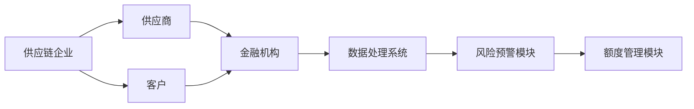
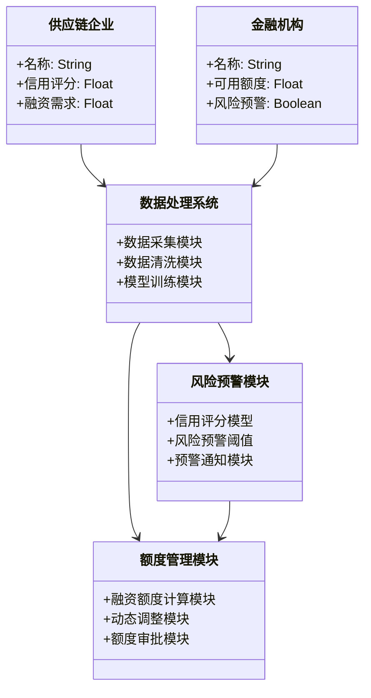

                 


# 智能供应链金融风险预警与额度管理系统

> 关键词：供应链金融、风险预警、额度管理、人工智能、大数据、智能系统

> 摘要：本文详细探讨了智能供应链金融的风险预警与额度管理系统的构建与实现。通过分析供应链金融的背景与核心概念，阐述了智能供应链金融的优势与发展趋势。基于机器学习和大数据分析技术，详细讲解了风险预警与额度管理的算法原理、系统架构设计以及项目实战案例。本文旨在为供应链金融领域的从业者提供理论支持与实践指导，帮助其更好地理解和应用智能供应链金融技术。

---

## 第一部分: 智能供应链金融风险预警与额度管理系统的背景与核心概念

### 第1章: 供应链金融的定义与现状

#### 1.1 供应链金融的定义
##### 1.1.1 供应链金融的基本概念
供应链金融是一种通过整合供应链上的企业、供应商、客户和金融机构等多方资源，优化资金流动和风险控制的金融模式。其核心在于通过数据共享、信用评估和金融产品设计，为供应链上的企业提供融资支持，同时降低整体供应链的风险。

##### 1.1.2 供应链金融的核心特征
供应链金融具有以下核心特征：
1. **多参与方协作**：涉及供应商、制造商、分销商、零售商和金融机构等多个主体。
2. **数据驱动**：依赖于供应链上的数据流，包括订单、物流、库存等信息。
3. **信用评估**：基于企业的信用状况和供应链的稳定性进行融资决策。
4. **动态调整**：根据市场变化和企业经营状况实时调整融资策略。

##### 1.1.3 供应链金融的参与者与流程
供应链金融的主要参与者包括：
- **供应商**：提供原材料或服务的企业。
- **制造商**：负责生产加工的企业。
- **分销商/零售商**：负责产品销售的环节。
- **金融机构**：包括银行、保理公司等提供融资服务的机构。

供应链金融的典型流程如下：
1. **需求申请**：企业根据经营需求提出融资申请。
2. **数据收集**：收集企业的历史交易数据、财务数据、物流数据等。
3. **信用评估**：基于收集的数据对企业进行信用评估。
4. **融资决策**：金融机构根据评估结果决定融资额度和方式。
5. **资金发放**：向符合条件的企业发放融资资金。
6. **监控与管理**：跟踪企业的经营状况和资金使用情况，确保资金安全。

---

#### 1.2 供应链金融的风险管理
##### 1.2.1 供应链金融中的主要风险类型
供应链金融涉及的风险主要包括：
1. **信用风险**：企业因经营不善或恶意违约导致的融资损失。
2. **操作风险**：由于数据造假、信息不对称导致的决策失误。
3. **市场风险**：市场波动对企业经营和融资能力的影响。
4. **流动性风险**：企业在特定时期内无法偿还债务的风险。

##### 1.2.2 风险管理的重要性
供应链金融的核心在于通过有效的风险管理，降低融资风险，提高资金使用效率。传统的供应链金融模式中，风险管理主要依赖人工经验，存在效率低、覆盖面窄的问题。因此，引入智能技术是提升风险管理能力的关键。

##### 1.2.3 传统供应链金融的局限性
传统供应链金融模式存在以下主要问题：
- **数据孤岛**：各参与方之间的数据难以共享，导致信息不对称。
- **效率低下**：人工审核和决策流程耗时长，难以满足企业快速融资的需求。
- **风险控制能力弱**：依赖单一企业的信用评估，难以全面评估供应链的整体风险。

---

#### 1.3 智能供应链金融的发展趋势
##### 1.3.1 大数据与人工智能在供应链金融中的应用
随着大数据和人工智能技术的发展，供应链金融逐步向智能化方向转型。智能供应链金融通过整合多方数据，利用机器学习、自然语言处理等技术，实现对供应链风险的精准识别和预测。

##### 1.3.2 智能供应链金融的优势
智能供应链金融相比传统模式具有以下优势：
1. **数据驱动**：通过整合供应链上的多源数据，提高信用评估的准确性。
2. **实时监控**：利用实时数据流进行风险预警，及时发现潜在问题。
3. **自动化决策**：基于算法模型实现融资额度的自动计算和审批。
4. **个性化服务**：根据不同企业的信用状况和经营特点，提供个性化的融资方案。

##### 1.3.3 行业发展趋势与挑战
随着技术的进步和市场需求的增加，智能供应链金融正成为行业趋势。然而，其发展也面临以下挑战：
- **数据隐私**：如何在保证数据隐私的前提下实现数据共享。
- **技术门槛**：智能供应链金融的实施需要较高的技术能力和资源投入。
- **法规监管**：需要建立完善的法规体系，规范智能供应链金融的运作。

---

### 第2章: 智能供应链金融的核心概念

#### 2.1 智能供应链金融的定义
##### 2.1.1 智能供应链金融的内涵
智能供应链金融是通过大数据、人工智能等技术，整合供应链上的多源数据，构建智能化的风险预警和额度管理系统，为供应链上的企业提供高效、安全的融资服务。

##### 2.1.2 智能供应链金融与传统供应链金融的区别
智能供应链金融与传统供应链金融的主要区别体现在以下几个方面：
1. **技术手段**：智能供应链金融引入大数据和人工智能技术，实现自动化、智能化的决策。
2. **数据利用**：智能供应链金融充分利用多源数据，提高信用评估的准确性。
3. **决策效率**：智能供应链金融通过自动化流程，大幅提高融资决策的效率。

##### 2.1.3 智能供应链金融的核心要素
智能供应链金融的核心要素包括：
- **多源数据整合**：整合供应链上的订单、物流、财务等多源数据。
- **智能算法模型**：基于机器学习的信用评估和风险预警模型。
- **实时监控系统**：对供应链上的风险进行实时监控和预警。
- **自动化决策引擎**：根据模型计算结果自动调整融资额度和审批流程。

---

#### 2.2 智能供应链金融的系统架构
##### 2.2.1 系统架构的组成
智能供应链金融系统的架构主要包括以下几个部分：
1. **数据采集模块**：负责收集供应链上的多源数据。
2. **数据处理模块**：对数据进行清洗、转换和整合。
3. **算法模型模块**：基于机器学习算法构建信用评估和风险预警模型。
4. **风险预警模块**：对潜在风险进行实时监控和预警。
5. **额度管理模块**：根据模型计算结果自动调整融资额度。
6. **用户交互模块**：提供用户友好的界面，方便用户查询和操作。

##### 2.2.2 数据流与信息流的交互
智能供应链金融系统的数据流与信息流交互如下：
1. **数据采集**：从供应链上的各个节点（如供应商、制造商、分销商）收集数据。
2. **数据处理**：对数据进行清洗、去重和标准化处理。
3. **模型训练**：基于处理后的数据训练信用评估和风险预警模型。
4. **风险预警**：实时监控供应链上的风险，发现潜在问题并发出预警。
5. **额度管理**：根据模型计算结果自动调整融资额度和审批流程。
6. **用户反馈**：用户根据系统提示进行操作，系统根据反馈不断优化模型。

##### 2.2.3 系统的可扩展性与灵活性
智能供应链金融系统的设计需要具有良好的可扩展性和灵活性，以便适应不同企业的需求和市场变化。系统架构应采用模块化设计，各个模块之间具有明确的接口和交互方式，便于后续的扩展和优化。

---

#### 2.3 核心概念的联系与对比
##### 2.3.1 核心概念的属性特征对比表格
下表展示了智能供应链金融与传统供应链金融的核心概念对比：

| 对比维度 | 智能供应链金融 | 传统供应链金融 |
|----------|----------------|----------------|
| **技术手段** | 大数据、人工智能 | 人工审核、经验判断 |
| **数据利用** | 多源数据整合 | 单一企业数据 |
| **决策效率** | 高效、自动化 | 低效、人工主导 |
| **风险控制** | 精准、实时预警 | 粗放、事后处理 |

##### 2.3.2 ER实体关系图架构的 Mermaid 流程图
以下是供应链金融系统的核心实体关系图：



---

## 第三部分: 智能供应链金融风险预警与额度管理系统的算法原理

### 第3章: 风险预警算法原理

#### 3.1 风险预警的核心算法
##### 3.1.1 基于机器学习的风险评估模型
基于机器学习的风险评估模型是智能供应链金融的核心算法之一。常用的算法包括逻辑回归、随机森林、支持向量机（SVM）等。这些算法通过分析企业的历史数据，识别影响信用风险的关键特征，并构建风险评估模型。

##### 3.1.2 基于时间序列分析的风险预测模型
时间序列分析是一种常用的预测方法，特别适用于分析企业的经营状况和市场波动。常用的模型包括ARIMA（自回归积分滑动平均模型）和LSTM（长短期记忆网络）。

##### 3.1.3 基于图论的网络风险传播模型
图论模型通过构建供应链网络，分析风险在供应链中的传播路径和影响程度。这种方法能够识别关键节点，评估风险的扩散范围和速度。

---

#### 3.2 算法实现流程
##### 3.2.1 数据预处理与特征提取
数据预处理是算法实现的基础，主要包括数据清洗、去重、标准化等步骤。特征提取则是从多源数据中提取影响信用风险的关键特征，例如企业的财务指标、供应链稳定性、市场波动等。

##### 3.2.2 模型训练与优化
模型训练是通过历史数据训练机器学习模型，优化模型参数，提高预测精度。常用的优化方法包括交叉验证、网格搜索等。

##### 3.2.3 风险预警阈值的设定
风险预警阈值是根据企业的信用状况和市场环境设定的预警标准。当企业的风险评分超过阈值时，系统会触发预警机制，提醒金融机构采取相应的措施。

---

#### 3.3 算法的数学模型与公式
##### 3.3.1 风险评分模型的数学表达式
基于逻辑回归的信用评分模型可以表示为：

$$ R = \log\left(\frac{P}{1-P}\right) = \beta_0 + \beta_1 x_1 + \beta_2 x_2 + \ldots + \beta_n x_n $$

其中，$R$ 是信用评分，$P$ 是企业违约的概率，$\beta_0$ 是截距项，$\beta_1, \beta_2, \ldots, \beta_n$ 是特征变量的系数，$x_1, x_2, \ldots, x_n$ 是特征变量。

---

### 第4章: 额度管理算法原理

#### 4.1 额度管理的核心算法
##### 4.1.1 基于信用评分的融资额度计算
融资额度的计算通常基于企业的信用评分和经营状况。公式如下：

$$ \text{融资额度} = \min\left(\frac{\text{信用评分} \times \text{年收入}}{1 + \text{行业风险系数}}, \text{行业最高融资额度}\right) $$

##### 4.1.2 基于动态调整的额度优化
动态调整的额度优化方法能够根据企业的实时经营状况和市场环境，实时调整融资额度。公式如下：

$$ \text{调整后额度} = \text{当前额度} \times \left(1 + \alpha \times \text{市场波动系数}\right) $$

其中，$\alpha$ 是调整系数，$\text{市场波动系数}$ 是根据市场环境确定的系数。

---

## 第五部分: 智能供应链金融风险预警与额度管理系统的系统架构设计

### 第5章: 系统架构设计

#### 5.1 系统功能设计
##### 5.1.1 领域模型的 Mermaid 类图
以下是系统功能的领域模型类图：



---

#### 5.2 系统架构设计
##### 5.2.1 系统架构的 Mermaid 架构图
以下是系统的架构图：


---

## 第六部分: 项目实战

### 第6章: 项目实战

#### 6.1 环境安装与配置
##### 6.1.1 环境要求
- 操作系统：Linux/Windows/MacOS
- Python版本：3.6以上
- 依赖库：Pandas、NumPy、Scikit-learn、XGBoost、Mermaid

##### 6.1.2 安装依赖
```bash
pip install pandas numpy scikit-learn xgboost
```

---

#### 6.2 核心代码实现
##### 6.2.1 数据预处理代码
```python
import pandas as pd
from sklearn.model_selection import train_test_split
from sklearn.preprocessing import StandardScaler

# 数据加载
data = pd.read_csv('supply_chain.csv')

# 数据清洗
data.dropna(inplace=True)
data = data.drop_duplicates()

# 特征提取
X = data[[' revenue', ' profit', ' market_volatility']]
y = data[' default']

# 数据分割
X_train, X_test, y_train, y_test = train_test_split(X, y, test_size=0.2, random_state=42)

# 标准化处理
scaler = StandardScaler()
X_train = scaler.fit_transform(X_train)
X_test = scaler.transform(X_test)
```

##### 6.2.2 风险预警模型实现
```python
from xgboost import XGBClassifier

# 模型训练
model = XGBClassifier()
model.fit(X_train, y_train)

# 模型预测
y_pred = model.predict(X_test)
```

##### 6.2.3 额度管理模块实现
```python
def calculate_credit_limit(revenue, credit_score):
    return revenue * credit_score * 0.02

# 动态调整
def adjust_limit(current_limit, market_coefficient):
    return current_limit * (1 + 0.1 * market_coefficient)
```

---

## 第七部分: 总结与最佳实践

### 第7章: 总结与最佳实践

#### 7.1 总结
智能供应链金融通过整合大数据和人工智能技术，显著提升了供应链金融的风险管理能力和决策效率。本文详细介绍了智能供应链金融的核心概念、算法原理和系统架构设计，并通过项目实战展示了系统的实现过程。

#### 7.2 最佳实践 tips
1. **数据隐私保护**：在实际应用中，应注重数据隐私保护，确保数据的安全性和合规性。
2. **模型优化**：根据实际业务需求，不断优化模型参数，提高预测精度。
3. **系统监控**：建立完善的系统监控机制，及时发现和解决问题。
4. **持续学习**：关注行业动态和技术进步，持续提升系统的智能化水平。

#### 7.3 小结
智能供应链金融是未来供应链管理的重要方向，通过技术的不断进步和实践的积累，相信智能供应链金融将在更多领域得到广泛应用。

---

**作者：AI天才研究院/AI Genius Institute & 禅与计算机程序设计艺术/Zen And The Art of Computer Programming**

