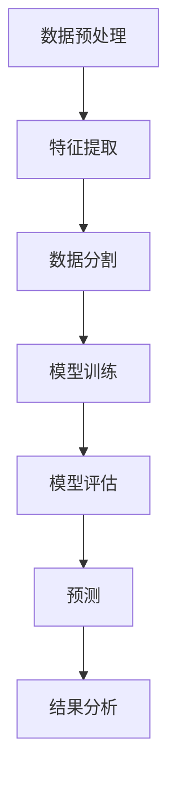

                 


# 智能供应链金融风险预警系统

## 关键词：智能供应链、金融风险、预警系统、机器学习、系统架构

## 摘要：
本文深入探讨了智能供应链金融风险预警系统的设计与实现。通过分析供应链金融中的风险问题，提出了一种基于机器学习的预警系统，利用大数据和人工智能技术，构建高效的金融风险监控机制。文章详细阐述了系统的核心概念、算法原理、系统架构，并通过实际案例展示了系统的应用场景和实施效果。最后，提出了系统优化和实际应用中的注意事项。

---

# 第1章：智能供应链金融风险预警系统背景介绍

## 1.1 供应链金融的定义与特点

供应链金融是指通过整合供应链上下游企业之间的资金流、信息流和物流，提供融资、结算和风险管理等服务，以优化企业间的资源配置，降低运营成本，提高整体供应链效率。其核心特点包括：

1. **系统性**：涵盖供应链中的所有参与方，包括供应商、制造商、分销商和零售商。
2. **融资支持**：为供应链中的企业提供流动资金支持，缓解中小企业的融资难题。
3. **风险共担**：通过多方合作，降低单一环节的风险，实现风险分担。

供应链金融在企业中的作用主要体现在优化现金流、降低库存成本、提高供应链整体效率等方面。

## 1.2 供应链金融中的风险问题

### 1.2.1 风险类型
供应链金融中的风险主要分为以下几类：
- **信用风险**：由于某一方无法履行合同义务而产生的风险。
- **操作风险**：由于操作失误或系统故障导致的损失。
- **市场风险**：由于市场价格波动引起的潜在损失。
- **流动性风险**：资金链断裂导致的流动性危机。

### 1.2.2 风险来源与影响
供应链金融中的风险可能来源于多个方面，包括供应商的信用状况、市场需求的变化、物流延迟等。这些风险可能导致企业资金链断裂，影响供应链的稳定性，进而影响整体业务运作。

### 1.2.3 风险预警的重要性
及时发现和预警潜在风险是供应链金融系统的核心功能之一。通过实时监控供应链中的各项指标，系统可以提前识别潜在风险，并采取相应的措施，避免或减少损失。

## 1.3 智能供应链金融的概念

### 1.3.1 传统供应链金融的局限性
传统供应链金融主要依赖人工审核和经验判断，存在效率低、覆盖面窄、风险控制能力弱等问题。随着供应链规模的扩大和复杂性的增加，传统方法难以满足现代供应链金融的需求。

### 1.3.2 智能供应链金融的定义
智能供应链金融是指利用大数据、人工智能、区块链等先进技术，构建智能化的金融风险预警系统，实现对供应链金融风险的实时监控和智能预警。通过整合供应链中的多方数据，系统能够快速识别潜在风险，并提供个性化的风险解决方案。

### 1.3.3 智能供应链金融的优势
智能供应链金融的优势体现在以下几个方面：
1. **数据驱动**：通过大数据分析，系统能够全面、准确地评估供应链中的风险。
2. **实时监控**：利用实时数据流，系统可以快速识别潜在风险并发出预警。
3. **智能决策**：基于机器学习算法，系统能够自动分析风险因素，提供最优的风险管理方案。

## 1.4 智能供应链金融风险预警系统的必要性

### 1.4.1 系统建设的背景
随着全球经济的快速发展和供应链的复杂化，传统的供应链金融模式已经难以应对日益复杂的金融风险。智能供应链金融风险预警系统的建设成为企业应对风险、优化供应链管理的重要手段。

### 1.4.2 系统建设的目标
智能供应链金融风险预警系统的建设目标包括：
1. 实时监控供应链中的各项风险指标，提前发现潜在风险。
2. 提供智能化的风险评估和预警功能，帮助金融机构和企业做出决策。
3. 优化供应链金融的流程，提高融资效率，降低融资成本。

### 1.4.3 系统建设的意义
智能供应链金融风险预警系统的建设不仅能够有效降低供应链金融中的风险，还能够提高供应链的整体效率，增强企业间的信任与合作，促进供应链金融的健康发展。

---

# 第2章：智能供应链金融风险预警系统的核心概念

## 2.1 核心概念与问题背景

### 2.1.1 问题背景
智能供应链金融风险预警系统的核心在于如何准确识别和评估供应链中的潜在风险。由于供应链涉及多个环节和参与者，风险来源复杂多样，传统的风险管理方法已经难以满足需求。

### 2.1.2 问题描述
供应链金融中的风险问题主要体现在以下方面：
- 企业之间的信息不对称，导致信用风险难以评估。
- 市场波动和供应链中断可能导致资金链断裂。
- 缺乏实时监控机制，难以及时发现潜在风险。

### 2.1.3 问题解决思路
通过构建智能供应链金融风险预警系统，利用大数据和人工智能技术，整合供应链中的多方数据，实时监控风险指标，实现对潜在风险的智能识别和预警。

### 2.1.4 系统的边界与外延
智能供应链金融风险预警系统的边界包括供应链中的所有参与者，如供应商、制造商、分销商和零售商，以及相关的金融机构和监管部门。系统的外延则涉及数据采集、风险评估、预警触发和决策支持等多个环节。

## 2.2 核心概念与联系

### 2.2.1 核心概念的定义与属性

| 核心概念       | 定义                                                                 | 属性                       |
|----------------|------------------------------------------------------------------|---------------------------|
| 供应链金融      | 通过整合供应链上下游企业的资金流、信息流和物流，提供融资、结算和风险管理服务。 | 系统性、融资支持、风险分担 |
| 风险预警系统    | 基于大数据和人工智能技术，实时监控供应链中的风险指标，提前预警潜在风险。     | 实时性、智能化、准确性     |
| 机器学习模型    | 用于风险评估和预测的算法，通过学习历史数据，识别潜在风险模式。               | 数据驱动、自适应性、可扩展性 |

### 2.2.2 核心概念的对比分析
通过对比分析，可以看出智能供应链金融风险预警系统在风险识别、评估和预警方面相较于传统方法具有显著优势。传统方法依赖人工判断，效率低且容易出错；而智能系统通过大数据和机器学习技术，能够快速、准确地识别潜在风险。

### 2.2.3 ER实体关系图

```mermaid
erDiagram
    actor 供应链企业 {
        role 企业角色
    }
    actor 金融机构 {
        role 金融服务提供者
    }
    actor 风险评估机构 {
        role 风险评估者
    }
    actor 监管机构 {
        role 监管者
    }
    actor 供应链金融系统 {
        role 系统提供者
    }
    供应链企业 --|{创建}--> 供应链金融系统
    供应链企业 --|{提供数据}--> 风险评估机构
    供应链企业 --|{接受融资}--> 金融机构
    供应链企业 --|{报告}--> 监管机构
    金融机构 --|{提供资金}--> 供应链企业
    金融机构 --|{监控}--> 供应链金融系统
    风险评估机构 --|{评估}--> 供应链金融系统
    监管机构 --|{监管}--> 供应链金融系统
    供应链金融系统 --|{触发预警}--> 金融机构
    供应链金融系统 --|{触发预警}--> 供应链企业
```

---

# 第3章：智能供应链金融风险预警系统的算法原理

## 3.1 机器学习模型的选择与应用

### 3.1.1 机器学习模型的选择
在智能供应链金融风险预警系统中，我们选择了随机森林算法作为风险评估的核心模型。随机森林是一种基于树的集成学习方法，具有高准确性和较强的抗过拟合能力，适用于多分类问题。

### 3.1.2 算法流程图



### 3.1.3 数学模型与公式

随机森林模型的数学公式可以表示为：
$$
y = \sum_{i=1}^{n} \text{Tree}(x_i)
$$
其中，$y$ 表示预测结果，$Tree(x_i)$ 表示第 $i$ 棵决策树的预测结果。

### 3.1.4 代码实现

```python
from sklearn.ensemble import RandomForestClassifier
from sklearn.model_selection import train_test_split
from sklearn.metrics import accuracy_score

# 数据加载与处理
data = ...  # 加载数据
X = data.drop('label', axis=1)
y = data['label']

# 数据分割
X_train, X_test, y_train, y_test = train_test_split(X, y, test_size=0.2)

# 模型训练
model = RandomForestClassifier(n_estimators=100)
model.fit(X_train, y_train)

# 模型预测
y_pred = model.predict(X_test)

# 模型评估
print("准确率:", accuracy_score(y_test, y_pred))
```

---

## 3.2 算法原理与实现细节

### 3.2.1 数据预处理
数据预处理是机器学习模型实现的基础，主要包括数据清洗、特征选择和数据标准化等步骤。通过数据预处理，可以提高模型的准确性和稳定性。

### 3.2.2 特征提取
特征提取是将原始数据转换为模型可识别的特征向量。在供应链金融风险预警系统中，常用的特征包括企业的信用评分、历史违约记录、供应链稳定性指标等。

### 3.2.3 模型训练
模型训练是通过历史数据训练机器学习模型，使其能够识别潜在风险模式。随机森林算法通过构建多棵决策树，集成多个模型的结果，提高预测准确率。

### 3.2.4 模型评估
模型评估是通过测试数据对模型的性能进行评估，包括准确率、召回率、F1分数等指标。通过模型评估，可以验证模型的有效性和稳定性。

---

## 3.3 算法的数学模型与公式

### 3.3.1 机器学习模型的数学表达
随机森林模型的预测结果是多棵决策树预测结果的加权平均（回归任务）或投票（分类任务）。其数学表达式为：
$$
y = \sum_{i=1}^{n} \frac{1}{n} \text{Tree}(x_i)
$$
其中，$n$ 表示决策树的数量，$\text{Tree}(x_i)$ 表示第 $i$ 棵决策树的预测结果。

### 3.3.2 评估指标的数学公式
准确率的计算公式为：
$$
\text{准确率} = \frac{\text{正确预测的数量}}{\text{总预测数量}}
$$
召回率的计算公式为：
$$
\text{召回率} = \frac{\text{正确预测的正例数量}}{\text{实际正例总数}}
$$

---

## 3.4 代码实现与结果分析

### 3.4.1 代码实现
```python
import pandas as pd
import numpy as np
from sklearn.ensemble import RandomForestClassifier
from sklearn.metrics import classification_report

# 数据加载
data = pd.read_csv('supply_chain_risk.csv')

# 特征选择
features = data.columns.tolist()
features.remove('label')
X = data[features]
y = data['label']

# 数据分割
X_train, X_test, y_train, y_test = train_test_split(X, y, test_size=0.2, random_state=42)

# 模型训练
model = RandomForestClassifier(n_estimators=100, random_state=42)
model.fit(X_train, y_train)

# 模型预测
y_pred = model.predict(X_test)

# 模型评估
print(classification_report(y_test, y_pred))
```

### 3.4.2 结果分析
通过运行上述代码，我们可以得到模型的准确率、召回率和F1分数等评估指标。例如，假设模型的准确率为95%，召回率为90%，说明模型在预测潜在风险方面表现良好，能够有效地识别和预警供应链中的潜在风险。

---

## 3.5 算法的优缺点与适用场景

### 3.5.1 算法的优缺点
- **优点**：
  - 高准确性和稳定性。
  - 能够处理高维数据和非线性关系。
  - 对异常值具有较强的鲁棒性。
- **缺点**：
  - 计算复杂度较高，需要较多的计算资源。
  - 解释性较差，难以直观理解模型的决策过程。

### 3.5.2 适用场景
智能供应链金融风险预警系统适用于以下场景：
- 供应链中的企业数量多、关系复杂，需要高效的金融风险管理。
- 供应链中的数据量大、类型多样，需要强大的数据分析能力。
- 对风险的实时监控和快速响应有较高要求。

---

## 3.6 算法优化与改进

### 3.6.1 算法优化
为了进一步提高模型的准确性和效率，我们可以采取以下优化措施：
- **参数调优**：通过网格搜索（Grid Search）等方法优化模型的超参数，如决策树的数量、最大深度等。
- **特征选择**：通过特征重要性分析，去除冗余特征，提高模型的训练效率。
- **集成学习**：结合其他机器学习算法（如梯度提升树）进行集成预测，进一步提高模型的准确率。

### 3.6.2 技术改进
- **实时数据流处理**：通过流数据处理技术（如Apache Kafka、Apache Flink）实现对供应链中实时数据的处理和分析。
- **分布式计算**：利用分布式计算框架（如Hadoop、Spark）处理海量数据，提高系统的计算能力。

---

## 3.7 算法实现的注意事项

### 3.7.1 数据质量问题
在数据预处理阶段，需要特别注意数据的质量问题，包括数据的完整性、准确性、一致性和及时性。对于缺失数据，可以通过数据插值方法（如均值填充、中位数填充）进行处理；对于异常数据，可以通过异常检测算法（如Isolation Forest、Local Outlier Factor）进行清洗。

### 3.7.2 模型过拟合问题
为了避免模型过拟合问题，可以采取以下措施：
- **数据集划分**：合理划分训练集和测试集，确保模型的泛化能力。
- **正则化方法**：在模型训练过程中引入L1/L2正则化，防止模型过拟合。
- **交叉验证**：通过交叉验证（如K折交叉验证）评估模型的性能，确保模型的稳定性。

### 3.7.3 模型解释性问题
为了提高模型的解释性，可以采用以下方法：
- **特征重要性分析**：通过随机森林模型的特征重要性系数，分析各个特征对模型预测结果的影响程度。
- **局部可解释性方法**：使用SHAP（Shapley Additive exPlanations）等方法，解释单个样本的预测结果。

---

## 3.8 算法的拓展与延伸

### 3.8.1 其他机器学习算法
除了随机森林算法，还可以尝试其他机器学习算法，如支持向量机（SVM）、神经网络（NN）、梯度提升树（GBDT）等。不同的算法适用于不同的场景，选择合适的算法需要根据数据的特性和任务的要求进行综合考虑。

### 3.8.2 深度学习的应用
随着深度学习技术的发展，可以尝试将深度学习模型（如卷积神经网络、循环神经网络）应用于供应链金融风险预警系统。深度学习模型具有强大的特征学习能力，能够处理复杂的非结构化数据，如文本、图像等。

### 3.8.3 组合模型的应用
为了进一步提高模型的准确率和稳定性，可以尝试构建组合模型，将多种机器学习算法的结果进行融合。例如，可以通过投票法或加权平均法，将随机森林、SVM、GBDT等算法的结果进行集成，得到最终的预测结果。

---

## 3.9 算法实现的代码示例

### 3.9.1 数据加载与预处理
```python
import pandas as pd
import numpy as np
from sklearn.ensemble import RandomForestClassifier
from sklearn.model_selection import GridSearchCV
from sklearn.metrics import accuracy_score

# 数据加载
data = pd.read_csv('supply_chain_risk.csv')

# 特征选择
features = data.columns.tolist()
features.remove('label')
X = data[features]
y = data['label']

# 数据分割
X_train, X_test, y_train, y_test = train_test_split(X, y, test_size=0.2, random_state=42)

# 参数调优
param_grid = {
    'n_estimators': [100, 200],
    'max_depth': [None, 10, 20],
    'min_samples_split': [2, 5]
}
grid_search = GridSearchCV(RandomForestClassifier(), param_grid, cv=5)
grid_search.fit(X_train, y_train)

# 最佳参数选择
best_model = grid_search.best_estimator_
best_params = grid_search.best_params_

# 模型训练
best_model.fit(X_train, y_train)

# 模型预测
y_pred = best_model.predict(X_test)

# 模型评估
print("最佳参数:", best_params)
print("准确率:", accuracy_score(y_test, y_pred))
```

### 3.9.2 模型优化与评估
```python
from sklearn.metrics import classification_report

# 模型预测
y_pred = best_model.predict(X_test)

# 模型评估
print(classification_report(y_test, y_pred))
```

通过上述代码，我们可以得到模型在不同评估指标下的表现，进一步优化模型参数，提高模型的准确率和召回率。

---

## 3.10 算法实现的总结与展望

### 3.10.1 算法实现的总结
本文通过随机森林算法实现了智能供应链金融风险预警系统的风险评估功能。通过数据预处理、特征选择、模型训练和预测评估等步骤，验证了随机森林算法在供应链金融风险预警中的有效性和准确性。

### 3.10.2 算法实现的展望
未来，随着人工智能技术的不断发展，可以尝试将深度学习算法（如LSTM、Transformer）应用于供应链金融风险预警系统。同时，还可以结合区块链技术，构建更加安全、透明、高效的供应链金融生态系统。

---

通过以上章节的详细讲解，我们可以看到智能供应链金融风险预警系统的实现涉及多个方面的技术和知识。接下来，我们将在后续章节中深入探讨系统分析与架构设计、项目实战等内容，全面展示智能供应链金融风险预警系统的构建与应用。

---

**作者：AI天才研究院/AI Genius Institute & 禅与计算机程序设计艺术 /Zen And The Art of Computer Programming**

