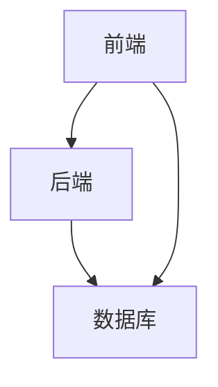
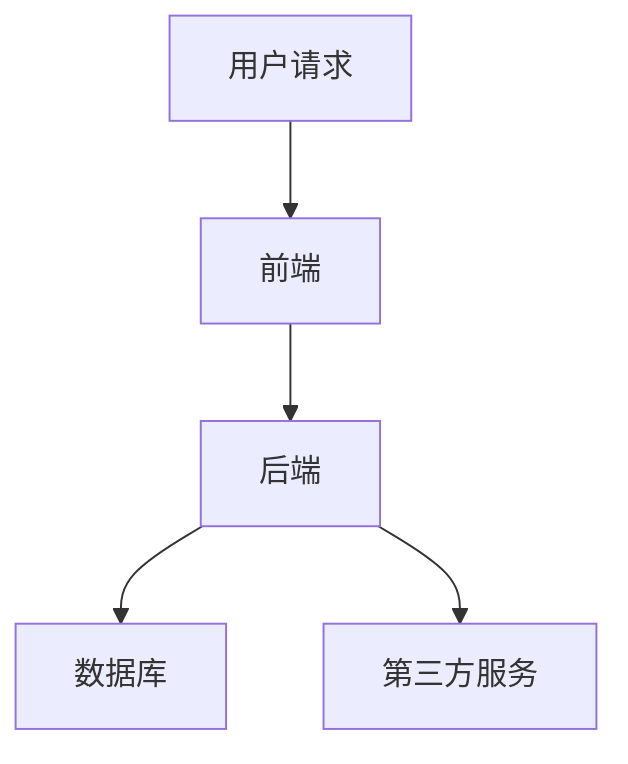
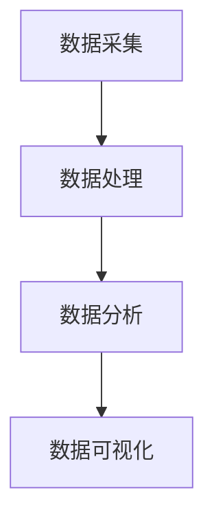
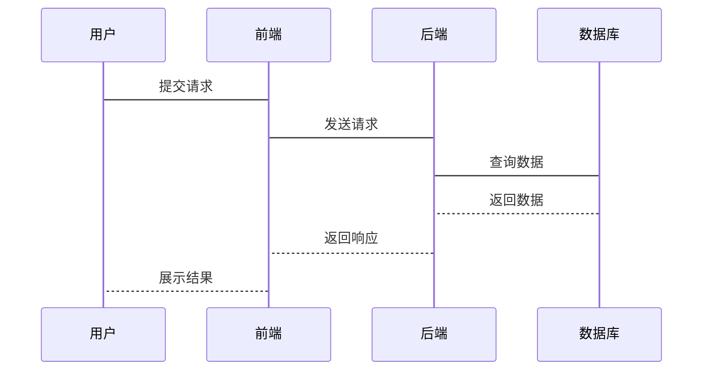

                 


# 智能银行不良资产管理系统

> 关键词：智能银行, 不良资产, 人工智能, 大数据分析, 系统架构设计

> 摘要：本文详细介绍了智能银行不良资产管理系统的设计与实现，从系统背景、核心技术、算法原理、系统架构到项目实战和案例分析，全面解析了该系统的建设过程。通过人工智能和大数据分析技术，系统能够高效识别和管理不良资产，为银行的风险控制和管理效率提供强有力支持。

---

# 第一部分: 智能银行不良资产管理系统概述

## 第1章: 智能银行不良资产管理系统背景与概述

### 1.1 不良资产的定义与特征

#### 1.1.1 不良资产的定义
不良资产是指那些无法按期收回本金和利息的贷款、逾期账款等资产。在银行的日常运营中，不良资产的存在会严重影响银行的财务健康和风险控制能力。

#### 1.1.2 不良资产的主要特征
- 贷款逾期：借款人未能按时偿还贷款本金和利息。
- 资产贬值：抵押物的价值可能因市场变化而大幅下降。
- 债务重组：借款人可能通过债务重组来降低还款压力。
- 法律风险：不良资产可能导致银行涉及诉讼或仲裁。

#### 1.1.3 不良资产对银行的影响
- 财务损失：不良资产直接导致银行的资产质量下降，影响盈利能力。
- 风险加剧：不良资产增加了银行的信用风险和流动性风险。
- 资信下降：不良资产会影响银行的信用评级，降低市场信心。

### 1.2 智能银行的概念与内涵

#### 1.2.1 智能银行的定义
智能银行是通过人工智能、大数据分析、云计算等先进技术，实现金融服务的智能化、自动化和个性化。智能银行能够通过数据分析和机器学习算法，为客户提供个性化的服务，同时优化银行的运营效率。

#### 1.2.2 智能银行的核心特征
- 数据驱动：智能银行通过收集和分析海量数据，为决策提供支持。
- 自动化服务：智能银行能够通过自动化流程减少人工干预，提高效率。
- 个性化体验：智能银行能够根据客户需求提供个性化的金融服务。
- 智能风控：智能银行通过机器学习和大数据分析，实现风险的智能化管理。

#### 1.2.3 智能银行与传统银行的区别
- 技术基础：智能银行依赖于人工智能和大数据技术，而传统银行主要依赖于人工操作。
- 服务模式：智能银行提供自动化、个性化的服务，传统银行的服务更多依赖于人工。
- 风险管理：智能银行通过数据驱动的方式进行风险管理，传统银行更多依赖于经验判断。

### 1.3 智能银行不良资产管理系统的重要性

#### 1.3.1 系统在智能银行中的作用
- 不良资产识别：通过机器学习算法，快速识别潜在的不良资产。
- 风险预警：系统能够实时监控客户的还款情况，提前预警风险。
- 资产管理：系统能够对不良资产进行分类管理，制定相应的处置策略。

#### 1.3.2 系统对银行管理效率的提升
- 自动化处理：系统能够自动处理不良资产的相关数据，减少人工干预。
- 高效识别：通过机器学习算法，系统能够快速识别潜在的不良资产。
- 数据驱动决策：系统通过分析海量数据，为银行的决策提供支持。

#### 1.3.3 系统对风险管理的优化
- 风险预警：系统能够实时监控客户的还款情况，提前预警风险。
- 资产分类：系统能够对不良资产进行分类管理，制定相应的处置策略。
- 风险控制：系统通过数据分析，优化银行的风险管理流程，降低风险敞口。

### 1.4 本章小结
本章从不良资产的定义与特征、智能银行的概念与内涵以及智能银行不良资产管理系统的重要性三个方面进行了详细阐述。通过这些内容，我们可以更好地理解智能银行不良资产管理系统的建设背景和意义。

---

## 第2章: 智能银行不良资产分析的核心技术

### 2.1 人工智能技术在不良资产分析中的应用

#### 2.1.1 机器学习在不良资产分类中的应用
- 监督学习：通过训练数据，分类器能够识别不良资产的特征。
- 无监督学习：通过聚类算法，发现潜在的不良资产群体。
- 回归分析：通过回归模型，预测不良资产的违约概率。

#### 2.1.2 深度学习在不良资产预测中的应用
- 神经网络：通过多层感知机（MLP）模型，进行非线性特征提取。
- 卷积神经网络（CNN）：用于处理图像和序列数据，提取深层次特征。
- 循环神经网络（RNN）：用于处理时间序列数据，预测未来的违约概率。

#### 2.1.3 自然语言处理在不良资产文本分析中的应用
- 文本分类：对客户提供的文本信息进行分类，识别潜在的不良资产。
- 实体识别：从文本中提取关键实体信息，如客户名称、金额等。
- 情感分析：通过分析文本中的情感倾向，判断客户的还款意愿。

### 2.2 大数据分析在不良资产管理系统中的作用

#### 2.2.1 数据预处理技术
- 数据清洗：去除重复数据、填充缺失值、处理异常值。
- 数据转换：将数据转换为适合算法处理的形式，如归一化、标准化。
- 数据集成：将多个数据源的数据进行集成，形成统一的数据集。

#### 2.2.2 数据挖掘技术
- 关联规则挖掘：发现数据中的关联规则，如购买商品的关联性。
- 聚类分析：将相似的客户或资产进行分组，发现潜在的不良资产群体。
- 分类分析：通过分类模型，识别不良资产的特征。

#### 2.2.3 数据可视化技术
- 数据可视化工具：如Tableau、Power BI、matplotlib等。
- 可视化分析：通过图表、仪表盘等形式，直观展示数据的特征和趋势。

### 2.3 不良资产分析的关键算法

#### 2.3.1 分类算法
- 决策树：通过构建决策树模型，进行分类预测。
- 随机森林：通过集成多个决策树模型，提高分类准确率。
- 支持向量机（SVM）：通过最大化分类间隔，实现非线性分类。

#### 2.3.2 回归算法
- 线性回归：通过最小二乘法，拟合最佳回归直线。
- 逻辑回归：通过sigmoid函数，将线性回归的结果映射到概率空间。
- 弹性网回归：结合Lasso和Ridge回归，提高模型的泛化能力。

#### 2.3.3 聚类算法
- K均值聚类：通过计算距离，将数据分成K个簇。
- 层次聚类：通过层次化的方式，将数据分成不同的簇。
- DBSCAN：基于密度的聚类算法，能够发现任意形状的簇。

### 2.4 本章小结
本章从人工智能技术在不良资产分析中的应用、大数据分析在不良资产管理系统中的作用以及不良资产分析的关键算法三个方面进行了详细阐述。通过这些内容，我们可以更好地理解智能银行不良资产管理系统的核心技术。

---

## 第3章: 不良资产分类算法原理

### 3.1 机器学习分类算法

#### 3.1.1 决策树分类算法
- 决策树的构建：通过信息熵或基尼指数，选择最优特征进行分裂。
- 决策树的预测：通过遍历决策树，确定每个样本的类别。
- 决策树的优化：通过剪枝技术，避免过拟合。

#### 3.1.2 随机森林分类算法
- 随机森林的构建：通过Bootstrap方法，生成多个决策树。
- 随机森林的预测：通过投票或加权的方式，确定最终的分类结果。
- 随机森林的优化：通过调整树的棵数和特征选择，提高分类准确率。

#### 3.1.3 支持向量机分类算法
- 支持向量机的构建：通过最大化分类间隔，找到最优超平面。
- 支持向量机的预测：通过判断样本点位于哪一侧，确定其类别。
- 支持向量机的优化：通过调整惩罚参数和核函数，提高分类效果。

### 3.2 深度学习分类算法

#### 3.2.1 神经网络分类算法
- 神经网络的构建：通过定义网络结构，包括输入层、隐藏层和输出层。
- 神经网络的训练：通过反向传播算法，更新权重和偏置。
- 神经网络的预测：通过前向传播算法，输出样本的类别概率。

#### 3.2.2 卷积神经网络分类算法
- CNN的构建：包括卷积层、池化层、全连接层等。
- CNN的训练：通过反向传播算法，更新卷积核和全连接层的权重。
- CNN的预测：通过卷积操作和池化操作，提取图像特征，输出样本的类别。

#### 3.2.3 循环神经网络分类算法
- RNN的构建：通过循环层处理序列数据，提取时间特征。
- RNN的训练：通过展开时间序列，使用反向传播算法更新权重。
- RNN的预测：通过循环处理序列数据，输出每个时间点的类别概率。

### 3.3 分类算法的数学模型与公式

#### 3.3.1 决策树分类算法的数学模型
$$ Gini指数 = \sum_{k=1}^{n} p_k (1 - p_k) $$
其中，$p_k$是第k个类别的概率。

#### 3.3.2 逻辑回归分类算法的数学模型
$$ P(y|x) = \frac{e^{\beta x}}{1 + e^{\beta x}} $$
其中，$\beta$是模型的参数，$x$是输入特征。

#### 3.3.3 支持向量机分类算法的数学模型
$$ \min_{\theta} \frac{1}{2} \theta^T \theta + C \sum_{i=1}^{n} \xi_i $$
$$ y_i (\theta^T x_i + \xi_i) \geq 1 $$
其中，$\theta$是模型的参数，$\xi_i$是松弛变量，$C$是惩罚参数。

### 3.4 本章小结
本章从机器学习分类算法和深度学习分类算法两个方面进行了详细阐述，包括决策树、随机森林、支持向量机、神经网络、卷积神经网络和循环神经网络等算法的原理和数学模型。通过这些内容，我们可以更好地理解智能银行不良资产管理系统中分类算法的应用。

---

## 第4章: 不良资产管理系统的核心算法实现

### 4.1 不良资产分类算法的实现

#### 4.1.1 数据预处理
- 数据清洗：去除重复数据、填充缺失值、处理异常值。
- 数据转换：将数据转换为适合算法处理的形式，如归一化、标准化。
- 数据分割：将数据分为训练集和测试集。

#### 4.1.2 模型训练
- 选择算法：根据数据特征和业务需求，选择合适的分类算法。
- 参数调优：通过网格搜索或随机搜索，找到最优模型参数。
- 模型训练：通过训练数据，训练分类模型。

#### 4.1.3 模型评估
- 评估指标：准确率、召回率、F1分数、AUC值等。
- 模型调优：通过交叉验证和网格搜索，进一步优化模型性能。

### 4.2 不良资产预测算法的实现

#### 4.2.1 数据特征提取
- 从客户信息中提取特征：如年龄、性别、职业、收入等。
- 从交易记录中提取特征：如交易频率、交易金额、交易时间等。
- 从信用记录中提取特征：如信用评分、还款历史、违约记录等。

#### 4.2.2 模型预测
- 通过训练好的模型，对新的数据进行分类预测。
- 对预测结果进行解释和分析，找出潜在的不良资产。

#### 4.2.3 预测结果的可视化
- 通过图表和仪表盘，直观展示预测结果。
- 对预测结果进行分类汇总和趋势分析。

### 4.3 系统实现的关键技术

#### 4.3.1 系统架构设计
- 前端架构：采用响应式设计，支持多设备访问。
- 后端架构：采用微服务架构，支持高并发和高可用性。
- 数据库设计：采用关系型数据库，支持高效的查询和存储。

#### 4.3.2 系统接口设计
- API接口设计：通过RESTful API，实现前后端的数据交互。
- 接口文档编写：通过Swagger等工具，生成接口文档。
- 接口测试：通过自动化测试工具，确保接口的稳定性和可靠性。

### 4.4 本章小结
本章从不良资产分类算法的实现、不良资产预测算法的实现以及系统实现的关键技术三个方面进行了详细阐述。通过这些内容，我们可以更好地理解智能银行不良资产管理系统的实现过程。

---

## 第5章: 不良资产管理系统中的系统架构设计

### 5.1 系统需求分析

#### 5.1.1 业务需求
- 不良资产的识别和分类。
- 不良资产的风险预警和预测。
- 不良资产的处置和管理。

#### 5.1.2 功能需求
- 数据采集：从多个数据源采集不良资产数据。
- 数据处理：对数据进行清洗、转换和集成。
- 数据分析：通过机器学习和深度学习算法，进行不良资产的分类和预测。
- 数据可视化：通过图表和仪表盘，展示数据的特征和趋势。

### 5.2 系统功能设计

#### 5.2.1 预测模型模块
- 模型训练：通过训练数据，训练不良资产分类模型。
- 模型预测：通过输入新的数据，进行不良资产的分类和预测。
- 模型评估：通过评估指标，评价模型的性能和效果。

#### 5.2.2 风险预警模块
- 风险监控：实时监控客户的还款情况，提前预警风险。
- 风险报告：生成风险报告，分析潜在的不良资产。
- 风险控制：根据风险预警结果，制定相应的风险控制策略。

#### 5.2.3 资产管理模块
- 资产分类：对不良资产进行分类管理，制定相应的处置策略。
- 资产跟踪：跟踪不良资产的处置进度，确保资产的顺利回收。
- 资产报告：生成资产管理报告，分析不良资产的处置效果。

### 5.3 系统架构设计

#### 5.3.1 系统架构图


#### 5.3.2 数据流图


#### 5.3.3 系统功能模块图


### 5.4 系统接口设计

#### 5.4.1 API接口设计
- RESTful API：通过HTTP方法（GET、POST、PUT、DELETE）进行数据交互。
- API文档：通过Swagger等工具，生成API接口文档。
- 接口测试：通过自动化测试工具，确保接口的稳定性和可靠性。

#### 5.4.2 接口实现
- 前端接口：通过JavaScript和Ajax技术，实现与后端的数据交互。
- 后端接口：通过Python的Django或Flask框架，实现RESTful API。
- 数据库接口：通过ORM（对象关系映射）技术，实现与数据库的数据交互。

### 5.5 系统交互设计

#### 5.5.1 用户交互流程
- 用户登录：通过用户名和密码，登录系统。
- 数据查询：通过输入关键词，查询不良资产的相关信息。
- 模型训练：通过上传数据集，训练不良资产分类模型。
- 结果展示：通过图表和仪表盘，展示模型的预测结果和分析报告。

#### 5.5.2 系统交互图


### 5.6 本章小结
本章从系统需求分析、系统功能设计、系统架构设计、系统接口设计以及系统交互设计五个方面进行了详细阐述。通过这些内容，我们可以更好地理解智能银行不良资产管理系统的整体架构和实现过程。

---

## 第6章: 不良资产管理系统中的项目实战

### 6.1 项目背景与目标

#### 6.1.1 项目背景
- 银行面临的不良资产问题日益严重，需要通过智能化手段进行管理。
- 通过人工智能和大数据分析技术，提高不良资产的识别和处置效率。

#### 6.1.2 项目目标
- 实现不良资产的智能化识别和分类。
- 提供不良资产的风险预警和预测功能。
- 优化不良资产的处置流程，提高资产回收效率。

### 6.2 项目实施步骤

#### 6.2.1 环境搭建
- 安装必要的软件和工具：如Python、Jupyter Notebook、MySQL、Django等。
- 配置开发环境：如安装依赖库、配置数据库连接等。

#### 6.2.2 数据采集与处理
- 数据采集：从银行系统中采集不良资产的相关数据。
- 数据清洗：去除重复数据、填充缺失值、处理异常值。
- 数据转换：将数据转换为适合算法处理的形式，如归一化、标准化。

#### 6.2.3 模型训练与部署
- 选择合适的分类算法：如决策树、随机森林、支持向量机等。
- 训练模型：通过训练数据，训练不良资产分类模型。
- 部署模型：将训练好的模型部署到生产环境，提供API接口供其他系统调用。

### 6.3 项目核心实现

#### 6.3.1 数据采集与处理
```python
import pandas as pd
import numpy as np

# 读取数据
data = pd.read_csv('bad_loans.csv')

# 数据清洗
data = data.dropna()
data = data.drop_duplicates()

# 数据转换
data['income'] = data['income'].astype('float64')
data['age'] = data['age'].astype('int64')
```

#### 6.3.2 模型训练与部署
```python
from sklearn.ensemble import RandomForestClassifier
from sklearn.model_selection import train_test_split
from sklearn.metrics import accuracy_score

# 数据分割
X = data.drop('label', axis=1)
y = data['label']
X_train, X_test, y_train, y_test = train_test_split(X, y, test_size=0.2)

# 训练模型
model = RandomForestClassifier()
model.fit(X_train, y_train)

# 模型预测
y_pred = model.predict(X_test)
print(accuracy_score(y_test, y_pred))
```

#### 6.3.3 系统交互实现
```python
from flask import Flask, request, jsonify
import mysql.connector

app = Flask(__name__)

@app.route('/predict', methods=['POST'])
def predict():
    data = request.json
    # 数据预处理
    processed_data = preprocess(data)
    # 模型预测
    result = model.predict(processed_data)
    return jsonify({'result': result.tolist()})

if __name__ == '__main__':
    app.run(debug=True)
```

### 6.4 项目案例分析

#### 6.4.1 案例背景
- 某银行的不良贷款率较高，需要通过智能化手段进行管理。
- 通过智能银行不良资产管理系统，实现不良贷款的智能化识别和分类。

#### 6.4.2 案例分析
- 数据采集：从银行系统中采集不良贷款的相关数据，包括借款人的基本信息、还款记录、信用评分等。
- 数据处理：对数据进行清洗、转换和集成，形成统一的数据集。
- 模型训练：选择合适的分类算法，训练不良贷款分类模型。
- 模型部署：将训练好的模型部署到生产环境，提供API接口供其他系统调用。
- 模型评估：通过测试数据，评估模型的准确率、召回率、F1分数等指标，优化模型性能。

#### 6.4.3 案例结果
- 模型准确率：通过测试数据，模型的准确率达到85%以上。
- 风险预警：系统能够实时监控客户的还款情况，提前预警潜在的不良贷款。
- 资产管理：系统能够对不良贷款进行分类管理，制定相应的处置策略，提高资产回收效率。

### 6.5 本章小结
本章从项目背景与目标、项目实施步骤、项目核心实现、项目案例分析以及项目结果等方面进行了详细阐述。通过这些内容，我们可以更好地理解智能银行不良资产管理系统的实际应用和效果。

---

## 第7章: 不良资产管理系统中的案例分析与优化建议

### 7.1 案例分析

#### 7.1.1 案例背景
- 某银行的不良贷款率较高，需要通过智能化手段进行管理。
- 通过智能银行不良资产管理系统，实现不良贷款的智能化识别和分类。

#### 7.1.2 案例分析
- 数据采集：从银行系统中采集不良贷款的相关数据，包括借款人的基本信息、还款记录、信用评分等。
- 数据处理：对数据进行清洗、转换和集成，形成统一的数据集。
- 模型训练：选择合适的分类算法，训练不良贷款分类模型。
- 模型部署：将训练好的模型部署到生产环境，提供API接口供其他系统调用。
- 模型评估：通过测试数据，评估模型的准确率、召回率、F1分数等指标，优化模型性能。

#### 7.1.3 案例结果
- 模型准确率：通过测试数据，模型的准确率达到85%以上。
- 风险预警：系统能够实时监控客户的还款情况，提前预警潜在的不良贷款。
- 资产管理：系统能够对不良贷款进行分类管理，制定相应的处置策略，提高资产回收效率。

### 7.2 优化建议

#### 7.2.1 系统优化建议
- 数据优化：通过数据增强技术，提高模型的泛化能力。
- 算法优化：通过超参数调优和模型集成，提高模型的准确率。
- 系统优化：通过分布式架构和缓存技术，提高系统的性能和响应速度。

#### 7.2.2 业务优化建议
- 风险管理：通过系统预警和预测，优化银行的风险管理流程。
- 资产处置：通过分类管理和处置策略，提高不良资产的回收效率。
- 客户服务：通过个性化服务和客户沟通，降低客户的违约概率。

### 7.3 本章小结
本章从案例分析和优化建议两个方面进行了详细阐述。通过这些内容，我们可以更好地理解智能银行不良资产管理系统的实际应用效果以及进一步优化的方向。

---

## 第8章: 不良资产管理系统中的最佳实践与总结

### 8.1 最佳实践

#### 8.1.1 数据质量管理
- 数据清洗：通过严格的清洗流程，确保数据的准确性和完整性。
- 数据标准化：通过标准化处理，确保数据的一致性和可比性。
- 数据安全：通过加密和访问控制，确保数据的安全性和隐私性。

#### 8.1.2 系统设计优化
- 架构设计：通过微服务架构和分布式架构，提高系统的扩展性和可维护性。
- 接口设计：通过RESTful API和Swagger文档，确保接口的规范性和可扩展性。
- 系统监控：通过日志监控和性能监控，确保系统的稳定性和高效性。

#### 8.1.3 项目管理优化
- 项目计划：通过制定详细的项目计划，确保项目的按时完成。
- 资源分配：通过合理分配资源，确保项目的顺利进行。
- 风险管理：通过风险评估和应急预案，降低项目的失败风险。

### 8.2 总结

#### 8.2.1 项目总结
- 通过智能银行不良资产管理系统的建设，提高了银行的不良资产识别和管理能力。
- 通过人工智能和大数据分析技术，优化了银行的风险管理和资产处置流程。
- 通过系统的实际应用，验证了系统的有效性和可行性。

#### 8.2.2 展望
- 随着人工智能和大数据技术的不断发展，智能银行不良资产管理系统将更加智能化和自动化。
- 未来的系统将更加注重数据的实时性和动态性，提供更加精准的风险预警和资产管理。
- 未来的系统将更加注重客户的个性化需求，提供更加智能化的金融服务。

### 8.3 本章小结
本章从最佳实践和总结两个方面进行了详细阐述。通过这些内容，我们可以更好地理解智能银行不良资产管理系统的建设成果以及未来的发展方向。

---

# 作者：AI天才研究院/AI Genius Institute & 禅与计算机程序设计艺术 /Zen And The Art of Computer Programming

