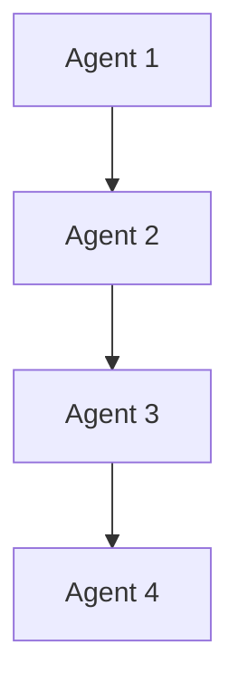
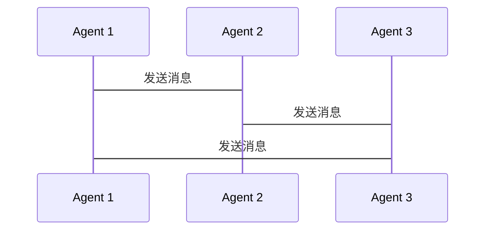

                 


# 构建具有群体智能的多Agent系统

> 关键词：多Agent系统、群体智能、分布式计算、协商算法、共识机制

> 摘要：本文旨在深入探讨如何构建具有群体智能的多Agent系统。从基本概念到核心算法，从系统设计到项目实战，系统性地介绍多Agent系统和群体智能的结合，分析其在分布式计算中的应用，探讨协商算法和共识机制的实现，最后通过实际案例展示系统设计与实现过程。

---

## 第一部分: 多Agent系统与群体智能基础

### 第1章: 多Agent系统概述

#### 1.1 多Agent系统的基本概念

##### 1.1.1 Agent的定义与特点
- **Agent**（智能体）是指能够感知环境并采取行动以实现目标的实体。Agent可以是软件程序、机器人或其他智能系统。
- **特点**：
  - **自主性**：能够在没有外部干预的情况下自主决策。
  - **反应性**：能够感知环境并实时响应。
  - **社会性**：能够与其他Agent或人类进行交互和协作。
  - **学习能力**：能够通过经验改进自身行为。

##### 1.1.2 多Agent系统的定义
多Agent系统是由多个相互作用的Agent组成的分布式系统，这些Agent通过协作完成复杂任务，通常应用于分布式计算、机器人技术和人工智能领域。

##### 1.1.3 群体智能的定义与特征
- **群体智能**：指多个简单个体通过协作表现出的智能行为，例如蚂蚁觅食、鸟群飞行。
- **特征**：
  - **分布式**：个体之间没有中央控制。
  - **自组织**：个体通过局部信息自发组织。
  - **涌现性**：群体表现出的智能是单个个体不具备的。

#### 1.2 多Agent系统的发展背景

##### 1.2.1 分布式系统的发展
- 分布式系统通过多台计算机协作完成任务，提高了系统的可靠性和性能。
- 多Agent系统是分布式系统的一种高级形式，结合了智能体的自主性和协作性。

##### 1.2.2 群体智能的研究现状
- 群体智能研究始于20世纪90年代，广泛应用于路径规划、资源分配等领域。
- 当前研究重点在于优化算法和提高系统的自适应性。

##### 1.2.3 多Agent系统在现实中的应用
- **机器人协作**：多台机器人协同完成任务，如仓储物流。
- **分布式计算**：利用多Agent系统优化计算资源分配。
- **人工智能应用**：在自动驾驶、智能家居等领域有广泛应用。

#### 1.3 本章小结
- **多Agent系统的核心概念**：Agent的自主性、反应性和社会性。
- **群体智能的特点**：分布式、自组织和涌现性。

---

### 第2章: 多Agent系统的核心概念

#### 2.1 Agent的结构与行为

##### 2.1.1 Agent的内部结构
- **感知层**：负责感知环境信息，如传感器数据。
- **决策层**：基于感知信息做出决策。
- **行动层**：执行决策动作，如发送消息或移动。

##### 2.1.2 Agent的行为模型
- **反应式模型**：基于当前感知做出即时反应。
- **认知式模型**：结合记忆和规划，做出复杂决策。

##### 2.1.3 Agent的生命周期
- **创建**：初始化Agent。
- **运行**：执行任务。
- **终止**：完成任务或发生错误。

#### 2.2 多Agent系统中的通信与协作

##### 2.2.1 Agent之间的通信机制
- **直接通信**：Agent之间直接交换信息。
- **间接通信**：通过中间媒介传递信息。

##### 2.2.2 协作协议的设计
- **协商协议**：Agent之间通过协商确定任务分配。
- **合作协议**：定义协作规则和通信协议。

##### 2.2.3 分布式环境中的协调问题
- **同步问题**：如何保证多个Agent的时间一致性。
- **冲突解决**：如何处理Agent之间的冲突。

#### 2.3 群体智能中的决策机制

##### 2.3.1 基于群体智能的决策模型
- **基于规则的决策**：根据预定义规则做出决策。
- **基于学习的决策**：通过机器学习模型进行决策。

##### 2.3.2 分布式决策算法
- **分布式决策算法**：在分布式环境中进行决策的算法，如分布式一致性算法。

##### 2.3.3 群体智能中的共识问题
- **共识问题**：如何让多个Agent达成一致决策。
- **共识算法**：如PBFT、RAFT等。

#### 2.4 本章小结
- **多Agent系统的核心概念**：Agent的结构、行为和通信机制。
- **群体智能中的决策机制**：分布式决策和共识问题。

---

### 第3章: 群体智能算法与实现

#### 3.1 群体智能算法概述

##### 3.1.1 遗传算法
- **遗传算法**：模拟生物进化过程，用于优化问题求解。
- **基本步骤**：初始化种群、选择、交叉、变异。

##### 3.1.2 蚁群算法
- **蚁群算法**：模拟蚂蚁觅食过程，用于路径优化问题。
- **基本步骤**：初始化、信息素更新、路径选择。

##### 3.1.3 粒子群优化算法
- **粒子群优化算法**：模拟鸟群飞行，用于优化问题求解。
- **基本步骤**：初始化、迭代更新、最优解搜索。

#### 3.2 群体智能算法的实现步骤

##### 3.2.1 算法初始化
- **种群初始化**：随机生成初始种群。
- **信息素初始化**：初始化信息素值。

##### 3.2.2 信息传递与更新
- **遗传算法**：父代选择、交叉、变异。
- **蚁群算法**：蚂蚁移动、信息素更新。
- **粒子群优化**：粒子更新位置、速度。

##### 3.2.3 群体决策的实现
- **基于遗传算法的决策**：通过优化过程选择最优解。
- **基于蚁群算法的决策**：通过路径优化选择最优路径。
- **基于粒子群优化的决策**：通过迭代更新找到最优解。

#### 3.3 群体智能算法的数学模型

##### 3.3.1 遗传算法的数学模型
$$
\text{适应度函数} = f(x) = \sum_{i=1}^{n} x_i
$$

##### 3.3.2 蚁群算法的数学模型
$$
\text{信息素更新} = \Delta \tau_{ij} = Q / \text{最短路径长度}
$$

##### 3.3.3 粒子群优化算法的数学模型
$$
v_i = v_i + \alpha (p_i - x_i) + \beta (p_g - x_i)
$$

#### 3.4 本章小结
- **群体智能算法的核心思想**：模拟自然现象，通过迭代优化找到最优解。
- **算法实现的关键步骤**：初始化、信息传递、更新迭代。

---

### 第4章: 多Agent系统中的算法实现

#### 4.1 分布式计算与多Agent系统

##### 4.1.1 分布式计算的基本概念
- **分布式计算**：将计算任务分发到多台计算机上并行执行。
- **多Agent系统**：通过Agent协作完成分布式计算任务。

##### 4.1.2 多Agent系统中的分布式算法
- **分布式搜索算法**：在多Agent系统中进行分布式搜索。
- **分布式优化算法**：通过多Agent协作优化问题。

##### 4.1.3 分布式环境下的通信问题
- **通信延迟**：Agent之间通信的延迟问题。
- **通信带宽**：通信带宽对系统性能的影响。

#### 4.2 多Agent系统中的协商算法

##### 4.2.1 协商的基本概念
- **协商**：Agent之间通过通信达成一致的过程。
- **协商协议**：定义协商规则和通信方式。

##### 4.2.2 协商算法的设计
- **基于规则的协商**：预定义协商规则。
- **基于逻辑的协商**：通过逻辑推理达成一致。

##### 4.2.3 协商算法的实现
- **协商过程**：信息交换、规则匹配、协议达成。
- **协商结果**：达成一致或失败。

#### 4.3 多Agent系统中的共识机制

##### 4.3.1 共识机制的基本概念
- **共识机制**：确保所有Agent达成一致的过程。
- **共识算法**：如PBFT、RAFT等。

##### 4.3.2 共识算法的设计
- **PBFT算法**：基于拜占庭容错的共识算法。
- **RAFT算法**：基于选举的共识算法。

##### 4.3.3 共识算法的实现
- **PBFT实现**：角色轮换、消息广播。
- **RAFT实现**：领导者选举、日志同步。

#### 4.4 本章小结
- **多Agent系统中的算法实现**：分布式计算、协商算法和共识机制。
- **共识算法的核心思想**：通过算法确保系统一致性。

---

### 第5章: 系统分析与架构设计

#### 5.1 问题场景介绍

##### 5.1.1 问题背景
- **多Agent系统应用**：如机器人协作、分布式计算。
- **群体智能应用**：如路径规划、资源分配。

##### 5.1.2 项目介绍
- **项目目标**：构建一个具有群体智能的多Agent系统。
- **项目需求**：实现多Agent协作、群体智能算法、系统集成。

#### 5.2 系统功能设计

##### 5.2.1 系统功能模块
- **Agent管理模块**：管理多个Agent。
- **通信模块**：实现Agent之间的通信。
- **算法模块**：实现群体智能算法。
- **决策模块**：基于算法结果做出决策。

##### 5.2.2 系统功能流程
- **初始化**：启动系统，加载配置。
- **运行**：Agent开始执行任务，通过通信模块进行协作。
- **终止**：完成任务或发生错误。

#### 5.3 系统架构设计

##### 5.3.1 系统架构图


##### 5.3.2 系统交互流程


#### 5.4 系统接口设计

##### 5.4.1 系统接口
- **通信接口**：定义Agent之间的通信接口。
- **算法接口**：定义群体智能算法的接口。
- **决策接口**：定义决策模块的接口。

##### 5.4.2 接口实现
- **通信接口实现**：通过消息队列实现。
- **算法接口实现**：通过函数调用实现。
- **决策接口实现**：通过回调函数实现。

#### 5.5 本章小结
- **系统分析与架构设计**：从问题场景到系统设计，确保系统功能和架构的合理性。

---

### 第6章: 项目实战

#### 6.1 环境搭建

##### 6.1.1 环境需求
- **操作系统**：Linux/Windows/MacOS
- **编程语言**：Python/Java/C++
- **开发工具**：PyCharm/IntelliJ IDEA/Visual Studio

##### 6.1.2 安装依赖
- **Python库**：numpy、pymongo、socket等。
- **开发工具安装**：安装所需IDE和插件。

#### 6.2 系统核心实现

##### 6.2.1 Agent类实现
```python
class Agent:
    def __init__(self, id):
        self.id = id
        self.state = "idle"
    
    def感知环境(self):
        # 实现感知逻辑
        pass
    
    def采取行动(self):
        # 实现行动逻辑
        pass
```

##### 6.2.2 通信模块实现
```python
import socket

class Communicator:
    def __init__(self, host, port):
        self.host = host
        self.port = port
        self.socket = socket.socket(socket.AF_INET, socket.SOCK_STREAM)
        self.socket.connect((host, port))
    
    def send_message(self, message):
        self.socket.send(message.encode())
    
    def receive_message(self):
        data = self.socket.recv(1024).decode()
        return data
```

##### 6.2.3 群体智能算法实现
```python
import random

class GeneticAlgorithm:
    def __init__(self, population_size, fitness_function):
        self.population_size = population_size
        self.fitness_function = fitness_function
    
    def初始化种群(self):
        self.population = [random个体 for _ in range(self.population_size)]
    
    def选择(self):
        # 实现选择逻辑
        pass
    
    def交叉(self):
        # 实现交叉逻辑
        pass
    
    def变异(self):
        # 实现变异逻辑
        pass
```

#### 6.3 案例分析与详细讲解

##### 6.3.1 案例分析
- **案例背景**：多Agent系统应用于仓储物流。
- **系统实现**：实现多台机器人协作完成货物搬运。
- **算法应用**：使用遗传算法优化路径规划。

##### 6.3.2 详细讲解
- **系统设计**：设计Agent类、通信模块和遗传算法模块。
- **代码实现**：实现Agent的感知、决策和行动功能。
- **测试与优化**：测试系统性能并进行优化。

#### 6.4 项目小结
- **项目实现的关键点**：Agent设计、通信模块实现、群体智能算法实现。
- **项目总结**：通过实际案例展示系统设计与实现过程。

---

### 第7章: 高级主题与未来展望

#### 7.1 高级主题

##### 7.1.1 群体智能的自适应性
- **自适应算法**：能够根据环境变化自动调整算法参数。
- **自适应系统**：系统能够根据反馈自动优化性能。

##### 7.1.2 多Agent系统的安全性
- **安全威胁**：Agent系统可能面临的安全威胁，如拒绝服务攻击。
- **安全防护**：通过加密通信、访问控制等措施提高系统安全性。

#### 7.2 未来展望

##### 7.2.1 研究热点
- **强化学习在群体智能中的应用**：通过强化学习提高群体智能系统的决策能力。
- **多Agent系统的边缘计算**：将多Agent系统应用于边缘计算，提高系统的实时性和响应速度。

##### 7.2.2 技术趋势
- **智能化增强**：通过深度学习等技术进一步增强多Agent系统的智能性。
- **分布式计算的普及**：随着云计算和边缘计算的发展，多Agent系统将得到更广泛应用。

#### 7.3 本章小结
- **高级主题**：群体智能的自适应性和多Agent系统的安全性。
- **未来展望**：强化学习、边缘计算和分布式计算的发展将推动多Agent系统进一步发展。

---

## 作者：AI天才研究院/AI Genius Institute & 禅与计算机程序设计艺术 /Zen And The Art of Computer Programming

