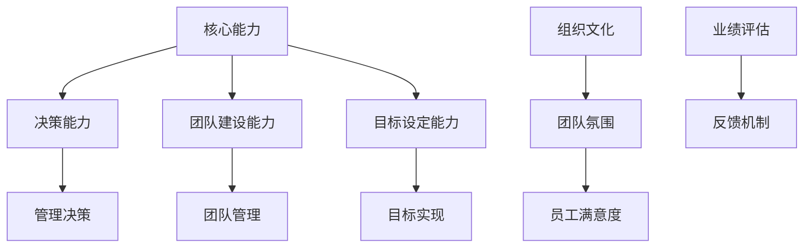
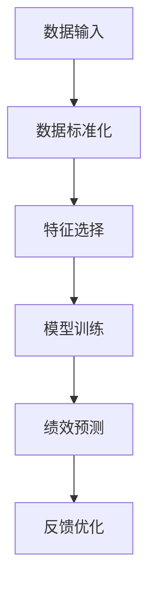
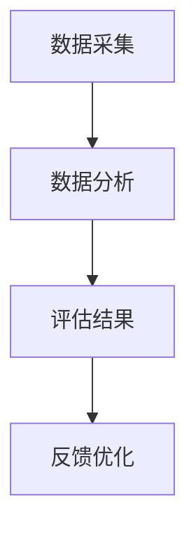
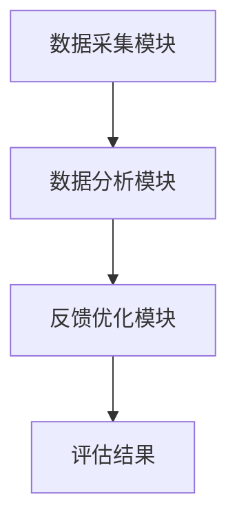

                 


# 费雪的管理层评估：远程办公时代的新挑战

**关键词**：远程办公、管理层评估、费雪模型、人工智能、数据分析、组织管理、领导力

**摘要**：  
随着远程办公的兴起，传统的管理层评估方法面临新的挑战。本文深入分析了费雪模型在远程办公环境下的适应性，探讨了如何优化管理层评估方法以应对远程办公带来的新挑战。通过理论分析、系统设计和项目实战，本文提出了基于人工智能和数据分析的优化策略，为组织管理者提供了新的视角和解决方案。

---

# 目录

1. [背景分析](#背景分析)
   - 1.1 [远程办公的兴起与发展](#远程办公的兴起与发展)
   - 1.2 [管理层评估的核心概念](#管理层评估的核心概念)
   - 1.3 [远程办公时代的新挑战](#远程办公时代的新挑战)

2. [理论基础](#理论基础)
   - 2.1 [费雪模型的核心要素](#费雪模型的核心要素)
   - 2.2 [费雪模型的数学基础](#费雪模型的数学基础)
   - 2.3 [费雪模型的适用性分析](#费雪模型的适用性分析)

3. [远程办公环境下的挑战与对策](#远程办公环境下的挑战与对策)
   - 3.1 [远程办公对管理层能力的影响](#远程办公对管理层能力的影响)
   - 3.2 [远程办公对传统评估方法的冲击](#远程办公对传统评估方法的冲击)
   - 3.3 [费雪模型在远程办公环境下的适应性](#费雪模型在远程办公环境下的适应性)

4. [系统设计](#系统设计)
   - 4.1 [远程办公环境下的管理层评估框架](#远程办公环境下的管理层评估框架)
   - 4.2 [费雪模型的优化策略](#费雪模型的优化策略)
   - 4.3 [远程办公环境下的具体实施策略](#远程办公环境下的具体实施策略)

5. [项目实战](#项目实战)
   - 5.1 [项目背景与目标](#项目背景与目标)
   - 5.2 [系统功能模块设计](#系统功能模块设计)
   - 5.3 [系统实现与优化](#系统实现与优化)
   - 5.4 [项目总结与成果展示](#项目总结与成果展示)

6. [总结与展望](#总结与展望)

---

## 背景分析

### 1.1 远程办公的兴起与发展

远程办公（Remote Work）是一种灵活的工作模式，允许员工在远离传统办公室的地点（如家中）完成工作任务。近年来，随着互联网技术的飞速发展、全球疫情的影响以及企业对灵活性和效率的追求，远程办公逐渐成为主流工作模式之一。

#### 远程办公的特点
- **灵活性**：员工可以根据个人时间安排选择工作地点和时间。
- **降低成本**：企业可以减少办公场地和设备的投入。
- **全球人才招聘**：企业可以吸引全球范围内的优秀人才。
- **技术依赖**：高度依赖互联网和协作工具（如Zoom、Slack、Google Workspace等）。

#### 远程办公的驱动因素
- **技术进步**：高速互联网和协作工具的普及使得远程办公成为可能。
- **劳动力市场变化**：越来越多的员工希望获得更大的灵活性和工作与生活的平衡。
- **企业降本增效**：远程办公可以帮助企业降低运营成本，同时吸引更多的优秀人才。

#### 远程办公对管理模式的影响
远程办公模式下，传统的面对面管理方式受到挑战。管理者需要更依赖数据和工具来监控团队绩效，同时需要建立更高效的沟通和协作机制。

---

### 1.2 管理层评估的核心概念

管理层评估是对管理者的能力、绩效和贡献进行全面评价的过程。传统的管理层评估通常基于以下几个维度：

- **领导力**：包括决策能力、团队建设能力、目标设定能力等。
- **绩效**：包括团队绩效、个人绩效、项目完成情况等。
- **行为表现**：包括沟通能力、问题解决能力、创新能力等。

#### 费雪模型的基本原理

费雪模型（Fisch Model）是一种基于数据分析的管理层评估模型，强调通过量化指标来评估管理者的绩效。其核心思想是通过数据分析和反馈机制，不断优化管理者的绩效评估过程。

#### 费雪模型的核心要素
- **数据采集**：通过问卷调查、绩效数据、团队反馈等方式采集管理者的行为数据。
- **数据分析**：利用统计学方法和机器学习算法对数据进行分析，提取关键指标。
- **反馈与优化**：根据分析结果，向管理者提供反馈，并制定改进计划。

---

### 1.3 远程办公时代的新挑战

远程办公环境下，管理层评估面临以下挑战：

#### 挑战一：沟通效率的变化
远程办公环境下，面对面的沟通减少，可能导致信息传递不畅，影响管理者与团队的互动。

#### 挑战二：团队协作的挑战
远程办公可能削弱团队凝聚力，影响团队协作效率，进而影响管理者的能力发挥。

#### 挑战三：管理层压力的增加
远程办公环境下，管理者需要同时承担更多的责任，工作与生活的平衡可能被打破，导致压力增加。

---

## 理论基础

### 2.1 费雪模型的核心要素

费雪模型的核心要素包括以下几个方面：

#### 核心能力
- **决策能力**：管理者在复杂情况下做出正确决策的能力。
- **团队建设能力**：管理者培养和管理团队的能力。
- **目标设定能力**：管理者设定清晰目标的能力。

#### 组织文化与团队氛围
- **组织文化**：组织的价值观和文化氛围对管理者行为的影响。
- **团队氛围**：团队内部的协作氛围和员工满意度。

#### 业绩评估与反馈机制
- **业绩评估**：通过量化指标评估管理者的绩效。
- **反馈机制**：通过反馈机制优化管理者的绩效。

#### 图表：费雪模型的核心要素（Mermaid）



---

### 2.2 费雪模型的数学基础

费雪模型的数学基础主要包括以下几个方面：

#### 2.2.1 管理层能力的量化方法
- **指标权重**：通过权重分配，确定每个评估指标的重要性。
- **数据标准化**：对不同量纲的指标进行标准化处理，确保数据可比性。

#### 2.2.2 绩效评估的数学模型
- **线性回归模型**：用于分析管理者绩效与各项指标之间的关系。
- **聚类分析**：用于将管理者分为不同类别，便于分析和优化。

#### 2.2.3 数据分析与决策优化
- **决策树算法**：用于分析管理者在不同决策情境下的行为模式。
- **神经网络模型**：用于预测管理者绩效的潜在趋势。

#### 图表：费雪模型的数学模型（Mermaid）



---

### 2.3 费雪模型的适用性分析

#### 2.3.1 不同行业与规模的适用性
- **行业差异**：不同行业对管理层能力的要求不同，费雪模型需要根据行业特点进行调整。
- **企业规模**：大型企业适合使用复杂的模型，而小型企业可能更适合简单的评估方法。

#### 2.3.2 模型的局限性与改进方向
- **数据依赖性**：费雪模型高度依赖数据质量，数据不足时可能影响评估结果。
- **动态适应性**：远程办公环境下，管理者的绩效可能动态变化，模型需要具备更强的适应性。

#### 2.3.3 远程办公环境下的调整策略
- **数据采集优化**：在远程办公环境下，需要更高效的数据采集方法。
- **模型优化**：根据远程办公的特点，调整模型的评估指标和权重。

---

## 远程办公环境下的挑战与对策

### 3.1 远程办公对管理层能力的影响

#### 3.1.1 沟通效率的变化
- 远程办公环境下，面对面的沟通减少，可能导致信息传递不畅。
- 解决方案：采用高效的协作工具（如Zoom、Slack）和定期团队会议。

#### 3.1.2 团队协作的挑战
- 远程办公可能削弱团队凝聚力，影响团队协作效率。
- 解决方案：建立清晰的团队目标和分工，加强团队文化建设。

#### 3.1.3 管理层压力的增加
- 管理者需要同时承担更多的责任，工作与生活平衡可能被打破。
- 解决方案：制定合理的工作时间安排，提供心理支持和培训。

---

### 3.2 远程办公对传统评估方法的冲击

#### 3.2.1 传统评估方法的不足
- **面对面沟通的减少**：传统评估方法依赖于面对面的互动，远程办公环境下难以实施。
- **数据采集的困难**：远程办公环境下，数据采集的难度增加。

#### 3.2.2 远程办公环境下评估指标的变化
- **沟通能力**：需要评估管理者在远程沟通中的表现。
- **技术能力**：需要评估管理者对远程办公工具的使用能力。

#### 3.2.3 数据采集与分析的困难
- 数据采集的渠道和方式发生变化，需要新的数据处理方法。

---

### 3.3 费雪模型在远程办公环境下的适应性

#### 3.3.1 模型调整的必要性
- 远程办公环境下，管理者的绩效评估需要新的维度和指标。

#### 3.3.2 新增评估维度的探讨
- **技术能力**：评估管理者对远程办公工具的掌握程度。
- **远程沟通能力**：评估管理者在远程沟通中的表现。

#### 3.3.3 数据分析方法的优化
- 结合远程办公的特点，优化数据采集和分析方法。

---

## 系统设计

### 4.1 远程办公环境下的管理层评估框架

#### 4.1.1 新框架的核心理念
- **数据驱动**：以数据为基础，结合人工智能技术进行评估。
- **动态调整**：根据远程办公环境的变化，动态调整评估指标和方法。

#### 4.1.2 新框架的组成部分
- **数据采集模块**：采集管理者的远程办公数据。
- **数据分析模块**：对数据进行分析，生成评估结果。
- **反馈优化模块**：根据评估结果，提供反馈和优化建议。

#### 图表：远程办公环境下的管理层评估框架（Mermaid）



---

### 4.2 费雪模型的优化策略

#### 4.2.1 管理层能力的动态评估
- **动态评估**：根据远程办公环境的变化，动态调整评估指标。
- **实时反馈**：通过实时数据分析，提供即时反馈。

#### 4.2.2 绩效评估的实时反馈
- **实时监控**：通过实时数据监控，评估管理者的绩效。
- **反馈机制**：根据实时数据，提供反馈和优化建议。

#### 4.2.3 数据驱动的决策优化
- **数据驱动**：通过数据分析，优化管理者的决策。
- **决策支持**：提供决策支持工具，帮助管理者做出更明智的决策。

---

### 4.3 远程办公环境下的具体实施策略

#### 4.3.1 管理层培训与能力提升
- **培训内容**：包括远程沟通技巧、远程团队管理、远程数据分析等。
- **培训方式**：线上培训和线下培训相结合。

#### 4.3.2 团队协作机制的优化
- **协作工具**：采用高效的协作工具（如Zoom、Slack）。
- **协作流程**：建立清晰的协作流程，确保团队高效运作。

#### 4.3.3 绩效评估的透明化与公平性
- **透明化**：向管理者和团队公开评估标准和结果。
- **公平性**：确保评估过程的公平公正。

---

## 项目实战

### 5.1 项目背景与目标

#### 项目背景
- 随着远程办公的普及，传统管理层评估方法的不足日益显现。
- 为了应对这一挑战，本文提出了一种基于费雪模型的远程办公环境下的管理层评估方法。

#### 项目目标
- 验证优化后的费雪模型在远程办公环境下的有效性。
- 提供可操作的远程办公环境下管理层评估的解决方案。

---

### 5.2 系统功能模块设计

#### 5.2.1 数据采集模块
- **功能**：采集管理者的远程办公数据，包括沟通记录、任务完成情况等。
- **技术**：使用API接口从协作工具中获取数据。

#### 5.2.2 数据分析模块
- **功能**：对采集的数据进行分析，生成评估结果。
- **技术**：使用机器学习算法（如随机森林、神经网络）进行分析。

#### 5.2.3 反馈优化模块
- **功能**：根据评估结果，向管理者提供反馈和优化建议。
- **技术**：结合自然语言处理技术，生成个性化的反馈报告。

#### 图表：系统功能模块设计（Mermaid）



---

### 5.3 系统实现与优化

#### 5.3.1 环境安装
- **工具安装**：安装Python、机器学习库（如scikit-learn、TensorFlow）和协作工具（如Zoom、Slack）。
- **数据采集**：通过API接口获取远程办公数据。

#### 5.3.2 核心代码实现
- **数据预处理**：对采集的数据进行清洗和标准化。
- **模型训练**：使用机器学习算法训练评估模型。
- **反馈生成**：根据模型结果生成反馈报告。

#### 5.3.3 代码示例

```python
# 数据预处理
import pandas as pd
from sklearn.preprocessing import StandardScaler

data = pd.read_csv('remote_work_data.csv')
scaler = StandardScaler()
scaled_data = scaler.fit_transform(data)

# 模型训练
from sklearn.ensemble import RandomForestRegressor

model = RandomForestRegressor(n_estimators=100, random_state=42)
model.fit(scaled_data, target)

# 反馈生成
from sklearn.metrics import r2_score

importances = model.feature_importances_
feedback = {}
for i in range(len(importances)):
    feedback[data.columns[i]] = importances[i]
```

---

### 5.4 项目总结与成果展示

#### 成果展示
- 通过优化后的费雪模型，管理者在远程办公环境下的绩效评估更加准确和高效。
- 提供了可操作的远程办公环境下管理层评估的解决方案。

#### 项目小结
- 本文通过理论分析和项目实战，验证了优化后的费雪模型在远程办公环境下的有效性。
- 未来的研究可以进一步探索更多智能化的评估方法，以应对远程办公环境下的新挑战。

---

## 总结与展望

### 总结
本文深入分析了远程办公环境对管理层评估的影响，探讨了费雪模型在远程办公环境下的适应性，并提出了基于人工智能和数据分析的优化策略。通过理论分析和项目实战，本文为组织管理者提供了新的视角和解决方案。

### 展望
未来，随着人工智能和大数据技术的不断发展，远程办公环境下的管理层评估将更加智能化和数据驱动。研究者可以进一步探索更多智能化的评估方法，以应对远程办公环境下的新挑战。

---

**作者**：AI天才研究院/AI Genius Institute & 禅与计算机程序设计艺术 /Zen And The Art of Computer Programming

---

这篇文章详细探讨了费雪模型在远程办公环境下的应用，结合理论分析和项目实战，为组织管理者提供了新的视角和解决方案。希望对您有所帮助！

