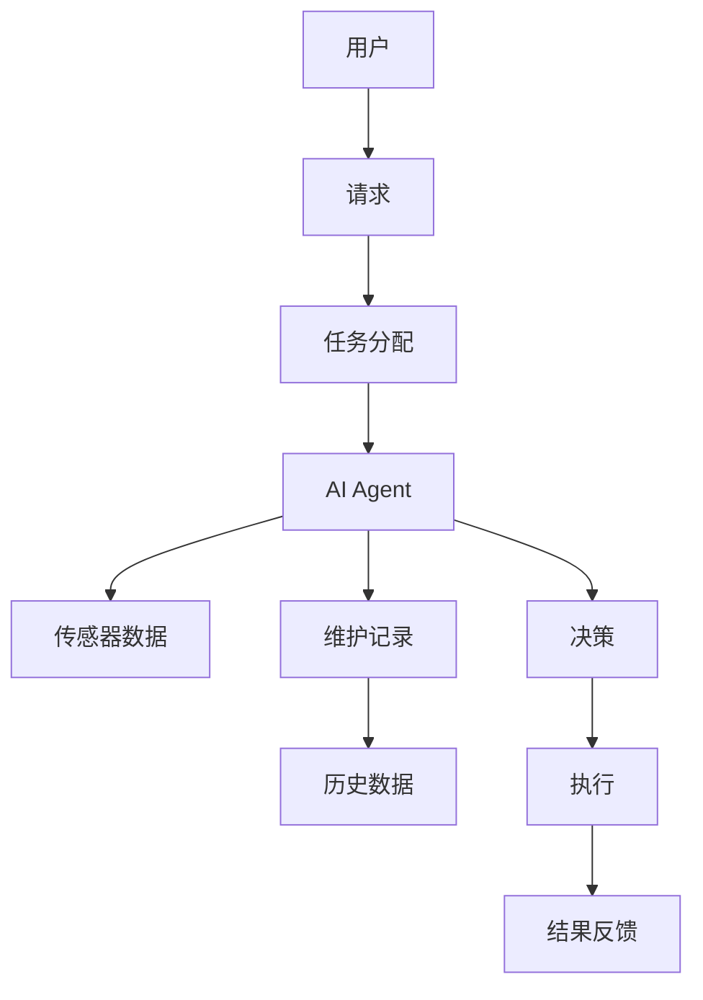
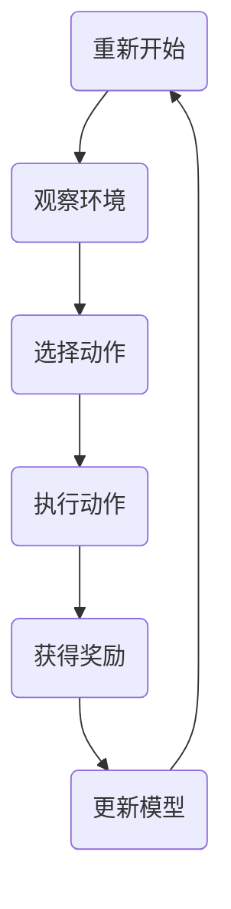
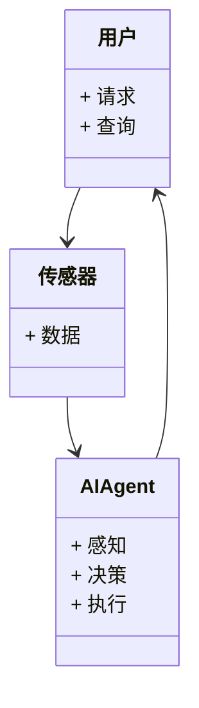
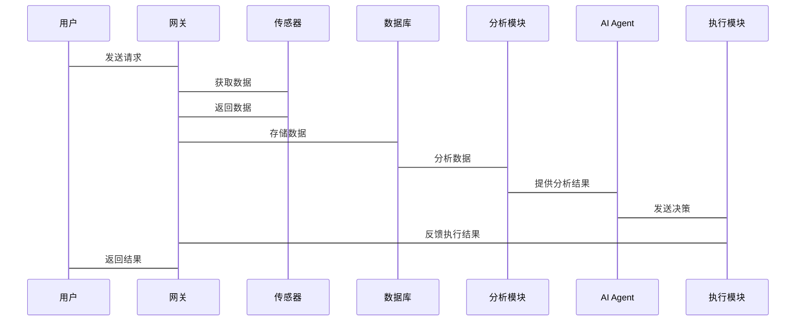

                 


# AI Agent在智能地下管网维护中的实践

> 关键词：AI Agent, 智能地下管网维护, 多智能体系统, 强化学习, 物联网, 大数据分析

> 摘要：本文深入探讨了AI Agent在智能地下管网维护中的应用，从问题背景、核心概念到算法原理、系统架构，再到项目实战，全面解析了如何利用AI技术提升地下管网维护的效率和智能化水平。通过实际案例分析和代码实现，展示了AI Agent在解决复杂管网问题中的强大能力。

---

## 第1章: 问题背景与描述

### 1.1 问题背景

#### 1.1.1 地下管网维护的重要性
地下管网是城市基础设施的核心组成部分，包括供水、供电、燃气等生命线工程。其安全稳定运行直接关系到城市居民的生活质量和城市的可持续发展。然而，随着城市化进程的加快，地下管网的复杂性和维护难度也在不断增加。

#### 1.1.2 传统地下管网维护的挑战
传统维护方式存在以下问题：
- **数据孤岛**：各个子系统（如供水、供电）的数据分散，缺乏统一的管理平台。
- **维护效率低**：人工巡检耗时耗力，难以及时发现和处理问题。
- **应急响应慢**：在突发故障时，缺乏智能化的决策支持，导致抢修时间长。

#### 1.1.3 AI Agent的引入及其优势
AI Agent（智能体）是一种能够感知环境、自主决策并执行任务的智能系统。引入AI Agent可以实现：
- **智能化监测**：实时感知管网状态，预测潜在问题。
- **自动化决策**：基于大数据分析和机器学习模型，快速制定最优解决方案。
- **多智能体协作**：多个AI Agent协同工作，提高整体维护效率。

### 1.2 问题描述

#### 1.2.1 地下管网的复杂性
地下管网包括多种类型（如供水管、电缆）和复杂的拓扑结构，维护任务涉及多个部门的协作。

#### 1.2.2 维护中的常见问题
- **泄漏检测困难**：传统方法依赖人工巡检，漏检率高。
- **故障定位不准**：缺乏精准的定位手段，导致维修成本增加。
- **应急处理低效**：在紧急情况下，难以快速制定抢修方案。

#### 1.2.3 现有解决方案的不足
传统方法依赖人工经验，效率低且容易出错。现有解决方案多为单一功能（如传感器监控），缺乏智能化的决策支持。

### 1.3 问题解决与边界

#### 1.3.1 AI Agent在维护中的应用目标
- 实现管网状态的实时监测和智能分析。
- 提供故障预测和应急处理的决策支持。
- 优化维护流程，降低维护成本。

#### 1.3.2 解决方案的边界与外延
- **边界**：仅关注管网维护，不涉及其他城市基础设施。
- **外延**：未来可扩展至城市交通、环保等领域。

#### 1.3.3 核心概念与组成要素
AI Agent系统由感知层、决策层、执行层组成，依赖于物联网、大数据分析和机器学习技术。

---

## 第2章: AI Agent的核心概念与联系

### 2.1 AI Agent的基本原理

#### 2.1.1 定义与基本属性
AI Agent是一种能够感知环境、自主决策并执行任务的智能系统。其基本属性包括：
- **自主性**：无需外部干预，自主完成任务。
- **反应性**：能够实时感知环境变化并做出反应。
- **协作性**：能够与其他智能体协作完成复杂任务。

#### 2.1.2 多智能体系统（MAS）的概念
MAS由多个智能体组成，每个智能体负责特定任务，通过通信和协调完成整体目标。

#### 2.1.3 AI Agent的决策机制
AI Agent基于感知数据和历史经验，通过机器学习模型生成决策。

### 2.2 核心概念对比表

| 比较维度         | AI Agent                     | 传统自动化系统               |
|------------------|------------------------------|-----------------------------|
| 自主性           | 高                           | 低                         |
| 学习能力         | 强，支持在线学习             | 无或弱                     |
| 适应性           | 高，能够适应环境变化         | 低                         |
| 协作能力         | 强，支持多智能体协作         | 有限                       |

### 2.3 ER实体关系图



---

## 第3章: 算法原理讲解

### 3.1 算法概述

#### 3.1.1 基于强化学习的决策过程
AI Agent通过与环境的交互，学习最优策略以最大化奖励。

#### 3.1.2 多智能体协作机制
多个AI Agent协同工作，通过通信协议交换信息，共同完成复杂任务。

#### 3.1.3 实时数据处理流程
AI Agent实时接收传感器数据，分析后生成决策并执行。

### 3.2 算法流程



### 3.3 Python代码实现

```python
import numpy as np
from collections import deque

class AI-Agent:
    def __init__(self, state_space, action_space):
        self.state_space = state_space
        self.action_space = action_space
        self.memory = deque(maxlen=1000)
        self.gamma = 0.99
        self.epsilon = 1.0
        self.epsilon_min = 0.01
        self.epsilon_decay = 0.995

    def act(self, state):
        if np.random.random() < self.epsilon:
            return np.random.randint(0, self.action_space)
        else:
            return np.argmax(self.model.predict(state))

    def remember(self, state, action, reward, next_state):
        self.memory.append((state, action, reward, next_state))

    def replay(self, batch_size):
        if len(self.memory) < batch_size:
            return
        minibatch = random.sample(self.memory, batch_size)
        X = []
        Y = []
        for state, action, reward, next_state in minibatch:
            target = reward
            if not next_state.terminal:
                target = reward + self.gamma * np.max(self.model.predict(next_state))
            X.append(state)
            Y.append(target)
        self.model.fit(X, Y)

    def decay_epsilon(self):
        self.epsilon = max(self.epsilon_min, self.epsilon * self.epsilon_decay)
```

### 3.4 数学模型与公式

#### 3.4.1 强化学习的Q-learning算法
$$ Q(s, a) = Q(s, a) + \alpha (r + \gamma \max Q(s', a') - Q(s, a)) $$
其中：
- \( Q(s, a) \)：状态-动作对的Q值
- \( \alpha \)：学习率
- \( r \)：奖励
- \( \gamma \)：折扣因子
- \( s' \)：下一个状态

---

## 第4章: 系统分析与架构设计方案

### 4.1 项目场景介绍

#### 4.1.1 项目背景
某城市面临地下管网维护效率低、成本高的问题，希望通过引入AI Agent提升维护效率。

#### 4.1.2 项目目标
实现地下管网的智能化监测、故障预测和应急处理。

### 4.2 系统功能设计

#### 4.2.1 领域模型


#### 4.2.2 系统架构


#### 4.2.3 系统接口设计
- 用户接口：接收用户请求，发送维护指令。
- 传感器接口：接收传感器数据，发送到AI Agent。
- 执行接口：接收AI Agent的决策，执行维护任务。

#### 4.2.4 系统交互


---

## 第5章: 项目实战

### 5.1 环境安装

#### 5.1.1 安装Python
```bash
python --version
pip install --upgrade pip
```

#### 5.1.2 安装依赖库
```bash
pip install numpy matplotlib pandas
pip install tensorflow
```

### 5.2 系统核心实现

#### 5.2.1 数据预处理
```python
import pandas as pd
data = pd.read_csv('sensors.csv')
data_preprocessed = data.dropna()
```

#### 5.2.2 模型训练
```python
model = Sequential()
model.add(Dense(64, activation='relu', input_dim=data.shape[1]))
model.add(Dense(1, activation='sigmoid'))
model.compile(optimizer='adam', loss='binary_crossentropy', metrics=['accuracy'])
model.fit(X_train, y_train, epochs=10, batch_size=32)
```

#### 5.2.3 模型部署
```python
import numpy as np
def predict_leakage(state):
    return model.predict(state)
```

### 5.3 案例分析

#### 5.3.1 数据分析
```python
import matplotlib.pyplot as plt
plt.plot(data_preprocessed['temperature'], label='温度')
plt.plot(data_preprocessed['pressure'], label='压力')
plt.legend()
plt.show()
```

#### 5.3.2 模型验证
```python
from sklearn.metrics import accuracy_score
y_pred = model.predict(X_test)
print(accuracy_score(y_test, y_pred))
```

---

## 第6章: 总结与展望

### 6.1 最佳实践 tips
- **数据质量**：确保传感器数据的准确性和完整性。
- **模型优化**：定期更新模型，适应环境变化。
- **多智能体协作**：优化通信协议，提高协作效率。

### 6.2 小结
本文详细介绍了AI Agent在智能地下管网维护中的应用，从理论到实践，展示了如何利用AI技术解决实际问题。

### 6.3 注意事项
- **数据隐私**：确保管网数据的安全性。
- **系统稳定性**：设计容错机制，避免系统崩溃。

### 6.4 拓展阅读
- 《强化学习实战》
- 《分布式系统：概念与设计》
- 《深度学习与计算机视觉》

---

## 作者

作者：AI天才研究院 & 禅与计算机程序设计艺术

---

通过以上目录和内容的详细规划，您可以开始撰写完整的文章。确保每个章节都有丰富的技术细节和实际案例，帮助读者全面理解AI Agent在智能地下管网维护中的应用。

