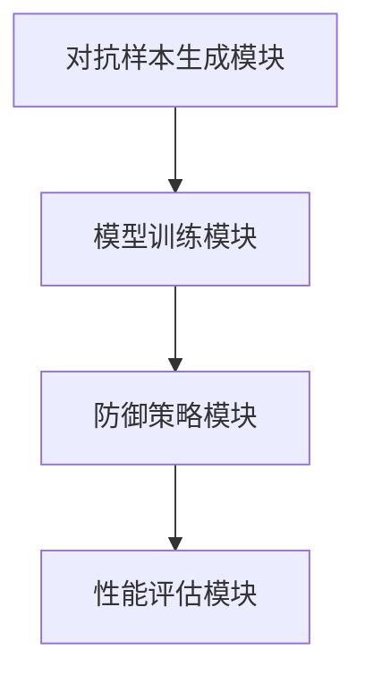
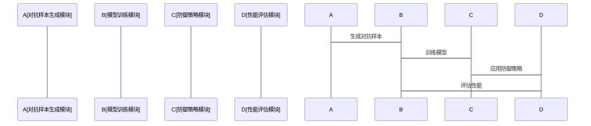

                 


# AI Agent 的安全性：防御对抗性攻击

> 关键词：AI Agent, 对抗性攻击, 安全性, 防御策略, 生成对抗网络, 深度学习安全, 人工智能安全

> 摘要：AI Agent 在现代应用中的重要性日益凸显，但其安全性问题也随之而来，尤其是对抗性攻击的威胁。本文从 AI Agent 的基本概念出发，深入探讨对抗性攻击的原理与分类，分析其对 AI Agent 的潜在威胁。同时，详细阐述了 AI Agent 的安全性评估指标与防御策略，提出了基于生成对抗网络的防御算法，并通过具体案例展示了防御技术的实现过程。最后，本文总结了当前防御技术的优势与不足，并对未来的研究方向进行了展望。

---

## 第1章: AI Agent 的基本概念与背景

### 1.1 AI Agent 的定义与特点

AI Agent 是一种智能体，能够感知环境、自主决策并执行任务。其核心特点包括：

- **自主性**：能够在没有外部干预的情况下自主执行任务。
- **反应性**：能够实时感知环境变化并做出相应反应。
- **目标导向性**：基于目标函数进行决策和行动。
- **学习能力**：通过数据和经验不断优化自身性能。

### 1.2 对抗性攻击的定义与分类

对抗性攻击是一种恶意行为，旨在通过干扰输入数据或模型参数，使 AI 系统产生错误输出或决策。其主要分类包括：

- **基于输入的攻击**：通过修改输入数据（如图像、文本）生成对抗样本。
- **基于模型的攻击**：通过破坏模型参数或训练过程实现攻击目标。
- **基于输出的攻击**：通过干扰模型输出结果，使其产生错误决策。

### 1.3 AI Agent 与对抗性攻击的关系

AI Agent 的脆弱性主要体现在其感知和决策模块上。对抗性攻击可以利用这些脆弱性，通过干扰输入数据或误导决策过程，使 AI Agent 失去正常功能。例如，在自动驾驶场景中，对抗性攻击可能导致 AI Agent 错误识别交通信号，从而引发安全风险。

---

## 第2章: 对抗性攻击的核心原理

### 2.1 对抗性攻击的原理分析

对抗性攻击的核心在于通过引入小幅度的扰动，使模型预测结果发生显著变化。其基本原理如下：

1. **对抗样本的生成**：通过优化算法，在原始样本上添加难以察觉的噪声，生成对抗样本。
2. **目标函数的优化**：对抗样本的生成目标是最小化模型对原始样本的分类置信度，同时最大化对目标类别的置信度。
3. **对抗训练的优化**：通过交替优化生成器和判别器，使生成器能够生成更具欺骗性的对抗样本。

### 2.2 对抗性攻击的数学模型

对抗性攻击的数学模型主要基于生成对抗网络（GAN）框架。以下是常见的对抗性攻击模型及其公式：

#### 2.2.1 对抗样本生成的损失函数
$$ \mathcal{L}_{\text{adv}} = \mathcal{L}_{\text{cls}} + \lambda \mathcal{L}_{\text{adv}} $$
其中，$\mathcal{L}_{\text{cls}}$ 是分类损失，$\lambda$ 是对抗性损失的权重。

#### 2.2.2 对抗性攻击的优化目标
$$ \arg \max_{\delta} \mathcal{L}(\theta, x+\delta) $$
其中，$\delta$ 是对抗样本的扰动量，$\theta$ 是模型参数。

### 2.3 对抗性攻击的实现步骤

1. **定义目标模型**：选择一个预训练好的深度学习模型作为目标。
2. **初始化生成器和判别器**：在 GAN 框架中，生成器用于生成对抗样本，判别器用于区分真实样本和对抗样本。
3. **交替优化**：通过交替优化生成器和判别器，逐步生成更具欺骗性的对抗样本。

---

## 第3章: AI Agent 安全性的核心要素

### 3.1 AI Agent 的安全威胁模型

AI Agent 的安全威胁模型包括以下方面：

- **威胁来源**：包括恶意攻击者、数据污染、模型窃取等。
- **威胁假设**：假设攻击者具备一定的技术能力，能够利用对抗性攻击手段对 AI Agent 进行攻击。
- **威胁场景**：例如，在自动驾驶场景中，攻击者可能通过对抗性攻击干扰 AI Agent 的视觉感知模块。

### 3.2 安全性评估指标

安全性评估指标主要包括以下几类：

- **攻击成功率**：衡量对抗样本对目标模型的攻击效果。
- **防御成功率**：衡量防御策略对对抗样本的识别和拦截能力。
- **安全性与性能的平衡**：在保证安全性的同时，尽量减少对模型性能的负面影响。

### 3.3 安全性与性能的平衡

在 AI Agent 的设计中，安全性与性能的平衡是一个重要问题。过于激进的安全防御可能会影响模型的正常功能，而过于宽松的防御策略则可能无法有效抵御对抗性攻击。因此，需要在安全性与性能之间找到一个合理的平衡点。

---

## 第4章: 对抗性攻击的防御策略

### 4.1 基于生成对抗网络的防御算法

#### 4.1.1 对抗训练

对抗训练是一种有效的防御策略，通过在训练过程中引入对抗样本，提高模型的鲁棒性。其具体步骤如下：

1. **定义生成器和判别器**：生成器用于生成对抗样本，判别器用于区分真实样本和对抗样本。
2. **交替优化**：通过交替优化生成器和判别器，逐步提高模型的鲁棒性。
3. **对抗样本生成**：生成器生成对抗样本，判别器将其识别为真实样本。

#### 4.1.2 扰动消除

扰动消除是一种基于后处理的防御策略，通过去除输入数据中的扰动，恢复其原始状态。其具体实现步骤如下：

1. **输入数据预处理**：对输入数据进行去噪处理，去除可能的对抗性扰动。
2. **模型预测**：对去噪后的数据进行正常预测。
3. **结果输出**：输出最终的预测结果。

### 4.2 基于鲁棒优化的防御策略

鲁棒优化是一种基于模型优化的防御策略，通过优化模型参数，提高其对对抗样本的鲁棒性。其具体步骤如下：

1. **定义鲁棒优化目标**：通过优化模型参数，使得模型对对抗样本的预测结果保持稳定。
2. **引入对抗性约束**：在优化过程中引入对抗性约束，确保模型对对抗样本的鲁棒性。
3. **模型重训练**：通过重训练模型，提高其对对抗样本的防御能力。

### 4.3 混合防御策略

混合防御策略结合了多种防御技术，通过综合利用不同防御方法的优势，提高 AI Agent 的整体安全性。例如，可以通过结合对抗训练和扰动消除，进一步增强模型的鲁棒性。

---

## 第5章: 对抗性攻击的数学模型与算法实现

### 5.1 对抗性攻击的数学模型

对抗性攻击的数学模型主要基于生成对抗网络（GAN）框架。以下是常见的对抗性攻击模型及其公式：

#### 5.1.1 对抗样本生成的损失函数
$$ \mathcal{L}_{\text{adv}} = \mathcal{L}_{\text{cls}} + \lambda \mathcal{L}_{\text{adv}} $$
其中，$\mathcal{L}_{\text{cls}}$ 是分类损失，$\lambda$ 是对抗性损失的权重。

#### 5.1.2 对抗性攻击的优化目标
$$ \arg \max_{\delta} \mathcal{L}(\theta, x+\delta) $$
其中，$\delta$ 是对抗样本的扰动量，$\theta$ 是模型参数。

### 5.2 对抗性攻击的算法实现

以下是生成对抗性攻击的 Python 实现代码示例：

```python
import torch
import torch.nn as nn
import torch.optim as optim

class Generator(nn.Module):
    def __init__(self, input_size, hidden_size, output_size):
        super(Generator, self).__init__()
        self.fc1 = nn.Linear(input_size, hidden_size)
        self.fc2 = nn.Linear(hidden_size, output_size)

    def forward(self, x):
        x = torch.relu(self.fc1(x))
        x = torch.sigmoid(self.fc2(x))
        return x

class Discriminator(nn.Module):
    def __init__(self, input_size, hidden_size, output_size):
        super(Discriminator, self).__init__()
        self.fc1 = nn.Linear(input_size, hidden_size)
        self.fc2 = nn.Linear(hidden_size, output_size)

    def forward(self, x):
        x = torch.relu(self.fc1(x))
        x = torch.sigmoid(self.fc2(x))
        return x

def train_generator(generator, discriminator, optimizer_g, optimizer_d, criterion, data):
    generator.zero_grad()
    noise = torch.randn(data.size(0), input_size)
    fake_data = generator(noise)
    outputs = discriminator(fake_data)
    loss_g = criterion(outputs, torch.ones_like(outputs))
    loss_g.backward()
    optimizer_g.step()

def train_discriminator(generator, discriminator, optimizer_d, criterion, data):
    discriminator.zero_grad()
    fake_data = generator(torch.randn(data.size(0), input_size))
    real_outputs = discriminator(data)
    fake_outputs = discriminator(fake_data)
    loss_d = criterion(real_outputs, torch.ones_like(real_outputs)) + criterion(fake_outputs, torch.zeros_like(fake_outputs))
    loss_d.backward()
    optimizer_d.step()

# 初始化模型和优化器
generator = Generator(input_size, hidden_size, output_size)
discriminator = Discriminator(input_size, hidden_size, output_size)
optimizer_g = optim.Adam(generator.parameters(), lr=0.001)
optimizer_d = optim.Adam(discriminator.parameters(), lr=0.001)
criterion = nn.BCELoss()

# 开始训练
for epoch in range(num_epochs):
    for _ in range(k):
        train_generator(generator, discriminator, optimizer_g, optimizer_d, criterion, data)
        train_discriminator(generator, discriminator, optimizer_d, criterion, data)
```

### 5.3 防御算法的实现

以下是基于对抗训练的防御算法实现代码示例：

```python
def adversarial_training(model, generator, discriminator, optimizer, criterion, data):
    model.train()
    optimizer.zero_grad()
    noise = torch.randn(data.size(0), input_size)
    fake_data = generator(noise)
    outputs = model(fake_data)
    loss = criterion(outputs, labels)
    loss.backward()
    optimizer.step()

# 初始化模型和优化器
model = YourModel()
optimizer = optim.Adam(model.parameters(), lr=0.001)
criterion = nn.CrossEntropyLoss()

# 开始训练
for epoch in range(num_epochs):
    for _ in range(k):
        adversarial_training(model, generator, discriminator, optimizer, criterion, data)
```

---

## 第6章: 对抗性攻击的系统设计与架构

### 6.1 系统功能设计

以下是基于对抗性攻击防御的系统功能设计：

1. **对抗样本生成模块**：负责生成对抗样本。
2. **模型训练模块**：负责对模型进行对抗训练。
3. **防御策略模块**：负责实现多种防御策略。
4. **性能评估模块**：负责对模型的鲁棒性和性能进行评估。

### 6.2 系统架构设计

以下是系统架构设计的 Mermaid 图：



### 6.3 接口设计

以下是系统接口设计：

1. **生成对抗样本接口**：`generate_adversarial_samples(model, data, epsilon)`。
2. **模型训练接口**：`train_model(model, optimizer, criterion, data, epochs)`。
3. **防御策略接口**：`apply_defense_strategy(model, adversarial_data)`。
4. **性能评估接口**：`evaluate_model(model, data)`。

### 6.4 系统交互设计

以下是系统交互设计的 Mermaid 图：



---

## 第7章: 项目实战

### 7.1 项目环境安装

以下是项目环境安装的代码示例：

```bash
pip install torch
pip install numpy
pip install matplotlib
```

### 7.2 核心代码实现

以下是核心代码实现：

```python
import torch
import torch.nn as nn
import torch.optim as optim
import numpy as np
import matplotlib.pyplot as plt

class SimpleCNN(nn.Module):
    def __init__(self):
        super(SimpleCNN, self).__init__()
        self.conv1 = nn.Conv2d(1, 6, 5)
        self.pool = nn.MaxPool2d(2, 2)
        self.conv2 = nn.Conv2d(6, 16, 5)
        self.fc1 = nn.Linear(16 * 5 * 5, 120)
        self.fc2 = nn.Linear(120, 10)

    def forward(self, x):
        x = self.pool(torch.relu(self.conv1(x)))
        x = self.pool(torch.relu(self.conv2(x)))
        x = x.view(-1, 16 * 5 * 5)
        x = torch.relu(self.fc1(x))
        x = self.fc2(x)
        return x

def generate_adversarial_samples(model, data, labels, epsilon=0.1):
    model.eval()
    data = data.clone().requires_grad_(True)
    optimizer = optim.SGD([data], lr=epsilon)
    outputs = model(data)
    loss = nn.CrossEntropyLoss()(outputs, labels)
    loss.backward()
    optimizer.step()
    return data

# 初始化模型和数据
model = SimpleCNN()
model.train()
criterion = nn.CrossEntropyLoss()
optimizer = optim.SGD(model.parameters(), lr=0.01)
```

### 7.3 代码解读与分析

以下是代码解读与分析：

1. **SimpleCNN 模型**：定义了一个简单的卷积神经网络模型，用于图像分类任务。
2. **generate_adversarial_samples 函数**：通过梯度下降方法，生成对抗样本。
3. **模型训练**：对模型进行正常训练，同时结合对抗样本生成模块，实现模型的鲁棒性优化。

### 7.4 实际案例分析

以下是实际案例分析：

1. **对抗样本生成**：通过 `generate_adversarial_samples` 函数生成对抗样本，并将其输入模型。
2. **模型预测**：模型对对抗样本进行预测，观察其预测结果是否发生变化。
3. **性能评估**：通过性能评估模块，评估模型在对抗样本下的鲁棒性和准确性。

### 7.5 项目小结

通过本项目，我们可以看到对抗性攻击对 AI Agent 的潜在威胁，同时也验证了防御策略的有效性。通过对模型进行对抗训练和扰动消除，可以在一定程度上提高模型的鲁棒性。

---

## 第8章: 总结与展望

### 8.1 总结

本文从 AI Agent 的基本概念出发，深入探讨了对抗性攻击的原理与分类，分析了其对 AI Agent 的潜在威胁。同时，详细阐述了 AI Agent 的安全性评估指标与防御策略，提出了基于生成对抗网络的防御算法，并通过具体案例展示了防御技术的实现过程。最后，总结了当前防御技术的优势与不足，并对未来的研究方向进行了展望。

### 8.2 展望

未来的研究方向可能包括：

1. **更高效的防御算法**：探索更高效的防御算法，提高模型的鲁棒性。
2. **跨模态防御技术**：研究跨模态的防御技术，提高 AI Agent 的整体安全性。
3. **动态防御策略**：探索动态防御策略，应对对抗性攻击的多样化。

---

## 作者：AI天才研究院/AI Genius Institute & 禅与计算机程序设计艺术 /Zen And The Art of Computer Programming

