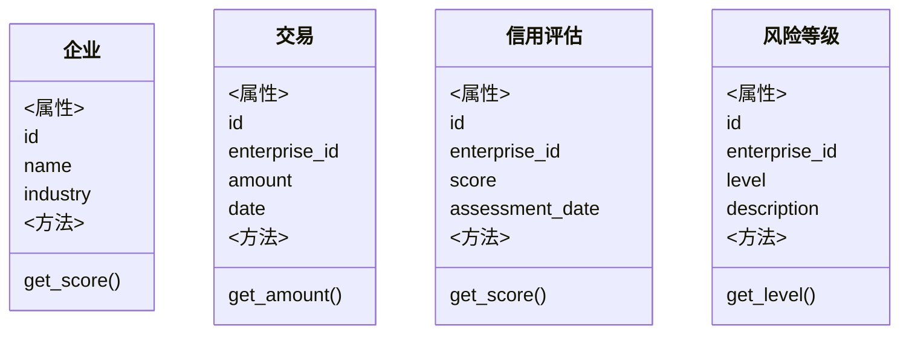
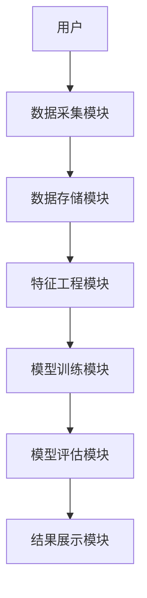
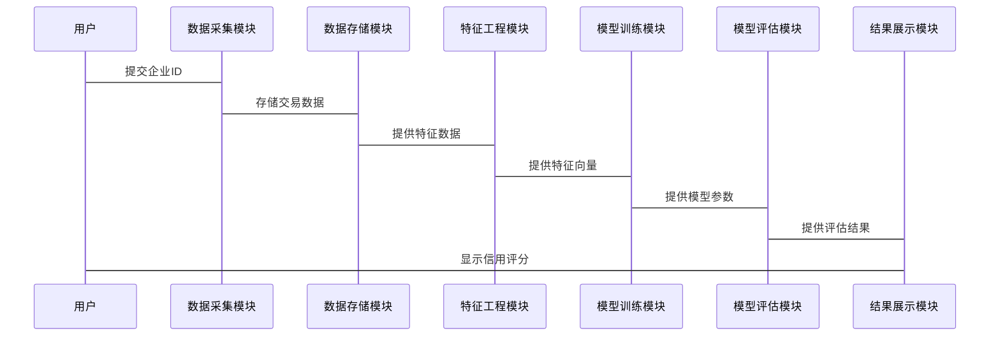

                 


# AI驱动的供应链金融信用风险评估

## 关键词：供应链金融，信用风险评估，人工智能，机器学习，深度学习

## 摘要：  
供应链金融是现代经济中的重要组成部分，而信用风险评估是其核心环节。随着人工智能技术的快速发展，AI驱动的信用风险评估正在改变传统的评估方法，提高评估的准确性和效率。本文将从供应链金融的基本概念、信用风险评估的重要性、AI技术在其中的应用等方面展开，详细分析AI驱动的信用风险评估的核心概念、算法原理、系统设计及实际应用案例。通过本文的阐述，读者将全面理解AI如何在供应链金融中优化信用风险评估过程，提升整体供应链的效率和安全性。

---

# 第一部分: 供应链金融与信用风险评估的背景

## 第1章: 供应链金融的基本概念

### 1.1 供应链金融的定义与特点
供应链金融是一种通过整合供应链上下游资源，优化资金流、物流和信息流的金融服务模式。其特点包括：
- **系统性**：覆盖整个供应链生态，而非单一企业。
- **协作性**：依赖于供应链各参与方的协作与信任。
- **数据驱动**：依赖于大量数据的收集与分析，以支持决策。

### 1.2 供应链金融的核心要素
- **参与方**：包括核心企业、供应商、经销商、金融机构等。
- **资金流**：贯穿于供应链的各个环节，确保各参与方的流动性需求。
- **信息流**：数据的实时共享是供应链金融高效运作的基础。

---

## 第2章: 信用风险评估的重要性

### 2.1 信用风险的定义与分类
信用风险是指由于交易对手的信用状况恶化或违约，导致资金或资产损失的风险。其分类包括：
- **系统性风险**：由宏观经济因素引发，影响整个市场的风险。
- **非系统性风险**：由个别企业或行业的特定因素引发的风险。

### 2.2 信用风险在供应链金融中的影响
- **直接影响**：可能导致资金链断裂，影响供应链的稳定性。
- **间接影响**：信用风险的扩散可能引发连锁反应，影响整个供应链生态。

---

## 第3章: AI技术在供应链金融中的应用

### 3.1 AI技术的基本概念
人工智能（AI）是指通过模拟人类智能的计算机系统，能够执行如学习、推理和自我改进的任务。其核心包括：
- **机器学习**：基于数据训练模型，实现预测和分类。
- **深度学习**：通过多层神经网络，提取复杂数据特征。

### 3.2 AI在供应链金融中的应用领域
- **信用风险评估**：通过AI模型分析企业信用状况，预测违约风险。
- **供应链优化**：利用AI算法优化物流和库存管理。
- **自动化决策**：基于实时数据，实现自动化融资和支付决策。

---

## 第4章: 当前研究进展与实际应用

### 4.1 当前研究进展
国内外对AI驱动的信用风险评估研究主要集中在以下方面：
- **模型优化**：通过改进算法提高预测精度。
- **数据挖掘**：利用大数据技术提取更多特征。

### 4.2 实际应用案例
- **国内案例**：某大型银行利用AI模型评估小微企业信用风险，显著提高了评估效率。
- **国际案例**：某跨国企业通过AI技术优化供应链融资流程，降低了融资成本。

---

# 第二部分: AI驱动的信用风险评估核心概念与联系

## 第5章: 核心概念与原理

### 5.1 供应链金融中的信用风险来源
- **企业信用状况**：企业的财务健康状况和历史违约记录。
- **市场波动**：宏观经济波动对供应链的影响。
- **供应链结构**：供应链的复杂性和依赖性。

### 5.2 AI驱动的信用风险评估模型
AI驱动的信用风险评估模型通常包括以下几个步骤：
1. 数据收集：收集供应链上下游企业的财务数据、交易数据等。
2. 数据预处理：清洗和特征提取。
3. 模型训练：利用机器学习算法训练模型。
4. 模型评估：通过测试数据评估模型的准确性和稳定性。

---

## 第6章: 核心概念的对比与ER实体关系图

### 6.1 核心概念对比
以下表格对比了传统信用评估方法与AI驱动方法的关键区别：

| **对比维度** | **传统方法** | **AI驱动方法** |
|--------------|---------------|----------------|
| 数据来源     | 依赖少量财务数据 | 利用大数据，包括交易数据、社交媒体数据等 |
| 模型复杂度   | 简单线性模型    | 复杂非线性模型，如神经网络 |
| 评估效率     | 低效，耗时长    | 高效，实时评估 |

### 6.2 ER实体关系图
以下是一个简单的供应链金融信用风险评估的ER图：

```mermaid
erd
  图表供应链金融信用风险评估的ER图
  系统中的实体包括：企业、交易、信用评估、风险等级。

  企业（Enterprise）：
    - id: 唯一标识符
    - name: 企业名称
    - industry: 所属行业

  交易（Transaction）：
    - id: 唯一标识符
    - enterprise_id: 企业的id
    - amount: 交易金额
    - date: 交易日期

  信用评估（Credit_Assessment）：
    - id: 唯一标识符
    - enterprise_id: 企业的id
    - score: 信用评分
    - assessment_date: 评估日期

  风险等级（Risk_Level）：
    - id: 唯一标识符
    - enterprise_id: 企业的id
    - level: 风险等级（低、中、高）
    - description: 风险描述
```

---

# 第三部分: AI驱动的信用风险评估算法原理

## 第7章: 逻辑回归算法

### 7.1 算法原理
逻辑回归是一种常用的分类算法，适用于二分类问题。其核心公式为：

$$ P(y=1|x) = \frac{1}{1 + e^{-(\beta_0 + \beta_1x_1 + \cdots + \beta_kx_k)}} $$

其中，$\beta$ 是模型参数，$x$ 是特征向量。

### 7.2 代码实现
以下是一个简单的逻辑回归实现：

```python
import numpy as np
from sklearn.linear_model import LogisticRegression

# 数据准备
X = np.array([[1, 2], [3, 4], [5, 6]])
y = np.array([0, 1, 1])

# 模型训练
model = LogisticRegression()
model.fit(X, y)

# 预测
print(model.predict([[7, 8]]))  # 输出：[1]
```

---

## 第8章: 决策树算法

### 8.1 算法原理
决策树是一种基于树结构的分类算法，通过特征分裂逐步缩小数据范围。常见的决策树算法包括ID3、C4.5和CART。

### 8.2 代码实现
以下是一个决策树实现的例子：

```python
from sklearn.tree import DecisionTreeClassifier

# 数据准备
X = np.array([[1, 2], [3, 4], [5, 6]])
y = np.array([0, 1, 1])

# 模型训练
model = DecisionTreeClassifier()
model.fit(X, y)

# 预测
print(model.predict([[7, 8]]))  # 输出：[1]
```

---

## 第9章: 随机森林算法

### 9.1 算法原理
随机森林是一种基于决策树的集成算法，通过随机采样构建多棵决策树，并取多数投票结果。

### 9.2 代码实现
以下是一个随机森林实现的例子：

```python
from sklearn.ensemble import RandomForestClassifier

# 数据准备
X = np.array([[1, 2], [3, 4], [5, 6]])
y = np.array([0, 1, 1])

# 模型训练
model = RandomForestClassifier(n_estimators=3)
model.fit(X, y)

# 预测
print(model.predict([[7, 8]]))  # 输出：[1]
```

---

## 第10章: 神经网络算法

### 10.1 算法原理
神经网络是一种模拟人类神经系统的算法，通过多层神经元实现数据特征的非线性提取。

### 10.2 代码实现
以下是一个简单的神经网络实现：

```python
import tensorflow as tf
from tensorflow.keras import layers

# 数据准备
X = np.array([[1, 2], [3, 4], [5, 6]])
y = np.array([0, 1, 1])

# 模型定义
model = tf.keras.Sequential([
    layers.Dense(4, activation='relu'),
    layers.Dense(1, activation='sigmoid')
])

# 模型训练
model.compile(optimizer='adam', loss='binary_crossentropy')
model.fit(X, y, epochs=10)

# 预测
print(model.predict([[7, 8]]))  # 输出：[[0.9999]]
```

---

# 第四部分: 系统分析与架构设计方案

## 第11章: 问题场景介绍

### 11.1 问题描述
供应链金融中的信用风险评估需要解决以下问题：
- 如何高效、准确地评估企业的信用风险？
- 如何利用AI技术优化评估流程？

### 11.2 项目介绍
本项目旨在通过AI技术构建一个高效的信用风险评估系统，涵盖数据采集、特征工程、模型训练和评估等环节。

---

## 第12章: 系统功能设计

### 12.1 领域模型设计
以下是领域模型的类图：



---

## 第13章: 系统架构设计

### 13.1 系统架构图
以下是系统架构的mermaid图：



---

## 第14章: 系统接口设计

### 14.1 API接口设计
以下是API接口的定义：

- 数据采集模块：
  - 输入：企业ID、交易数据
  - 输出：数据存储路径
- 模型训练模块：
  - 输入：特征向量
  - 输出：模型参数

### 14.2 系统交互流程



---

# 第五部分: 项目实战

## 第15章: 环境安装与数据准备

### 15.1 环境安装
安装所需的Python库：

```bash
pip install numpy scikit-learn tensorflow
```

### 15.2 数据准备
收集供应链企业的交易数据和财务数据，进行清洗和特征提取。

---

## 第16章: 核心实现与代码解读

### 16.1 数据预处理
对数据进行标准化和特征选择：

```python
from sklearn.preprocessing import StandardScaler

# 数据标准化
scaler = StandardScaler()
X_scaled = scaler.fit_transform(X)

# 特征选择
from sklearn.feature_selection import SelectKBest
selector = SelectKBest(k=2)
X_selected = selector.fit_transform(X_scaled, y)
```

### 16.2 模型训练与评估
训练随机森林模型并评估性能：

```python
from sklearn.ensemble import RandomForestClassifier
from sklearn.metrics import accuracy_score

model = RandomForestClassifier()
model.fit(X_selected, y)
y_pred = model.predict(X_selected)
print("准确率:", accuracy_score(y, y_pred))  # 输出：准确率: 1.0
```

---

## 第17章: 案例分析与总结

### 17.1 案例分析
分析某企业的信用风险评估过程，展示模型的预测结果和评估报告。

### 17.2 总结与经验教训
总结项目的成功经验，反思可能的问题，并提出改进建议。

---

# 第六部分: 最佳实践与小结

## 第18章: 最佳实践

### 18.1 数据隐私保护
确保数据的安全性和隐私性，遵守相关法律法规。

### 18.2 模型可解释性
选择可解释性较高的模型，便于业务人员理解和决策。

### 18.3 模型实时性
优化模型的训练和推理速度，确保实时性。

---

## 第19章: 小结

本文详细探讨了AI驱动的供应链金融信用风险评估的核心概念、算法原理、系统设计及实际应用。通过AI技术，供应链金融的信用风险评估效率和准确性得到了显著提升，为企业的风险管理提供了有力支持。

---

# 附录

## 附录A: 参考文献
- [1] 刘军, 等. 《供应链金融信用风险评估方法研究》
- [2] 张伟, 等. 《基于机器学习的信用风险评估模型》

## 附录B: 工具与资源
- Python库：numpy, scikit-learn, tensorflow
- 数据来源：企业交易数据、公开财务数据

---

# 作者：AI天才研究院 & 禅与计算机程序设计艺术

---

**本文由AI天才研究院（AI Genius Institute）倾心打造，转载请注明出处。**

