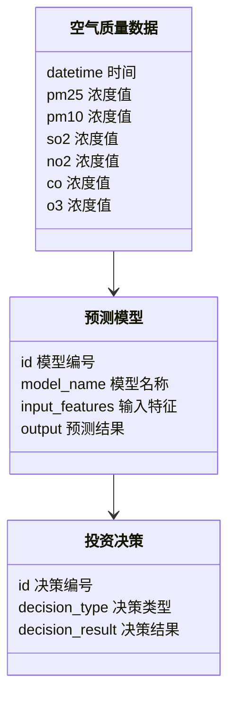
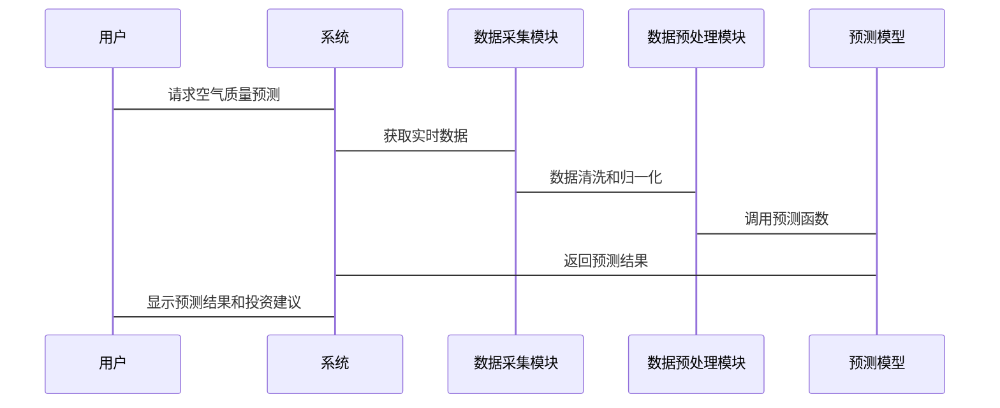

                 


# 价值投资中的智能城市空气质量预测系统分析

> 关键词：价值投资、智能城市、空气质量预测、机器学习、时间序列分析

> 摘要：本文探讨了如何将价值投资的理念应用于智能城市中的空气质量预测系统。通过分析空气质量预测的核心算法和价值投资的策略，结合实际案例，展示了如何利用技术手段优化投资决策，实现长期稳定的收益。文章从背景、概念、算法、系统设计、实战等多个方面展开，为读者提供了全面的技术分析和实践指导。

---

# 第一部分: 价值投资与智能城市空气质量预测的背景与概念

## 第1章: 价值投资与智能城市空气质量预测的背景

### 1.1 问题背景与描述

#### 1.1.1 空气质量预测的必要性
空气质量是影响居民健康和城市环境的重要因素。随着工业化进程的加快，空气污染问题日益严重，准确预测空气质量变得尤为重要。通过预测空气质量，可以提前采取措施，减少污染对居民健康和环境的影响。

#### 1.1.2 智能城市发展的现状
智能城市是信息技术与城市规划深度融合的产物，旨在通过智能化手段提升城市的管理效率和居民生活质量。空气质量预测是智能城市的重要组成部分，能够为城市规划和环保决策提供数据支持。

#### 1.1.3 价值投资在环保领域的应用潜力
价值投资是一种长期投资策略，注重挖掘具有长期增长潜力的企业或项目。在环保领域，尤其是空气质量管理方面，价值投资可以用于识别具有可持续发展能力的企业或技术，从而实现长期稳定的收益。

---

### 1.2 问题解决方法

#### 1.2.1 数据驱动的空气质量预测方法
通过收集和分析空气质量数据，利用机器学习算法构建预测模型，实现对空气质量的精准预测。

#### 1.2.2 价值投资中的预测模型构建
基于空气质量预测结果，构建投资模型，识别具有长期增长潜力的企业或项目，优化投资组合。

#### 1.2.3 智能城市空气质量预测系统的边界与外延
智能城市空气质量预测系统不仅包括数据采集、处理和预测，还涉及与城市规划、环保政策等领域的联动，形成闭环管理。

---

### 1.3 核心概念与组成要素

#### 1.3.1 空气质量预测的核心要素
- 数据采集：包括PM2.5、PM10、SO2、NO2、CO、O3等污染物的浓度数据。
- 数据预处理：清洗、归一化、特征提取等。
- 预测模型：时间序列分析（如ARIMA）或深度学习模型（如LSTM）。

#### 1.3.2 价值投资中的关键指标
- 空气质量改善的经济价值。
- 企业或项目的长期增长潜力。
- 环保政策的影响力。

#### 1.3.3 智能城市空气质量预测系统的结构
- 数据采集模块。
- 数据处理模块。
- 预测模型模块。
- 投资决策模块。

---

## 第2章: 核心概念与联系

### 2.1 空气质量预测的原理

#### 2.1.1 数据采集与处理
通过传感器网络采集空气质量数据，清洗和预处理后，提取特征用于模型训练。

#### 2.1.2 预测模型的构建与验证
利用时间序列分析或深度学习模型，构建预测模型，并通过历史数据验证模型的准确性。

#### 2.1.3 预测结果的解释与应用
将预测结果应用于环保决策、健康预警等领域。

---

### 2.2 价值投资中的空气质量预测

#### 2.2.1 空气质量与投资决策的关系
空气质量的好坏直接影响企业的运营成本和投资价值。通过预测空气质量，投资者可以更好地评估企业的长期发展潜力。

#### 2.2.2 价值投资中的预测模型
基于空气质量预测结果，构建投资模型，识别具有长期增长潜力的企业或项目。

#### 2.2.3 空气质量预测对投资收益的影响
通过预测空气质量，投资者可以提前布局环保产业，降低投资风险，实现长期稳定的收益。

---

### 2.3 空气质量预测与智能城市的关系

#### 2.3.1 智能城市中的空气质量监测体系
通过物联网技术，实时监测城市空气质量，构建智能化的监测网络。

#### 2.3.2 空气质量预测在城市规划中的应用
利用预测结果优化城市布局，减少污染源的影响，提升城市环境质量。

#### 2.3.3 智能城市空气质量预测系统的优化方向
结合实时数据和动态调整模型，提高预测精度，优化投资决策。

---

### 2.4 核心概念对比分析

#### 2.4.1 空气质量预测与传统预测方法的对比
| 对比维度 | 空气质量预测 | 传统预测方法 |
|----------|--------------|---------------|
| 数据来源 | 实时传感器数据 | 历史统计数据 | 
| 方法 | 机器学习模型 | 统计分析 | 
| 精度 | 较高 | 较低 | 

#### 2.4.2 价值投资中的空气质量预测与传统投资策略的对比
| 对比维度 | 传统投资策略 | 基于空气质量预测的价值投资 |
|----------|----------------|-----------------------------|
| 投资依据 | 财务指标 | 空气质量预测结果 | 
| 投资周期 | 短期 | 长期 | 
| 风险控制 | 依赖市场波动 | 依赖环保政策和企业长期发展 | 

#### 2.4.3 智能城市空气质量预测系统的优缺点分析
- 优点：预测精度高，实时性强，能够为投资决策提供科学依据。
- 缺点：数据依赖性强，模型易受外部因素影响，系统维护成本高。

---

## 2.5 ER实体关系图

```mermaid
er
    entity 空气质量数据 {
        id 数据编号
        datetime 时间
        pm25 浓度值
        pm10 浓度值
        so2 浓度值
        no2 浓度值
        co 浓度值
        o3 浓度值
    }
    entity 预测模型 {
        id 模型编号
        model_name 模型名称
        input_features 输入特征
        output 预测结果
    }
    entity 投资决策 {
        id 决策编号
        decision_type 决策类型
        decision_result 决策结果
    }
```

---

# 第二部分: 算法原理与系统设计

## 第3章: 算法原理

### 3.1 时间序列分析（ARIMA模型）

#### 3.1.1 ARIMA模型原理
ARIMA（AutoRegressive Integrated Moving Average）是一种广泛应用于时间序列预测的模型。它由自回归部分、差分部分和移动平均部分组成。

#### 3.1.2 ARIMA模型的数学公式
$$ ARIMA(p, d, q) $$
其中：
- \( p \)：自回归阶数
- \( d \)：差分阶数
- \( q \)：移动平均阶数

#### 3.1.3 ARIMA模型的实现步骤
1. 数据预处理：差分处理，使数据平稳。
2. 参数估计：通过极大似然估计确定模型参数。
3. 模型验证：检验残差的白噪声性质。
4. 预测：基于模型进行未来空气质量预测。

#### 3.1.4 ARIMA模型的Python实现
```python
from statsmodels.tsa.arima_model import ARIMA
import pandas as pd

# 假设data为时间序列数据
model = ARIMA(data, order=(p, d, q))
model_fit = model.fit()
# 预测未来一步的值
forecast = model_fit.forecast(steps=1)
print(forecast)
```

---

### 3.2 长短期记忆网络（LSTM）

#### 3.2.1 LSTM原理
LSTM是一种特殊的循环神经网络，能够有效捕捉时间序列中的长-term依赖关系。

#### 3.2.2 LSTM模型的数学公式
$$ f_t = \sigma(W_f x_t + U_f h_{t-1} + b_f) $$
$$ i_t = \sigma(W_i x_t + U_i h_{t-1} + b_i) $$
$$ o_t = \sigma(W_o x_t + U_o h_{t-1} + b_o) $$
$$ c_t = f_t \cdot c_{t-1} + i_t \cdot tanh(W_c x_t + U_c h_{t-1} + b_c) $$
$$ h_t = o_t \cdot tanh(c_t) $$

#### 3.2.3 LSTM模型的实现步骤
1. 数据预处理：归一化处理。
2. 构建LSTM网络：定义输入层、LSTM层和输出层。
3. 模型训练：使用历史数据训练模型。
4. 预测：基于训练好的模型进行未来空气质量预测。

#### 3.2.4 LSTM模型的Python实现
```python
from tensorflow.keras.models import Sequential
from tensorflow.keras.layers import LSTM, Dense

# 假设data为时间序列数据，shape=(n_samples, timesteps, features)
model = Sequential()
model.add(LSTM(50, input_shape=(timesteps, features)))
model.add(Dense(1))
model.compile(loss='mean_squared_error', optimizer='adam')
model.fit(X_train, y_train, epochs=100, batch_size=32)
# 预测未来一步的值
X_forecast = ...  # 形状=(1, timesteps, features)
y_forecast = model.predict(X_forecast)
print(y_forecast)
```

---

## 第4章: 系统分析与架构设计

### 4.1 系统功能设计

#### 4.1.1 领域模型类图


#### 4.1.2 系统架构图


#### 4.1.3 系统接口设计
- 数据采集接口：接收传感器数据。
- 模型调用接口：调用预测模型进行预测。
- 投资决策接口：根据预测结果生成投资决策。

#### 4.1.4 系统交互流程


---

## 第5章: 项目实战

### 5.1 环境安装与配置

#### 5.1.1 安装Python和相关库
```bash
pip install numpy pandas scikit-learn tensorflow keras
```

#### 5.1.2 安装传感器数据采集工具
安装如Raspberry Pi等传感器套件，配置数据采集接口。

---

### 5.2 核心代码实现

#### 5.2.1 数据预处理代码
```python
import pandas as pd

# 读取数据
data = pd.read_csv('air_quality.csv')

# 数据清洗
data.dropna(inplace=True)
data = data[['datetime', 'pm25', 'pm10', 'so2', 'no2', 'co', 'o3']]
data.set_index('datetime', inplace=True)
```

#### 5.2.2 ARIMA模型实现
```python
from statsmodels.tsa.arima_model import ARIMA

# 拟合ARIMA模型
model = ARIMA(data['pm25'], order=(5, 1, 0))
model_fit = model.fit()

# 预测未来值
forecast = model_fit.forecast(steps=24)
print(forecast)
```

#### 5.2.3 LSTM模型实现
```python
from tensorflow.keras.models import Sequential
from tensorflow.keras.layers import LSTM, Dense

# 数据准备
X_train = ...
y_train = ...

# 模型训练
model = Sequential()
model.add(LSTM(50, input_shape=(timesteps, features)))
model.add(Dense(1))
model.compile(loss='mean_squared_error', optimizer='adam')
model.fit(X_train, y_train, epochs=100, batch_size=32)

# 预测
X_forecast = ...
y_forecast = model.predict(X_forecast)
print(y_forecast)
```

---

### 5.3 代码解读与分析

#### 5.3.1 数据预处理
- 数据清洗：去除缺失值。
- 数据归一化：将数据标准化，便于模型训练。

#### 5.3.2 ARIMA模型
- 参数选择：根据数据的平稳性和相关性确定p、d、q。
- 模型验证：通过残差检验确保模型的准确性。

#### 5.3.3 LSTM模型
- 数据格式：输入数据需 reshape 为3维数组。
- 模型训练：使用历史数据训练模型，优化器选择adam。
- 模型预测：基于训练好的模型，预测未来空气质量。

---

### 5.4 实际案例分析

#### 5.4.1 数据来源与处理
- 数据来源：公开的空气质量数据集，如美国环保局（ EPA ）的数据。

#### 5.4.2 模型训练与验证
- 训练数据：2018-2020年的数据。
- 验证数据：2021年的数据。
- 模型预测：预测2022年的空气质量。

#### 5.4.3 投资决策
- 根据预测结果，投资于空气质量改善潜力大的企业或项目。
- 监测模型预测的准确性，动态调整投资策略。

---

### 5.5 项目小结

#### 5.5.1 核心代码实现
- 数据预处理：清洗和归一化。
- ARIMA模型：参数选择和模型验证。
- LSTM模型：数据格式化和模型训练。

#### 5.5.2 系统优化方向
- 提高模型预测精度：结合多种算法进行集成预测。
- 实时更新模型：根据新数据动态调整模型参数。
- 提升系统稳定性：优化数据采集和处理流程。

---

# 第三部分: 总结与展望

## 第6章: 总结与展望

### 6.1 最佳实践 tips

#### 6.1.1 数据处理
- 确保数据的完整性和准确性。
- 采用多种数据预处理方法，提高模型的泛化能力。

#### 6.1.2 模型选择
- 根据数据特点选择合适的预测模型。
- 结合多种模型进行集成预测，提高预测精度。

#### 6.1.3 系统优化
- 定期更新模型参数，确保预测的准确性。
- 优化数据采集和处理流程，提高系统运行效率。

---

### 6.2 小结

通过本文的分析和实践，我们展示了如何将价值投资的理念应用于智能城市中的空气质量预测系统。利用机器学习算法构建预测模型，结合投资决策模型，实现了对空气质量的精准预测和优化投资决策。

---

### 6.3 注意事项

- 数据质量直接影响预测结果，需谨慎处理。
- 模型选择需结合实际场景，避免盲目追求复杂性。
- 系统运行需定期维护，确保数据更新和模型优化。

---

### 6.4 拓展阅读

- 推荐书籍：《时间序列分析与应用》、《深度学习实战》。
- 推荐论文：相关领域的最新研究论文。
- 推荐工具：TensorFlow、Keras、statsmodels等机器学习框架。

---

# 作者：AI天才研究院/AI Genius Institute & 禅与计算机程序设计艺术 /Zen And The Art of Computer Programming

