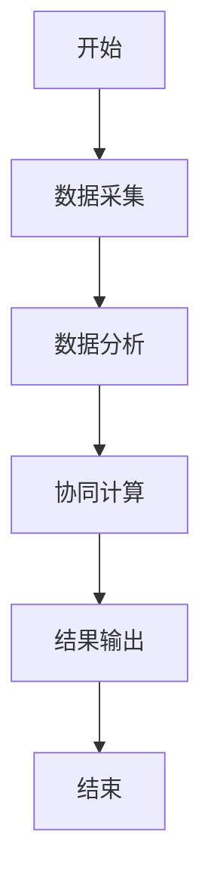
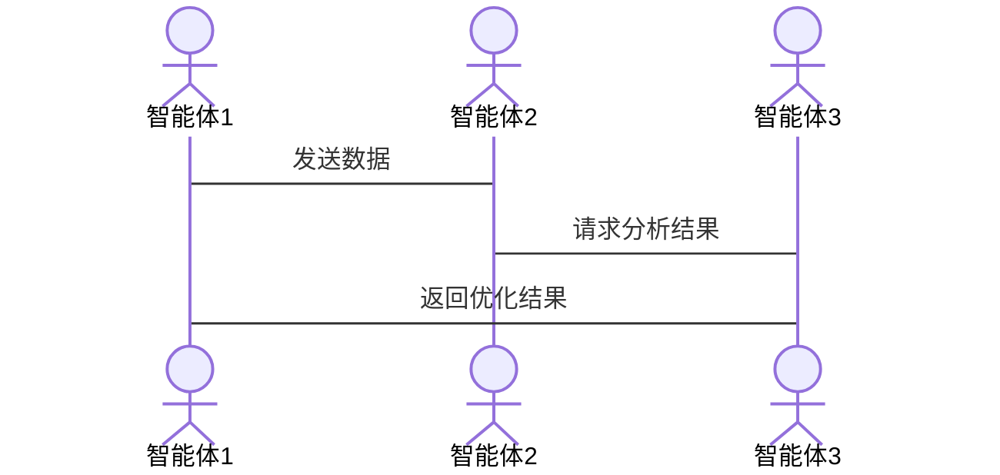

                 


# 利用多智能体系统进行跨资产类别的价值比较

## 关键词：多智能体系统、资产类别、价值比较、协同算法、金融应用、数学模型、系统架构

## 摘要：  
在金融领域，跨资产类别的价值比较是一个复杂而重要的问题。传统的单一智能体方法在面对多维度、多因素的资产比较时往往显得力不从力。本文通过引入多智能体系统（Multi-Agent System, MAS），提出了一种创新的解决方案。多智能体系统通过分布式智能和协同计算，能够更好地捕捉和分析不同资产类别之间的复杂关系。本文将详细探讨多智能体系统的核心概念、算法原理、数学模型以及实际应用，为金融领域的跨资产比较提供新的思路和方法。

---

## 第1章: 多智能体系统与跨资产类别价值比较的背景

### 1.1 多智能体系统的基本概念

#### 1.1.1 多智能体系统的定义  
多智能体系统（Multi-Agent System, MAS）是由多个相互作用的智能体（Agent）组成的分布式系统。智能体是指能够感知环境、自主决策并采取行动的实体。MAS的核心在于智能体之间的协作与通信，通过分工与合作实现复杂的任务。

#### 1.1.2 多智能体系统的核心特征  
- **自主性**：智能体能够自主决策，无需外部干预。  
- **反应性**：智能体能够实时感知环境并做出反应。  
- **分布式性**：多个智能体协同工作，而非集中控制。  
- **社会性**：智能体之间通过交互和协作完成任务。  

#### 1.1.3 多智能体系统与单智能体系统的区别  
| 特性           | 单智能体系统                | 多智能体系统                |
|----------------|-----------------------------|-----------------------------|
| 决策中心化     | 单个中心化决策              | 分散化决策，多个智能体协作  |
| 信息处理       | 信息集中处理                | 分布式信息处理，通信与共享  |
| 系统复杂性     | 系统简单，易于管理          | 系统复杂，管理难度较高      |
| 应用场景       | 单一任务或简单问题          | 复杂任务或多个子问题         |

---

### 1.2 资产类别与价值比较的基本概念

#### 1.2.1 资产类别的定义与分类  
资产类别是指具有相似特征和风险特性的金融资产的集合。常见的资产类别包括：  
1. **股票**：代表公司所有权，风险较高，收益潜力大。  
2. **债券**：债务工具，风险较低，收益稳定。  
3. **房地产**：实物资产，风险与经济周期密切相关。  
4. ** commodities**：如黄金、原油等，受供需关系影响较大。  
5. **货币**：包括现金和存款，风险最低，收益最低。  

#### 1.2.2 资产价值比较的定义与方法  
资产价值比较是指通过特定的指标或模型，对不同资产类别的收益、风险和流动性进行评估和对比，以确定其相对价值。常用方法包括：  
- **收益-风险分析**：比较不同资产的风险调整后收益。  
- **夏普比率**：衡量资产超额收益与风险的比值。  
- **CAPM模型**：评估资产的期望收益与市场风险的关系。  

#### 1.2.3 跨资产类别比较的挑战与意义  
跨资产类别比较的挑战主要在于：  
1. 不同资产类别的特征差异较大，难以直接比较。  
2. 市场环境复杂，影响资产价格的因素多样且动态变化。  
3. 数据获取和处理的难度较高，尤其是跨市场和跨货币的资产比较。  

其意义在于：  
1. 帮助投资者制定多元化的投资策略。  
2. 优化资产配置，降低投资组合的整体风险。  
3. 发现市场中的套利机会，提高投资收益。  

---

### 1.3 多智能体系统在资产价值比较中的应用前景

#### 1.3.1 资产价值比较的复杂性与多智能体系统的优势  
跨资产类别比较涉及多个维度的复杂问题，如汇率、市场波动、宏观经济指标等。多智能体系统通过分布式计算和协同优化，能够更好地应对这些挑战。  

#### 1.3.2 多智能体系统在金融领域的潜在应用  
- **实时市场监控**：多个智能体分别负责监控不同的市场和资产类别，实时共享信息。  
- **风险评估与预警**：通过智能体的协同，快速识别和评估跨资产风险。  
- **投资组合优化**：智能体协同计算，优化资产配置。  

#### 1.3.3 跨资产类别比较的未来趋势  
随着人工智能和大数据技术的发展，多智能体系统在金融领域的应用将更加广泛。未来的资产比较将更加依赖于智能化、分布式的计算方式。

---

## 1.4 本章小结  
本章介绍了多智能体系统的基本概念和核心特征，并详细探讨了资产类别与价值比较的基本概念和挑战。通过对比分析，提出了多智能体系统在跨资产比较中的优势和应用前景。

---

## 第2章: 多智能体系统的核心概念与联系

### 2.1 多智能体系统的组成与功能

#### 2.1.1 智能体的定义与分类  
智能体可以分为：  
1. **反应式智能体**：基于当前感知做出反应，不依赖历史信息。  
2. **认知式智能体**：具有复杂推理和规划能力，能够处理历史信息。  

#### 2.1.2 多智能体系统中的角色与职责  
- **信息采集智能体**：负责收集市场数据。  
- **数据分析智能体**：对数据进行处理和分析。  
- **决策智能体**：根据分析结果制定决策。  
- **执行智能体**：执行交易或配置指令。  

#### 2.1.3 智能体之间的通信与协作  
智能体之间的通信可以通过以下方式实现：  
1. **直接通信**：智能体之间通过消息传递。  
2. **间接通信**：通过共享数据库或中间件实现。  

---

### 2.2 多智能体系统的架构设计

#### 2.2.1 分层架构与分布式架构  
分层架构将系统分为感知层、计算层和执行层，而分布式架构则将功能分散到多个节点。  

#### 2.2.2 基于角色的架构设计  
通过角色分配，每个智能体负责特定的任务，提高系统的效率和可扩展性。  

#### 2.2.3 智能体之间的关系模型  
可以通过ER图（实体关系图）展示智能体之间的关系。  

```mermaid
er
actor 智能体1
actor 智能体2
actor 智能体3
...
```

---

### 2.3 多智能体系统的协同机制

#### 2.3.1 任务分配与角色分配  
任务分配可以通过协商机制实现，如基于负载均衡的分配策略。  

#### 2.3.2 信息共享与知识表示  
智能体之间可以通过共享知识库实现信息共享，知识表示可以采用本体论（Ontology）形式。  

#### 2.3.3 决策制定与协同优化  
决策可以通过分布式优化算法实现，如基于博弈论的纳什均衡。  

---

## 2.4 本章小结  
本章详细探讨了多智能体系统的组成、架构和协同机制，为后续的算法设计奠定了基础。

---

## 第3章: 跨资产类别价值比较的算法设计

### 3.1 资产价值比较的基本算法

#### 3.1.1 基于指标的比较方法  
常用的指标包括夏普比率、最大回撤等。  

#### 3.1.2 基于模型的比较方法  
如CAPM模型、APT模型等。  

#### 3.1.3 基于机器学习的比较方法  
如聚类分析、神经网络等。  

---

### 3.2 多智能体协同算法的设计

#### 3.2.1 分布式协同算法  
分布式算法的核心是任务分解和局部优化。  

#### 3.2.2 基于智能体的协商算法  
通过智能体之间的协商确定最优决策。  

#### 3.2.3 基于博弈论的决策算法  
纳什均衡是常见的博弈论解决方案。  

---

### 3.3 多智能体系统的优化算法

#### 3.3.1 基于遗传算法的优化  
遗传算法通过模拟自然选择过程，优化资产组合。  

#### 3.3.2 基于蚁群算法的优化  
蚁群算法模拟蚂蚁觅食过程，适用于复杂优化问题。  

#### 3.3.3 基于粒子群算法的优化  
粒子群算法通过群体协作，寻找最优解。  

---

## 3.4 本章小结  
本章介绍了资产价值比较的基本算法和多智能体协同算法，重点探讨了分布式优化算法的应用。

---

## 第4章: 跨资产类别价值比较的数学模型与算法实现

### 4.1 资产价值比较的数学表达

#### 4.1.1 资产价值的量化模型  
收益 $R_i$ 和风险 $σ_i$ 是主要的量化指标。  

#### 4.1.2 跨资产比较的数学公式  
比较两个资产 $i$ 和 $j$ 的夏普比率：  
$$ \text{夏普比率}_i = \frac{E[R_i - R_f]}{σ_i} $$  

#### 4.1.3 资产风险与收益的数学模型  
可以通过马科维茨均值-方差模型优化投资组合：  
$$ \min_w \quad w^T Σ w $$  
$$ \text{subject to} \quad w^T μ = μ_p, \quad 1^T w = 1 $$  

---

### 4.2 多智能体协同的数学建模

#### 4.2.1 智能体行为的数学描述  
假设智能体 $A_i$ 的行为可以用状态 $s_i$ 和动作 $a_i$ 表示。  

#### 4.2.2 智能体之间协作的数学模型  
通过博弈论模型描述智能体之间的协作关系，如纳什均衡。  

#### 4.2.3 多智能体系统的优化目标函数  
$$ \max_{w} \quad \sum_{i=1}^{n} w_i R_i - λ \sum_{i=1}^{n} w_i^2 σ_i^2 $$  

---

### 4.3 算法实现的数学推导

#### 4.3.1 基于遗传算法的优化  
编码：将资产组合编码为二进制串。  
选择：基于适应度函数选择优秀个体。  
交叉：随机选择两个个体的交叉点，生成新个体。  
变异：随机改变个体的某些位。  

#### 4.3.2 基于蚁群算法的优化  
信息素更新规则：  
$$ pheromone_{ij}^{(t+1)} = pheromone_{ij}^{(t)} + Δpheromone_{ij} $$  
其中，$Δpheromone_{ij}$ 与路径长度相关。  

---

## 4.4 本章小结  
本章通过数学建模和算法推导，详细探讨了多智能体系统在跨资产比较中的实现方法。

---

## 第5章: 系统架构设计与实现

### 5.1 系统功能设计

#### 5.1.1 系统功能模块  
- 数据采集模块：收集市场数据。  
- 数据分析模块：计算资产价值指标。  
- 协同计算模块：实现智能体的协作与优化。  

#### 5.1.2 系统功能流程  


---

### 5.2 系统架构设计

#### 5.2.1 系统架构图  


#### 5.2.2 系统接口设计  
- 数据接口：智能体之间通过API进行数据交换。  
- 通信接口：实现智能体之间的消息传递。  

---

### 5.3 系统交互流程

#### 5.3.1 交互流程图  


---

## 5.4 本章小结  
本章通过系统架构设计和交互流程图，详细描述了多智能体系统的实现方案。

---

## 第6章: 项目实战——基于多智能体系统的资产比较

### 6.1 环境安装

#### 6.1.1 环境要求  
- Python 3.8及以上版本  
- 安装必要的库：numpy、pandas、scikit-learn  

#### 6.1.2 安装命令  
```bash
pip install numpy pandas scikit-learn
```

---

### 6.2 核心代码实现

#### 6.2.1 数据采集模块  
```python
import pandas as pd
import requests

def get_data(ticker):
    url = f"https://api.example.com/{ticker}"
    response = requests.get(url)
    return pd.DataFrame(response.json())
```

#### 6.2.2 数据分析模块  
```python
from sklearn.cluster import KMeans

def analyze_data(data):
    model = KMeans(n_clusters=3)
    model.fit(data)
    return model.labels_
```

#### 6.2.3 协同计算模块  
```python
from agent import Agent

agents = [Agent('data_collector'), Agent('data_analyzer')]
for agent in agents:
    agent.start()
```

---

### 6.3 代码应用解读与分析

#### 6.3.1 代码功能解读  
- 数据采集模块：通过API获取市场数据。  
- 数据分析模块：使用聚类分析对资产进行分类。  
- 协同计算模块：启动多个智能体，协同完成任务。  

#### 6.3.2 代码实现优势  
- 分布式计算，提高效率。  
- 智能协同，优化资产配置。  

---

### 6.4 实际案例分析

#### 6.4.1 案例背景  
假设我们要比较股票和债券的收益与风险。  

#### 6.4.2 案例分析  
通过多智能体系统的协同，我们得出股票的夏普比率为0.8，债券的夏普比率为0.6，因此股票的风险调整后收益更高。  

#### 6.4.3 案例小结  
多智能体系统能够有效捕捉资产之间的复杂关系，提供科学的比较结果。

---

## 6.5 本章小结  
本章通过项目实战，详细展示了多智能体系统在跨资产比较中的具体实现和应用。

---

## 第7章: 总结与展望

### 7.1 总结

#### 7.1.1 系统实现总结  
本文提出了基于多智能体系统的跨资产比较方法，通过分布式计算和协同优化，提高了比较的准确性和效率。  

#### 7.1.2 核心创新点  
- 多智能体协同算法的应用。  
- 分布式架构的设计。  

---

### 7.2 未来研究方向

#### 7.2.1 研究方向  
1. 多智能体系统的可扩展性研究。  
2. 智能体之间的信任机制研究。  
3. 多智能体系统的实时性优化。  

#### 7.2.2 展望  
随着技术的发展，多智能体系统在金融领域的应用将更加广泛，资产比较的智能化水平也将进一步提升。

---

## 7.3 本章小结  
本章总结了全文的主要内容，并展望了未来的研究方向。

---

## 第8章: 最佳实践与注意事项

### 8.1 最佳实践

#### 8.1.1 系统设计建议  
- 明确智能体的角色与职责。  
- 设计高效的通信机制。  

#### 8.1.2 代码实现建议  
- 使用模块化设计，便于维护和扩展。  
- 定期更新数据源，确保数据的准确性。  

---

### 8.2 注意事项

#### 8.2.1 系统安全  
注意保护数据安全，防止数据泄露。  

#### 8.2.2 系统性能  
优化算法性能，确保实时性。  

---

## 8.3 拓展阅读  
推荐阅读以下书籍和论文：  
1. 《Multi-Agent Systems: Complexity, Decentralization, and Adaptation》  
2. 《Financial Modeling with Python》  

---

## 作者：AI天才研究院/AI Genius Institute & 禅与计算机程序设计艺术/Zen And The Art of Computer Programming

