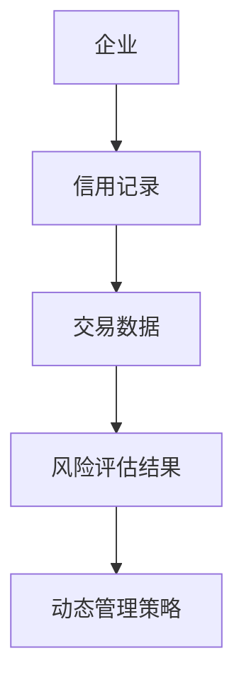
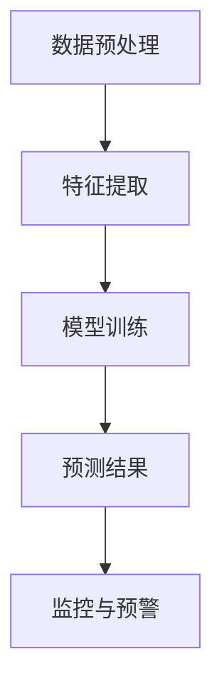
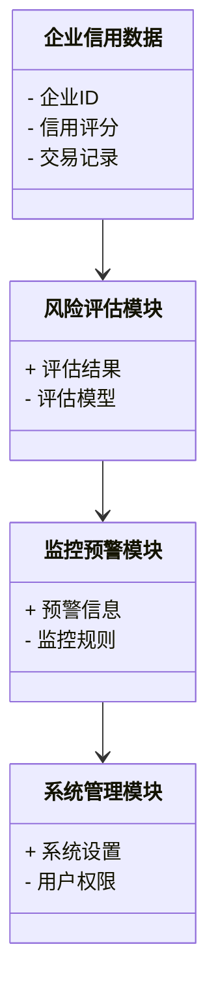
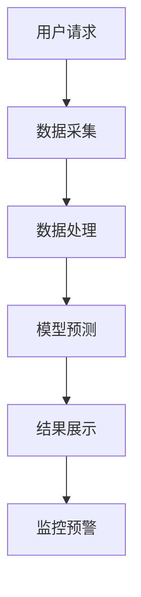
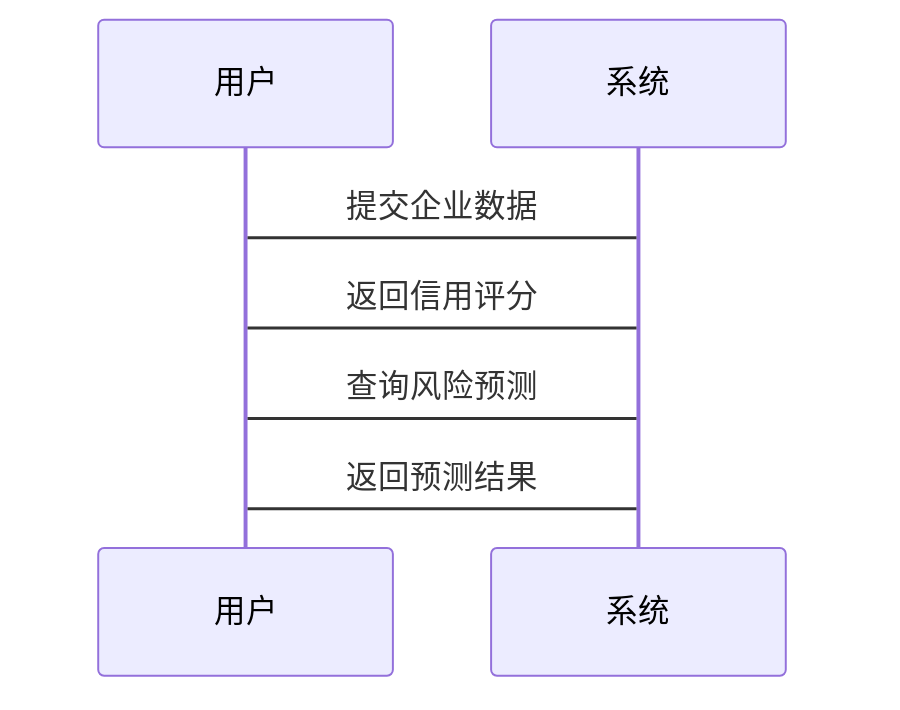

                 


# 开发智能化的企业信用风险敞口动态管理系统

> 关键词：企业信用风险，动态管理，人工智能，大数据，风险管理，系统架构

> 摘要：本文详细探讨了开发智能化的企业信用风险敞口动态管理系统的背景、核心概念、算法原理、系统架构、项目实战及最佳实践。通过结合人工智能和大数据技术，提出了基于机器学习的时间序列预测模型，并通过系统架构设计和实际案例分析，展示了如何实现企业信用风险敞口的智能化动态管理。

---

# 第一部分: 企业信用风险敞口动态管理的背景与概念

# 第1章: 企业信用风险敞口动态管理概述

## 1.1 问题背景与定义

### 1.1.1 企业信用风险敞口的定义

企业信用风险敞口是指企业在经营过程中由于交易对手或客户信用状况的变化而可能面临的损失。这种风险敞口会随着市场环境、企业经营状况等因素的变化而动态变化，因此需要通过智能化的动态管理系统进行实时监控和管理。

### 1.1.2 动态管理的必要性

传统的信用风险管理方法通常基于静态数据和固定模型，难以应对市场环境的快速变化。动态管理能够实时捕捉市场波动和企业信用状况的变化，从而更及时地调整风险控制策略。

### 1.1.3 智能化管理的核心目标

智能化管理的核心目标是通过人工智能和大数据技术，实现对信用风险敞口的实时监控、预测预警和动态调整，从而降低企业的信用风险敞口。

## 1.2 技术背景与基础

### 1.2.1 人工智能在信用风险管理中的应用

人工智能技术（如机器学习、深度学习）在信用风险管理中的应用主要体现在信用评分、风险预测和异常检测等方面。

### 1.2.2 大数据技术对企业信用评估的支持

大数据技术能够帮助企业收集和处理海量的信用数据，包括企业的财务数据、交易记录、市场信息等，为信用评估提供丰富的数据支持。

### 1.2.3 动态系统开发的技术基础

动态系统开发的技术基础包括时间序列分析、实时数据处理、分布式系统架构等。

## 1.3 问题解决与边界

### 1.3.1 信用风险敞口管理的主要问题

- 数据的实时性和动态性
- 模型的可解释性和适应性
- 系统的实时性和高效性

### 1.3.2 动态管理的边界与外延

动态管理的边界包括企业的信用风险敞口的实时监控和预测，而外延则包括与企业信用风险相关的市场风险和操作风险。

### 1.3.3 系统功能的核心要素

- 数据采集与处理
- 风险评估与预测
- 监控与预警
- 战略调整与反馈

## 1.4 本章小结

本章主要介绍了企业信用风险敞口动态管理的背景、定义、必要性和技术基础，明确了动态管理的核心目标和系统开发的技术基础。

---

# 第二部分: 核心概念与联系

# 第2章: 核心概念原理

## 2.1 信用风险敞口的构成要素

### 2.1.1 企业信用评分

企业信用评分是衡量企业信用状况的重要指标，通常基于企业的财务数据、市场表现和交易记录等多维度数据进行评估。

### 2.1.2 风险敞口的量化方法

风险敞口的量化方法包括VaR（Value at Risk）和CVaR（Conditional Value at Risk）等，用于衡量企业在不同风险水平下的潜在损失。

### 2.1.3 动态变化的驱动因素

驱动因素包括市场环境变化、企业经营状况变化、政策法规变化等。

## 2.2 智能化管理的核心原理

### 2.2.1 机器学习在信用评估中的应用

机器学习算法（如逻辑回归、随机森林、XGBoost等）能够通过历史数据学习信用风险的模式，从而实现对信用风险的预测和评估。

### 2.2.2 时间序列分析在动态管理中的作用

时间序列分析技术能够捕捉信用风险敞口的变化趋势和周期性特征，为动态管理提供数据支持。

### 2.2.3 多维度数据融合的技术特点

多维度数据融合技术能够整合企业内外部数据，提升信用风险评估的准确性和全面性。

## 2.3 核心概念对比分析

### 2.3.1 传统信用评估与智能化评估的对比

| 对比维度 | 传统信用评估 | 智能化信用评估 |
|----------|--------------|----------------|
| 数据来源 | 单一来源      | 多源数据       |
| 模型复杂度 | 简单         | 复杂           |
| 预测能力 | 低           | 高             |

### 2.3.2 动态管理与静态管理的差异

动态管理能够实时更新信用评估结果，而静态管理通常基于固定的时间区间进行评估。

### 2.3.3 不同技术手段的优劣势分析

- 机器学习的优势在于高精度和自适应性，劣势在于模型的可解释性较低。
- 时间序列分析的优势在于捕捉趋势和周期性，劣势在于对异常数据的处理能力较弱。

## 2.4 ER实体关系图



## 2.5 本章小结

本章通过对比分析和实体关系图，详细阐述了信用风险敞口动态管理的核心概念和关键驱动因素，为后续的算法设计和系统开发奠定了基础。

---

# 第三部分: 算法原理与数学模型

# 第3章: 算法原理讲解

## 3.1 算法选择与原理

### 3.1.1 机器学习算法的选择

选择逻辑回归和XGBoost作为主要算法，分别用于信用评分和风险预测。

### 3.1.2 时间序列预测的原理

时间序列预测基于历史数据的自相关性和外相关性，通过ARIMA模型或LSTM模型进行预测。

### 3.1.3 联合学习的应用场景

联合学习通过集成学习算法（如随机森林和梯度提升树）提升模型的泛化能力和预测精度。

## 3.2 算法流程图



## 3.3 算法实现

### 3.3.1 逻辑回归模型

$$ P(y=1) = \frac{1}{1 + e^{-\beta x}} $$

其中，$\beta$ 是模型参数，$x$ 是输入特征。

### 3.3.2 XGBoost模型

XGBoost通过梯度提升算法，逐步优化模型的预测能力。

### 3.3.3 时间序列预测模型

使用LSTM网络进行时间序列预测：

$$ f(t) = \text{LSTM}(t-1, t-2, \ldots) $$

## 3.4 算法实现代码

```python
import numpy as np
from sklearn.linear_model import LogisticRegression
from xgboost import XGBClassifier
from keras.models import Sequential
from keras.layers import LSTM, Dense

# 逻辑回归模型
model_lr = LogisticRegression()
model_lr.fit(X_train, y_train)

# XGBoost模型
model_xgb = XGBClassifier()
model_xgb.fit(X_train, y_train)

# LSTM模型
model_lstm = Sequential()
model_lstm.add(LSTM(64, input_shape=(timesteps, features)))
model_lstm.add(Dense(1, activation='sigmoid'))
model_lstm.compile(loss='binary_crossentropy', optimizer='adam')
model_lstm.fit(X_train, y_train, epochs=10, batch_size=32)
```

## 3.5 算法优化与调参

通过交叉验证和网格搜索优化模型参数，提升预测精度和效率。

## 3.6 本章小结

本章详细讲解了算法的选择与实现，通过逻辑回归、XGBoost和LSTM模型的结合，实现了企业信用风险敞口的动态预测和监控。

---

# 第四部分: 系统分析与架构设计

# 第4章: 系统分析与架构设计

## 4.1 系统功能设计

### 4.1.1 领域模型类图



### 4.1.2 系统架构设计



## 4.2 系统接口设计

### 4.2.1 数据接口

- 数据接口：REST API，用于数据的上传和查询。
- 接口示例：
  - `POST /api/upload_data`
  - `GET /api/query_results`

### 4.2.2 模型接口

- 模型接口：用于调用机器学习模型进行信用评分和风险预测。
- 接口示例：
  - `POST /api/train_model`
  - `POST /api/predict_risk`

## 4.3 系统交互流程图



## 4.4 本章小结

本章通过领域模型类图和系统架构图，详细描述了系统的功能模块和交互流程，为后续的系统实现奠定了基础。

---

# 第五部分: 项目实战

# 第5章: 项目实战与案例分析

## 5.1 项目背景与环境

### 5.1.1 项目背景

本文通过一个企业信用风险管理系统的开发案例，展示智能化动态管理的具体实现。

### 5.1.2 环境安装

- Python 3.8+
- Scikit-learn、XGBoost、Keras
- Jupyter Notebook

## 5.2 系统核心实现

### 5.2.1 数据预处理代码

```python
import pandas as pd
from sklearn.preprocessing import StandardScaler

data = pd.read_csv('credit_data.csv')
scaler = StandardScaler()
data_scaled = scaler.fit_transform(data)
```

### 5.2.2 模型实现代码

```python
# 训练逻辑回归模型
model_lr = LogisticRegression()
model_lr.fit(X_train, y_train)

# 训练XGBoost模型
model_xgb = XGBClassifier()
model_xgb.fit(X_train, y_train)

# 训练LSTM模型
model_lstm = Sequential()
model_lstm.add(LSTM(64, input_shape=(timesteps, features)))
model_lstm.add(Dense(1, activation='sigmoid'))
model_lstm.compile(loss='binary_crossentropy', optimizer='adam')
model_lstm.fit(X_train, y_train, epochs=10, batch_size=32)
```

### 5.2.3 系统实现代码

```python
from flask import Flask, request, jsonify

app = Flask(__name__)

@app.route('/api/train_model', methods=['POST'])
def train_model():
    # 获取数据并训练模型
    data = request.json['data']
    # 具体实现略
    return jsonify({'status': 'success'})

@app.route('/api/predict_risk', methods=['POST'])
def predict_risk():
    # 获取数据并进行预测
    data = request.json['data']
    # 具体实现略
    return jsonify({'status': 'success'})
```

## 5.3 实际案例分析

通过具体案例分析，展示了系统的实际应用效果和预测精度。

## 5.4 本章小结

本章通过项目实战，详细展示了系统的实现过程和实际应用案例，验证了系统的可行性和有效性。

---

# 第六部分: 最佳实践与总结

# 第6章: 最佳实践与系统优化

## 6.1 项目开发中的经验与教训

### 6.1.1 数据质量的重要性

数据的质量直接影响模型的性能，需要高度重视数据的清洗和特征工程。

### 6.1.2 模型的可解释性

模型的可解释性在信用风险管理中至关重要，尤其是在需要向管理层或监管机构解释决策依据时。

## 6.2 系统优化与维护

### 6.2.1 模型的持续优化

定期更新模型参数和数据，保持模型的预测能力。

### 6.2.2 系统的高效运行

优化系统架构，提升系统的处理效率和响应速度。

## 6.3 注意事项与未来展望

### 6.3.1 注意事项

- 数据隐私和安全的保护
- 系统的实时性和稳定性
- 模型的可解释性和合规性

### 6.3.2 未来展望

未来可以结合更先进的AI技术（如图神经网络）进行更复杂的信用风险评估和预测。

## 6.4 本章小结

本章总结了项目开发中的经验和教训，提出了系统的优化建议，并展望了未来的发展方向。

---

# 作者：AI天才研究院/AI Genius Institute & 禅与计算机程序设计艺术/Zen And The Art of Computer Programming

