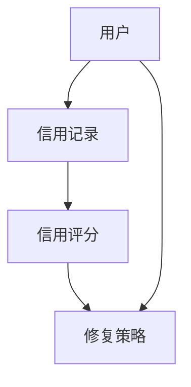
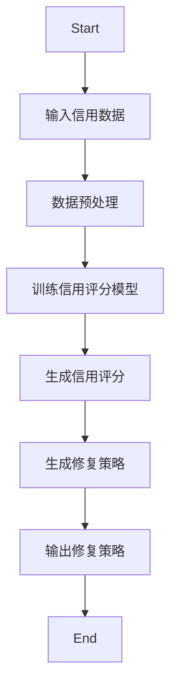
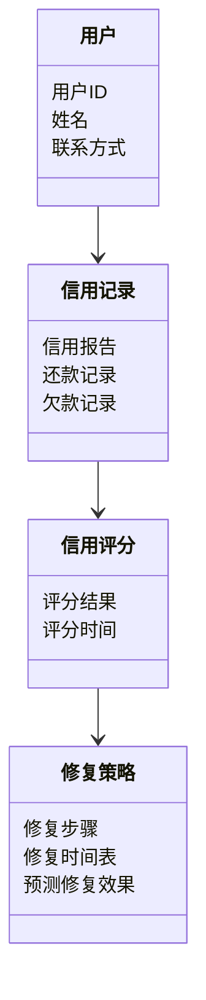

                 


# 智能个人信用修复策略生成器

## 关键词：智能、信用修复、策略生成器、人工智能、个人信用、修复策略

## 摘要：本文将深入探讨智能个人信用修复策略生成器的设计与实现。通过结合人工智能技术，分析个人信用修复的核心问题，提出基于机器学习的修复策略生成算法，并结合实际案例进行详细解读，为信用修复行业提供新的思路和解决方案。

---

## 第一部分: 智能个人信用修复策略生成器背景介绍

### 第1章: 智能个人信用修复策略生成器概述

#### 1.1 信用修复的背景与问题

##### 1.1.1 个人信用的重要性  
个人信用是现代社会经济活动的重要基石。无论是贷款申请、信用卡办理还是租房购房，信用记录都直接影响个人的经济行为和生活品质。然而，由于各种原因，个人信用记录可能会出现瑕疵，如逾期还款、欠款等，导致信用评分下降。

##### 1.1.2 信用修复的必要性  
信用修复是改善个人信用状况的重要手段。然而，传统的信用修复方法往往依赖人工操作，效率低、成本高，且缺乏个性化和科学性。如何利用人工智能技术，自动化、智能化地生成修复策略，成为当前信用修复领域的研究热点。

##### 1.1.3 当前信用修复的主要挑战  
当前信用修复面临的主要挑战包括数据获取困难、修复策略缺乏个性化、修复过程复杂且难以量化等。传统的修复方法难以满足现代金融环境下的高效率和高精准度要求。

#### 1.2 智能信用修复的核心概念

##### 1.2.1 智能信用修复的定义  
智能信用修复是指利用人工智能技术，通过分析个人信用数据，自动生成最优修复策略的过程。其核心在于利用机器学习算法，识别信用问题的根源，并制定个性化的修复方案。

##### 1.2.2 智能信用修复的关键技术  
智能信用修复的关键技术包括数据挖掘、机器学习、自然语言处理等。其中，机器学习算法（如随机森林、支持向量机等）被广泛应用于信用评分和修复策略生成。

##### 1.2.3 智能信用修复的边界与外延  
智能信用修复的边界在于其仅针对个人信用修复，而不涉及企业信用或其他类型的信用修复。其外延则包括信用评分模型、修复策略生成算法、修复效果评估等。

#### 1.3 本章小结  
本章通过分析信用修复的背景与问题，提出了智能信用修复的核心概念，为后续章节的深入分析奠定了基础。

---

### 第2章: 智能个人信用修复策略生成器的核心概念与联系

#### 2.1 核心概念原理

##### 2.1.1 信用评分模型  
信用评分模型是智能信用修复的基础。常见的信用评分模型包括线性回归、逻辑回归、随机森林等。这些模型通过分析个人信用数据，生成信用评分，从而判断个人信用风险。

##### 2.1.2 修复策略生成算法  
修复策略生成算法是智能信用修复的核心。基于信用评分模型的结果，修复策略生成算法会根据个人信用状况，制定具体的修复步骤和时间表。

#### 2.2 核心概念属性特征对比

##### 2.2.1 信用评分模型的特征对比  
| 特征 | 信用评分模型 | 修复策略生成算法 |
|------|--------------|------------------|
| 输入 | 信用数据     | 信用评分结果     |
| 输出 | 信用评分     | 修复策略         |
| 方法 | 监督学习      | 强化学习或贪心算法 |

##### 2.2.2 修复策略生成算法的特征对比  
| 特征 | 基于规则的算法 | 基于机器学习的算法 |
|------|----------------|-------------------|
| 输入 | 信用评分结果   | 信用评分结果      |
| 输出 | 固定修复步骤   | 个性化修复策略    |
| 方法 | 预定义规则     | 自适应学习        |

#### 2.3 ER实体关系图  
以下是智能信用修复的ER实体关系图：



#### 2.4 本章小结  
本章通过对比分析信用评分模型和修复策略生成算法的核心特征，明确了智能信用修复系统的关键组成部分，并通过ER实体关系图展示了各部分之间的关系。

---

### 第3章: 智能个人信用修复策略生成器的算法原理

#### 3.1 算法原理概述

##### 3.1.1 基于机器学习的信用评分模型  
基于机器学习的信用评分模型通过分析历史信用数据，训练模型预测个人信用评分。常用的算法包括逻辑回归、随机森林等。模型输出的信用评分反映了个人信用风险的高低。

##### 3.1.2 修复策略生成算法的选择  
修复策略生成算法的选择取决于信用评分模型的输出结果。基于模型预测的信用评分，修复策略生成算法会制定相应的修复步骤。常用的算法包括贪心算法和强化学习算法。

#### 3.2 算法流程图  

修复策略生成的算法流程图如下：



#### 3.3 算法数学模型

##### 3.3.1 信用评分模型  
信用评分模型可以表示为：

$$ \text{信用评分} = \sum_{i=1}^{n} w_i x_i + b $$

其中，$w_i$ 是特征 $x_i$ 的权重，$b$ 是偏置项。

##### 3.3.2 修复策略生成模型  
修复策略生成模型可以表示为：

$$ \text{修复策略} = \argmin_{\theta} \sum_{i=1}^{m} (y_i - f(x_i, \theta))^2 $$

其中，$y_i$ 是目标修复效果，$f(x_i, \theta)$ 是修复策略生成函数，$\theta$ 是模型参数。

#### 3.4 本章小结  
本章通过详细讲解智能信用修复系统的算法原理，展示了如何利用机器学习算法生成修复策略，并通过流程图和数学公式明确了各部分之间的关系。

---

### 第4章: 智能个人信用修复策略生成器的系统分析与架构设计

#### 4.1 问题场景介绍  

智能信用修复系统需要解决的主要问题包括信用数据的获取、信用评分的计算、修复策略的生成以及修复效果的评估等。系统需要具备高效率、高准确性和高个性化的特征。

#### 4.2 系统功能设计  

##### 4.2.1 领域模型设计  

以下是领域模型的类图：



##### 4.2.2 系统架构设计  

以下是系统架构的分层图：

```mermaid
graph TD
    用户 --> API Gateway[API网关]
    API Gateway --> Frontend[前端]
    Frontend --> Backend[后端]
    Backend --> Database[数据库]
    Backend --> ModelServer[模型服务器]
    ModelServer --> Preprocess[数据预处理]
    Preprocess --> Train[模型训练]
    Train --> Predict[模型预测]
    Predict --> Strategy[策略生成]
```

##### 4.2.3 系统接口设计  

系统主要接口包括：

1. **用户接口**：用于输入信用数据和获取修复策略。
2. **数据接口**：用于获取信用记录和修复数据。
3. **模型接口**：用于训练和预测信用评分。

##### 4.2.4 系统交互流程图  

以下是系统交互的流程图：

```mermaid
graph TD
    用户 --> API Gateway
    API Gateway --> Frontend
    Frontend --> Backend
    Backend --> Database
    Database --> CreditRecord
    CreditRecord --> CreditScore
    CreditScore --> RepairStrategy
    RepairStrategy --> Backend
    Backend --> Frontend
    Frontend --> 用户
```

#### 4.3 本章小结  
本章通过系统分析与架构设计，明确了智能信用修复系统的功能模块和交互流程，为后续的实现奠定了基础。

---

### 第5章: 项目实战

#### 5.1 环境安装  

智能信用修复系统的开发环境包括：

1. **编程语言**：Python 3.8+
2. **开发框架**：Django 或 Flask
3. **机器学习库**：Scikit-learn、XGBoost
4. **数据处理库**：Pandas、NumPy
5. **可视化工具**：Matplotlib、Seaborn

#### 5.2 核心实现代码  

以下是修复策略生成器的核心代码示例：

```python
import numpy as np
from sklearn.ensemble import RandomForestRegressor
from sklearn.metrics import mean_squared_error

# 数据预处理
def preprocess_data(data):
    # 假设data是一个包含信用数据的Pandas DataFrame
    # 删除缺失值
    data = data.dropna()
    # 标准化处理
    from sklearn.preprocessing import StandardScaler
    scaler = StandardScaler()
    scaled_features = scaler.fit_transform(data[['特征1', '特征2', ...]])
    return scaled_features

# 模型训练
def train_model(features, labels):
    model = RandomForestRegressor(n_estimators=100, random_state=42)
    model.fit(features, labels)
    return model

# 修复策略生成
def generate_repair_strategy(model, user_credit_data):
    # 预测信用评分
    predicted_scores = model.predict(preprocess_data(user_credit_data))
    # 生成修复策略
    repair_strategy = []
    for score in predicted_scores:
        if score < 0.5:
            repair_strategy.append('立即还款')
        elif 0.5 <= score < 0.7:
            repair_strategy.append('分期还款')
        else:
            repair_strategy.append('无需修复')
    return repair_strategy

# 示例用法
if __name__ == '__main__':
    import pandas as pd
    # 加载数据
    data = pd.read_csv('credit_data.csv')
    # 提取特征和标签
    features = data[['特征1', '特征2', ...]]
    labels = data['信用评分']
    # 数据预处理
    processed_features = preprocess_data(data)
    # 训练模型
    model = train_model(processed_features, labels)
    # 生成修复策略
    user_data = pd.read_csv('user_credit.csv')
    repair_strategy = generate_repair_strategy(model, user_data)
    print('修复策略:', repair_strategy)
```

#### 5.3 代码解读与分析  

上述代码实现了以下功能：

1. **数据预处理**：对输入数据进行缺失值处理和标准化处理。
2. **模型训练**：使用随机森林算法训练信用评分模型。
3. **修复策略生成**：根据模型预测的信用评分，生成修复策略。

#### 5.4 实际案例分析  

假设某用户信用评分为0.4，系统会生成“立即还款”的修复策略。修复完成后，用户的信用评分会提升，修复策略生成器会根据新的信用评分动态调整修复策略。

#### 5.5 本章小结  
本章通过实际案例的分析和代码实现，展示了智能信用修复系统的具体应用和实现过程。

---

### 第6章: 最佳实践

#### 6.1 小结  

智能信用修复系统通过结合人工智能技术，能够高效、准确地生成修复策略，帮助个人改善信用状况。

#### 6.2 注意事项  

1. **数据隐私**：在处理个人信用数据时，需严格遵守数据隐私保护法规。
2. **模型评估**：定期评估模型性能，确保修复策略的有效性。
3. **用户教育**：向用户普及信用修复的知识，帮助用户更好地理解和使用修复策略。

#### 6.3 拓展阅读  

1. 《机器学习实战》
2. 《信用评分模型的构建与应用》
3. 《人工智能在金融领域的应用》

#### 6.4 本章小结  
本章总结了智能信用修复系统的优势和注意事项，并提供了拓展阅读的方向，帮助读者进一步深入了解相关知识。

---

## 作者：AI天才研究院/AI Genius Institute & 禅与计算机程序设计艺术 /Zen And The Art of Computer Programming

