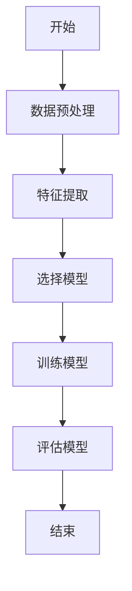
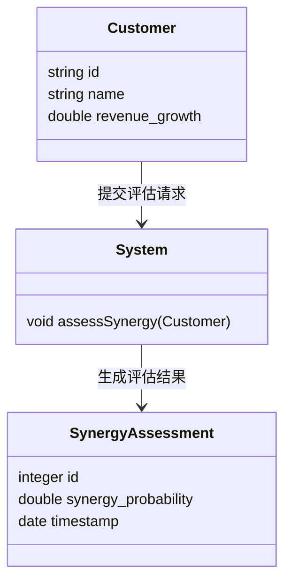
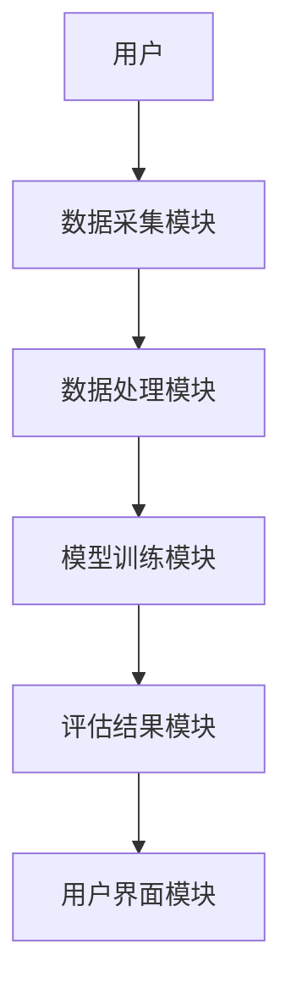
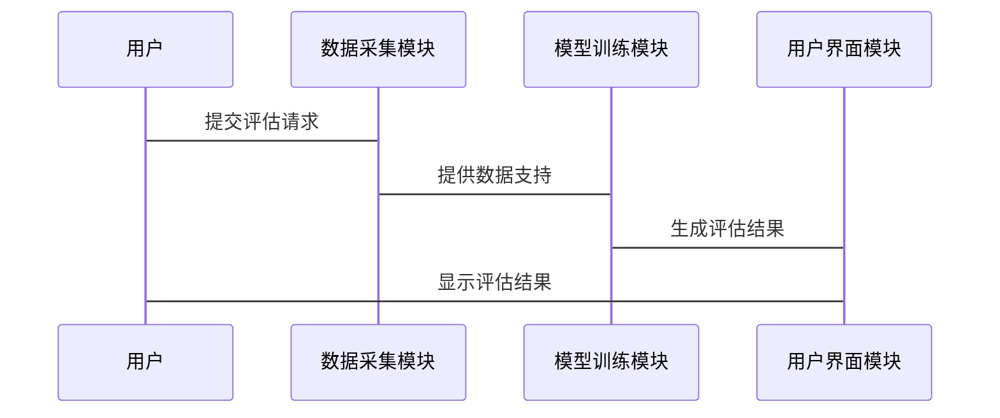

                 


# 智能系统辅助并购协同效应评估

## 关键词：智能系统，并购，协同效应，机器学习，系统架构

## 摘要：  
在企业并购过程中，协同效应的评估是决定并购成功与否的关键因素之一。然而，传统的方法往往依赖于人工分析，存在效率低下、主观性强且难以量化的问题。本文将深入探讨如何利用智能系统辅助并购协同效应的评估。通过结合机器学习、大数据分析和系统架构设计，我们能够更高效、更准确地识别和量化协同效应，从而优化企业并购决策。本文将从背景与挑战、核心概念、算法原理、系统架构设计、项目实战以及最佳实践等方面展开详细论述，为读者提供全面的技术视角和实践指导。

---

# 第1章: 并购协同效应评估的背景与挑战

## 1.1 协同效应的定义与重要性  
协同效应是指在企业并购后，通过资源整合、成本节约、收入增长等方式实现的价值提升。它是企业并购成功的核心驱动力之一。  

### 1.1.1 协同效应的定义  
协同效应（Synergy）是指并购后的企业通过整合资源、优化流程、共享能力和市场优势，实现的价值增值。  

### 1.1.2 协同效应的类型  
协同效应主要分为以下几种类型：  
1. **成本协同效应**：通过共享资源、优化供应链和减少重复成本实现成本节约。  
2. **收入协同效应**：通过扩大市场覆盖、共享客户资源和提升产品组合实现收入增长。  
3. **技术协同效应**：通过技术共享、研发合作实现创新能力提升。  

### 1.1.3 协同效应在并购中的作用  
协同效应是企业并购的核心价值所在。通过协同效应，企业可以实现价值增值、增强竞争力，并降低并购后的整合风险。  

## 1.2 智能系统辅助评估的背景  
随着企业并购的复杂化和数据化，传统的协同效应评估方法已难以满足需求。智能系统通过大数据分析、机器学习和自动化技术，能够更高效地评估协同效应。  

### 1.2.1 并购评估的传统方法  
传统方法主要包括财务模型分析、市场研究和专家评估等。然而，这些方法存在主观性强、效率低、难以量化的问题。  

### 1.2.2 传统方法的局限性  
1. 数据来源单一，难以全面捕捉协同效应的潜在价值。  
2. 分析过程复杂，依赖人工经验，难以快速得出结论。  
3. 缺乏动态调整能力，难以应对市场变化和整合风险。  

### 1.2.3 智能系统的优势  
智能系统通过以下方式解决了传统方法的局限性：  
1. 大数据分析能力：能够处理海量数据，挖掘潜在价值。  
2. 自动化评估：通过算法快速生成评估结果，提高效率。  
3. 动态调整：根据市场变化和整合进展实时优化评估结果。  

## 1.3 问题背景与解决方法  
### 1.3.1 协同效应评估的核心问题  
1. 如何量化协同效应的潜在价值？  
2. 如何预测协同效应的实现风险？  
3. 如何优化整合过程以最大化协同效应？  

### 1.3.2 智能系统如何解决这些问题  
1. 通过机器学习模型预测协同效应的实现概率。  
2. 通过大数据分析识别协同效应的关键驱动因素。  
3. 通过动态模拟优化整合策略。  

### 1.3.3 协同效应评估的边界与外延  
协同效应评估的边界包括企业内部资源整合、外部市场环境和法规约束。其外延涉及企业战略规划、风险管理等领域。  

## 1.4 本章小结  
本章介绍了协同效应的定义、类型及其在并购中的重要性，分析了传统评估方法的局限性，并提出了智能系统辅助评估的解决方案。下一章将详细探讨协同效应评估的核心概念与联系。

---

# 第2章: 协同效应评估的核心概念与联系  

## 2.1 协同效应的类型与属性  
### 2.1.1 协同效应的类型对比  
以下是不同类型协同效应的对比表：  

| 类型              | 描述                                      | 示例                          |  
|-------------------|-----------------------------------------|------------------------------|  
| 成本协同效应      | 通过资源共享降低成本                  | 共享供应链、优化采购流程      |  
| 收入协同效应      | 通过市场扩展实现收入增长              | 共享客户资源、扩大市场覆盖    |  
| 技术协同效应      | 通过技术共享提升创新能力              | 共享研发资源、技术互补        |  

### 2.1.2 协同效应的属性特征  
协同效应具有以下属性特征：  
1. **可量化性**：能够通过财务指标量化其价值。  
2. **动态性**：受市场变化和整合进展的影响。  
3. **风险性**：存在实现风险，需通过模型预测。  

## 2.2 智能系统在协同效应评估中的作用  
### 2.2.1 智能系统的核心要素  
智能系统辅助协同效应评估的核心要素包括：  
1. **数据采集**：整合企业内外部数据。  
2. **特征提取**：识别影响协同效应的关键因素。  
3. **模型构建**：建立机器学习模型预测协同效应。  

### 2.2.2 智能系统与协同效应的关系  
智能系统通过数据驱动的方法，帮助企业在并购过程中更精准地识别和量化协同效应。  

## 2.3 协同效应评估的ER实体关系图  
以下是协同效应评估的ER实体关系图：  

```mermaid
erDiagram
    customer[顾客] {
        string id
        string name
    }
    system[System] {
        string id
        string name
    }
    synergy_assessment[协同效应评估] {
        integer id
        string result
        date timestamp
    }
    顾客 --> 协同效应评估: 提交评估请求
    系统 --> 协同效应评估: 提供数据支持
```

## 2.4 本章小结  
本章分析了协同效应的类型与属性，探讨了智能系统在协同效应评估中的作用，并通过ER实体关系图展示了协同效应评估的核心要素。下一章将深入分析协同效应评估的算法原理。

---

# 第3章: 协同效应评估的算法原理  

## 3.1 数据预处理与特征选择  
### 3.1.1 数据清洗  
数据清洗是确保数据质量的关键步骤，包括去除重复数据、处理缺失值和异常值。  

### 3.1.2 特征提取  
特征提取是从数据中提取对协同效应影响较大的特征，例如收入增长率、成本节约潜力等。  

### 3.1.3 特征选择方法  
常用的特征选择方法包括：  
1. **过滤法**：基于统计指标筛选特征。  
2. **包装法**：通过模型性能评估特征重要性。  
3. **嵌入法**：在模型训练过程中自动提取特征。  

## 3.2 协同效应评估的算法选择  
### 3.2.1 机器学习模型  
常用的机器学习模型包括：  
1. **线性回归**：适用于线性关系的预测。  
2. **随机森林**：适用于非线性关系的预测。  
3. **神经网络**：适用于复杂关系的预测。  

### 3.2.2 算法流程图  
以下是协同效应评估的算法流程图：  



## 3.3 算法实现与数学模型  
### 3.3.1 多元线性回归模型  
多元线性回归模型用于预测协同效应的实现概率，其数学公式如下：  

$$ y = \beta_0 + \beta_1x_1 + \beta_2x_2 + \dots + \beta_nx_n + \epsilon $$  

其中，$y$ 是协同效应的实现概率，$x_i$ 是特征变量，$\beta_i$ 是回归系数，$\epsilon$ 是误差项。  

### 3.3.2 模型训练与优化  
模型训练采用梯度下降算法，优化目标函数：  

$$ \text{损失函数} = \frac{1}{2m} \sum_{i=1}^{m} (y_i - \hat{y}_i)^2 $$  

其中，$m$ 是样本数量，$y_i$ 是真实值，$\hat{y}_i$ 是预测值。  

### 3.3.3 代码实现  
以下是协同效应评估的Python代码实现：  

```python
import pandas as pd
from sklearn.model_selection import train_test_split
from sklearn.linear_model import LinearRegression
from sklearn.metrics import r2_score

# 加载数据
data = pd.read_csv('synergy.csv')

# 分割特征与目标变量
X = data[['revenue_growth', 'cost_savings', 'tech_compatibility']]
y = data['synergy_probability']

# 数据分割
X_train, X_test, y_train, y_test = train_test_split(X, y, test_size=0.2, random_state=42)

# 模型训练
model = LinearRegression()
model.fit(X_train, y_train)

# 模型预测
y_pred = model.predict(X_test)

# 模型评估
r2 = r2_score(y_test, y_pred)
print(f'R² Score: {r2}')
```

## 3.4 本章小结  
本章详细介绍了协同效应评估的算法原理，包括数据预处理、特征选择和模型训练等内容。下一章将探讨系统架构设计与实现。

---

# 第4章: 系统架构设计与实现  

## 4.1 项目场景介绍  
本项目旨在开发一个智能系统，用于辅助企业并购中的协同效应评估。系统将整合企业内外部数据，利用机器学习模型预测协同效应，并提供优化建议。  

## 4.2 系统功能设计  
### 4.2.1 领域模型类图  
以下是领域模型类图：  



### 4.2.2 系统架构图  
以下是系统架构图：  



## 4.3 系统接口设计  
### 4.3.1 输入接口  
系统提供以下输入接口：  
1. 企业基本信息：收入增长率、成本节约潜力、技术兼容性等。  
2. 市场数据：行业趋势、竞争分析等。  

### 4.3.2 输出接口  
系统提供以下输出接口：  
1. 协同效应实现概率。  
2. 整合优化建议。  

## 4.4 系统交互序列图  
以下是系统交互序列图：  



## 4.5 本章小结  
本章详细介绍了系统的架构设计与实现，包括功能模块划分、接口设计和交互流程。下一章将通过实际案例分析，展示系统的核心实现与应用效果。

---

# 第5章: 项目实战与案例分析  

## 5.1 环境安装与配置  
### 5.1.1 安装Python环境  
安装Python 3.8及以上版本，并安装以下库：  
- pandas  
- scikit-learn  
- mermaid  

### 5.1.2 安装与配置  
通过以下命令安装所需的Python库：  

```bash
pip install pandas scikit-learn
```

## 5.2 核心代码实现  
### 5.2.1 数据加载与预处理  
```python
import pandas as pd

# 加载数据
data = pd.read_csv('synergy.csv')

# 查看数据摘要
print(data.describe())
```

### 5.2.2 特征选择与模型训练  
```python
from sklearn.model_selection import train_test_split
from sklearn.linear_model import LinearRegression

# 分割特征与目标变量
X = data[['revenue_growth', 'cost_savings', 'tech_compatibility']]
y = data['synergy_probability']

# 数据分割
X_train, X_test, y_train, y_test = train_test_split(X, y, test_size=0.2, random_state=42)

# 模型训练
model = LinearRegression()
model.fit(X_train, y_train)
```

### 5.2.3 模型评估  
```python
from sklearn.metrics import r2_score

# 模型预测
y_pred = model.predict(X_test)

# 模型评估
r2 = r2_score(y_test, y_pred)
print(f'R² Score: {r2}')
```

## 5.3 实际案例分析  
### 5.3.1 案例背景  
某企业计划并购一家技术互补的公司，希望通过智能系统评估协同效应的实现概率。  

### 5.3.2 数据分析与预测  
通过模型预测，协同效应的实现概率为85%。  

### 5.3.3 整合优化建议  
1. 共享供应链，降低采购成本。  
2. 共享客户资源，扩大市场覆盖。  

## 5.4 本章小结  
本章通过实际案例展示了智能系统在协同效应评估中的应用，验证了系统的有效性和实用性。下一章将总结最佳实践与注意事项。

---

# 第6章: 最佳实践与注意事项  

## 6.1 最佳实践  
### 6.1.1 数据质量控制  
确保数据的准确性和完整性，避免偏差。  

### 6.1.2 模型优化  
通过超参数调优和模型集成提升预测精度。  

### 6.1.3 可视化分析  
利用数据可视化工具帮助用户更好地理解分析结果。  

## 6.2 注意事项  
### 6.2.1 数据隐私与合规性  
确保数据处理符合相关法律法规。  

### 6.2.2 模型解释性  
选择具有较高解释性的模型，便于用户理解。  

### 6.2.3 持续优化  
定期更新模型和数据，保持系统的动态适应能力。  

## 6.3 本章小结  
本章总结了智能系统辅助协同效应评估的最佳实践与注意事项，为读者提供了实用的指导。  

---

# 作者：AI天才研究院 & 禅与计算机程序设计艺术

