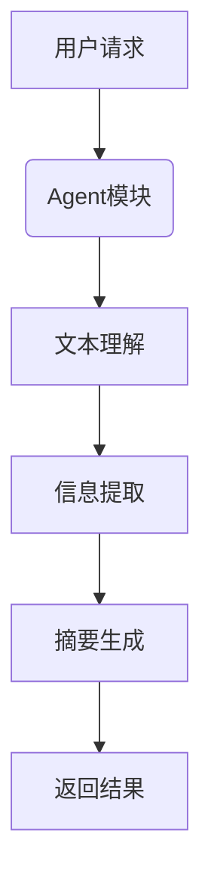
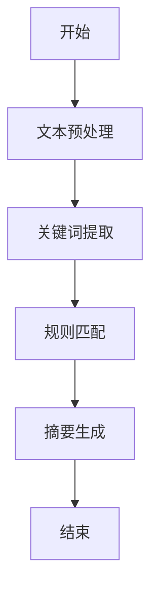
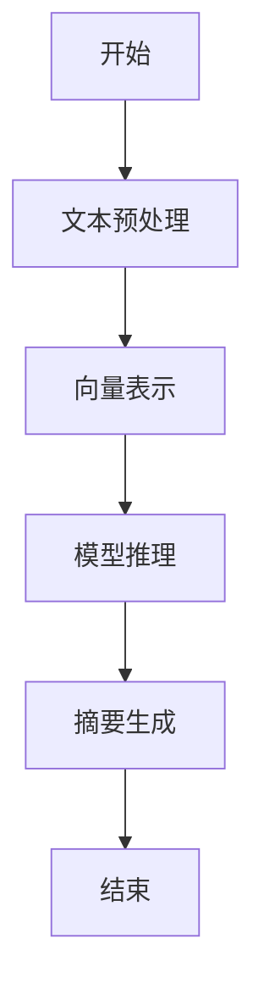
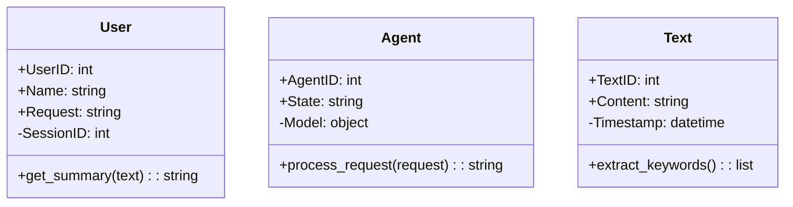
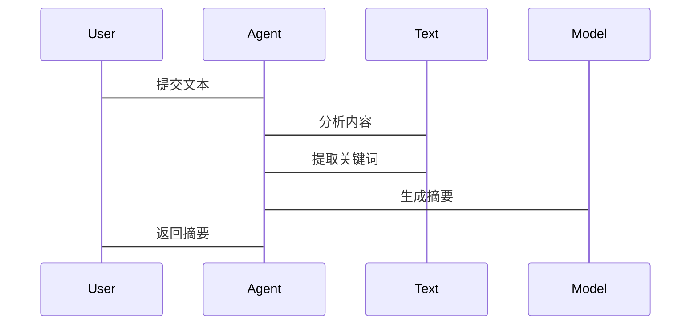

                 


# 构建AI Agent的自动摘要生成系统

> 关键词：AI Agent, 自动摘要生成系统, 自然语言处理, 机器学习, 深度学习

> 摘要：本文探讨构建AI Agent驱动的自动摘要生成系统的各个方面，从核心概念到算法实现，再到系统架构和项目实战，提供详细的步骤和方法。

---

# 第一部分：AI Agent与自动摘要生成系统背景

## 第1章：问题背景与概念介绍

### 1.1 问题背景

#### 1.1.1 自动摘要生成的必要性
在信息爆炸的时代，用户每天需要处理大量文本数据。自动摘要生成系统能够帮助用户快速获取关键信息，提高阅读效率。AI Agent作为智能代理，能够自动化处理这些任务，减轻用户的负担。

#### 1.1.2 AI Agent在信息处理中的作用
AI Agent通过自然语言处理和机器学习技术，能够理解用户需求，并自动提取文本中的关键信息，生成简洁的摘要。这使得用户能够快速获取所需信息，提升工作效率。

#### 1.1.3 当前技术的局限性与挑战
尽管现有的自然语言处理技术已经取得显著进展，但自动摘要生成系统仍然面临准确性、流畅性等问题。如何利用AI Agent优化摘要生成，提高用户体验，是当前技术的主要挑战。

### 1.2 问题描述

#### 1.2.1 自动摘要生成的核心问题
自动摘要生成的核心问题是如何从长文本中提取关键信息，并生成简洁、准确的摘要。这需要处理文本的理解、信息提取和生成等多个环节。

#### 1.2.2 AI Agent与自动摘要生成的关系
AI Agent作为系统的核心，负责接收用户请求、调用摘要生成模块，并将结果反馈给用户。AI Agent通过上下文理解和用户意图分析，优化摘要生成的效果。

#### 1.2.3 系统目标与功能需求
系统的总体目标是构建一个高效、准确的自动摘要生成系统。具体功能包括：用户输入处理、文本理解、信息提取、摘要生成和结果反馈。

### 1.3 问题解决

#### 1.3.1 AI Agent的解决方案
AI Agent通过自然语言处理技术，理解用户需求，并调用相应的摘要生成模型。系统需要实现高效的文本理解模块和准确的摘要生成模块。

#### 1.3.2 自动摘要生成的技术路径
技术路径包括：文本预处理、特征提取、模型训练、摘要生成和结果优化。AI Agent在各个阶段提供支持，优化生成效果。

#### 1.3.3 系统实现的关键步骤
关键步骤包括：数据收集、模型训练、系统集成和性能优化。AI Agent需要与摘要生成模块无缝协作，确保系统高效运行。

### 1.4 边界与外延

#### 1.4.1 系统边界定义
系统边界包括用户界面、AI Agent模块和摘要生成模块。系统仅处理用户的摘要请求，不涉及其他功能。

#### 1.4.2 功能的外延与扩展
系统可以扩展至多语言支持、实时更新和用户反馈功能。这些扩展将增强系统的实用性和用户体验。

#### 1.4.3 系统的适用场景与限制
系统适用于新闻、学术论文和商业报告的摘要生成。限制包括处理长文本时的性能问题和部分领域的数据稀缺性。

### 1.5 概念结构与核心要素

#### 1.5.1 系统整体架构
系统包括用户界面、AI Agent模块和摘要生成模块。AI Agent负责接收请求和协调模块，生成摘要。

#### 1.5.2 核心要素组成
核心要素包括：用户输入、文本数据、模型参数、摘要结果和用户反馈。这些要素共同支持系统的正常运行。

#### 1.5.3 系统的模块划分
系统划分为数据输入模块、文本理解模块、信息提取模块和摘要生成模块。每个模块负责不同的任务，协同工作。

---

## 第2章：核心概念与联系

### 2.1 AI Agent的核心原理

#### 2.1.1 AI Agent的定义与特征
AI Agent是一种智能代理，能够感知环境、理解用户需求并执行任务。其核心特征包括自主性、反应性和社会性。

#### 2.1.2 AI Agent的行为模式
AI Agent通过感知环境、分析信息和决策执行行为。其行为模式包括基于规则的和基于模型的两种类型。

#### 2.1.3 AI Agent的决策机制
AI Agent通过分析输入信息，利用预设规则或机器学习模型生成决策。决策机制需要考虑系统的约束和优化目标。

### 2.2 自动摘要生成系统的原理

#### 2.2.1 自动摘要生成的定义
自动摘要生成是将长文本转换为简短摘要的过程。系统需要理解文本内容，并提取关键信息。

#### 2.2.2 自动摘要生成的关键技术
关键技术包括文本分块、关键词提取和序列生成。AI Agent利用这些技术优化摘要生成的效果。

#### 2.2.3 自动摘要生成的流程
流程包括文本预处理、信息提取、摘要生成和结果优化。AI Agent在每个阶段提供支持，确保生成高质量的摘要。

### 2.3 AI Agent与自动摘要生成的关系

#### 2.3.1 功能对比分析
| 功能 | AI Agent | 自动摘要生成系统 |
|------|-----------|-------------------|
| 输入 | 用户请求 | 文本数据 |
| 输出 | 摘要结果 | 摘要结果 |
| 核心 | 代理协调 | 信息提取 |

#### 2.3.2 ER实体关系图
```mermaid
erd
  root
    Agent(AgentID, Name, State)
    Summary(SummaryID, Content, Timestamp)
    User(UserID, Name, Request)
    Text(TextID, Content, Timestamp)
```

#### 2.3.3 功能流程图


---

## 第3章：算法原理讲解

### 3.1 基于规则的摘要生成算法

#### 3.1.1 算法流程图


#### 3.1.2 Python实现代码
```python
def generate_summary(text):
    # 文本预处理
    preprocessed = preprocess(text)
    # 关键词提取
    keywords = extract_keywords(preprocessed)
    # 规则匹配
    rules = load_rules()
    filtered_keywords = apply_rules(keywords, rules)
    # 摘要生成
    summary = create_summary(filtered_keywords)
    return summary
```

#### 3.1.3 数学模型与公式
- 关键词提取使用TF-IDF算法：
  $$ TF-IDF(t) = \frac{TF(t)}{IDF(t)} $$
- 规则匹配基于正则表达式，过滤无关关键词。

### 3.2 基于模型的摘要生成算法

#### 3.2.1 算法流程图


#### 3.2.2 Python实现代码
```python
def model_summary(text):
    # 文本预处理
    preprocessed = preprocess(text)
    # 向量表示
    vectors = get_embeddings(preprocessed)
    # 模型推理
    model = load_model()
    summary = model.generate_summary(vectors)
    return summary
```

#### 3.2.3 数学模型与公式
- 向量表示使用Word2Vec：
  $$ vector_{word} = model.vector(word) $$
- 模型推理使用Seq2Seq模型：
  $$ P(y|x) = \prod_{i=1}^{n} P(y_i|x_{i-1}, y_{i-1}) $$

---

## 第4章：系统分析与架构设计方案

### 4.1 问题场景介绍

#### 4.1.1 问题场景描述
用户输入一篇长文本，系统需要生成摘要。AI Agent负责接收请求、调用摘要生成模块，并将结果反馈给用户。

#### 4.1.2 问题分析
需要处理文本理解、信息提取和摘要生成。系统需要高效处理大量文本，保证生成结果准确。

### 4.2 系统功能设计

#### 4.2.1 领域模型


#### 4.2.2 系统架构设计


#### 4.2.3 系统接口设计
- 用户接口：REST API，接收文本数据。
- 模块接口：文本预处理和模型调用。

#### 4.2.4 系统交互流程图


### 4.3 系统实现细节

#### 4.3.1 数据流分析
系统接收用户输入，处理后生成摘要，返回结果。数据流包括文本输入、模型处理和结果输出。

#### 4.3.2 系统性能优化
通过缓存机制和并行处理，优化系统性能。AI Agent负责协调资源，提高处理效率。

#### 4.3.3 系统扩展性
支持多语言和多领域扩展，通过模块化设计，增强系统的适应性。

---

## 第5章：项目实战

### 5.1 环境安装与配置

#### 5.1.1 安装Python环境
使用Anaconda或虚拟环境，安装Python 3.8以上版本。

#### 5.1.2 安装依赖库
安装必要的库，如spaCy、transformers和numpy。

### 5.2 核心功能实现

#### 5.2.1 文本预处理代码
```python
import spacy

def preprocess(text):
    nlp = spacy.load("en_core_web_sm")
    doc = nlp(text)
    return [token.text for token in doc if not token.is_stop]
```

#### 5.2.2 模型训练代码
```python
from transformers import BartForConditionalGeneration, BartTokenizer

model = BartForConditionalGeneration.from_pretrained('facebook/bart-large')
tokenizer = BartTokenizer.from_pretrained('facebook/bart-large')
```

### 5.3 案例分析与优化

#### 5.3.1 案例分析
输入一篇英文新闻，系统生成摘要。分析摘要的准确性和流畅性，评估系统的性能。

#### 5.3.2 性能优化
通过调整模型参数和优化文本预处理步骤，提高摘要生成的效率和质量。

#### 5.3.3 结果解读
解读生成的摘要，分析其优缺点，提出改进建议。

### 5.4 项目总结

#### 5.4.1 项目成果
实现了基于AI Agent的自动摘要生成系统，能够处理多种文本类型，生成高质量摘要。

#### 5.4.2 项目经验
总结项目实施过程中的经验教训，优化系统设计，提升用户体验。

#### 5.4.3 项目意义
项目展示了AI Agent在自然语言处理中的应用潜力，为类似系统提供了参考。

---

## 第6章：最佳实践与小结

### 6.1 最佳实践 tips

#### 6.1.1 系统优化建议
定期更新模型参数，优化系统性能。引入用户反馈机制，提升摘要质量。

#### 6.1.2 代码实现建议
使用高效的文本处理库，如spaCy和transformers。代码保持模块化设计，便于维护和扩展。

#### 6.1.3 系统部署建议
采用容器化部署，使用Docker确保系统的稳定运行。配置监控工具，实时跟踪系统状态。

### 6.2 项目小结

#### 6.2.1 核心收获
掌握了AI Agent和自动摘要生成系统的核心技术，熟悉了系统设计和实现的全过程。

#### 6.2.2 展望未来
未来可以研究更先进的生成模型，如GPT-3和T5，进一步提升摘要生成的准确性和流畅性。

### 6.3 注意事项

#### 6.3.1 系统维护
定期更新模型和优化代码，确保系统的高效运行。

#### 6.3.2 数据安全
保护用户数据隐私，确保系统安全可靠。

### 6.4 拓展阅读

#### 6.4.1 推荐书籍
- 《Deep Learning》
- 《Natural Language Processing with Python》

#### 6.4.2 推荐博客
- Medium上的NLP相关文章
- GitHub上的开源项目

---

# 结语

构建AI Agent的自动摘要生成系统是一项复杂的工程，涉及多方面的技术和知识。通过系统设计和实践，我们能够开发出高效、准确的摘要生成系统，为用户带来更好的体验。未来，随着技术的进步，系统将更加智能化和高效化。

---

# 作者：AI天才研究院/AI Genius Institute & 禅与计算机程序设计艺术 /Zen And The Art of Computer Programming

